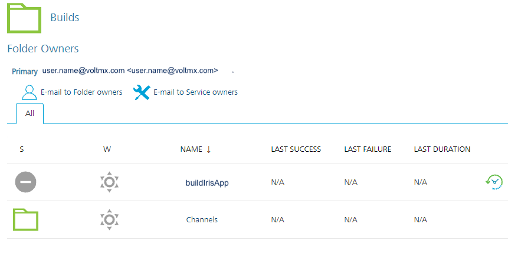

                           

Iris projects in App Factory
==================================

In App Factory, you can enable the CI/CD process for the source code of a Volt MX Iris app by creating a Iris project. You can then use appropriate jobs to build an app, publish an app, and also test the app code. After every stage, an [email notification](#build-results-notification) is sent to the project team. The emails contain information about the status of a stage, and also contain assets such as build or tests artifacts, or test results.

Iris project folder
-------------------------

The following section contains information about how to run, build, and deploy a Iris app by using the App Factory CI/CD process. After the build is completed, an email notification is sent about the build result with information about the build artifacts, changelog from the Git tool, and build settings.

To run jobs for a Iris app, open the project folder from the App Factory console, and then open the **Iris** folder. The Iris folder contains three nested folders.

*   Builds
*   CustomHooks
*   Tests
*   Triggers

Builds
------

The build folder contains **buildIrisApp** job, which orchestrates the build and test logic for different channels of a Iris app.

The **buildIrisApp** job initiates the Iris project build stage which depends on (but is not limited to) the following parameters:

*   The Volt MX Foundry Environment is used to build a Iris app and then publishing it. You can use different Foundry environments to split the release stages into three phases: **Development**, **Staging**, and **Production**.
    *   Developers or testers use a development environment to test the features that are developed into a particular development branch
    *   Developers or testers use a staging environment to test features that are developed in a sprint or a release
    *   An administrator uses a production environment to deploy the features that are developed in a sprint or a release
*   The Operating System (OS) can be iOS or Android.
*   The Form Factor can be Mobile, Tablet, or Desktop.
*   The Channel type can be a native app or a web app
    *   A Native build is generated by Xcode (for Apple) or by the Android SDK
    *   A Single Page Application (SPA) build generates a WAR file that can be used to deploy the project as a web app
*   The Build mode specifies the type of binaries that are produced after a build: release or debug. The debug mode is used during the development phase to test the builds. The Release mode is used to build the binaries for production. The binaries that are built in the Release mode must be signed accordingly.

The **buildIrisApp** job can be divided into the following logical stages:

The Build stage executes the build of the project from the specified repository. It consists of the following stages:

*   Build
*   Publish artifacts to S3
*   Notify on build status by e-mail

The Test stage executes the tests of the project from the specified repository. It consists of the following stages:

*   Build Tests
*   Notify on build tests status by e-mail
*   Run Tests
*   Notify on tests run status by e-mail  

CustomHooks
-----------

Custom Hooks are custom pipelines that consist of a Java source code and a build script, which is either an ANT script or a MAVEN script. The hooks can be set to run at certain stages of the build flow, such as pre-build and post-build.

For more information, refer to [Custom Hooks for Iris](CustomHooksIris.md).

Tests
-----------

The Tests folder contains jobs to create tests, run tests, and manage device pools. It also contains sub-folders that store the created tests based on the trigger mechanism.

For more information, refer to the following sections:

*   [Testing an App - TestNG](TestingAnApp.md)
*   [Testing an App - Jasmine](TestingAnAppJasmine.md)
*   [Configuring Device Pools](Configuring_Device_Pools.md)
*   [Cross Application Testing](CrossAppTesting.md)

Triggers
-----------

The Triggers folder contains the **createTrigger** job, which creates a trigger to perform a build based on a schedule or based on a push to the source code. There are two sub-folders that store the created triggers based on the trigger mechanism.

For more information, refer to the following sections:

*   [Scheduling a Iris Build](AutoTriggeredJobs.md)
*   [Build on Push for Iris Apps](BuildOnPush.md)

Build Results Notification
--------------------------

After a build job is completed, members that are added to the [Recipients](Project_Settings.md#Notifications_Iris) project setting receive an email that contains generic information about the build. The email also contains a list of artifacts with corresponding links to an S3 bucket. The details in the App Factory build notification emails are divided into three sections. Every section contains the following information.

### Build Details

This section contains the following build related information:

*   **Project**: Displays the name of App Factory project
*   **Triggered By**: Displays the email ID of the user who triggered the build
*   **Project Branch**: The name of the project source code branch that is used for the build
*   **Build URL**: Provides a link to the console log of the corresponding build
*   **Build Number**: Displays the App Factory build number
*   **Build Mode**: Displays the mode in which the binaries are built
*   **Date of Build**: Displays the date and time on which the project was built
*   **Build Duration**: Displays the total time that was taken to complete the build
*   **Environment Name**: Displays the Fabric app config that was selected for the build and points to the respective backend services
*   **Target Web Application**: [Only for Web apps] Provides a link to the deployed web application
*   **Test Framework**: Displays the framework that was used to run tests on the app
*   **Code Coverage**: [Only for Jasmine tests] Displays whether code coverage is enabled for the test runs
*   **Test Plan**: Displays the name of the file that contains test plan
*   **Rerun Tests**: [Only for Jasmine tests] Displays whether reruns are enabled for failed test cases
*   **Selected Browser**: [Only for Web apps] Displays the name and version of the browser that was selected for the build
*   **Selected Device Pools**: [Only for Native apps] Displays the name of the device pool that was selected for the build
*   **Devices not available in pool**: Displays the devices in the pool that are not available for use
*   **Appium Version**: Displays the version of Appium that is used to run tests on the app
*   **Run in Custom AWS Environment**: [Only for Native apps] Displays whether the tests are run in a custom AWS environment

### Build Information

This section provides the details about the build status and the version with respect to each channel in a tabular format. The table contains the following information:

*   **Channel**: The type of platform for which the build is applicable
*   **Installer**: If the corresponding channel build is successful, this section contains the binaries along with the binary extension type. If the build fails, then the status of the build is **Failed**, and a different email is sent that contains the failure logs for every channel.

> **Note:**  
For the iOS channel, you will get the following types of extension binaries:  
    
*   **IPA**: A link to download the iOS binary on your system.  
*   **KAR**: An intermediate file that is generated by Iris. The KAR file can be converted to an iOS app, or used to debug the app locally for any issues of the IPA file.  
*   **PLIST**: An OTA link to download and install the binary on your device.  

*   **App Version**: The app version that is selected for the specified channel.

### Source Code Details

This section provides details about the source code repository (such as commit-ID and change logs) in a table. The table contains the following information:

*   **Channel**: The type of platform for which the build is applicable
*   **Commit ID**: The first seven characters of the ID of a Git push that starts the build process. It is a link that can track down the changes that were picked for the build. The link redirects to Git (hosted link GitHub, Git server, bitbucket, Azure DevOps) and points to the page where all the notable file changes are visible.

> **_Note:_** If you have checked-in new changes in between or during the build process, there can be multiple Commit IDs for each channel. Appfactory assigns a build to a node, therefore the channel builds are run in parallel, and every build will check-out the branch separately.

*   **Commit Logs**: It displays the list of files that were modified, added, or deleted from the project during the build along with its status.

> **Note:** Only top ten lines of change log are printed. To display more change logs, use the compare feature from the Git web server. The details in the commit logs section are shown only when there is a previous build. The following table shows different messages that are shown with respect to each scenario:  
    

<table style="width: 100%;mc-table-style: url('Resources/TableStyles/Basic.css');" class="TableStyle-Basic" cellspacing="0"><colgroup><col style="width: 390px;" class="TableStyle-Basic-Column-Column1"><col class="TableStyle-Basic-Column-Column1"></colgroup><tbody><tr class="TableStyle-Basic-Body-Body1"><th style="text-align: center;background-color: #dcdcdc;padding-left: 5px;padding-right: 5px;padding-top: 5px;padding-bottom: 5px;border-left-style: solid;border-left-width: 1px;border-left-color: #fff;border-right-style: solid;border-right-width: 1px;border-right-color: #fff;border-top-style: solid;border-top-width: 1px;border-top-color: #fff;border-bottom-style: solid;border-bottom-width: 1px;border-bottom-color: #bbb;" class="TableStyle-Basic-BodyE-Column1-Body1"><b>Message</b></th><th style="text-align: center;background-color: #dcdcdc;padding-left: 5px;padding-right: 5px;padding-top: 5px;padding-bottom: 5px;border-left-style: solid;border-left-width: 1px;border-left-color: #fff;border-right-style: solid;border-right-width: 1px;border-right-color: #fff;border-top-style: solid;border-top-width: 1px;border-top-color: #fff;border-bottom-style: solid;border-bottom-width: 1px;border-bottom-color: #bbb;" class="TableStyle-Basic-BodyD-Column1-Body1"><b>Scenario</b></th></tr><tr class="TableStyle-Basic-Body-Body1"><td style="background-color: #ffffff;padding-left: 5px;padding-right: 5px;padding-top: 5px;padding-bottom: 5px;border-left-style: solid;border-left-width: 1px;border-left-color: #fff;border-right-style: solid;border-right-width: 1px;border-right-color: #fff;border-top-style: solid;border-top-width: 1px;border-top-color: #fff;border-bottom-style: solid;border-bottom-width: 1px;border-bottom-color: #bbb;" class="TableStyle-Basic-BodyE-Column1-Body1">Previous build is unavailable to fetch the diff</td><td style="background-color: #ffffff;padding-left: 5px;padding-right: 5px;padding-top: 5px;padding-bottom: 5px;border-left-style: solid;border-left-width: 1px;border-left-color: #fff;border-right-style: solid;border-right-width: 1px;border-right-color: #fff;border-top-style: solid;border-top-width: 1px;border-top-color: #fff;border-bottom-style: solid;border-bottom-width: 1px;border-bottom-color: #bbb;" class="TableStyle-Basic-BodyD-Column1-Body1">If previous build does not exist.</td></tr><tr class="TableStyle-Basic-Body-Body1"><td style="background-color: #ffffff;padding-left: 5px;padding-right: 5px;padding-top: 5px;padding-bottom: 5px;border-left-style: solid;border-left-width: 1px;border-left-color: #fff;border-right-style: solid;border-right-width: 1px;border-right-color: #fff;border-top-style: solid;border-top-width: 1px;border-top-color: #fff;border-bottom-style: solid;border-bottom-width: 1px;border-bottom-color: #bbb;" class="TableStyle-Basic-BodyE-Column1-Body1">No diff is available</td><td style="background-color: #ffffff;padding-left: 5px;padding-right: 5px;padding-top: 5px;padding-bottom: 5px;border-left-style: solid;border-left-width: 1px;border-left-color: #fff;border-right-style: solid;border-right-width: 1px;border-right-color: #fff;border-top-style: solid;border-top-width: 1px;border-top-color: #fff;border-bottom-style: solid;border-bottom-width: 1px;border-bottom-color: #bbb;" class="TableStyle-Basic-BodyD-Column1-Body1">If there are no change in the available logs.</td></tr><tr class="TableStyle-Basic-Body-Body1"><td style="background-color: #ffffff;padding-left: 5px;padding-right: 5px;padding-top: 5px;padding-bottom: 5px;border-left-style: solid;border-left-width: 1px;border-left-color: #fff;border-right-style: solid;border-right-width: 1px;border-right-color: #fff;border-top-style: solid;border-top-width: 1px;border-top-color: #fff;border-bottom-style: solid;border-bottom-width: 1px;border-bottom-color: #bbb;" class="TableStyle-Basic-BodyB-Column1-Body1">Unable to fetch diff, your previous build is on a different branch</td><td style="background-color: #ffffff;padding-left: 5px;padding-right: 5px;padding-top: 5px;padding-bottom: 5px;border-left-style: solid;border-left-width: 1px;border-left-color: #fff;border-right-style: solid;border-right-width: 1px;border-right-color: #fff;border-top-style: solid;border-top-width: 1px;border-top-color: #fff;border-bottom-style: solid;border-bottom-width: 1px;border-bottom-color: #bbb;" class="TableStyle-Basic-BodyA-Column1-Body1">If the branch name of the current build does not match with the previous build.</td></tr></tbody></table>

*   To avoid duplication and reduce the size of the table, channels with the same commit-ID are grouped and the corresponding change logs are displayed.
    

### Native Test Results

This section contains a brief summary and a detailed summary of the tests that are run on your native apps.

If you enabled rerunning of failed test cases, this section contains a brief summary of the rerun test cases. If you enabled code coverage for your tests, the brief summary contains a Code Coverage Report.

  

### AWS Custom Environment Run

The test results section also contains information about the Appium Tests that are run on a custom AWS environment. This section contains links to the following files:

*   Logcat.logcat
*   TCP dump log.txt
*   Test spec output.txt
*   Video.mp4
*   Customer Artifacts.zip

The **Customer Artifacts.zip** file contains the test output contents. The **Test spec output.txt** file contains the AWS console output of the tests that are run on the Custom Environment.

### Web Test Results

This section contains a brief summary of the tests that are run on your web app. It also contains links to test logs such as the Detailed Test Report and the Browser Console Log.

If you enabled Code Coverage for your tests, the Test Logs section contains a code coverage report.

