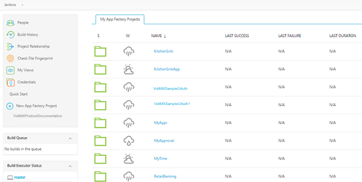
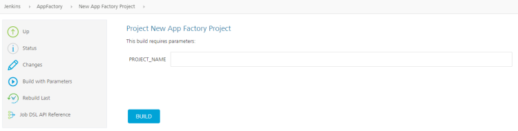
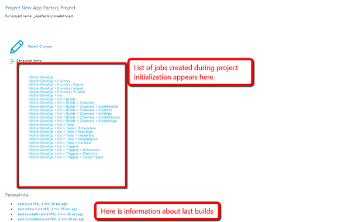
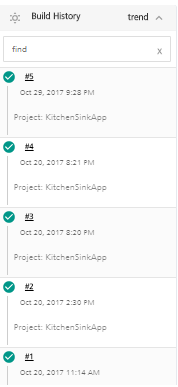
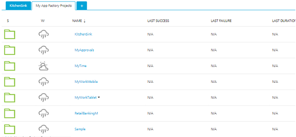

                           

Creating an App Factory project
===============================

App Factory uses a job process to perform tasks such as creating new projects and running tests cases. After you sign in to App Factory, the console displays an overview of all the configured jobs. The Volt MX cloud account name is displayed on the upper-right corner. You can sign-out of the console by clicking **log out**.

The left panel displays actions that you can perform by using jobs. Additionally, there are quick links that you can follow to access documentation, or to create a new project. Below the left panel, you can view the jobs that are currently in the **Build Queue**. You can also view a list of nodes where jobs should be executed (Build Executor Status).

The main panel of the console displays a list of projects, in which you can view the status indicator of a folder or a job. The columns display a weather icon, the name of the project, the date on which the last build succeeded, the date on which the last build failed, and the duration of the last build.

The weather icon specifies the stability of the project. The weather icon can display the following statuses.

*   **Sun with a cloud**: Specifies that the project is healthy and is working properly
*   **Cloud with rain**: Specifies that the project continues to fail
*   **Cloud with a single drop**: Specifies that the project has started failing

> **Note:**  
While creating a project, you can select Iris, Foundry, or both. If you create a new project with the same name as an existing project, App Factory overrides the structure of the existing project.  
  
VoltMX recommends that you use the override only for Iris projects, and not for Foundry projects. For more information, refer to the [Known Issues](Known_Issues.md#Upgrading).  

To set up an app for the first time in App Factory Console, follow these steps:

1.  Open the **App Factory Console** in a web browser, and then sign-in by using your Volt MX cloud credentials.  
    If you do not have a Volt MX cloud account, contact your administrator to get access to App Factory and the Volt MX cloud.
2.  Click **New App Factory Project** link in the left panel. The **New App Factory Project** page appears.

    This page is used to create a project for building and/or testing an app.

    The job is used to create CI (Continuous Integration) per project with predefined configuration and infrastructure. To complete the configuration, perform a first time build, for the App you want to incorporate into App Factory.
    
3.  Configure the project parameters. For more information about the parameters, refer to the following sections.

    

    <table style="width:100%">
    <tr style="width:40%">
    <th>Parameter</th>
    <th>Description</th>
    </tr>
    <tr>
    <td><b>PROJECT_NAME</b></td>
    <td>Specifies the name of the App Factory project. The project name can be alphanumeric, and must include a minimum of 4 characters and a maximum of 17 characters. The project name should start with an alphabet.</td>
    </tr>
    <tr>
    <td><b>PROJECT_TYPE</b></td>
    <td>Specifies the type of project that you want to create. App Factory supports the following types of projects.  
    1. <b>VoltMX Project</b>: 
    A VoltMX project is used to build Iris apps and Foundry apps with the dependent files and custom configurations. 
    For more information, refer to the following sections. 
    <ul>
    <li>
    <a href="RunningIrisApp.html">Iris Projects in App Factory</a>
    </li>
    <li>
    <a href="RunningFoundryApp.html">Foundry Projects in App Factory</a>
    </li>
    </ul> 
    2. <b>VoltMX Microservice Project</b>: 
    A VoltMX Microservice project is used to build and deploy microservices with the dependent Jolt and Policy files. 
    For more information, refer to the following section. 
    <ul>
    <li>
    <a href="Microservice_Projects.html">Microservice Projects in App Factory</a>
    </li>
    </ul>
    </td>
    </tr>
    </table>

4.  Click **BUILD**.

    Additional information on build execution can be found on the original job page. A list of structured project folders and jobs is generated during the creation of a project. Information about the last build, last stable build, last successful build, and last completed build is provided at the end of a job page.

    

    A new project with a specified PROJECT_NAME is created. In the **Build History**, you can find the status of the last triggered build. If the job status indicator is a green tick, the job is successful. If the job status indicator is a red circle, then the job did not pass.

    

After the job execution is complete, the project is created and can be viewed on the landing page of App Factory.

