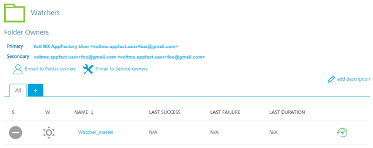
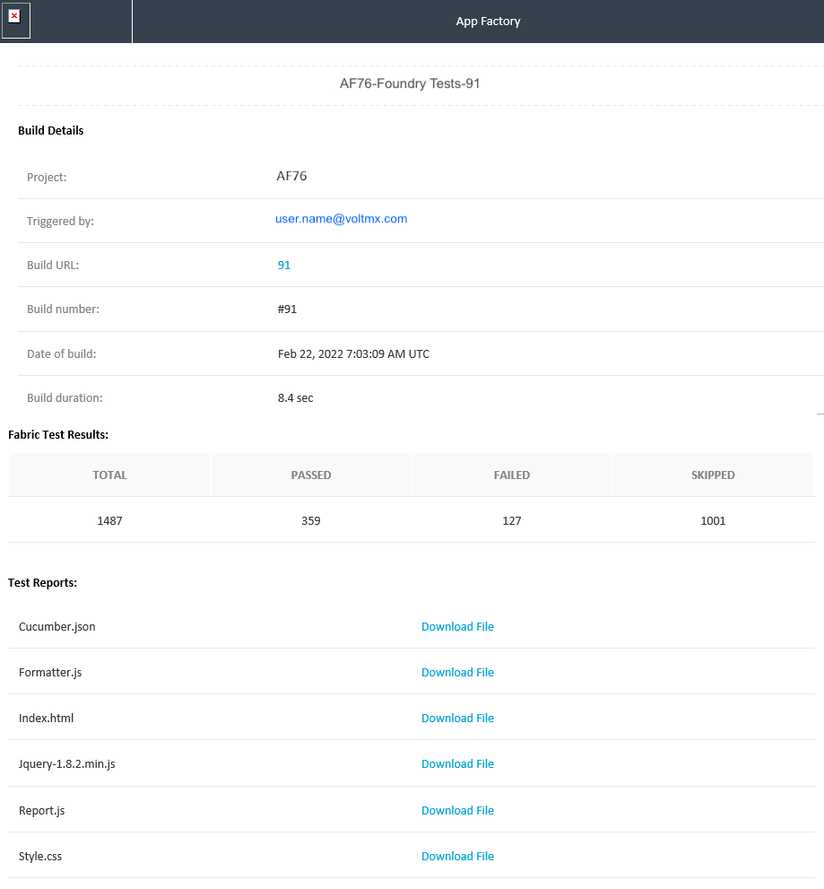

  

Testing a Foundry app with the Cucumber Framework
================================================

Cucumber is a behavior-driven development (BDD) framework that is used to validate test-case scenarios. From V9 ServicePack 5, you can use the Cucumber framework to run tests on Foundry projects.

Prerequisites
-------------

The test resources must be placed as a Maven project at the following path of your SCM:  
`<foundry_project_source>/<testResources>/Cucumber/`  
Make sure that the `pom.xml` file is in the `testResources/Cucumber/` folder.

Alternatively, you can upload the test resources as a zip file in the TEST\_ZIP\_PACKAGE parameter.

Building and running a test
---------------------------

To build and run a test, follow these steps:

1.  From the **Foundry** folder of your project, navigate to the **Tests** sub-folder.
2.  For the **runFoundryTests** job, click the **Build with Parameters** icon on the right side of the row.  
    Alternatively, select the **runFoundryTests** job, and then from the left panel of the details page, select **Build with Parameters**.
3.  Configure the build parameters for the runTest job. For more information about the parameters, refer to the following sections.  
    Source Control
    
    <table style="width: 80%;mc-table-style: url]('Resources/TableStyles/Basic.css');" class="TableStyle-Basic" cellspacing="0"><colgroup><col class="TableStyle-Basic-Column-Column1" style="width: 30%;"><col class="TableStyle-Basic-Column-Column1" style="width: 50%;"></colgroup><tbody><tr class="TableStyle-Basic-Body-Body1"><th class="TableStyle-Basic-BodyE-Column1-Body1">Parameter</th><th class="TableStyle-Basic-BodyD-Column1-Body1">Description</th></tr><tr class="TableStyle-Basic-Body-Body1"><td class="TableStyle-Basic-BodyB-Column1-Body1">
SCM_BRANCH
</td><td class="TableStyle-Basic-BodyA-Column1-Body1">
Specifies the branch, release tag, or commit ID of the repository that contains the test files.

The tests must be placed at the following location: <code class="file_names" style="font-size: 11pt;">&lt;repository_root&gt;/testResources/Cucumber/</code>

The <b>&lt;repository_root&gt;</b> specifies the root of the Foundry project source; it must be configured in the <a href="Project_Settings.html" target="_blank">Project Settings</a>.
</td></tr></tbody></table>
    
    Testing
    
    <table style="width: 80%;mc-table-style: url('Resources/TableStyles/Basic.css');" class="TableStyle-Basic" cellspacing="0"><colgroup><col class="TableStyle-Basic-Column-Column1"><col class="TableStyle-Basic-Column-Column1"></colgroup><tbody><tr class="TableStyle-Basic-Body-Body1"><th class="TableStyle-Basic-BodyE-Column1-Body1">Parameter</th><th class="TableStyle-Basic-BodyD-Column1-Body1">Description</th></tr><tr class="TableStyle-Basic-Body-Body1" madcap:conditions="Default.Not Ready for Publish"><td class="TableStyle-Basic-BodyE-Column1-Body1">
TEST_FRAMEWORK
</td><td class="TableStyle-Basic-BodyD-Column1-Body1">
Specifies the framework that must be used for the test run. Contains the following options:
<ul><li>Cucumber Test Framework</li></ul></td></tr><tr class="TableStyle-Basic-Body-Body1"><td class="TableStyle-Basic-BodyE-Column1-Body1">
MVN_OPTIONS
</td><td class="TableStyle-Basic-BodyD-Column1-Body1">
Specifies the Maven options that can be included for the test run. You can also add command-line options for the <code class="codefirst" style="font-size: 11pt;">mvn</code> command.

You can invoke Maven with a different set of goals, maven profiles, or additional arguments by using the -D option. For example: <code class="codefirst">clean package -DskipTests -Darg1=foo1 -Darg2=foo2</code>
</td></tr><tr class="TableStyle-Basic-Body-Body1"><td class="TableStyle-Basic-BodyE-Column1-Body1">
TEST_ZIP_PACKAGE
</td><td class="TableStyle-Basic-BodyD-Column1-Body1">
Specifies a URL to the zip package that contains the test resources.

<i>Important: </i></b>">Make sure that the URL is public and accessible from App Factory.

If you have included the test resources in the SCM, you can skip this parameter.
</td></tr><tr class="TableStyle-Basic-Body-Body1"><td class="TableStyle-Basic-BodyB-Column1-Body1">
TEST_REPORTS_DIRS
</td><td class="TableStyle-Basic-BodyA-Column1-Body1">
Specifies the custom reports that are generated during the test run. For example, <code class="file_names">target/cucumber/cucumber.json</code>.

You can include multiple reports by separating them with a comma (<code class="codefirst">,</code>).
</td></tr></tbody></table>
    
    Custom Hooks
    
    
    
    <table style="mc-table-style: url]('Resources/TableStyles/Basic.css');width: 90%;" class="TableStyle-Basic" cellspacing="0"><colgroup><col class="TableStyle-Basic-Column-Column1" style="width: 35%;"><col class="TableStyle-Basic-Column-Column1" style="width: 55%;"></colgroup><tbody><tr class="TableStyle-Basic-Body-Body1"><th class="TableStyle-Basic-BodyE-Column1-Body1">Parameter</th><th class="TableStyle-Basic-BodyD-Column1-Body1">Description</th></tr><tr class="TableStyle-Basic-Body-Body1"><td class="TableStyle-Basic-BodyB-Column1-Body1">
RUN_CUSTOM_HOOKS
</td><td class="TableStyle-Basic-BodyA-Column1-Body1">
Specifies whether Custom Hooks must be run in the after the tests are executed (the Post-Test stage). For more information, refer to <a href="CustomHooks.html" target="_blank">Custom Hooks</a>.
</td></tr></tbody></table>
    

Running Tests from other jobs
-----------------------------

You can trigger the test from the **buildFoundryApp** job available in the **Project Name** > **Foundry** > **Builds** folder. You can also create an auto-triggered test from the **createFoundryTest** job available in the **Project Name** > **Foundry** > **Tests** folder.

Auto-Triggering Tests
---------------------

App Factory supports two types of auto-triggered test jobs: scm-triggered (Watchers) and cron-triggered (Schedulers). Every project contains a folder called **Tests** in the **Foundry** sub-folder, which contains a job for creation of auto-triggered jobs (createFoundryTest) and two sub-folders where the created jobs are stored.

To setup an auto-triggered test job, follow these steps:

1.  From the project folder, navigate to the **Tests** sub-folder.
2.  Select the **createFoundryTest** job.
3.  Configure the CRON\_SCHEDULE parameter based on your requirement.
    *   If you want to create a **Scheduler**, type a Cron expression that corresponds to the time at which the build job must be triggered.  
          
        For information about cron expressions, refer to [Cron](https://en.wikipedia.org/wiki/Cron).
    *   If you want to create a **Watcher**, leave the CRON\_SCHEDULE parameter blank.
4.  Configure the remaining parameters, which are the same as the **runFoundryTest** job.
5.  After you configure all the parameters, click **BUILD**.

*   Every Scheduler that is created contains the cron string in job name to simplify the job search.  
    
*   Every Watcher that is created contains the branch name in job name to simplify the job search.  
    

Test Results
------------

After a test run is complete, an email that contains the test results is sent to the addresses that are configured in the project settings.

The email displays information about the test run, such as the number of passed and failed test cases, build number, build URL, and build duration. The email also contains links to the various test reports.

#### Sample email for Foundry test results

