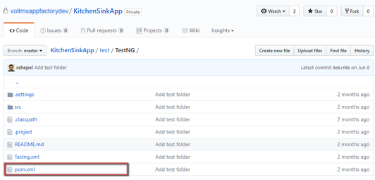
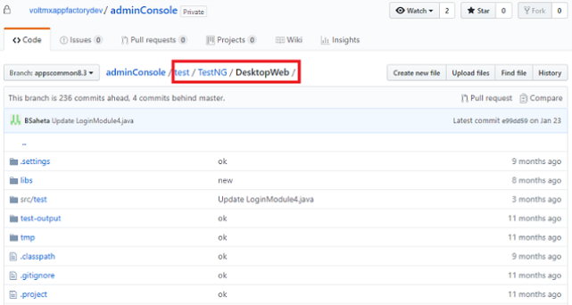
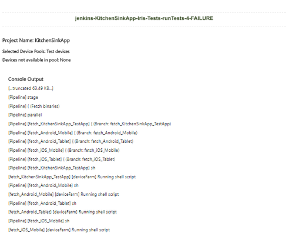
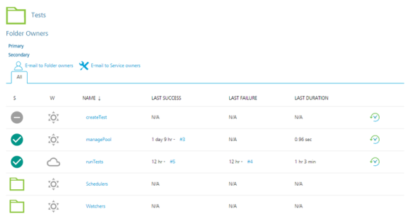
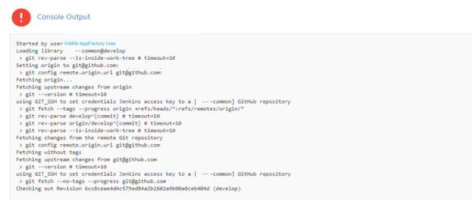
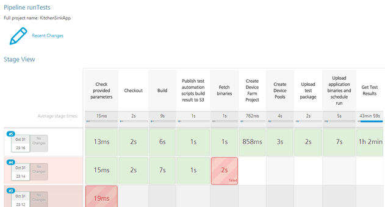
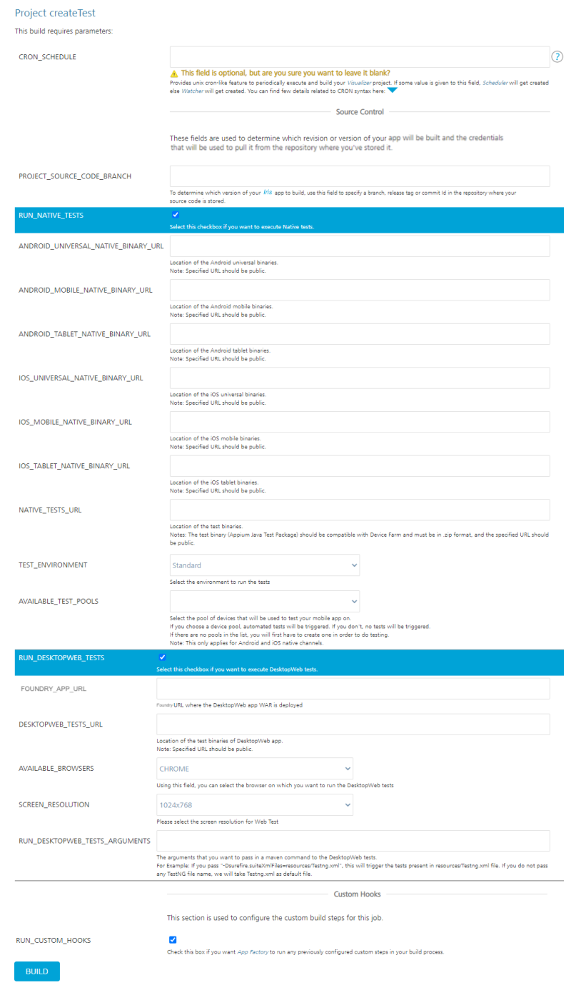
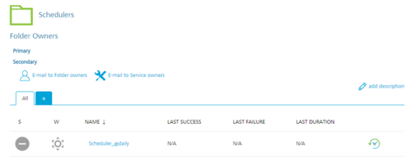
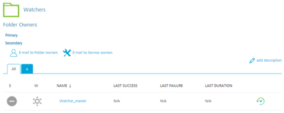

                           


Testing an App - TestNG
=======================

TestNG is a testing framework that can be used for unit testing and integration testing. With the TestNG framework, App Factory uses Appium to run test cases on the Native platform, and Selenium to run test cases on the Desktop Web platform. For more information, refer to the following sections.

Prerequisites
-------------


<details close markdown="block"><summary>Native Prerequisites</summary>

*   Make sure that the Iris project contains the Appium test files at the following location:  
    `<Project-Root>/test/TestNG/`
*   Make sure that you configure a device pool before you test the application  
    For information about device pools, refer to [Configuring Device Pools](Configuring_Device_Pools.md)
*   The Appium tests must be compatible with AWS Device Farm because the Appium tests are executed in the AWS Device Farm Cloud environment
    
    > **_Note:_** You can find the Appium tests in the root folder of the project.  
    
    
*   Tests must be compiled by using a Maven configuration file (pom.xml) that is available in the Tests root folder (`<Project-Root>/test/TestNG`)  
    

*   From v9.5.15.3 onwards, AppFactory supports native channel specific Appium test code along with the common Appium test code. AppFactory requires the Native channel specific Appium test code to be placed in the test folder of the Iris at the following locations:

    `<Project-Root>/testresources/TestNG/Mobile` for Mobile  

    `<Project-Root>/testresources/TestNG/Tablet` for Tablet  

    `<Project-Root>/testresources/TestNG/` for Common  

    If Mobile or Tablet specific Appium test code is present, then AppFactory will prioritise it above the Common Appium test code (if present) for the respective channel.

    <blockquote>
    <em><b>Note: </b></em>
    App Factory uses the AWS Device farm to run test cases on specific devices. The Device Farm offers two types of environments to run the tests- <br>
    1. Standard Test Environment <br>
    2. Custom Test Environment <br>
    The newly supported channel specific test code will not work on standard environment when triggered together for both the channels with channel specific Appium test code for both the channels.
    </blockquote>
</details>
<details close markdown="block"><summary>Desktop Web Prerequisites</summary>

*   Make sure that the Iris project contains the Selenium test files at the following location:  
    `<Project-Root>/test/TestNG/DesktopWeb/`  
    
*   Make sure that the Desktop Web tests are run by using Selenium and TestNG
*   Make sure that you run the tests on Google Chrome in headless mode before you run them on App Factory
*   If you are running the test on App Factory, refer to the chrome driver path and browser path as follows:
```
System.setProperty("webdriver.chrome.driver", System.getProperty("DRIVER_PATH"));  
    String browserPath = System.getProperty("BROWSER_PATH");
```
*   If you are using appscommon.jar in the test code, you can set driver path and browser path as follows:
    
```
System.setProperty("webdriver.chrome.driver", sgConfig.getDriverPath());  
    chromeOptions.setBinary(sg.getKeyValue(browserPath));
```
    
where **sg** is an instance of SgConfiguration class and **chromeOptions** is an instance of ChromeOptions.
</details>

Building and running a test
---------------------------

**_Important:_**  

*   To run tests that are independent from the build process, you need a Binary URL that is public (open) and accessible on the internet. For example, a URL to an S3 bucket from the email notification that is sent by the **buildIrisApp** job.
*   If you do not have a public Binary URL, HCL recommends that you run the tests as part of the build process.

To build and run a test, follow these steps:

1.  From the **Iris** folder of your project, navigate to the **Tests** sub-folder.
2.  For the **runTest** job, click the **Build with Parameters** icon on the right side of the row.  
    Alternatively, select the **runTest** job, and then from the left panel of the details page, select **Build with Parameters**.
3.  Configure the build parameters for the runTest job. For more information about the parameters, refer to the following sections.  
    

<details close="" markdown="block">
  <summary>
    Source Control
  </summary>
  <table style="width: 80%;mc-table-style: url]('Resources/TableStyles/Basic.css');" class="TableStyle-Basic" cellspacing="0">
    <colgroup>
      <col class="TableStyle-Basic-Column-Column1" style="width: 30%;">
      <col class="TableStyle-Basic-Column-Column1" style="width: 50%;">
    </colgroup>
    <tbody>
      <tr class="TableStyle-Basic-Body-Body1">
        <th class="TableStyle-Basic-BodyE-Column1-Body1">Parameter</th>
        <th class="TableStyle-Basic-BodyD-Column1-Body1">Description</th>
      </tr>
      <tr class="TableStyle-Basic-Body-Body1">
        <td class="TableStyle-Basic-BodyE-Column1-Body1">PROJECT_SOURCE_CODE_BRANCH</td>
        <td class="TableStyle-Basic-BodyD-Column1-Body1">
          Specifies the branch, release tag, or the commit ID of the repository that contains the test files.The tests must be placed at the following location:<code class="file_names">&lt;Repository-Root&gt;/&lt;Project-Root&gt;/test/testNG/</code><br>The <b>&lt;Repository_Root&gt;</b> must be configured in the <a href="Project_Settings.html">Project Settings</a>. The &lt;Project-Root&gt;is the name of the project that is configured while creating the <a href="Setup.html">Iris project in App Factory</a>.
        </td>
      </tr>
    </tbody>
  </table>
</details>


<details close markdown="block"><summary>Testing</summary>
<table style="width: 80%;mc-table-style: url]('Resources/TableStyles/Basic.css');" class="TableStyle-Basic" cellspacing="0"><colgroup><col class="TableStyle-Basic-Column-Column1" style="width: 30%;"><col class="TableStyle-Basic-Column-Column1" style="width: 50%;"></colgroup><tbody><tr class="TableStyle-Basic-Body-Body1"><th class="TableStyle-Basic-BodyE-Column1-Body1">Parameter</th><th class="TableStyle-Basic-BodyD-Column1-Body1">Description</th></tr><tr class="TableStyle-Basic-Body-Body1"><td class="TableStyle-Basic-BodyE-Column1-Body1">RUN_NATIVE_TESTS</td><td class="TableStyle-Basic-BodyD-Column1-Body1">Specifies whether App Factory must run tests for the Native platform.If you enable this parameter, the console displays additional parameters for Native tests. For more information, refer to <a href="#Build_Native" class="selected">Native build parameters</a>.</td></tr><tr class="TableStyle-Basic-Body-Body1"><td class="TableStyle-Basic-BodyE-Column1-Body1">TEST_FRAMEWORK</td><td class="TableStyle-Basic-BodyD-Column1-Body1">Specifies the framework that you want to use for testing the app. The test framework can be <b>TestNG</b> or <b>Jasmine</b>.</td></tr><tr class="TableStyle-Basic-Body-Body1"><td class="TableStyle-Basic-BodyB-Column1-Body1">RUN_DESKTOPWEB_TESTS</td><td class="TableStyle-Basic-BodyA-Column1-Body1">Specifies whether App Factory must run tests for the Desktop Web platform.If you enable this parameter, the console displays additional parameters for Desktop Web tests. For more information, refer to <a href="#Desktop_Build" class="selected">Desktop Web build parameters</a>.</td></tr></tbody></table>
</details>

<details close markdown="block"><summary>Native build parameters</summary>
    
<table style="mc-table-style: url]('Resources/TableStyles/Basic.css');width: 90%;" class="TableStyle-Basic" cellspacing="0"><colgroup><col class="TableStyle-Basic-Column-Column1" style="width: 35%;"><col class="TableStyle-Basic-Column-Column1" style="width: 55%;"></colgroup><tbody><tr class="TableStyle-Basic-Body-Body1"><th class="TableStyle-Basic-BodyE-Column1-Body1">Parameter</th><th class="TableStyle-Basic-BodyD-Column1-Body1">Description</th></tr><tr class="TableStyle-Basic-Body-Body1"><td class="TableStyle-Basic-BodyE-Column1-Body1">ANDROID_UNIVERSAL_NATIVE_BINARY_URL</td><td class="TableStyle-Basic-BodyD-Column1-Body1">Specifies the URL of the Android universal binaries that are generated by a build job or generated locally.</td></tr><tr class="TableStyle-Basic-Body-Body1"><td class="TableStyle-Basic-BodyE-Column1-Body1">ANDROID_MOBILE_NATIVE_BINARY_URL</td><td class="TableStyle-Basic-BodyD-Column1-Body1">Specifies the URL of the Android Mobile binary that is generated by a build job or generated locally.</td></tr><tr class="TableStyle-Basic-Body-Body1"><td class="TableStyle-Basic-BodyE-Column1-Body1">ANDROID_TABLET_NATIVE_BINARY_URL</td><td class="TableStyle-Basic-BodyD-Column1-Body1">Specifies the URL of the Android Tablet binary that is generated by a build job or generated locally.</td></tr><tr class="TableStyle-Basic-Body-Body1"><td class="TableStyle-Basic-BodyE-Column1-Body1">IOS_UNIVERSAL_NATIVE_BINARY_URL</td><td class="TableStyle-Basic-BodyD-Column1-Body1">Specifies the URL of the iOS universal binaries that are generated by a build job or generated locally.</td></tr><tr class="TableStyle-Basic-Body-Body1"><td class="TableStyle-Basic-BodyE-Column1-Body1">IOS_MOBILE_NATIVE_BINARY_URL</td><td class="TableStyle-Basic-BodyD-Column1-Body1">Specifies the URL of the iPhone binary that is generated by a build job or generated locally.</td></tr><tr class="TableStyle-Basic-Body-Body1"><td class="TableStyle-Basic-BodyE-Column1-Body1">IOS_TABLET_NATIVE_BINARY_URL</td><td class="TableStyle-Basic-BodyD-Column1-Body1">Specifies the URL of the iPad binary that is generated by a build job or generated locally.</td></tr><tr class="TableStyle-Basic-Body-Body1"><td class="TableStyle-Basic-BodyE-Column1-Body1">NATIVE_TESTS_URL</td><td class="TableStyle-Basic-BodyD-Column1-Body1">Specifies the URL of the binaries for the compiled test project. If you provide Git parameters, you can skip this parameter.</td></tr><tr class="TableStyle-Basic-Body-Body1"><td class="TableStyle-Basic-BodyE-Column1-Body1">TEST_ENVIRONMENT</td><td class="TableStyle-Basic-BodyD-Column1-Body1">Specifies the environment on which the Device Farm runs the test. You can select a Standard Test Environment, or select a Custom Test Environment.For more information, refer to <a href="#Native" class="selected">Native Testing Environments</a>.If you select a Custom Test Environment, the console displays additional parameters. For more information, refer to Custom Test Environment parameters.</td></tr><tr class="TableStyle-Basic-Body-Body1"><td class="TableStyle-Basic-BodyB-Column1-Body1">AVAILABLE_TEST_POOLS</td><td class="TableStyle-Basic-BodyA-Column1-Body1">Specifies the device pool that must be used for the tests. If a device pool is empty, the build fails.For more information, refer to <a href="Configuring_Device_Pools.md" target="_blank">Configuring Device Pools</a>.</td></tr></tbody></table>
    
**Custom Test Environment parameters**
    
<table style="mc-table-style: url('Resources/TableStyles/Basic.css');width: 90%;" class="TableStyle-Basic" cellspacing="0"><colgroup><col class="TableStyle-Basic-Column-Column1" style="width: 35%;"><col class="TableStyle-Basic-Column-Column1" style="width: 55%;"></colgroup><tbody><tr class="TableStyle-Basic-Body-Body1"><th class="TableStyle-Basic-BodyE-Column1-Body1">Parameter</th><th class="TableStyle-Basic-BodyD-Column1-Body1">Description</th></tr><tr class="TableStyle-Basic-Body-Body1"><td class="TableStyle-Basic-BodyE-Column1-Body1">APPIUM_VERSION</td><td class="TableStyle-Basic-BodyD-Column1-Body1">Specifies the Appium version that is used to run the tests. For information about the artifacts that are available in the notification mail for AWS Custom Environment Run, refer to <a href="BuildingAnApp.html">Building an App in AWS Custom Environment.</a></td></tr><tr class="TableStyle-Basic-Body-Body1"><td class="TableStyle-Basic-BodyB-Column1-Body1">TESTNG_FILES</td><td class="TableStyle-Basic-BodyA-Column1-Body1">Specifies the relative path of the TestNG.xml file in the test jar file, for example: <code class="file_names" style="font-size: 11pt;">appfactory/Testng.xml</code>.If the path is not specified, the root of the test jar file is taken as the default path.You can specify multiple file paths by using comma separated path values. For example:<code class="codefirst">voltmx/Testng.xml,voltmx/appfactory/Testng.xml,testng.xml</code><span class="autonumber"><span><b><i><span style="color: #0a9c4a;" class="mcFormatColor">Note: </span></i></b></span></span>If the specified TestNG file is not found in the source, the tests run independently similar to Standard Test Environment.</td></tr></tbody></table>    
</details>

<details close markdown="block"><summary>Desktop Web build parameters</summary>
    
<table style="mc-table-style: url('Resources/TableStyles/Basic.css');width: 90%;" class="TableStyle-Basic" cellspacing="0"><colgroup><col class="TableStyle-Basic-Column-Column1" style="width: 35%;"><col class="TableStyle-Basic-Column-Column1" style="width: 55%;"></colgroup><tbody><tr class="TableStyle-Basic-Body-Body1"><th class="TableStyle-Basic-BodyE-Column1-Body1">Parameter</th><th class="TableStyle-Basic-BodyD-Column1-Body1">Description</th></tr><tr class="TableStyle-Basic-Body-Body1"><td class="TableStyle-Basic-BodyE-Column1-Body1">FOUNDRY_APP_URL</td><td class="TableStyle-Basic-BodyD-Column1-Body1">Specifies the URL of the Foundry app with which the Desktop Web WAR file is published.</td></tr><tr class="TableStyle-Basic-Body-Body1"><td class="TableStyle-Basic-BodyE-Column1-Body1">DESKTOPWEB_TESTS_URL</td><td class="TableStyle-Basic-BodyD-Column1-Body1">Specifies the URL of the Desktop Web binary that is generated by a build job or generated locally.</td></tr><tr class="TableStyle-Basic-Body-Body1"><td class="TableStyle-Basic-BodyE-Column1-Body1">AVAILABLE_BROWSERS</td><td class="TableStyle-Basic-BodyD-Column1-Body1">Specifies the browser on which you want to run the Desktop Web tests.</td></tr><tr class="TableStyle-Basic-Body-Body1"><td class="TableStyle-Basic-BodyE-Column1-Body1">SCREEN_RESOLUTIONS</td><td class="TableStyle-Basic-BodyD-Column1-Body1">Specifies the resolution at which the browser must launch and run the tests.</td></tr><tr class="TableStyle-Basic-Body-Body1"><td class="TableStyle-Basic-BodyB-Column1-Body1">RUN_DESKTOPWEB_TESTS_ARGUMENTS</td><td class="TableStyle-Basic-BodyA-Column1-Body1">Specifies additional arguments (parameters) that must be passed in the Maven command for the Desktop Web tests.For Example: If you pass <span style="font-family: monospace;">-Dsurefire.suiteXmlFiles=resources/Testng.xml</span>, the argument triggers the tests from the <span style="font-family: monospace;">resources/Testng.xml</span> file. If you do not pass the argument, <span style="font-family: monospace;">Testng.xml</span> is selected as a default file.</td></tr></tbody></table>    
</details>

<details close markdown="block"><summary>Custom Hooks</summary>
    
<table style="mc-table-style: url]('Resources/TableStyles/Basic.css');width: 90%;" class="TableStyle-Basic" cellspacing="0"><colgroup><col class="TableStyle-Basic-Column-Column1" style="width: 35%;"><col class="TableStyle-Basic-Column-Column1" style="width: 55%;"></colgroup><tbody><tr class="TableStyle-Basic-Body-Body1"><th class="TableStyle-Basic-BodyE-Column1-Body1">Parameter</th><th class="TableStyle-Basic-BodyD-Column1-Body1">Description</th></tr><tr class="TableStyle-Basic-Body-Body1"><td class="TableStyle-Basic-BodyB-Column1-Body1">RUN_CUSTOM_HOOKS</td><td class="TableStyle-Basic-BodyA-Column1-Body1">Specifies whether Custom Hooks must be run in the after the tests are executed (the Post-Test stage). For more information, refer to <a href="CustomHooks.md" target="_blank">Custom Hooks</a>.</td></tr></tbody></table>    
</details>

Native Test Environments
------------------------

App Factory uses the AWS Device farm to run test cases on specific devices. The Device Farm offers two types of environments to run the tests.

*   **Standard Test Environment**  
    In a standard test environment, the Device Farm provides the logs and reports for every test case that available in the test suite. You can use the logs to locate and fix issues in your app. The tests are run on Appium version 1.9.1, and a new instance of the application is built for every test case. The test cases are implemented based on the sequence that is provided in the test package. The reports are gathered for every minor detail of the tests, therefore, running the tests takes time. For more information, refer to [Standard Test Environment](#Running).
    
    > **_Note:_** TestNG annotations and TestNG XML files are not supported in a Standard Testing Environment.
    
*   **CustomTest Environment**  
    In a Custom Test Environment, you can use the TestNG annotations to group, exclude, and include the test cases that you want to run, and also generate the logs and reports. You can use a TestNG XML file to determine the order in which the test runs. You can provide the required Appium version and the device farm downloads and installs the version to run the tests on it. All the test cases run on a single instance of the app, which makes the test execution faster in this environment. However, the speed of the test execution depends on the logic and flow of the test cases. For more information, refer to [Custom Test Environment](#Custom).
    

> **_Note:_** For information about the difference between Standard and Custom Test Environments, refer to [Standard and Custom test Environments](https://support.hcltechsw.com/csm?id=kb_article&sysparm_article=KB0083659).

### Standard Test Environment Run

The test run process consists of the following steps:

1.  Checkout of test project if GIT\_BRANCH and GIT\_CREDENTIALS are selected.
2.  Build the test project
3.  Publish test binaries at S3 based on the `<S3 bucket>/<project name>/Tests/runTests/<build number>/KitchenSinkApp_TestApp.zip`. For example: `https://s3-eu-west-1.amazonaws.com/ voltmxdemo/KitchenSinkApp/Tests/runTests/4/KitchenSinkApp_TestApp.zip`
4.  Fetch binaries to run them in AWS Device Farm
5.  Create a project in AWS Device Farm
6.  Create a device pool at AWS Device Farm, taking a device list selected from the configuration
7.  Upload test binaries to the Device Farm
8.  Upload application binaries to the Device Farm and schedule a run.
9.  Retrieve the test results.

Usually, the test run process takes around 20 minutes per each device in the device pool. Only the devices that are available in the Device Farm are used for testing. All unknown devices are skipped. If a particular application binary is missing, the devices for that channel are skipped from the test run.  


> **Note:**  
*   You can capture screenshots and display them in the email template under the respective test cases, when the tests are running through AWS Device Farm.    
    For more information, refer to [Run Appium Test Cases for Iris Application through App Factory](https://support.hcltechsw.com/csm?id=kb_article&sysparm_article=KB0083618).  
*   For more information about writing test cases for native Iris applications from scratch, and running them through App Factory using AWS Device Farm, refer to [Run Appium Test Cases](https://support.hcltechsw.com/csm?id=kb_article&sysparm_article=KB0083618).  

### Custom Test Environment Run (Raw Mode)

When you customize the test environment, you can specify the commands that must be run on the Device Farm to execute your tests. Running a test on a Custom Test Environment ensures that the tests on Device Farm run similar to the tests that run on your local machine. A Custom Test Environment does not generate granular reports for every test case.

In a Custom test environment, you can select the Appium version on which the test must be run. All the TestNG annotations, such as grouping and parallel tests/methods, are supported.

> **_Note:_** Make sure that you provide an appropriate Appium version. For more information, refer to [AWS Device Farm](https://docs.aws.amazon.com/devicefarm/latest/developerguide/test-types-android-appium-java-junit.md).

Including a testng.xml File in the tests.jar File for Device Farm

In a Custom Test Environment, TestNG XML is used to run the tests in the project test code. The `testng.xml` file must be present in the Testing jar file that is created as part of the test code compilation.

You can configure the Maven build to package the `testng.xml` with the Testing jar file as part of the maven build.

> **Note:**  
*   In Device Farm's standard environment, only a subset of features are supported for the testng.xml file.  
*   Use Custom environment if the following are required for the project:  
    *   Priority tag  
    *   Include and Exclude tag  
    *   Complex Grouping  
    *   Parameters from **testng.xml** file  
    
To apply the **testng.xml** file to the Appium TestNG test package for AWS Device Farm, you must add the **testng.xml** file to the root of the **\*-tests.jar file**. To achieve this, do the following:

*  Place your test code in the root test folder that is available at the following locations:
    
    *   For SP4 and higher versions, `<project_root>/testresources/TestNG/`.
    *   For lower versions, `<project_root>/test/TestNG`.
    
    > **_Note:_** Ensure that **pom.xml** is present in the required directory.
    
*  Write the required TestNG XML and place it at `<root_test_folder>/src/test/resources` location.  
      

*  To explicitly reference a directory, include the **testresources** tags in the **pom.xml**.
    ```
    <testResources>
            <testResource>
                <directory>${project.basedir}/<root_test_folder>/src/test/resources</directory>
            </testResource>
    </testResources>
    ```  

*  To reference the TestNG XML file for local executions, modify the **pom.xml** to include the **surefire** plugin. 

    ```<plugin>
            <groupId>org.apache.maven.plugins</groupId> 
            <artifactId>maven-surefire-plugin</artifactId>
            <version>2.12.4</version> 
            <configuration>
            <suiteXmlFiles> <suiteXmlFile>src/test/resources/testng.xml</suiteXmlFile></suiteXmlFiles>
            </configuration>
        </plugin>
    ```
    
    > **_Note:_** For more than one TestNG XML, use multiple `<suiteXmlFile>` tags.
    
*  To verify the package, you can build the test code to create a dependencies **zip** that contains the **Testing JAR**. This **zip** with the dependencies will be present inside **<root\_test\_folder>**/ **target directory**. Package the tests using maven clean and package commands at the test root folder. The **\-DskipTests=true** option specifies that the build should not run the unit tests.  

    `mvn clean package -DskipTests=true`  


*  Extract the zip folder. To verify whether the TestNG XML file is present at the desired location (root, by default), extract the jar using **xf** command.  

    `jar xf nameOfTheProjectFromPom-1.0-SNAPSHOT-tests.jar`  

*  Alternatively, you can use the **unzip** command to extract the contents of the jar.  

    `unzip nameOfTheProjectFromPom-1.0-SNAPSHOT-tests.jar -d sampletestsjarcontents` 

If the XML is in the correct location, remove the target folder and check-in the code into a branch in Git. Now, you can run your tests on App Factory in the Custom Test Environment. For more information, please refer to [AWS Documentation](https://aws.amazon.com/premiumsupport/knowledge-center/xml-file-tests-jar-file-device-farm/).

For information on test results, refer to [Test Results](#test-results).

> **_Note:_** Steps 3 and 4 are only for verification purpose. Tests will be compiled by App Factory during runtime unless the zip with dependencies is directly provided via build parameters.

> **_Important:_** You can use the universal application binary and run the tests on both mobile and tablet devices based on the availability in the device pool.  
You can trigger a run test job either with universal binary or with individual mobile/tablet.

Running Tests from buildIrisApp job
-----------------------------------------

You can also trigger the tests from the buildIrisApp job available at **Project Name** > **Iris** > **Builds** folder. It is the simplest way to validate your code by launching tests right after Building the application. There is no need to specify all parameters as they are provided while running the tests manually. The results can be viewed in line to the Test Results of Manual Tests. For more information, refer to [Building a Iris App](BuildingAnApp.md).

Test Results
------------

### Native Test Results

When the project test build is complete and the test results are published at S3, e-mail notifications are sent to recipients:

On unsuccessful build for the tests run, the following e-mail is sent to the recipients:

 

In the final stage, the consolidated test run status is notified via e-mail. Refer the following screenshots for the sample email for consolidated status.

Sample email for Native tests


To download test data fetched from AWS Device Farm, click **Download File** link. Data is stored at S3 and available for review without time limitations.

### Desktop Web Test Results

When the project test build is complete and the test results are published at S3, e-mail notifications are sent to recipients:

On unsuccessful build for the tests run, the following e-mail is sent to the recipients:


In the final stage, the consolidated test run status is notified via e-mail. Refer the following screenshots for the sample email for consolidated status.

Sample email for DesktopWeb tests


The summary of the test results are shown based on the tests executed on specified browser that includes passed, failed, skipped. Usually the tests are skipped when the driver initialization fails.

You can click the respective links in Brief Summary table to view the test summary.

To download the log files for each test case, click the respective **Download File** link. If you have any test failures, you can use these files to debug them.

### Test Status

Test Status is available in the test result email which is sent to the recipient after you execute the test cases. Following are different statuses in the test result email:

**PASSED**: The status of the test result is **PASSED** when the test case is run without any issues, and when the assertion is successful.

**FAILED**: The status of the test result is **FAILED** when the expected result does not match with the actual result of the test case, the assertion will fail and hence the test case status will be set to **FAILED**.

**SKIPPED**: Following are the scenarios where a test case can be skipped while testing, and the status of the test result can be **SKIPPED**.

*   AWS Issue: AWS skips the test cases yet to run when the duration of the test run exceeds 150 minutes (AWS Device Farm default time limit) resulting in the **SKIPPED** status. This is applicable only for Native test results.
*   TestNG issue: There are various scenarios where TestNG can skip the test cases during a test run. The most common scenario is, if a parent test case fails for any reason, TestNG will skip all the related child test cases, and the status of the test result is **SKIPPED**.

**WARNED**: The status of the test result is **WARNED** when the device farm returns any warning due to the issues from AWS.

**STOPPED**: The status of the test result is **STOPPED** when you abort the test case forcefully.

**ERRORED**: The status of the test result is **ERRORED** when the device farm returns any error due to the technical issue on AWS.

> **_Note:_** WARNED, STOPPED, and ERRORED statuses are not applicable for DesktopWeb tests.

Troubleshooting Issues
----------------------

The following errors can help you during troubleshooting runTests job fail:

*   **Error**: Jasmine Tests can only be executed when the app is built in Debug mode.  
    **Solution**: Make sure that you have selected the build mode as **debug** when the app is built before running the tests.
*   **Error**: Please provide pool to test on.  
    **Solution**: Make sure that you provide a value to AVAILABLE\_TEST\_POOLS parameter to run the native tests.
*   **Error**: Sorry, You can't run test for Android Universal binary along with Android Mobile/Tablet.  
    **Solution**: The universal binary tests both the Mobile and Tablet binaries are based on the availability of the devices in the device pool. So it is not required to provide mobile/tablet binary when you give universal binary.
*   **Error**: Build parameter <parameter name> value is not valid URL!  
    **Solution**: Make sure that the URL you provide for the following parameters is valid:
    *   ANDROID\_MOBILE\_NATIVE\_BINARY\_URL
    *   ANDROID\_TABLET\_NATIVE\_BINARY\_URL
    *   IOS\_MOBILE\_NATIVE\_BINARY\_URL
    *   IOS\_TABLET\_NATIVE\_BINARY\_URL
    *   NATIVE\_TESTS\_URL
        
    *   ANDROID\_UNIVERSAL\_NATIVE\_BINARY\_URL
        
    *   DESKTOPWEB\_TESTS\_URL
        
    *   IOS\_UNIVERSAL\_NATIVE\_BINARY\_URL
        

The builds that failed during the test can be tracked for the issues that caused the failure. For example, consider build #4 from the following screenshots of runTests job. To troubleshoot the issue, follow these steps.

1.  From your project folder, navigate to **Iris** > **Tests**.



2.  Select the runTests job, and then find the failed build.  
    For example, find and click the link for build **#4**.


3.  From the details page of the failed build, select the **Console Output** on the left panel. The **Console Output Log** opens in the right pane.



4.  Scroll to find errors in the log that caused the build to fail. For example, you can trace an error that is related to invalid Android Tablet URL.


5.  Check if the ANDROID\_TABLET\_NATIVE\_BINARY\_URL parameter is valid.

Alternatively you can troubleshoot the issue from the stages of Manual Testing.



To troubleshoot the issue from the Stage View, follow these steps:

1.  From the Stage View, point to the failed stage, and then click **Logs**.  
    
2.  From log messages in the **Stage Logs** window, identify the error message that corresponds to the failure of the build.  
    For example, you can trace an error that is related to invalid Android Tablet URL.


3.  Check whether the ANDROID\_TABLET\_NATIVE\_BINARY\_URL parameter is valid.

Auto Triggering Tests
---------------------

Currently, there are two types of auto-triggered test jobs: scm-triggered (Watchers) and cron-triggered (Schedulers). Every project structure has folder called "Tests" in "Iris" sub-folder, that contains job for creation of auto-triggered jobs (createTrigger) and two sub-folders where created jobs are stored.

To setup auto-triggered job, perform the following steps:

1.  Go to **Tests** folder under project's root folder.
2.  Click on **createTest** job.

    

3.  Provide all required parameters (they are the same as in "Facade" job).

    > **_Important:_** Please note, that there is one additional parameter, which is called "CRON\_SCHEDULE". If "CRON\_SCHEDULE" parameter is given, then a cron-triggered job is created and stored in "Schedulers" sub-folder. If the parameter is not provided, a scm-triggered job is created and stored in "Watchers" sub-folder.

    [](Resources/Images/TA_createTest.png)

4.  Check that the createTest job is complete.

    

    > **_Important:_** Every Scheduler that is created, will have cron string in job's name to simplify the job search. Refer the image below.

    

    > **_Important:_** Every Watcher that is created contains the branch name in the job name to simplify job search.

    
