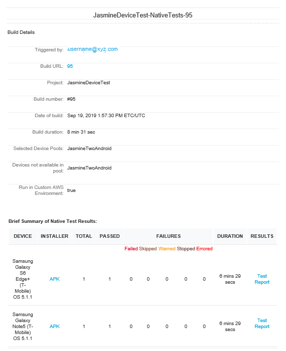
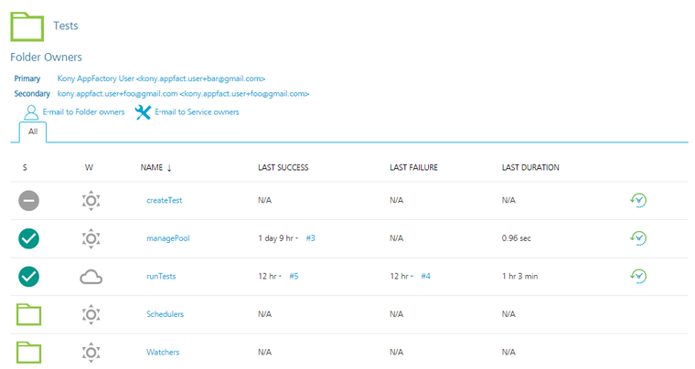
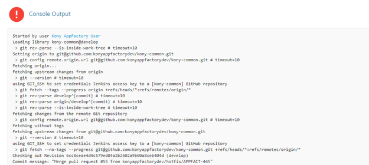

# Testing an App with the Jasmine Test Framework

Jasmine is a behavior driven development test framework for JavaScript. With App Factory, you can use the Jasmine framework to run test cases for the Native and Desktop Web platforms. For more information, refer to the following sections.

> **_Note_**: If you want to run Jasmine tests for the Native channel, or if you are using version V9 ServicePack 2 or earlier, you can run Jasmine tests only during the build process ([buildIrisApp](BuildingAnApp.html)).

## Prerequisites

Native Prerequisites

<b>Note:</b> To run the Jasmine tests on the native platform, you need a Custom Test Environment. Standard test environment is not supported to run Jasmine tests on the native platform.
<ul>
<li>
Make sure that the Iris project contains the test files at the following locations:
<ul>
<li><code>&lt;Project-Root&gt;/testresources/Jasmine/Mobile</code> for Mobile</li>
<li><code>&lt;Project-Root&gt;/testresources/Jasmine/Tablet</code> for Tablet</li>
</ul>
</li>
<li>Make sure that you configure a device pool before you test the application. For more information, refer to <a href="Configuring_Device_Pools.html">Configuring Device Pools</a></li>
<li>Jasmine tests are executed in the AWS Device Farm Cloud environment.</li>
You can find the Jasmine tests in the root folder of the project.

</ul>

Desktop Web Prerequisites

<ul>
<li>Make sure that the Iris project contains Jasmine test files at the following location: <code>&lt;Project-Root&gt;/testresources/Jasmine/Desktop</code></li>
</ul>

<ul>
<li>Make sure that the Jasmine tests are running in your local machines in Google Chrome.</li>
</ul>

### Custom Test Environment

Jasmine tests always run in a Custom Test Environment. App Factory uses the default Appium version to launch the app on the test device. But, you can provide a version number in the Build Parameters to override the Appium version. You can also provide the name of the Test Runner file that you want to run on the test device.

## Building and running a test

<blockquote>

<strong><em>Note</em></strong>:  

<ul>
<li>From V9 ServicePack 3, you can test a deployed web app with the Jasmine Test Framework by using the <strong>runTest</strong> job.</li>
<li>To run tests that are independent from the build process, make sure that the Binary URL is public (open) and accessible from App Factory. For example, a URL to an S3 bucket.</li>
<li>If you do not have a public Binary URL, VoltMX recommends that you run the tests as part of the build process.</li>
</ul>
</blockquote>

To build and run a test, follow these steps:

1.  From the **Iris** folder of your project, navigate to the **Tests** sub-folder.
2.  For the **runTest** job, click the **Build with Parameters** icon on the right side of the row.  
    Alternatively, select the **runTest** job, and then from the left panel of the details page, select **Build with Parameters**.
3.  Configure the build parameters for the runTest job. For more information about the parameters, refer to the following sections.  

  

    Source_Control
  

  <table style="width: 80%;mc-table-style: url('Resources/TableStyles/Basic.css');" class="TableStyle-Basic" cellspacing="0">
    <colgroup>
      <col class="TableStyle-Basic-Column-Column1" style="width: 30%;">
      <col class="TableStyle-Basic-Column-Column1" style="width: 50%;">
    </colgroup>
    <tbody>
      <tr class="TableStyle-Basic-Body-Body1">
        <th class="TableStyle-Basic-BodyE-Column1-Body1">Parameter</th>
        <th class="TableStyle-Basic-BodyD-Column1-Body1">Description</th>
      </tr>
      <tr class="TableStyle-Basic-Body-Body1">
        <td class="TableStyle-Basic-BodyB-Column1-Body1">PROJECT_SOURCE_CODE_BRANCH</td>
        <td class="TableStyle-Basic-BodyA-Column1-Body1">Specifies the branch, release tag, or the commit ID of the repository that contains the test files. The tests must be placed at the following location: 
<code>&lt;Repository-Root&gt;/&lt;Project-Root&gt;/test/Jasmine/</code>
 The <strong>&lt;Repository-Root&gt;<strong> must be configured in the <a href="Project_Settings.html">Project Settings</a>. The </strong>&lt;Project-Root&gt;</strong>is the name of the project that is configured while <a href="Setup.html#Iris">creating the Iris project in App Factory</a>.</td>
      </tr>
    </tbody>
  </table>

  

    Testing
  
<b>Note:</b> To run tests by using the Jasmine Test Framework, make sure that your app is built in the <strong>test</strong> mode.
  <table style="width: 80%;mc-table-style: url('Resources/TableStyles/Basic.css');" class="TableStyle-Basic" cellspacing="0">
    <colgroup>
      <col class="TableStyle-Basic-Column-Column1" style="width: 30%;">
      <col class="TableStyle-Basic-Column-Column1" style="width: 50%;">
    </colgroup>
    <tbody>
      <tr class="TableStyle-Basic-Body-Body1">
        <th class="TableStyle-Basic-BodyE-Column1-Body1">Parameter</th>
        <th class="TableStyle-Basic-BodyD-Column1-Body1">Description</th>
      </tr>
      <tr class="TableStyle-Basic-Body-Body1">
        <td class="TableStyle-Basic-BodyE-Column1-Body1">TEST_FRAMEWORK</td>
        <td class="TableStyle-Basic-BodyD-Column1-Body1">Specifies the framework that you want to use for testing the app. The test framework can be <strong>TestNG</strong> or <strong>Jasmine</strong>.</td>
      </tr>
      <tr class="TableStyle-Basic-Body-Body1">
        <td class="TableStyle-Basic-BodyE-Column1-Body1">RUN_NATIVE_TESTS</td>
        <td class="TableStyle-Basic-BodyD-Column1-Body1">
          Specifies whether App Factory must run tests for the Native platform. If you enable this parameter, the console displays additional parameters for Native tests. For more information, refer to <a href="#Build_Native">Native build parameters</a>.
        </td>
      </tr>
      <tr class="TableStyle-Basic-Body-Body1">
        <td class="TableStyle-Basic-BodyE-Column1-Body1">RUN_DESKTOPWEB_TESTS</td>
        <td class="TableStyle-Basic-BodyD-Column1-Body1">
          Specifies whether App Factory must run tests for the Desktop Web platform. If you enable this parameter, the console displays additional parameters for Desktop Web tests. For more information, refer to <a href="#Desktop_Build">Desktop Web build parameters</a>.
        </td>
      </tr>
      <tr class="TableStyle-Basic-Body-Body1" madcap:conditions="Default.V9SP5">
        <td class="TableStyle-Basic-BodyE-Column1-Body1">OVERRIDE_TEST_DATA</td>
        <td class="TableStyle-Basic-BodyD-Column1-Body1">
          Specifies whether custom data must be used during the test run. If you enable this parameter, App Factory displays the following parameters: <a href="#Desktop_Web">WEB_CUSTOM_DATA_PATH</a> <a href="#Custom_Environment">NATIVE_CUSTOM_DATA_PATH</a> Custom data is only applicable for Jasmine tests.
        </td>
      </tr>
      <tr class="TableStyle-Basic-Body-Body1" madcap:conditions="Default.V9SP4">
        <td class="TableStyle-Basic-BodyB-Column1-Body1">RERUN_FAILED_TESTS</td>
        <td class="TableStyle-Basic-BodyA-Column1-Body1">
          Specifies whether App Factory tracks the test suites that have at least one failed test case and reruns the test suites after the first test run is complete. To use this feature, the test suite must be written such that it can be run independent of other test suites. The test results for the rerun are included in a separate section of the notification email. For more information, refer to <a href="RunningIrisApp.html#Build">Build Results Notification</a>. This parameter is displayed only if <strong>Jasmine</strong> is selected as the test framework and either <code>RUN_NATIVE_TESTS</code> or <code>RUN_DESKTOPWEB_TESTS</code> is enabled.
        </td>
      </tr>
    </tbody>
  </table>

  

    Native build parameters
  
The following parameters are applicable only if you want to run automated tests on a native app that is generated by the protected build. 
  <b>Note:</b> 
  <ul>
<li>To run the tests individually, make sure that you provide public URLs in the <a href="#Build_Native">Native parameters</a>.</li>
<li>You can use the universal application binary and run the tests on mobile and tablet devices based on the availability in the device pool. You can trigger a runTest job either with a universal binary or with a mobile or a tablet binary.</li>
</ul>

  <table style="mc-table-style: url('Resources/TableStyles/Basic.css');width: 75%;" class="TableStyle-Basic" cellspacing="0">
    <colgroup>
      <col class="TableStyle-Basic-Column-Column1" style="width: 35%;">
      <col class="TableStyle-Basic-Column-Column1" style="width: 40%;">
    </colgroup>
    <tbody>
      <tr class="TableStyle-Basic-Body-Body1">
        <th class="TableStyle-Basic-BodyE-Column1-Body1">Parameter</th>
        <th class="TableStyle-Basic-BodyD-Column1-Body1">Description</th>
      </tr>
      <tr class="TableStyle-Basic-Body-Body1">
        <td class="TableStyle-Basic-BodyE-Column1-Body1">ANDROID_UNIVERSAL_NATIVE_BINARY_URL</td>
        <td class="TableStyle-Basic-BodyD-Column1-Body1">Specifies the URL of the Android universal binaries that are generated by a build job or generated locally.</td>
      </tr>
      <tr class="TableStyle-Basic-Body-Body1">
        <td class="TableStyle-Basic-BodyE-Column1-Body1">ANDROID_MOBILE_NATIVE_BINARY_URL</td>
        <td class="TableStyle-Basic-BodyD-Column1-Body1">Specifies the URL of the Android Mobile binary that is generated by a build job or generated locally.</td>
      </tr>
      <tr class="TableStyle-Basic-Body-Body1">
        <td class="TableStyle-Basic-BodyE-Column1-Body1">ANDROID_TABLET_NATIVE_BINARY_URL</td>
        <td class="TableStyle-Basic-BodyD-Column1-Body1">Specifies the URL of the Android Tablet binary that is generated by a build job or generated locally.</td>
      </tr>
      <tr class="TableStyle-Basic-Body-Body1">
        <td class="TableStyle-Basic-BodyE-Column1-Body1">IOS_UNIVERSAL_NATIVE_BINARY_URL</td>
        <td class="TableStyle-Basic-BodyD-Column1-Body1">Specifies the URL of the iOS universal binaries that are generated by a build job or generated locally.</td>
      </tr>
      <tr class="TableStyle-Basic-Body-Body1">
        <td class="TableStyle-Basic-BodyE-Column1-Body1">IOS_MOBILE_NATIVE_BINARY_URL</td>
        <td class="TableStyle-Basic-BodyD-Column1-Body1">Specifies the URL of the iPhone binary that is generated by a build job or generated locally.</td>
      </tr>
      <tr class="TableStyle-Basic-Body-Body1">
        <td class="TableStyle-Basic-BodyE-Column1-Body1">IOS_TABLET_NATIVE_BINARY_URL</td>
        <td class="TableStyle-Basic-BodyD-Column1-Body1">Specifies the URL of the iPad binary that is generated by a build job or generated locally.</td>
      </tr>
      <tr class="TableStyle-Basic-Body-Body1">
        <td class="TableStyle-Basic-BodyE-Column1-Body1">NATIVE_TESTS_URL</td>
        <td class="TableStyle-Basic-BodyD-Column1-Body1">Specifies the URL of the binaries for the compiled test project. If you provide Git parameters, you can skip this parameter.</td>
      </tr>
      <tr class="TableStyle-Basic-Body-Body1">
        <td class="TableStyle-Basic-BodyB-Column1-Body1">AVAILABLE_TEST_POOLS</td>
        <td class="TableStyle-Basic-BodyA-Column1-Body1">
          Specifies the device pool that must be used for the tests. If a device pool is empty, the build fails. For more information, refer to <a href="Configuring_Device_Pools.html">Configuring Device Pools</a>.
        </td>
      </tr>
    </tbody>
  </table>The URLs that you provide must be open and accessible on the internet. For example, a URL to an S3 bucket from the email notification that is sent by the <strong>buildIrisApp</strong> job.  <strong> Custom Test Environment related parameters</strong>:  In a custom test environment, you can select the Appium version on which you want to run your tests. Make sure that you provide an appropriate Appium version. For more information, refer to <a href="https://docs.aws.amazon.com/devicefarm/latest/developerguide/test-types-android-appium-java-junit.html">AWS Device Farm</a>.
  <table style="mc-table-style: url('Resources/TableStyles/Basic.css');width: 90%;" class="TableStyle-Basic" cellspacing="0">
    <colgroup>
      <col class="TableStyle-Basic-Column-Column1" style="width: 35%;">
      <col class="TableStyle-Basic-Column-Column1" style="width: 55%;">
    </colgroup>
    <tbody>
      <tr class="TableStyle-Basic-Body-Body1">
        <th class="TableStyle-Basic-BodyE-Column1-Body1">Parameter</th>
        <th class="TableStyle-Basic-BodyD-Column1-Body1">Description</th>
      </tr>
      <tr class="TableStyle-Basic-Body-Body1">
        <td class="TableStyle-Basic-BodyE-Column1-Body1">APPIUM_VERSION</td>
        <td class="TableStyle-Basic-BodyD-Column1-Body1">
          Specifies the Appium version that you want to run for the tests. For more information, refer to <a href="CustomTestEnvRun_RawMode.html">Custom Test Environment Run</a>. For information about the artifacts that are available in the notification mail for AWS Custom Environment Run, refer to <a href="BuildingAnApp.html#AWS_Custom">Building an App in AWS Custom Environment</a>.
        </td>
      </tr>
      <tr class="TableStyle-Basic-Body-Body1">
        <td class="TableStyle-Basic-BodyE-Column1-Body1">TEST_PLAN</td>
        <td class="TableStyle-Basic-BodyD-Column1-Body1">Specifies the test plan that you want to execute. The test plan files must be located at <code>&lt;Project-Root&gt;/testresources/Jasmine/Mobile/TestPlans</code></td>
      </tr>
      <tr class="TableStyle-Basic-Body-Body1" madcap:conditions="Default.V9SP5">
        <td class="TableStyle-Basic-BodyE-Column1-Body1">NATIVE_CUSTOM_DATA_PATH</td>
        <td class="TableStyle-Basic-BodyD-Column1-Body1">Specifies the path of the custom data that you want to use for the native tests. The path is relative to the channel directory in the <code>testresources/Jasmine</code> folder of the Iris project source. For example, if your custom data files are located at <code>/testresources/Jasmine/Mobile/customTestData/DevData/DataFile.js</code>, then the relative path is <code>customTestData/DevData</code>.</td>
      </tr>
      <tr class="TableStyle-Basic-Body-Body1">
        <td class="TableStyle-Basic-BodyB-Column1-Body1">NATIVE_TEST_PLAN</td>
        <td class="TableStyle-Basic-BodyA-Column1-Body1">Specifies the relative path of the test plan (such as <code>testRunner.js</code>) that you want to execute. The path is relative to the following folders: <em><code>/testresources/Jasmine/Mobile/Test Plans</code></em>, <code>/testresources/Jasmine/Tablet/Test Plans</code> If the test plan is not provided, the default test plan (testPlan.js) is executed.</td>
      </tr>
    </tbody>
  </table>

  

    Desktop Web build parameters
  

  <table style="mc-table-style: url('Resources/TableStyles/Basic.css');width: 90%;" class="TableStyle-Basic" cellspacing="0">
    <colgroup>
      <col class="TableStyle-Basic-Column-Column1" style="width: 35%;">
      <col class="TableStyle-Basic-Column-Column1" style="width: 55%;">
    </colgroup>
    <tbody>
      <tr class="TableStyle-Basic-Body-Body1">
        <th class="TableStyle-Basic-BodyE-Column1-Body1">Parameter</th>
        <th class="TableStyle-Basic-BodyD-Column1-Body1">Description</th>
      </tr>
      <tr class="TableStyle-Basic-Body-Body1">
        <td class="TableStyle-Basic-BodyE-Column1-Body1">Foundry_APP_URL</td>
        <td class="TableStyle-Basic-BodyD-Column1-Body1">Specifies the URL of the Foundry app with which the Desktop Web WAR file is published.</td>
      </tr>
      <tr class="TableStyle-Basic-Body-Body1" madcap:conditions="Default.V9SP5">
        <td class="TableStyle-Basic-BodyE-Column1-Body1">WEB_CUSTOM_DATA_PATH</td>
        <td class="TableStyle-Basic-BodyD-Column1-Body1">Specifies the path of the custom data that you want to use for the web tests. The path is relative to the channel directory in the <code>testresources/Jasmine</code> folder of the Iris project source. For example, if your custom data files are located at <code>/testresources/Jasmine/Web/customTestData/DevData/DataFile.js</code>, then the relative path is <code>customTestData/DevData</code>.</td>
      </tr>
      <tr class="TableStyle-Basic-Body-Body1">
        <td class="TableStyle-Basic-BodyE-Column1-Body1">WEB_TEST_PLAN</td>
        <td class="TableStyle-Basic-BodyD-Column1-Body1">Specifies the relative path of the test plan (such as <code>testRunner.js</code>) that you want to execute. The path is relative to the following folder: <code>/testresources/Jasmine/Desktop/Test Plans</code> If the test plan is not provided, the default test plan (testPlan.js) is executed.</td>
      </tr>
      <tr class="TableStyle-Basic-Body-Body1">
        <td class="TableStyle-Basic-BodyE-Column1-Body1">AVAILABLE_BROWSERS</td>
        <td class="TableStyle-Basic-BodyD-Column1-Body1">Specifies the browser on which you want to run the Desktop Web tests.</td>
      </tr>
      <tr class="TableStyle-Basic-Body-Body1">
        <td class="TableStyle-Basic-BodyE-Column1-Body1">SCREEN_RESOLUTIONS</td>
        <td class="TableStyle-Basic-BodyD-Column1-Body1">Specifies the resolution at which the browser must launch and run the tests.</td>
      </tr>
      <tr class="TableStyle-Basic-Body-Body1">
        <td class="TableStyle-Basic-BodyB-Column1-Body1">RUN_WEB_TESTS_ARGUMENTS</td>
        <td class="TableStyle-Basic-BodyA-Column1-Body1">Specifies additional parameters that must be passed in a Maven command to the Web tests.</td>
      </tr>
    </tbody>
  </table>

  

    Custom Hooks
  

  <table style="mc-table-style: url('Resources/TableStyles/Basic.css');width: 90%;" class="TableStyle-Basic" cellspacing="0">
    <colgroup>
      <col class="TableStyle-Basic-Column-Column1" style="width: 35%;">
      <col class="TableStyle-Basic-Column-Column1" style="width: 55%;">
    </colgroup>
    <tbody>
      <tr class="TableStyle-Basic-Body-Body1">
        <th class="TableStyle-Basic-BodyE-Column1-Body1">Parameter</th>
        <th class="TableStyle-Basic-BodyD-Column1-Body1">Description</th>
      </tr>
      <tr class="TableStyle-Basic-Body-Body1">
        <td class="TableStyle-Basic-BodyB-Column1-Body1">RUN_CUSTOM_HOOKS</td>
        <td class="TableStyle-Basic-BodyA-Column1-Body1">
          Specifies whether Custom Hooks must be run in the after the tests are executed (the Post-Test stage). For more information, refer to <a href="CustomHooks.html">Custom Hooks</a>.
        </td>
      </tr>
    </tbody>
  </table>

## Running Tests from the buildIrisApp job

You can trigger the tests from the buildIrisApp job available at **Project Name** > **Iris** > **Builds** folder. It is the simplest way to validate your code by launching tests right after Building the application. There is no need to specify all parameters as they are provided while running the tests manually. The results can be viewed in line to the Test Results of Manual Tests.

## Test Results

### Native test Results

When the project test build is complete and the test results are published at S3, e-mail notifications are sent to recipients:

On an unsuccessful build for the tests run, the following e-mail is sent to the recipients:

#### Sample email for Native tests

In the final stage, the consolidated test run status is notified via e-mail. Refer the following screenshots for the sample email for consolidated status.

To download test data that is fetched from the AWS Device Farm, click the **Download File** link. The data is stored at S3 and available for review without any time limitations.

To view the detailed test report, click the **Test Report** link.

### Desktop Web test results

When the project test build is complete and the test results are published at S3, e-mail notifications are sent to recipients:

On an unsuccessful build for the tests run, the following e-mail is sent to the recipients:

#### Sample email for Desktop Web tests

In the final stage, the consolidated test run status is notified via e-mail. Refer the following screenshots for the sample email for consolidated status.

The summary of the test results are shown based on the tests executed on specified browser that includes passed, failed, skipped. Usually the tests are skipped when the driver initialization fails.

To view the detailed test report, click the **Detailed Test Report** link.

To view the details on the browser log, click the **Browser Console Log** link.

### Test Status

Test Status is available in the test result email which is sent to the recipient after you execute the test cases. Following are different statuses in the test result email:

*   **PASSED**: The status of the test result is **PASSED** when the test case is executed without any issues, and when the assertion is successful.
*   **FAILED**: The status of the test result is **FAILED** when the expected result does not match with the actual result of the test case, and the assertion fails.

The **SKIPPED**, **WARNED**, **STOPPED**, **ERRORED** statuses are not applicable for Jasmine Tests.

## Troubleshooting Issues

The following errors can help you during troubleshooting if the runTest job fails:

*   **Error**: Jasmine Tests can only be executed when the app is built in Debug mode.  
**Solution**: Make sure that you have selected the build mode as **debug** when the app is built before running the tests.
*   **Error**: Please provide pool to test on.  
**Solution**: Make sure that you provide a value to AVAILABLE_TEST_POOLS parameter to run the native tests.
*   **Error**: Sorry, You can't run test for Android Universal binary along with Android Mobile/Tablet.  
**Solution**: The universal binary tests both the Mobile and Tablet binaries are based on the availability of the devices in the device pool. So it is not required to provide mobile/tablet binary when you give universal binary.
*   **Error**: Build parameter <parameter name> value is not valid URL!  
**Solution**: Make sure that the URL you provide for the following parameters is valid:
*   ANDROID_MOBILE_NATIVE_BINARY_URL
*   ANDROID_TABLET_NATIVE_BINARY_URL
*   IOS_MOBILE_NATIVE_BINARY_URL
*   IOS_TABLET_NATIVE_BINARY_URL
*   NATIVE_TESTS_URL
*   ANDROID_UNIVERSAL_NATIVE_BINARY_URL
*   DESKTOPWEB_TESTS_URL
*   IOS_UNIVERSAL_NATIVE_BINARY_URL

The builds that failed during the test can be tracked for the issues that caused the failure. For example, consider build #4 from the following screenshots of runTests job. To troubleshoot the issue, follow these steps.

1.  From your project folder, navigate to **Iris** > **Tests**.

    

3.  Select the runTests job, and then find the failed build.  
For example, find and click the link for build **#4**.

    

5.  From the details page of the failed build, select the **Console Output** on the left panel. The **Console Output Log** opens in the right pane.

    

7.  Scroll to find errors in the log that caused the build to fail. For example, you can trace an error that is related to invalid Android Tablet URL.

    

9.  Check if the ANDROID_TABLET_NATIVE_BINARY_URL parameter is valid. Alternatively you can troubleshoot the issue from the stages of Manual Testing.

    

To troubleshoot the issue from the Stage View, follow these steps:

1.  From the Stage View, point to the failed stage, and then click **Logs**.  
    
2.  From log messages in the **Stage Logs** window, identify the error message that corresponds to the failure of the build.  
For example, you can trace an error that is related to invalid Android Tablet URL.

    

4.  Check whether the ANDROID_TABLET_NATIVE_BINARY_URL parameter is valid.

## Auto-Triggering Tests

App Factory supports two types of auto-triggered test jobs: scm-triggered (Watchers) and cron-triggered (Schedulers). Every project contains a folder called **Tests** in the **Iris** sub-folder, which contains a job for creation of auto-triggered jobs (createTest) and two sub-folders where created jobs are stored.

To setup an auto-triggered test job, follow these steps:

1.  From the project folder, navigate to the **Tests** sub-folder.
2.  Select the **createTest** job.

    

4.  Configure the CRON_SCHEDULE parameter based on your requirement.
    *   If you want to create a **Scheduler**, type a Cron expression that corresponds to the time at which the build job must be triggered.  
        For information about cron expressions, refer to [Cron](https://en.wikipedia.org/wiki/Cron).
    *   If you want to create a **Watcher**, leave the CRON_SCHEDULE parameter blank.
5.  Configure the remaining parameters, which are the same as the runTest job.

    

7.  After you configure all the parameters, click **BUILD**.

    

**_Note:_**

*   Every Scheduler that is created contains the cron string in job name to simplify the job search.  
    
*   Every Watcher that is created contains the branch name in job name to simplify the job search.  
    

