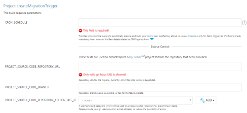
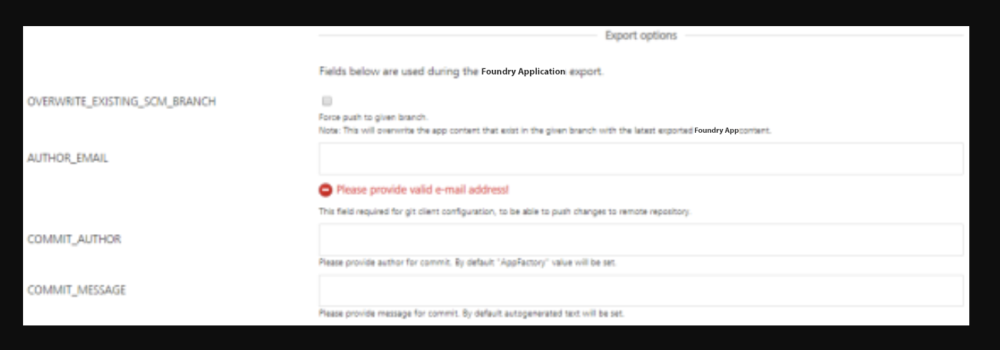

                          

Triggering a Foundry task
========================

App Factory enables users to schedule Foundry Import, Export, and Migrate jobs for Volt MX Foundry app configurations. In an App Factory project, you can create triggers for Iris and Foundry projects. To create Foundry Triggers, navigate to Triggers in Foundry. The Foundry Triggers has the new trigger jobs for each Foundry task (such as createExportTrigger, createImportTrigger, and createMigrationTrigger) and Schedulers. The Schedulers will have the created triggers.

Schedule Export
---------------

You can create a trigger to automate the export process of Foundry app configuration by using the **createExportTrigger** job. The job enables App Factory users to create schedulers to automate the export of Foundry app configuration from Foundry app to SCM.

**To set up an auto-triggered job for exporting the Foundry app, perform the following steps:**

1.  Navigate to App Factory Project >> Foundry >> **Triggers**. The **Triggers** page appears.
    
    
    
2.  Click **createExportTrigger**.

4.  Specify all the required parameters.
    
    
    
    **CRON\_SCHEDULE** - Specify the UNIX cron-like feature to periodically execute and build your Foundry task. The field is mandatory as App Factory allows you to create Schedulers only for Foundry triggers.
    
    **Source Control** - You can use the parameters to export or import a Volt MX Foundry project to/from the provided repository.
    
    *   **PROJECT\_SOURCE\_CODE\_REPOSITORY\_URL** - Repository URL for exporting the source code of the project; currently, only https URL format is supported.
    *   **PROJECT\_SOURCE\_CODE\_BRANCH** - Repository branch name, commit ID, or tag for Foundry export.
    *   **PROJECT\_SOURCE\_CODE\_REPOSITORY\_CREDENTIALS\_ID** -Used to access the repository for export and import tasks.
        
        > **_Important:_** Provide Git credentials depending on the Git URL format. If you provide the https link, then provide the user credentials (user name and password). In the case of ssh link, you must add the ssh key.
        
        > **_Note:_** If your repository is protected with 2FA (two-factor authentication) in GitHub, you need to add the GitHub credentials to your project. For more information, refer to [GitHub 2FA](Prerequisites.md#GitHub_2FA).
        
    
    **Foundry** - Used to configure settings specific to Volt MX Foundry.
    
    
    
    *   **CLOUD\_CREDENTIALS\_ID** - Volt MX cloud credentials. For more information on adding Volt MX cloud credentials, refer [Adding Cloud Credentials](ManagingCredentials.md#Cloud).
    *   **CLOUD\_ACCOUNT\_ID** - Volt MX cloud account ID.
    *   **FOUNDRY\_CONSOLE\_URL** - Publicly accessible url for user's Volt MX Foundry Console (without context path), relevant for on-premise installation only. For example http://10.10.24.78:8081.
        
    *   **FOUNDRY\_IDENTITY\_URL** - Publicly accessible url for user's Volt MX Identity Services (without context path), relevant for on-premise installation only. For example http://10.10.24.79:8080.
        
    *   **FOUNDRY\_APP\_NAME** - Foundry application name that needs to be exported.
    *   **FOUNDRY\_APP\_VERSION** - Foundry app version to export. Only specified version is used for the export process.
        
        > **_Note:_** Version input should be in the format of **major.minor**, where major and minor are numbers and 1 <= major <= 999 and 0 <= minor <= 99. For example, '1.0' or '999.99'.
        
    
    **Export Options** - Used during the Foundry application export process.
    
    
    
    *   **OVERWRITE\_EXISTING\_SCM\_BRANCH** - Select the check box to overwrite the existing SCM branch.
        
        > **_Note:_** Selecting the option will overwrite the app content that exists in the given branch with the latest exported Foundry app content.
        
    *   **AUTHOR\_EMAIL** - For Git client configuration, provide the email ID to push changes to remote repository.
        
    *   **COMMIT\_AUTHOR** - Provide author for commit. The **App Factory** value is set by default.
    *   **COMMIT\_MESSAGE** - Provide message for commit. The auto-generated text is set by default.
        
    
    **Notifications** - Used to configure settings associated with notifications.
    
    
    
    *   RECIPIENTS\_LIST - Enter the email addresses separated by a comma to notify people about the build status. If this parameter is empty, emails will be sent to the Jenkins **Default Recipients** list.
        
5.  Click **Build** to build the Export Trigger job with the build parameters. A cron-triggered job is created and stored in the Schedulers sub-folder.
    
    Every created Scheduler, has a cron string in the job's name to simplify the job search. Refer [Cron Documentation](https://en.wikipedia.org/wiki/Cron) for cron expressions that you can set up in the CRON\_SCHEDULE parameter.
    

Schedule Import
---------------

You can create a trigger to automate the import activity of Foundry app configuration by using the **createImportTrigger** job. The job enables App Factory users to create the schedulers to automate the import of Foundry app configuration from SCM repository to the Foundry app.

**To set up an auto-triggered job for importing the Foundry app, perform the following steps:**

1.  Navigate to App Factory Project >> Foundry >> **Triggers**. The **Triggers** page appears.
    
    
    
2.  Click **createImportTrigger**.
    
    
    
3.  Specify the following parameters:
    
    
    
    **CRON\_SCHEDULE** - Specify the UNIX cron-like feature to periodically execute and build your Foundry task. The field is mandatory as App Factory allows you to create Schedulers only for Foundry triggers.
    
    **Source Control** - Used to export or import a Volt MX Foundry project to/from the provided repository.
    
    *   **PROJECT\_SOURCE\_CODE\_REPOSITORY\_URL** - Repository URL for exporting the source code of the project; currently, only https URL format is supported.
    *   **PROJECT\_SOURCE\_CODE\_BRANCH** - Repository branch name, commit ID, or tag for Foundry export.
    *   **PROJECT\_SOURCE\_CODE\_REPOSITORY\_CREDENTIALS\_ID** - Used to access the repository for export and import tasks.
        
        > **_Important:_** Provide Git credentials depending on the Git URL format. If you provide the https link, then user credentials (user name and password) are sufficient. For the case of the ssh link, you must add the ssh key.
        
        > **_Note:_** If your repository is protected with 2FA (two-factor authentication) in GitHub, you need to add the GitHub credentials to your project. For more information, refer to [GitHub 2FA](Prerequisites.md#GitHub_2FA).
        
    
    **Foundry** - Used to configure settings specific to Volt MX Foundry.
    
    
    
    *   **CLOUD\_CREDENTIALS\_ID** - Volt MX cloud credentials. For more information on adding Volt MX cloud credentials, refer [Adding Cloud Credentials](ManagingCredentials.md#Cloud).
    *   **CLOUD\_ACCOUNT\_ID** - Volt MX cloud account ID.
    *   **FOUNDRY\_CONSOLE\_URL** - Publicly accessible url for user's Volt MX Foundry Console (without context path), relevant for on-premise installation only. For example http://10.10.24.78:8081.
        
    *   **FOUNDRY\_IDENTITY\_URL** - Publicly accessible url for user's Volt MX Identity Services (without context path), relevant for on-premise installation only. For example http://10.10.24.79:8080.
        
    *   **FOUNDRY\_APP\_NAME** - Foundry application name that needs to be exported.
    *   **FOUNDRY\_APP\_VERSION** - Foundry app version to be exported. Only the specified version is used for export.
        
        > **_Note:_** Version input should be in the format of **major.minor**, where major and minor are numbers and 1 <= major <= 999 and 0 <= minor <= 99. For example, '1.0' or '999.99'.
        
    
    **Import Options** -  Used to overwrite the existing application during the import process and publish the application after successful import.
    
    
    
    *   **OVERWRITE\_EXISTING\_APP\_VERSION** - Select the check box to overwrite the existing Foundry app.
        
    *   **ENABLE\_PUBLISH** - Select the check box to publish the application after successful import.
        
    *   **FOUNDRY\_ENVIRONMENT\_NAME** - Provide the Foundry environment for publishing.
    *   **SET\_DEFAULT\_VERSION** - Select the check box to make the specified version in the FOUNDRY\_APP\_VERSION field as the default version for your app.
        
    
    **Notifications** - Used to configure settings specific to notifications.
    
    
    
    *   RECIPIENTS\_LIST - Enter the email addresses separated by a comma to notify people about the build status. If this parameter is empty, emails will be sent to the Jenkins **Default Recipients** list.
        
4.  Click **Build** to build the Import Trigger job with the build parameters.
    
    A cron-triggered job is created and stored in the **Schedulers** sub-folder.
    
    Every created **Scheduler** has a cron string in the job's name to simplify the job search. Refer [Cron Documentation](https://en.wikipedia.org/wiki/Cron) for cron expressions that can be set up in the **CRON\_SCHEDULE** parameter.
    

Schedule Migrate
----------------

You can create a trigger to automate the migration activity of the Foundry app configuration by using **createMigrationTrigger** job. The job enables App Factory users to automate the migration of Volt MX Foundry App configurations from one environment to another Foundry environment by using schedulers.

**To set up an auto-triggered job for migrating the Foundry app, perform the following steps:**

1.  Navigate to App Factory Project >>Foundry>> **Triggers**.. The **Triggers** page appears.
    
    
    
2.  Click **createMigrationTrigger**.
    
    
    
3.  Specify the following parameters:
    
    
    
    **CRON\_SCHEDULE** - Specify the UNIX cron-like feature to periodically execute and build your Foundry task. The field is mandatory as App Factory allows you to create Schedulers only for Foundry triggers.
    
    **Source Control** - Used to export or import Volt MX Foundry project to/from the provided repository.
    
    *   **PROJECT\_SOURCE\_CODE\_REPOSITORY\_URL** - Repository URL for exporting the source code of the project; currently, only https URL format is supported.
    *   **PROJECT\_SOURCE\_CODE\_BRANCH** - Repository branch name, commit ID, or tag for the Foundry migrate.
    *   **PROJECT\_SOURCE\_CODE\_REPOSITORY\_CREDENTIALS\_ID** - is used to access the repository for export or import tasks.
        
        > **_Important:_** Provide Git credentials depending on the Git URL format. If you provide the https link, , then user credentials (user name and password) are sufficient. For the case of the ssh link, you must add the ssh key.
        
        > **_Note:_** If your repository is protected with 2FA (two-factor authentication) in GitHub, you need to add the GitHub credentials to your project. For more information, refer to [GitHub 2FA](Prerequisites.md#GitHub_2FA).
        
    
    **Foundry App Details For Migrate** - Used to configure the settings specific to the Volt MX Foundry app for migration.
    
    
    
    *   **FOUNDRY\_APP\_NAME** - Name of the Foundry application that needs to be migrated.
    *   **FOUNDRY\_APP\_VERSION** - The Foundry app version that is to be migrated. Only the specified version is used for migration.
        
        > **_Note:_** Version input should be in the format of **major.minor**, where major and minor are numbers and 1 <= major <= 999 and 0 <= minor <= 99. For example, '1.0' or '999.99'.
        
    
    **Foundry Cloud Details for Export** - Used to configure the settings specific to Volt MX Foundry Export.
    
    
    
    *   **EXPORT\_CLOUD\_CREDENTIALS\_ID** - Volt MX cloud user name or password for export. For detailed information on adding cloud credentials, refer [Adding New Cloud Credentials](ManagingCredentials.md#Cloud).
    *   **EXPORT\_CLOUD\_ACCOUNT\_ID** - Volt MX Cloud account ID for export.
        
    *   **FOUNDRY\_CONSOLE\_URL** - Publicly accessible url for user's Volt MX Foundry Console (without context path), relevant for on-premise installation only. For example http://10.10.24.78:8081.
    *   **FOUNDRY\_IDENTITY\_URL** - Publicly accessible url for user's Volt MX Identity Services (without context path), relevant for on-premise installation only. For example http://10.10.24.79:8080.
    
    **Export Options** -  Use the following fields during the Foundry application export process.
    
    
    
    *   **OVERWRITE\_EXISTING\_SCM\_BRANCH** - Select the check box to overwrite the existing SCM branch.
        
        > **_Note:_** Selecting the option overwrites the app content that exists in the specified branch with the latest exported Foundry app content.
        
    *   **AUTHOR\_EMAIL** - For Git client configuration, provide the email ID to push the changes to the remote repository.
        
    *   **COMMIT\_AUTHOR** - Provide the author for commit. App Factory value is set by default.
    *   **COMMIT\_MESSAGE** - Provide the message for commit. The auto-generated text is set by default.
        
    
    **Foundry Cloud Details For Import**\- Used to configure the settings specific to Volt MX Foundry Import.
    
    
    
    *   **IMPORT\_CLOUD\_CREDENTIALS\_ID** - Volt MX Cloud user name and password for import. Click **Add** to add cloud credentials. For detailed information on adding cloud credentials, refer [Adding New Cloud Credentials](ManagingCredentials.md#Cloud).
    *   **IMPORT\_CLOUD\_ACCOUNT\_ID** - Volt MX Cloud account ID for import.
    *   **FOUNDRY\_CONSOLE\_URL** - Publicly accessible url for user's Volt MX Foundry Console (without context path), relevant for on-premise installation only. For example http://10.10.24.78:8081.
    *   **FOUNDRY\_IDENTITY\_URL** - Publicly accessible url for user's Volt MX Identity Services (without context path), relevant for on-premise installation only. For example http://10.10.24.79:8080.
    
    **Import Options** -  Used to overwrite the existing application during the import process and publish the application after successful import.
    
    
    
    *   **OVERWRITE\_EXISTING\_APP\_VERSION** - Select the check box to overwrite the existing Foundry app.
        
    *   **ENABLE\_PUBLISH** - Select the check box to publish the application after successful import.
        
    *   **FOUNDRY\_ENVIRONMENT\_NAME** - Provide the Foundry environment for publishing.
    *   **SET\_DEFAULT\_VERSION** - Select the check box to make the specified version in the FOUNDRY\_APP\_VERSION field as the default version for your app.
        
    
    **Notifications** - Used to configure settings specific to notifications.
    
    
    
    **RECIPIENTS\_LIST** - Enter the email addresses separated by a comma to notify people for build status. If this parameter is empty, emails will be sent to the Jenkins **Default Recipients** list.
    
4.  Click **Build** to build the Migrate Trigger job with the specified build parameters.
    
    A cron-triggered job is created and stored in the **Schedulers** sub-folder.
    
    Every created **Scheduler**, has a cron string in the job's name to simplify the job search. Refer [Cron Documentation](https://en.wikipedia.org/wiki/Cron) for cron expressions that can be set up in the **CRON\_SCHEDULE** parameter.
