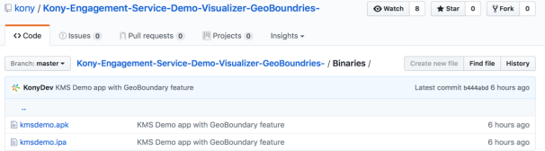
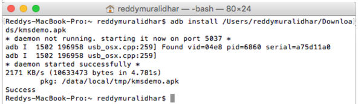
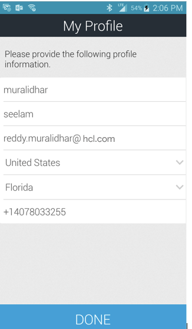
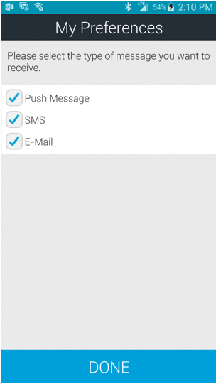
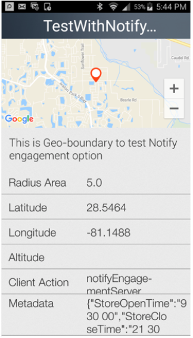
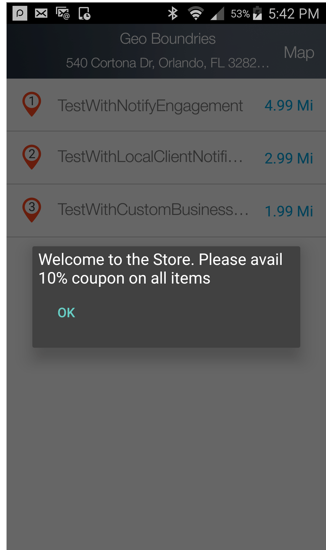
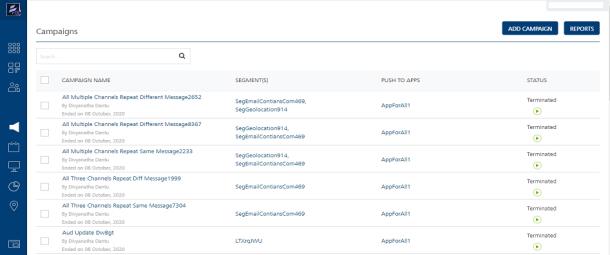
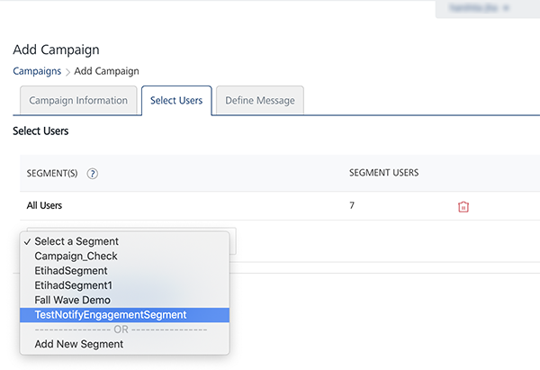

                           

Introduction to Engagement Geoboundary Monitoring: Installing Engagement Demo Application

Demo App for Geoboundary Monitoring
===================================

In this lesson, we will take you through the installation of the enhanced Engagement Demo Application and show you the steps to receive the notifications from the geoboundaries that are set up.

Refer to the chapter one of this course if not already done. The chapter one covers the steps needed to create the geoboundaries and also explains the concepts of the geoboundary monitoring.

It is assumed that you have access to the Engagement server of Volt MX Foundry and configured the Engagement server with the GCM/FCM key that is needed to send the notifications.

Installing Engagement Demo Application
--------------------------------------

In this section, we will take you thru the steps to download and install the android binary of the VoltMX’s Geoboundary monitoring Application.

1.  Refer to to the following URL to download the application binary on your device. As of this writing, this binary has been currently tested on android version 6.0.1 of Samsung S5.
    
    [Binaries](https://github.com/voltmx/VoltMX-Engagement-Service-Demo-Iris-GeoBoundries-/tree/master/Binaries)
    
    <!--  -->
    
2.  After the binary has been downloaded on to your machine, connect the device to the computer and run the adb command to install the binary.
    
    It is assumed that you already have android SDK installed before running this command. This is just one method of installing the binary. You can use any other alternative to install the binary on your device.
    
    
    
3.  Click the application icon, on your device, after the installation is complete. This action will display the following screen and request your permission to send push notifications. Click Ok to accept push notifications.
    
    
    
4.  The next screen will be a native notification requesting you to accept push notifications. Click Ok to continue.
    
    
    
5.  In the next screen, you will be prompted to enter your provisionedEngagement server URL, application ID and sender ID. Additional details of each of field is given below:
    *   URL: This is the provisioned URL of the Engagement server when you signed up for Volt MX Foundry. For example: `https://mfreddy.messaging.voltmxcloud.com`.
    *   Application Id: An application id uniquely identifies an application in the Engagement server. As you may recall, this id was created in the earlier course.
    *   Sender Id: This id is generated when you create the GCM/FCM key with Google so that you can configure your application in the Engagement server. As you may recall, this was also discussed in the earlier course.
    *   It is important that the sender ID used with the application is the same as the one associated with the GCM key that was used to configure the application in the Engagement server.
    *   Click **Done** after all the details were successfully entered. This will navigate you to the user creation screen.

        
    
         
        
6.  The User creation screen is shown below, where you need to enter the first name, last name, phone number, email, country and state (if country is US only) information.
7.  Click **Done** after all the information is entered. This action will create a user in the Engagement server.
    
    
    
8.  You will see the following screen once the user has been created successfully. Click **Ok** and **Done** again to navigate to the next screen of the application.
    
    
    
9.  In the next screen, you will see that you are already subscribed to receive push notifications. Click **SMS** and **E-Mail** options and click **Done**. This will update your preferences to receive all the notifications types and navigates to the next screen.
    
    
    

Geoboundary Monitoring
----------------------

This section will walk you through the steps needed to receive the notifications from the geoboundaries that you have set up in the earlier chapter.

1.  In the demo application screen, click the **Geo Boundaries** icon to launch the geo boundaries screen.
    
    
    
2.  In the next screen, you will see a list of all the monitored geoboundaries. Assuming that you are in vicinity of the three geoboundaries that were set up in the previous chapter, you will be able to see the three geoboundaries. Click on the top right corner to view geoboundaries on the map.
    
    
    
3.  The following screen shows the monitored geoboundaries in a map. The bigger circle in blue is the radius of interest and the smaller circle in green is the refresh boundary. As you may recall from chapter 1, the radius on interest is the radius of a circle with in which you would like all the geoboundaries to be monitored. Similarly, a refresh boundary is a circle when crossed by the application/device will cause a new set of geoboundaries to be fetched so that a new set can be monitored.
    
    The pins in red are the locations (center of the geoboundaries) that are monitored. In this example, we have three boundaries in the same location so the pins are shown as stacked one over the other.
    
    Click **Back** to display the geoboundary list page.
    
    
    
4.  Clicking on any of the geoboundary of the listing page will display the details of the geoboundary. The detail will show the radius of the geoboundary, metadata associated with the geoboundary, latitude, and the longitude.
    
    
    
5.  If you run the application or enter a geo-location that you are monitoring, then you will also get the notification as shown below. The notification below is coming from the **TestWithCustomBusinessLogic** geoboundary that was set up in the previous chapter. As you may recall this boundary could have been set up with client logic such as
    
```

    var startTime = res.metaData["StoreOpenTime"].split(' ');
    var closeTime = res.metaData["StoreCloseTime"].split(' ');
    var startDate = new Date();
    startDate.setHours(startTime[0]);
    startDate.setMinutes(startTime[1]);
    startDate.setSeconds(startTime[2]);
    var closeDate = new Date();
    closeDate.setHours(closeTime[0]);
    closeDate.setMinutes(closeTime[1]);
    closeDate.setSeconds(closeTime[2]);
    var currentDate = new Date
    if((currentDate <= closeDate && currentDate >= startDate)) alert("Welcome to the Store. Please avail 10% coupon on all items");
    else alert("Store is currently closed. Will reopen at " + startTime);
```
    
In this example, the app runs at the time the store was open, so the following notification is displayed.
    

    
6.  Similarly, when the application is put in the background and if you enter the geoboundary that was titled **TestWithLocalClientNotification**, you will also receive a local notification as shown below.
    
    
    
    Expanding the notification bar will display the following details:
    
    
    
7.  To test the **TestWithNotifyEngagement** geoboundary, we need to set up a campaign that will use a segment with **TestWithNotifyEngagement** geoboundary. As you may recall from the chapter 1, the **Notify Engagement** option will cause the client application to update its location with the Engagement server when the device/application enters the geoboundary. The Engagement server in this case will send the notifications for the campaign configured.
    
    Click **Segments** under the **Engagement** section. This will display the screen as below.
    
    
    
8.  Click **Add Segment** to begin the Segment creation screen. Enter the name of the segment as **TestNotifyEngagementSegment**. In the **Attribute** column choose **Location** from the drop-down list. Choose the value as **TestWithNotifyEngagement** from the drop-down list. In the **Execute Conditions By**, choose **Match All Conditions**. This will show the count in the **Users** as 1.
    
    > **_Note:_** Note that the count has to be greater than 1 to send messages when this segment is used.
    
9.  Click **Save** to save the segment.
    
    
    
10. Next, we will set up a campaign that will use this segment. To set up a campaign, click Campaigns under the Engagement section.
11. Click **Add Campaign** to begin the creation of the campaign.
    
    
    
12. Enter the campaign name as **TestNotifyEngagementCampaign**.. Enter the stop time which is 4 hrs after the current time. Click **Next –Select Users** to display the screen to select the users.
    
    
    
13. Select the segment **TestNotifyEngagementSegment** that was created. Click **Next – Define Message** to define the message for the campaign.
    
    
    
14. Select the push message as the message channel. Enter the message name and choose the application name for which the notifications needs to be sent.
15. Enter the message. In this example, the message will be **Welcome to Summer Campaign. Please avail 10% discount on all items**. Click **Save** to save the campaign to display the list of campaigns.
    
    
    
16. Once the device/application enters into the **TestWithNotifyEngagement** geoboundary, the campaign will send a notification to the device as shown below.
    
    
    
    When the notification is clicked, the application will be opened and the message is displayed.
    
    
    
    That’s it! You have installed the demo application that uses the geoboundaries which are set up in the earlier chapter, monitors the boundaries and receives notifications from them.
    

> **_Important:_** For more information, refer to this video:

<div class="youtube-wrapper"><iframe src="https://www.youtube.com/embed/K8zrpdEBhro" allowfullscreen=""></iframe></div>
