                           

Introduction to Engagement Geoboundary Monitoring: Introduction to Geoboundary Terminology

Geoboundary Creation and Monitoring
===================================

In this chapter, we will deep dive into the geoboundaries feature of the Engagement server. We will explain the monitoring of the geoboundaries, create three geoboundaries using various options that are available and also show you some source code to help you get started with sample geo-monitoring applications.

It is assumed that you already have access to trial account of Volt MX Foundry which has Engagement server provisioned. It is also highly recommended that you finish all the chapters of the beginner’s course before you continue with this chapter.

Introduction to Geoboundary Terminology
---------------------------------------

This section explains the geoboundary terminilogies:

### Geoboundary Radius

A geoboundary is an area that is defined by a circle which has the latitude and longitude as the center with a radius. This radius is called as the geoboundary radius.

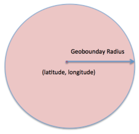

### Radius of Interest

The larger arbitrary radius with in which you would like to monitor all the geoboundaries is called as radius on interest. The radius of interest determines the number of the geoboundaries that you would like to monitor at any time. In the figure below Geo 1, Geo2, and Geo3 are the geoboundaries that are present with in a larger radius of interest.

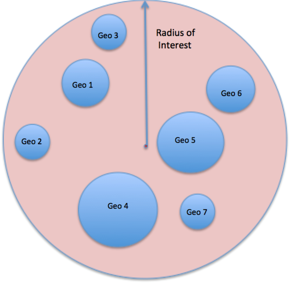

### Refresh Boundary

A refresh boundary is an arbiatry circle with a radius which when crossed will cause a new set of geoboundraies to be monitored. An application that is installed on a device (that is moving), monitors the geoboundaries that are refreshed from time to time. In such a situation, crossing the refresh boundary will cause the application to fetch a new set of boundaries to be monitored.

The figure below shows the refresh boundary, which includes some of the geoboundaries with in the radius of interest.


Geoboundaries in the Engagement Server
--------------------------------------

You have already reviewed the setup of the geoboundaries in the Engagement server. In this section, we will delve into more details of the geoboundaries set up screen and review the complete set of the options and the functionality available in the set up.

1.  The Geoboundary set up in the Engagement server looks as below. You will have an option to enter the address for the geoboundary creation, or dragging, and dropping the pin to create a geoboundary. If you enter the address, the latitude and longitude are populated automatically for that address. You can then enter the radius for the geoboundary.
    
    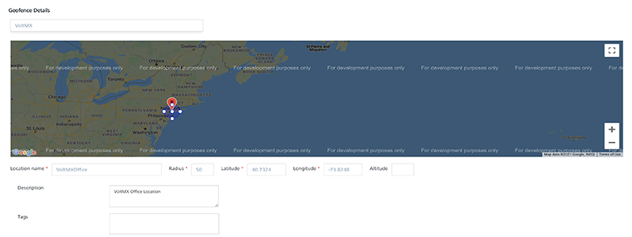
    
2.  If you drag and drop the pin, you will have an option of drawing the circle around the pin and this will populate the latitude, longitude and also the radius. This is shown below.
    
    
    
3.  You need to enter the Location Name, which will be the name of the new geoboundary. The description of the geoboundary will be optional. You can also enter a value for Tags that is additional data that you can associate with a geoboundary. Such data can be used to group a set of geoboundaries. The Engagement APIs, which we will discuss in the later section, also allow you to filter geoboundaries based on the tag values.
4.  The second section of the geoboundary creation screen is as below. In the **Client Action**, there are three options available as shown. The **Notify Engagment Server** option indicates that the client application needs to update the device location with the Engagement server when the user enters the geoboundary. The **Local Client Notification** option indicates that the application needs to display a local notification on the device. The **Custom Business Logic** option indicates that the any custom code set up with this geoboundary will need to be executed on the device.
5.  The **Metadata** section allows you to define certain name/value pairs that can be associated with the geoboundary. Such data can be used by the client application to apply any additional logic if needed.
    
    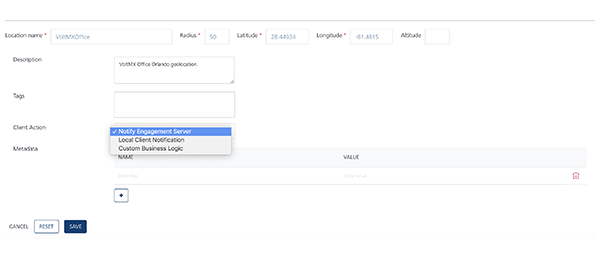
    
6.  Selecting the **Local Client Notification** option will display a text area where you need to enter a local notification message. Note that the local notification message needs to be entered if this option is chosen.
    
    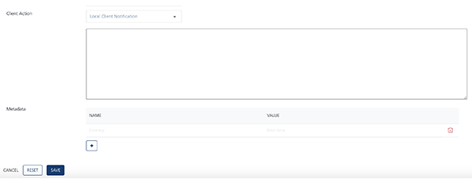
    
7.  You can choose the **Custom Business Logic** option. The option displays the java script editor where you can enter the script to be executed on the device.
    
    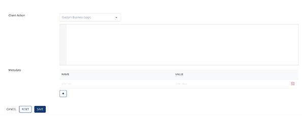
    
8.  Next you will create three geoboundaries with the above mentioned client action options.
    
    Let us begin with the **Notify Engagement Server** option. In the screen below, enter the address and pick the address from the drop list down list. In the screen below, the address of Volt MX in Florida (Orlando Location) is shown as a sample.
    
    *   Enter the location name as TestWithNotifyEngagement.
    *   Enter the description as needed.
    *   Choose the Notify Engagement Server as the client action.
    *   Enter the OrlandoLocation as the tag value.
    *   Enter the **StoreOpenTime** and **StoreCloseTime** as the tags with 9 30 00 (same as 9:30 am) and 21 30 00 (same as 9:30 pm) as values.
    *   Click **Save** to save the geoboundary.
    
    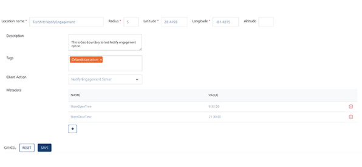
    
9.  Nex you will create a geoboundary with the **Local Client Notification** option. In the screen below, enter the same address from the drop. In the screen below, a store in Florida is shown as a sample.
    *   Enter the location name as TestWithLocalClientNotification.
    *   Enter the description as needed.
    *   Choose the Local Client Notification as the client action. The system displays a text area where you can enter a local notification message can be entered.
    *   Enter the OrlandoLocation as the tag value.
    *   Enter the **StoreOpenTime** and the **StoreCloseTime** as the tags with 9 30 00 and 21 30 00 as values. Click **Save** to save the geoboundary.
        
        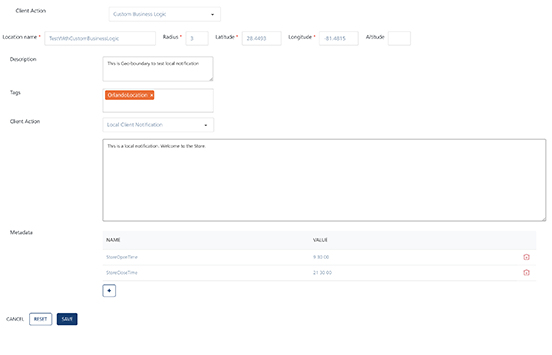
        
10. Next, you will create a geoboundary with the **Custom Business Logic** option. In the screen below, enter the same address you have used before and pick the address from the drop down list. The following image displays Volt MX office in Orlando as a sample address.
    
    *   Enter the location name as `TestWithCustomBusinessLogic`.
    *   Enter the description as needed.
    *   Choose the **Custom Business Logic** as the client action. The system displays a text area where the java script that need to be executed on the client application is entered.  
    You can just enter an alert or a more complex code as shown below. So when this geoboundary is monitored by a client application, the application can execute this code on the client and display the notification. Enter **OrlandoLocation** as the tag value.
    *   Click **Save** to save the geoboundary.

        
    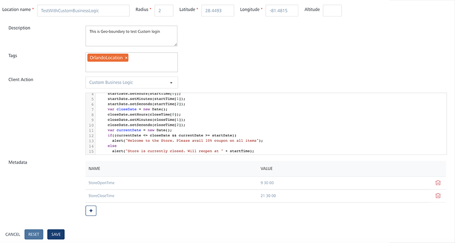
        
    
    Although a simple alert message can be used for your testing, more complex functionality with JavaScript can be configured for a geoboundary with the **Custom Business Logic** as client action. The code below reads metadata of a geoboundary like **StoreOpenTime** and **StoreCloseTime**. The below code provides a welcome message with a coupon, if the customer comes after the store is open else shows the time when the store will open.

```

    var startTime = res.metaData["startTime"].split(' ');
    var closeTime = res.metaData["closeTime"].split(' ');
    var startDate = new Date();
    startDate.setHours(startTime[0]);
    startDate.setMinutes(startTime[1]);
    startDate.setSeconds(startTime[2]);
    var closeDate = new Date();
    closeDate.setHours(closeTime[0]);
    closeDate.setMinutes(closeTime[1]);
    closeDate.setSeconds(closeTime[2]);
    var currentDate = new Date();
    if((currentDate <= closeDate && currentDate >= startDate)) alert("Welcome to the Store. Please avail 10% coupon on all items");
        
    else
        
    alert("Store is currently closed. Will reopen at " + startTime);
```

    
That’s it! You have created and saved three geoboundaries with different client actions.
    

Geoboundary Monitoring Flow
---------------------------

This section discusses the flow and the steps involved in monitoring the geoboundaries that are set up by client applications. At a high level, the geoboundary monitoring will involve using the SDK geo monitoring API. This SDK API in turn invokes the Engagement server API to retrieve the list of the geoboundaries in a radius of interest and then passing them on the framework to monitor. The entire flow of the geoboundary monitoring is explained below.

1.  This step captures the various actions that include the setting up of the geoboundaries in the Engagement server and registering of boundaries to be monitored by the platform. This step includes actions as mentioned below:
    
    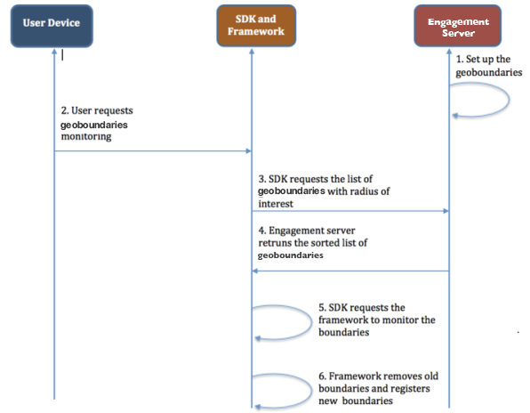
    
    1.  The user/admin of the Engagement server sets up the geoboundaries in the Engagement server.
    2.  The user starts the monitoring of the geoboundaries by invoking the SDK in the application. The user will also specify the radius of interest and any tags for the geoboundraies to be monitored if applicable.
    3.  The SDK then invokes the Engagement’s API to retrieve the sorted list of all the geoboundaries that satisfies the user’s input criteria. The Engagement server also returns a refresh boundary which will be monitored by SDK.
    4.  The SDK then submits the returned list of the boundaries to the framework to monitor the geoboundaries.
    5.  The framework refreshes any current geoboundary and starts monitoring the new list. The framework invokes the call back functions of the SDK when the user enters or exits a geobondary.
    6.  Assuming that the user crossed the refresh boundary that was returned by the Engagement server, the SDK retrieves a new set of the boundaries and submits the same to the framework to monitor.
2.  This step involves the framework communication with the SDK via listeners when the application/device enters or exists a geoboundary and the SDK performs the client action ( executing custom client logic or notification to the Engagement server or sending local notification) of the particular geoboundary. Details of this step are as below:
    
    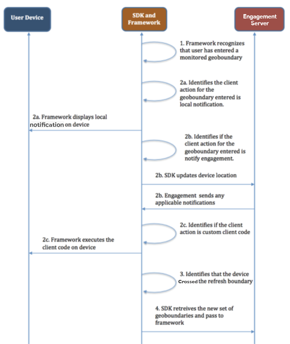
    
1.  The framework that is monitoring the geoboundaries will inform the SDK via the call back function that a particular geoboundary has entered or exited.

2.  The SDK will check the client action associated with the geoboundary that has entered or exited.

    *   If the client action is to show the local notification, the SDK will work with the framework to display the local notification on the device.

    *   If the client action is to notify the Engagement server, the SDK will update the device location. If there is a location based campaign in the Engagement server, then a notification will be sent by the Engagement server to the device if the applications were to qualify.

    *   If the client action is to execute custom client logic then the SDK will communicate with the framework to execute the client logic of the application on the device.
        
3.  The SDK will also recognize when the device/application crosses the refresh boundary and at that time will retrieve the new list of geoboundaries.
4.  When the device has crossed the refresh boundary, a set of geoboundaries are retrieved and passed to the framework to monitor.

Engagement API Support for Geoboundary Monitoring
-------------------------------------------------

The Engagement server provides a REST API called as the Find Nearest Location (Retrieval of Geoboundaries). The API when provided with a radius of interest will return a sorted list of all the geoboundaries contained in that radius. The list of the geoboundaries are sorted in the descending order of the distance to the circumference. Any metadata and tag information associated with the locations is also returned.

The URL of the API is given below:

```
http://<host>:<port>/api/v1/geolocations/nearest/{regId}?radius=100&pageSize=20&tags=tag1,tag2,tag3
```

To get he complete details of this API refer to the [Find Nearest Location API](../../../Foundry/engagement_api_guide/Content/REST_API_Geo_Location/Find_Nearest_Location.md)

### Client Side Code Sample

The following code sample explains how to start the geoboundary monitoring, on a client application, by invoking the SDK API.

```
function registerGeoBoundary() 
{
    var options = {};
    options.radius = radiusOfInterest;  // This is the radius of interest value
    options.tags = anyTagData;  // Any tag data based on which the geoboundaries will need to be filtered
};
    function successCallback (res) {
        alert ("Register GeoBoundary Success.");
}
    function failureCallback (err) {
    alert ("Register GeoBoundary Failed.");
}
   // messagingSvc is an instance of voltmx.sdk 
    messagingSvc.registerGeoBoundaries (options, successCallback, failureCallback); 

```

> **_Important:_** For more information, refer to this video

<div class="youtube-wrapper"><iframe src="https://www.youtube.com/embed/oVLoZH0OKWo" allowfullscreen=""></iframe></div>
