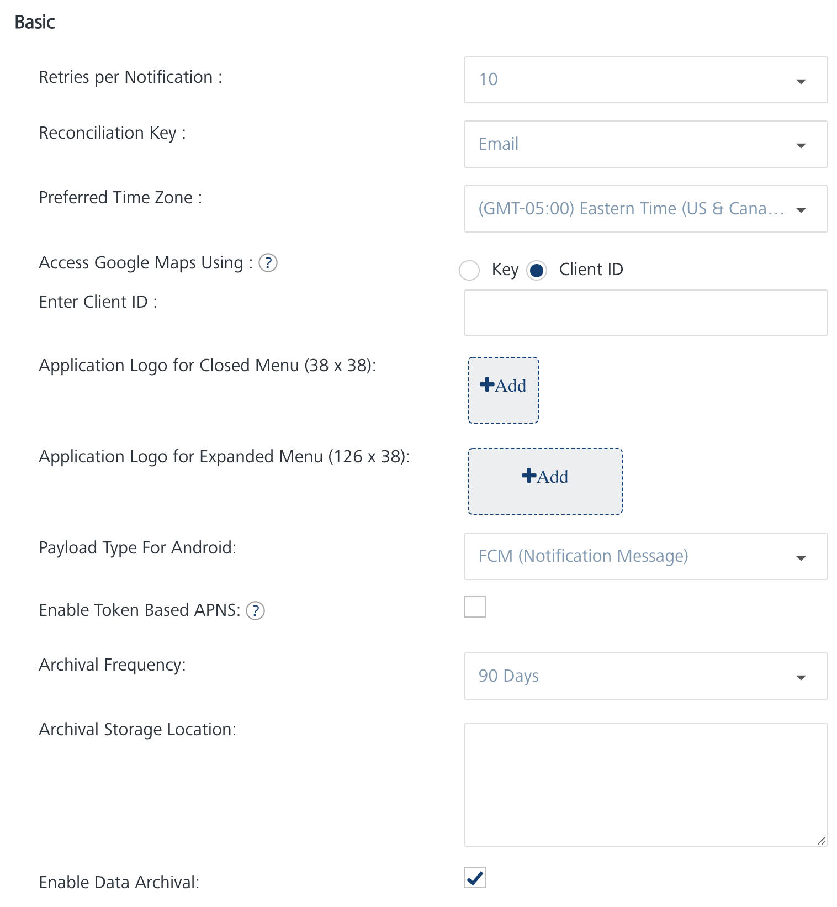

                           

Configuration of Email and SMS Channels in the Engagement Server
================================================================

This section walks you through the steps to configure the Email Server and the SMS provider so that you can send email and notifications to the application on your device. The instructions to install the application on your device will be covered in the later chapters of this tutorial.

Configuration of the Email Server
---------------------------------

1.  After logging into the Engagement Server, click **Configuration** under the **Settings** section.
    
    
    
2.  In the screen below, click **Email Configuration** to view the Email Server settings. You will notice that by default the **General** option is clicked.
    
    
    
3.  In the **Email Configuration** screen, enter the data as needed. For the **Protocol**, choose **SMTP** or **SMTPS** based on the email Server that you will configure. In this example, **SMTP** is chosen.
    *   The **Host Name** will be the name of the SMTP Server that you will be configuring.
    *   The **Port** number is associated with the SMTP or the SMTPS Server that you will configure. In this example, the port number is 25 as SMTP Server was chosen.
    *   The **Default Sender Id** is needed for the SMTP Server that you will configure. Contact the Server admin and enter the value.
    *   Choose the **Security Mode** as applicable for the Server that you will configure. If not sure, contact the Server admin and select the value.
    *   Setting the value of **Allow Unsubscribe** to **Yes** allows a user to unsubscribe from email notifications.
        
        
        
4.  In continuation of the screen discussed above, the **Custom Properties** can be ignored as they are not needed for this tutorial. Click **Test Connection** to test the SMTP Server. Once the connection is successful, click **Save** to save the email configuration.

That’s it! Now you have successfully configured the email Server that can be used to send notifications.

Configuration of SMS Providers
------------------------------

This section walks you through the steps that are needed to configure a SMS provider that can used to the user. The Engagement Server supports three SMS aggregators that can be used to send notifications. These are **Nexmo**, **Twilio**, and **Clickatell**. Though any of the SMS aggregators can be used to send the SMS notifications, this document provide details about how to use Nexmo to send SMS messages.

If not already done, do sign up for a trial account of [Nexmo](https://dashboard.nexmo.com/sign-up).

1.  After logging into the Engagement Server, click **Configuration** in the **Settings** section.
2.  In the screen below, click **SMS Configuration** to view the SMS aggregator settings. You will notice that by default the **General** option is set to active.
    
    
    
3.  From the **Provider** drop-down list, choose **Nexmo**. Enter the value of **API Key** and the **API secret** assigned to your trail account when you signed up with **Nexmo**. The**From** will be the phone number that Nexmo assigns to your trial account. The **Header Content Type** and the **Maximum Character Limit** will be the same as shown in the screen below.
    
    
    
4.  Click **Test Connection** to test the credentials entered. Click **Save** to save the settings.

That’s it! That completes the configuration of the SMS provider.

> **_Important:_** For more information refer this video:
