                           

<!-- Installation of the Engagement Demo App
=======================================

In this section, we will take you thru the installation of the Engagement Demo Application and show you the steps to create a user and receive the notifications on your Android device.

Refer earlier sections of this track if not already done as they cover the steps needed to create the application and the necessary configuration details to receive the push, email and SMS notifications.

Installing Engagement Demo Application
--------------------------------------

In this section, we will take you thru the steps to download and install the Android binary of Volt MX Engagement Demo Application.

1.  Refer the following URL to download the application binary on your device. As of this writing, the binary has been tested on `Android version 6.0.1` of Samsung S5.
    
    [VoltMX Engagement Services Demo App](https://github.com/voltmx/VoltMX-Engagement-Service-Demo-Iris/tree/master/Binaries)
    
    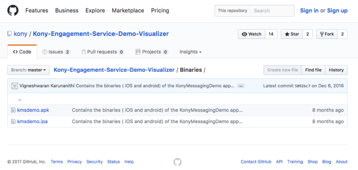
    
2.  After the binary has been downloaded on your machine, connect the device to the computer and run the `adb command` to install the binary.
3.  It is assumed that you already have Android SDK installed before running this command. This is just one method of installing the binary. You can use any other alternative option to install the binary on your device.
    
    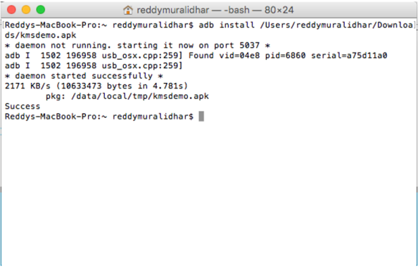
    
4.  Click the application icon on your device after the installation is complete. This will display the screen as displayed below and request your permission to send push notifications. Click **Ok** to accept push notifications.
    
    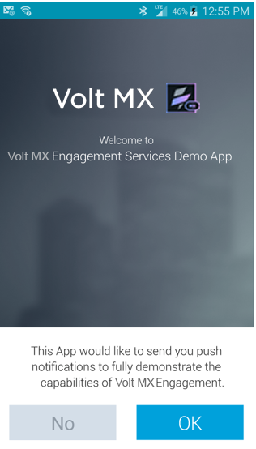
    
5.  The next screen will display a native notification that will also request you to accept push notifications. Click **Ok**.
    
    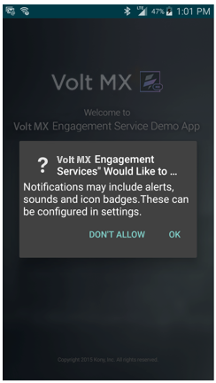

    
6.  The next screen will prompt you to enter your provisioned Volt MX Engagement Server URL, application id, and sender id. Additional details pertaining to each fields are as follows:
    *   **URL**: The URL of the Engagement Server provisioned for you when you signed up for Volt MX Foundry. For example: https://mobilefoundrydemo.messaging.voltmxcloud.com
        
    *   **Application Id**: An application id uniquely identifies an application in the Engagement Server. As you may recall, the ID was created when you created your application in lesson two of this track.
    *   **Sender Id**: This id is generated when you create the `FCM key` with Google so that you can core your application in the Engagement Server. As you recall, this was also discussed in the lesson two.
        
    It is important that the `sender id` used with the application is the same as the one associated with the FCM key. The sender id was used to configure the application in Engagement Server.

        
    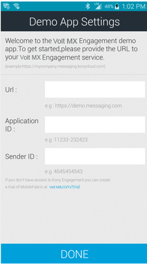 

  
7.  Click **Done** after all the details are successfully entered. This will navigate you to the **User** creation screen.
8.  You need to enter the first name, last name, phone number, email, country and state (if country is US only) information in the **User** creation screen.

    
    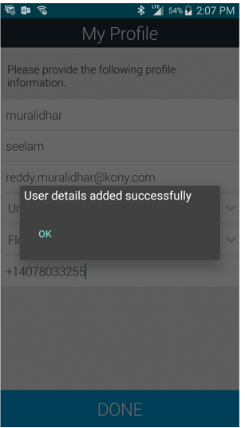    

    
9.  Click **Done** after all the information is entered. This will create the user in the Engagement Server.
10.  You will see the screen as below once the user has been created successfully. Click **Ok** and **Done** again to navigate to the next screen of the application.  

    
     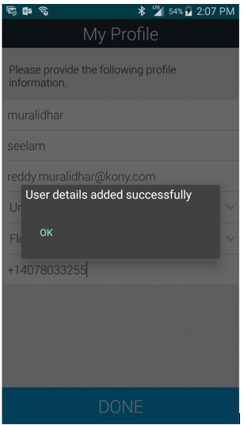
    
11.  In the next screen, you will see that you are already subscribed to receive push notifications. Select **SMS** and **E-Mail** options and click **Done**. This will update your preferences to receive all the notifications types and navigates you to the next screen.
    
      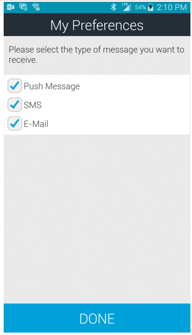 -->
    

Sending Push, Email, and SMS Notifications
------------------------------------------

This section walk you through the steps needed to submit the push, Email and SMS notifications to the application installed on your device in the previous section.

### Sending Push Notifications

We have installed the application, created a subscription, and updated the configuration to receive the push, SMS and email notifications. Now we are ready to trigger the first push notification to the device.

1.  Login to Volt MX Engagement Services console of the Volt MX Foundry. Once the log in is successful, you will see the screen as below. Click **Adhoc** under **Engagement** from the left pane.
    
    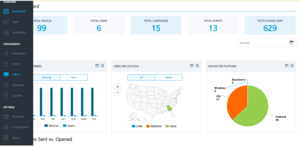
    
2.  In the **Adhoc** section, select the **Push Message** channel.
    
    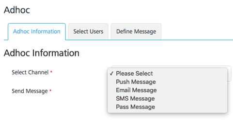
    
3.  This will cause another drop-down to be displayed, which will allow you to select the application you have created earlier in this track. Select the **EngagementTestApp** or any other application that you have created.
4.  Click **Next** > **Select Users** to navigate to the next screen and select the users.
    
    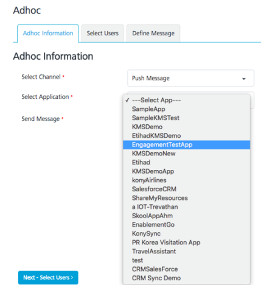
    
5.  In the **Select Users** section, choose the **Subscribers of EngagementTestApp** option and the user to send the message. Click **Next –Define Message** to navigate to the screen to enter the message to be sent.
    
    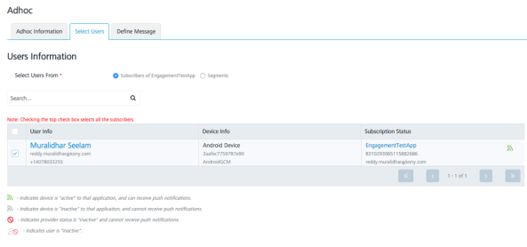
    
6.  In the Message screen, the **Standard Push** message type is chosen as default. Enter the message you would like to deliver as a push message to your device. Click **Send** to send the push message to the device.
    
    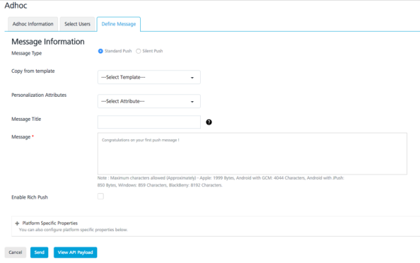
    
7.  Once the push message has been successfully submitted for delivery, you will see the notification message. Click **Ok** to continue.
    
    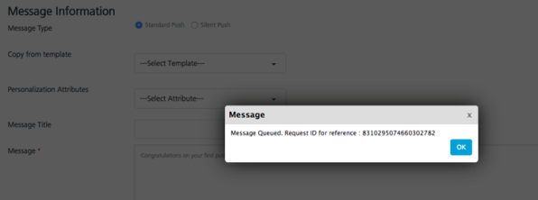
    
8.  You can also check the status of the message submitted in your Engagement Server by clicking **Status** under **Settings**.
    
    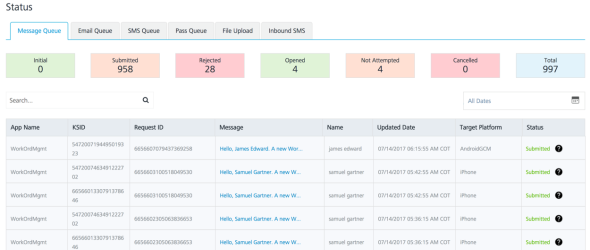
    
9.  Click the **Message Queue** tab to view the status of the push messages sent. As you can see from the screen below, the first message in the list is what was submitted earlier. The status of this message indicates that it was successfully submitted.
    
    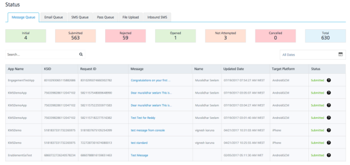
    
10.  Next, you will also see on your device screen that the message is successfully delivered.
    

        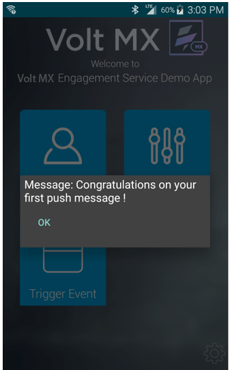
    

That’s it! Congratulations on your successful install of the Engagement application and receiving your first push message.

Sending SMS Notifications
-------------------------

Now you have successfully installed the application and received the first push message. Next, we will send our first SMS message from the Engagement Services console to the application.

As you may recall, from the earlier section of this track, you will need to sign up with a SMS aggregator and create a trail or a paid account to configure the SMS settings in your Engagement Server. It is assumed that the configuration of the SMS aggregator is completed before the next steps are executed.

1.  Login to Volt MX Engagement Services console of the Volt MX Foundry. Once the log in is successful, you will see the screen as below. Click **Adhoc** under the **Engagement** section from the left pane.
    
    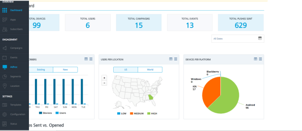

    
2.  In the **Adhoc** section, select the **SMS Message** channel. Click **Next –Select Users** to navigate to the next screen.
    
    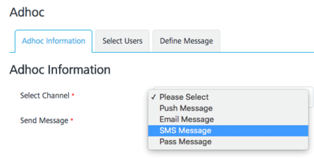 
    
3.  Select the user to whom the SMS message needs to be sent. Click **Next – Define Message** to navigate to the next screen.
    
    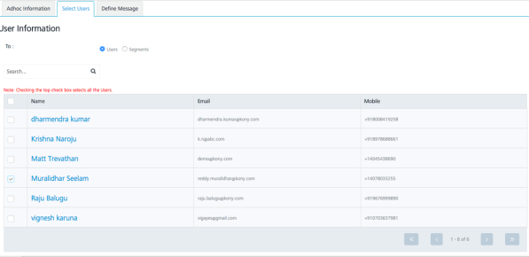
    
4.  Enter the SMS message in the **Message Box** and click **Send**. This will successfully send the SMS message to the user.
    
    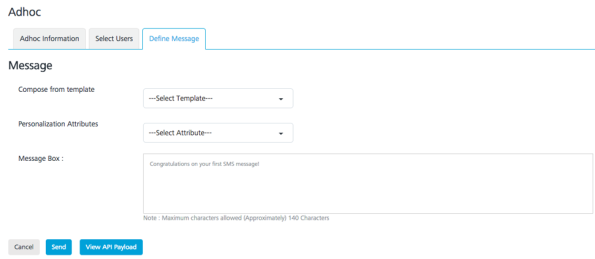
    
5.  As mentioned in the previous section, you can also check the status of the SMS message from the **Status** option under the **Settings** section of the Engagement Services console. Click the **SMS Queue** tab to view the first status of the first SMS message as successfully submitted.
    
    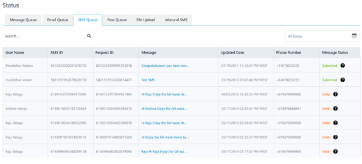
    

That’s it! Congratulations on your successful creation of the user and receiving your first SMS message from the Engagement Server.

Sending Email Notifications
---------------------------

Now that you have successfully installed the application and have received the first push message and first SMS message, we will review the steps needed to send email notifications from the Engagement Services console to the user.

As you may recall from the earlier section of this track, you need to configure the Email SMTP Server in your Engagement Server to send the email messages. It is assumed that the configuration of the Email Server is completed before the next steps are executed.

1.  Login to the Engagement Services console of Volt MX Foundry. Once the log in is successful, you see the screen as below. Click **Adhoc** under the **Engagement** section from the left pane.
    
    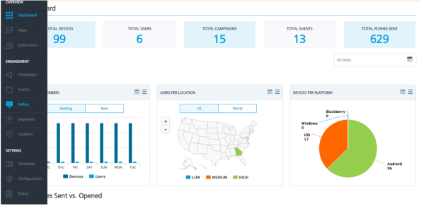
    
2.  In the **Adhoc** section, select the **Email Message** channel. Click **Next –Select Users** to navigate to the next screen.
    
    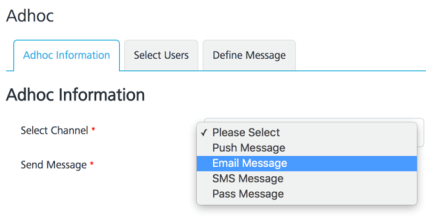
    
3.  Select the user to send the email message. Click **Next –Define Message**. The **CC** and the **BCC** options can be ignored for this tutorial.
    
    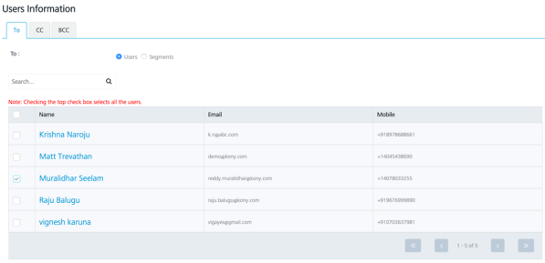
    
4.  In the **Define Message** section below, the **Sender Name**, **Sender Email**, **Send to Me**, and **Send Copy to others** options can be ignored.
    
    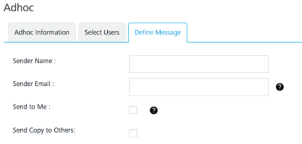
    
5.  Enter the email message and the subject in the section of the screen below. The other data fields can be ignored. Click **Send** to send the email to the user.
    
    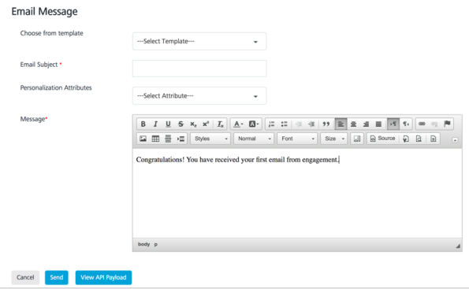
    
6.  As mentioned in the previous section, you can also check the status of the sent Email message from the **Status** option under the **Settings** section of the Engagement Server. Click the **Email Queue** tab to see the status of the first email message as successfully submitted.
    
    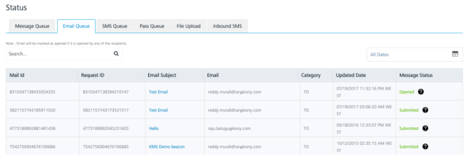
    
7.  The email will be successfully delivered to your email account as shown below.
    
    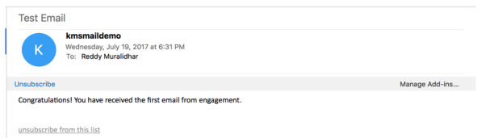
    

That’s it! Congratulations on your successful creation of the user and receiving your first email message from the Engagement Server.

> **_Important:_** For more information refer this video:
