                           

Navigating Volt MX Engagement Services Console
===========================================

Your first login to Engagement Services console will navigate you to the **Dashboard** home page, containing a snapshot of your deployment:

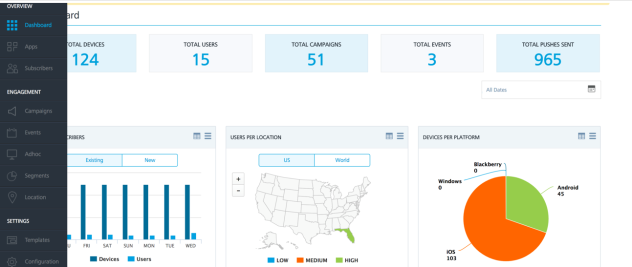

The Volt MX Foundry console comprises three major sections, accessible from the left pane of your console. They are :

Overview
--------

The overview is intended to provide a high level overview of all the details of your Engagement Server. It provides details of all applications, users, subscribers, and the associated details including reports.

Engagement
----------

The Engagement section provides all the details of the customer engagement. This includes details of campaigns, Events, Adhoc, segments, and the location based details.

Settings
--------

The settings section provides the details of the configuration that is needed for the Engagement to successfully send the notifications. It also provides the status of the various notifications that were sent to users and subscribers.

Next we will go into further details of the options that are found under the three high level categories.

### More about Overview Category

The overview section includes **Dashboard**, **Apps** and **Subscribers** options. Details of each of the options are provided below:

#### Dashboard

The dashboard provides an overall view of the applications and the associated data in your Engagement Server. Using this option, you can view various data, such as number of devices, number of users, total events and campaigns that are set up in your Engagement Server.

On the dashboard, you can also view information about various reports that are preconfigured in the Engagement Server. Some of these reports include the users that are existing vs new, users per location, number of devices per platform, number of pushes sent vs opened for campaigns and events, and total number of messages sent.

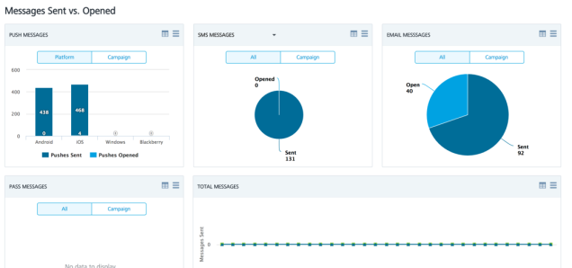

#### Apps

The apps option provides you the high level view of all the applications currently installed in your Engagement Server. You will also notice that many apps have the status as **Published**. You need to make sure that applications are published so that notifications can be sent to the devices that have installed the apps.

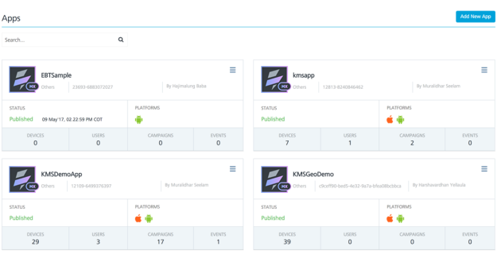

#### Subscribers

The **Subscribers** option has the details of users and devices that are associated with your Engagement Server. By default the **Devices** option is selected as shown below. The **Devices** option displays all subscriptions along with the subscription details, such as the application name, subscription token information, device name, and the device id. You can also see active and inactive subscriptions on the screen.

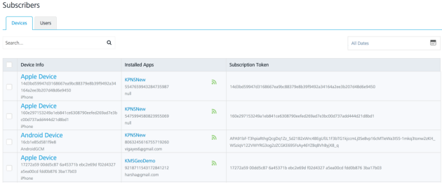

#### Users

The **Users** option displays the details of all the users that are added in the Engagement Server. You can see user information along with the devices that are associated with the user on the screen. This screen allows you to add a new user to the Engagement Server or import users from an external file.

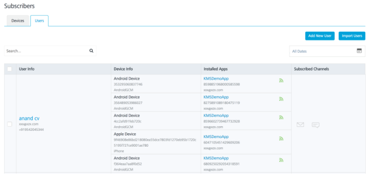

### More about Engagement Category

The Engagement section includes campaigns, events, adhoc, segments, and locations options. Details of each options are provided below:

#### Campaigns

Campaigns are preconfigured in the Engagement Server with a start date and end date. Using campaigns, you can select a segment of your users and send notifications using any of the notification channels, such as email, SMS, push and passes.

The **Campaigns** page displays the list of all campaigns along with the status of each campaign such as completed, running, and paused. Also new campaigns can be added from this screen if needed.

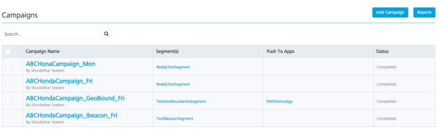

#### Events

Events are preconfigured in the Engagement Server to send notifications when invoked. You would use events when external systems need to send notifications like email, push, SMS and passes when certain events occur. These external system will invoke the events that are set up in your Engagement Server using a REST API.

The events screen as shown below contains the list of the events contained in your Engagement Server along with the event name, name of the user who created the event, name of the application that is associated with the event ( needed for push notifications) and the event id.

Note that the events have to be in active status for an external system to be able to invoke it.

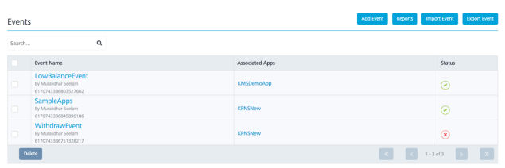

#### Adhoc

The Adhoc option of the Engagement Server allows you to send one time notifications to the users in your Engagement Server. This option allows you to choose the notification channel and the users to whom the notification will be delivered before composing the message to be sent. Once all of this information is provided, you can send the message immediately or schedule it for a later time if needed.

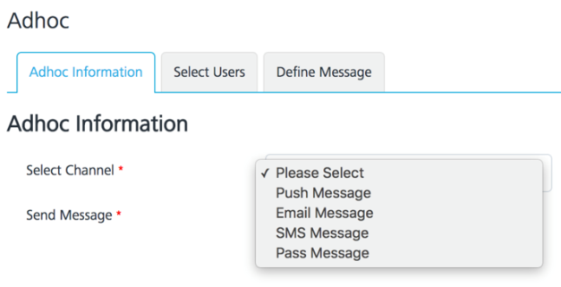

#### Segments

Segments are subset of users who match a certain criteria. You can create segments based on users that are added in your Engagement Server to run campaigns or send adhoc notifications. The segments screen lists all the segments that are contained in your Engagement Server along with the names, date created and any campaigns that are associated with the segment. You can also create a new segment, if needed from the **Segments** screen.

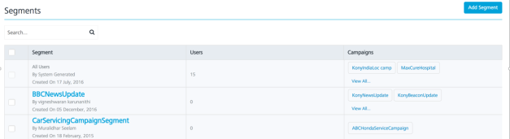

#### Locations

The **Locations** option enables you to use location information of the user to configure the geolocations or ibeacons. A geofence is a boundary that is defined by a latitude and longitude of a location. It can be better understood as a circle with a radius. The center of such circle being the latitude and longitude of the location.  
Beacons are pieces of hardware that emit signals and use the bluetooth technology. These geolocations or the ibeacons can be used to create segments based on the user’s location. Such segments can be used to run campaigns or send location based notifications.

By default the **Geofencing** tab is selected when **Locations** option is chosen. This option shows all the geofences that are present in your Engagement Server. This screen also provides the option of importing the geofences and exporting the geofences to another Engagement Server if needed.

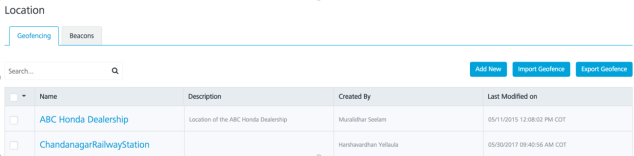

Click the **Beacons** tab to view the list of all the beacons that are contained in the Engagement Server. The screen also allows the user to add a new beacon or delete an existing beacon.

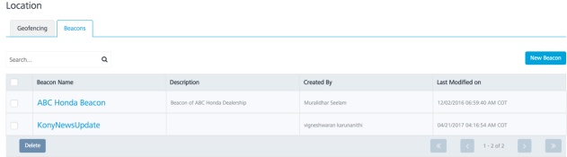

### More about Settings Category

The **Settings** from the left pane includes **Templates**, **Configuration**, **Status**, **API Help**, and **Admin Access** sections. Details of each section are provided below.

#### Templates

Templates in the Engagement Server are used for message standardization. You can use such templates that are predefined in any of the notification mechanisms to send messages to the user. The Templates screen provides an option to view all the templates that are contained in your Engagement Server along with the template names, author name and created date.

The **Message Template** option is chosen by default. However you can choose any other tab to view the corresponding templates. You can also add new template, import templates and export templates from the screen.

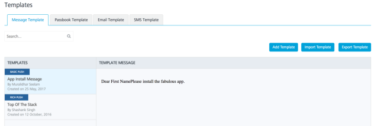

#### Configuration

The configuration section of the Engagement Server contains all the configuration details including the configuration of the notification providers. This section contains the **General**, **User Attributes**, **Audit Trial**, **Health Check**, **Job Monitor**, **Email Configuration**, **SMS Configuration**, and **Pass Configuration** tabs.

The **General** section contains configuration details such as number of retries for notifications, time zone, and reconciliation key. Also configuration that pertains to campaigns, events and security are contained in this section. The General section is selected by default when the **Configuration** option is chosen.

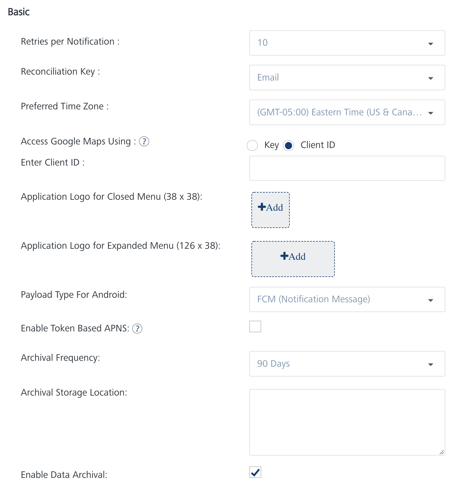

#### User Attributes

The **User Attributes** section allows the user to add any extra user attributes and also mark them as required if needed. Values for any such defined attributes will be provided in addition to the default user attributes when the user is created.

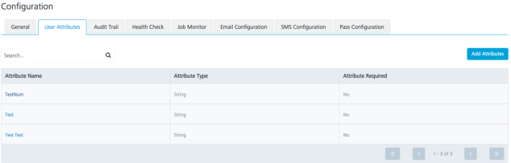

#### Audit Trial

The **Audit Trial** provides a trail of all the API invocations that have been performed in your Engagement Server. This includes the names of the actions that were performed along with the time of the invocation and the name of the user.

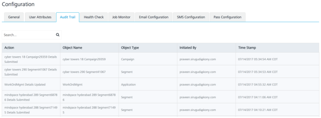

#### Health Check

The **Health Check** provides the status of the main tasks of the Engagement Server. It provides a check of database access, reporting Queue access, and indicates with the **Fail** status if any of these have failed. This data helps to identify the problem quickly if the Engagement Server does not function as expected.

#### Email Configuration

The **Email Configuration** section provides the details of the SMTP/SMTPS configuration that is needed to send the email notifications. This section also allows the user to run a quick test to check if the connection to the SMTP Server was successful.

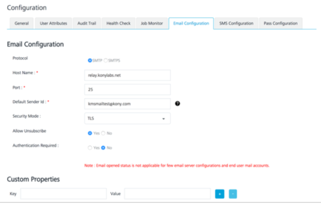

#### SMS Configuration

The **SMS Configuration** section provides the details of the SMS aggregator configuration that is needed to send the SMS notifications. An SMS aggregator is a company that has direct connections with all wireless carriers. Currently the Engagement Server support Nexmo, Twilio and Clickatell aggregators.

This section also allows the user to run a quick test to check if the connection to any of the SMS aggregators is successful.

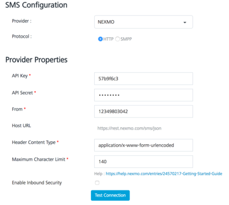

#### Pass Configuration

The **Pass Configuration** section provides the details of the configuration that is needed to send pass notifications. This page contains details of the existing pass certificates in the Engagement Server along with the option to upload new certificates.

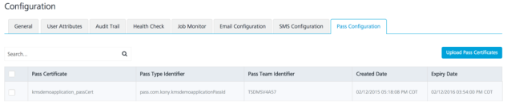

#### Status

This section displays the status details of the various notifications that were triggered from the Engagement Server. By clicking various tabs, such as **Message Queue**, **Email Queue**, **SMS Queue**, and **Pass Queue** the details and the status of the corresponding types of notifications can be seen. Each of the queues will display the message, the time it was submitted, the user name, and the status of the message. This section is used in trouble shooting for a message delivery.

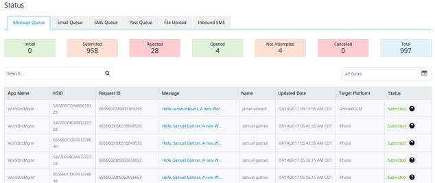

#### API Help

This section displays samples of payloads and other details like the URL and content type that will help in REST API invocation from a client application. All the functionality that is available in the console is also available as REST APIs and these sections allow the user to quickly understand the APIs.

This section is categorized based on specific functionality, such as Subscription, or Messages. Click any tab to view the APIs with respect to their functionality.

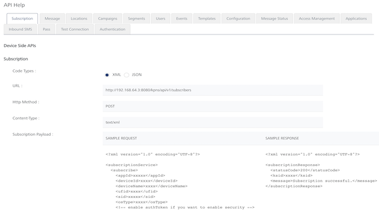

#### Admin Access

This section is usually accessed by the admin and allows the admin to add new users and groups. The admin can also inactive a user from this screen.

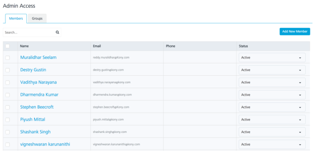
