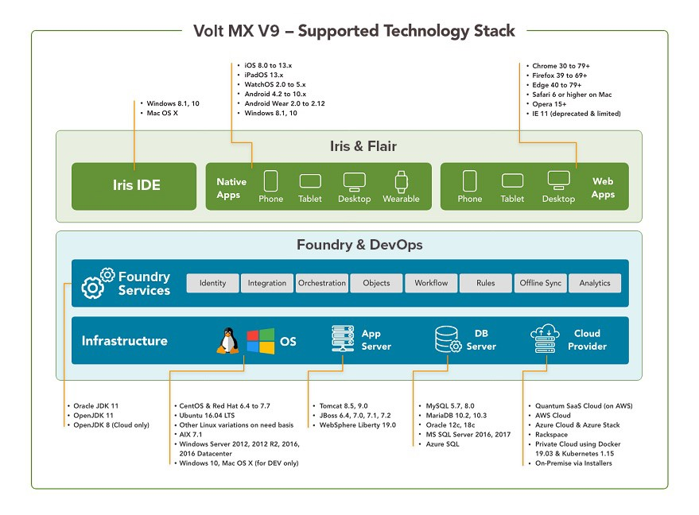

                          

You are here: Volt MX Foundry Topology and Components

Volt MX  Foundry Topology and Components
======================================

Volt MX  Foundry topology explains the logical arrangement of various components, such as, console, identity services, developer environment, and production environment.

In design time you configure apps with services, and publish them to a developer environment. After you confirm the changes in the apps, these apps will need to be published to a production environment. Authorized users can access apps on mobile devices from a production environment.

An overview of the Volt MX Foundry architecture and components follows:

The following table describes the components of Volt MX Foundry:

  
| Convention | Description |
| --- | --- |
| Identity | This component validates user accounts and applications for authentication and authorization. Authentication identifies log-on credentials of a user. Authorization allows or denies access to resources based on a user's role. Identity is used to authenticate and authorize runtime and design-time users. |
| Accounts | The accounts component contains information about what a user can do, such as create other users, delete users, create environments, delete environments, and publish apps to an environment.This component uses auth service for authorizing requests based on user roles. |
| Workspace (WaaS) | Workspace configures MBaaS services (applications, identity, integration, orchestration, and engagement services). After these services are configured, these services must be published to respective clouds/environments so that the services are available for run-time use. |
| Console/Portal | The console/portal is the user interface for configuring services for an application. |
| API Developer Portal | Volt MX Foundry Developer Portal feature lets you create a Portal for exposing APIs created using Volt MX Foundry. Developers from internal and external partner teams can access the portal created to explore and test the APIs You can directly access your [VoltMX Developer Portal](../../../Foundry/voltmx_foundry_user_guide/Content/VoltMXDevPortal.md) in Volt MX Foundry Console. |
| Environments (Engagement Services, Integration Services) | This component adds runtime capabilities to apps, such as engagement services, and integration services. |
| Middleware | This component exists between a mobile device and an endpoint server. It receives a request from a mobile device, sends it to an endpoint server, fetches the response from the backend and provides the required information to the device in the JSON format. |
| Admin | Admin provides the capability to list down the set of services published and test the services shown in Admin Console. Also you can view list of published apps and provides the delete apps functionality. In Volt MX Cloud, changing the log levels and checking the logs features are available as the cloud is managed by Volt MX. You can also view reports if you are using metrics module. This is an optional component. For more details, refer to [Admin Console User Guide](../../../Foundry/vmf_integrationservice_admin_console_userguide/Content/App_Services_User_Guide.md) |
| Services | Services component is used only when Volt MX Foundry is integrated. It has same runtime capabilities as the middleware. > **_Note:_**  To use Volt MX Server with Volt MX Foundry integrated, you can ignore the middleware.war. Similarly when you use only standalone Volt MX Server, you can ignore the services.war. |

> **_Note:_**

The Volt MX Foundry components can be configured on one node or separate nodes - for example, you can use one of the following choices:

*   Install All Components on one node.
*   Install Volt MX Foundry Console, Identity Services, Integration Services, and Engagement Services on separate nodes.

For frequently asked questions and troubleshooting, refer to [FAQs and Troubleshooting](Troubleshooting.md).

Developer Environment
---------------------

For development environment, a developer can preferably install Volt MX Foundry components in a standalone mode (single node) on a local environment. For more details, refer to [Single Node Installation](Installing_VoltMX_Foundry_on_Linux.md#Single-Node).

> **_Important:_**  VoltMX Foundry Installer supports Tomcat and JBoss.  
  
Tomcat on single-node only. For multi-node installation on Tomcat, refer to [VoltMX Foundry Manual Install Guide](../../../mf_manual_install.md).  
  
Volt MX  Foundry Consolidated installer supports JBoss on single node (**Standalone Mode**)and multi-node (**Domain Mode**).

> **_Important:_**  By default Volt MX Foundry Consolidated installer supports memcached server only in case of multinode installation.  
  
By default Volt MX Foundry Consolidated installer is not enabled with memcached server for single node installation (Tomcat and JBoss.) If you want use memcached server, follow manual steps provided at [How to Install Memcached Server](Pre-installation_Tasks.md#install-memcached-server).

Production Environment
----------------------

For production environment, domain mode (multinode) installation with HTTPs protocol is preferred. Multinode installation helps to enable better performance, high availability, and load balancing. For more details, refer to [Multinode Installation](Multi-Node_Installation.md).
