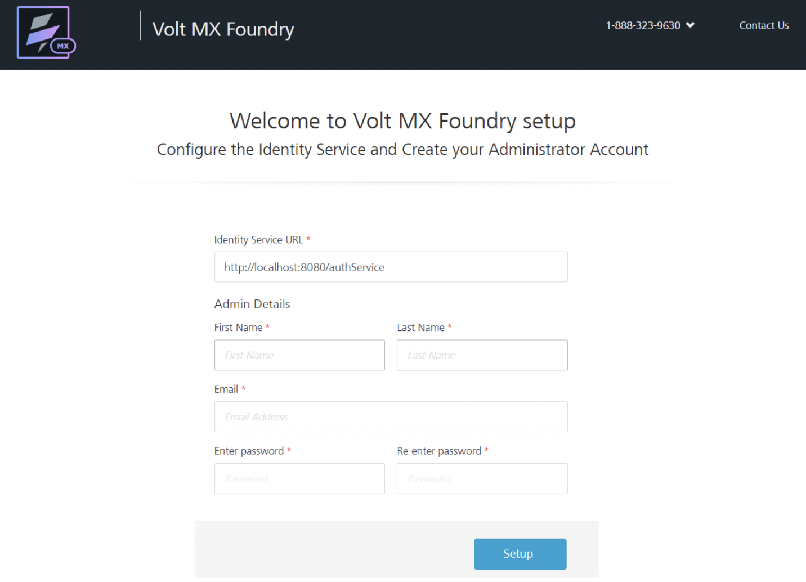

# Installing VoltMX Foundry on IBM AIX

VoltMX Foundry is supported for install on IBM AIX Operating System Version 7.2.0.0\. Currently, VoltMX Foundry support is available on IBM AIX with WebSphere.

This section of the document provides you with the instructions for installing and configuring VoltMX Foundry components.

The primary purpose of VoltMX Foundry installer user interface is to display information to a user, prompt the user for information needed to install, and configure VoltMX Foundry components on the system. VoltMX Foundry installer user interface also displays information about the progress of system changes as they are installed. This section explains new installation on the IBM AIX platform.

You need the required hardware and access to the supporting software as mentioned in the [Prerequisites](Prerequisites.md) section.

Make sure that you have proper administrative rights to install VoltMX Foundry on your computer with Server Administrator privileges required to run the VoltMX Foundry Installer.

## Prerequisites

Before you install VoltMX Foundry on AIX, ensure that you met the following:

*   Set AIX Locale to UTF8
*   Minimum space required at /root - 5GB
*   Minimum space required at /tmp - 5GB
*   IBM JAVA 1.7 required for installing MobileFoundry 7.3
*   IBM JAVA 1.8 required for installing VoltMX Foundry V8

## Download VoltMX Foundry installers for AIX platform

The following files are required to install VoltMX Foundry components on IBM AIX.

Please contact [support@voltmx.com](mailto:support@voltmx.com) for approval and to obtain access to download the VoltMX Foundry install artifacts for AIX platform.

*   ``VoltMXFoundryInstaller-Console_Identity_Engagement.zip``, to install Console, Identity Services, and Engagement Services (required to install VoltMX Foundry Console).
*   `VoltMXFoundryInstaller-Server.zip`, to install Integration Services.
<!-- *   `VoltMXFoundryInstaller-Sync.zip`, to install Sync Services. -->

## Installing VoltMX Foundry on IBM AIX

Before stating installer - run getServergroup utility and confirm server group showing as expected.

1.  Extract the installer from `VoltMXFoundryInstaller-Console_Identity_Engagement.zip` that you downloaded, and navigate to the folder.
2.  Grant execute rights to `VoltMXFoundryInstaller.bin` file.
4.  Run the LAX_VM command to run the Installer.
    For example, `VoltMXFoundryInstaller.bin LAX_VM <IBM JAVA LOCATION>`.

## Post Installation

After a successful installation, perform the following steps to work VoltMX Foundry Console properly on AIX.

1.  Go to your WebSphere WAR deployment location.
2.  Remove the `javassist-3.20.0-GA.jar` in the admin.war
3.  Remove the `javassist-3.20.0-GA.jar` in the kpns.war
4.  Restart WebSphere Server.
5.  Start VoltMX Foundry Console war from WebSphere admin console.

You can now access VoltMX Foundry Console by using the URLs. For more details, refer to [Accessing VoltMX Foundry Console - On-premises](./../../../Foundry/voltmx_foundry_user_guide/Content/Introduction.md)

## Upgrading VoltMX Foundry

Perform the following actions to upgrade your VoltMX Foundry instance:

1.  Take a backup of the existing Database.
2.  Download and Extract the VoltMX Foundry Installer.
3.  Grant execute rights to `VoltMXFoundryInstaller.bin` file.
4.  Run the LAX_VM command to run the Installer.

    For example, `VoltMXFoundryInstaller.bin LAX_VM <IBM JAVA LOCATION>`.

5.  Provide the same Database name prefix and suffix details as provided during the initial installation, when the installer prompts.
6.  Select **Yes** when the installer prompts to Use an existing Database.