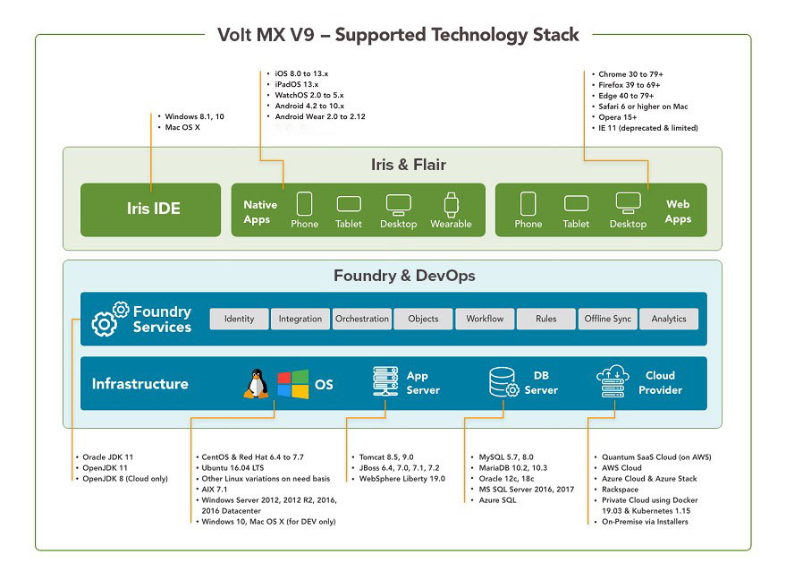

                             

Volt Foundry Topology and Components
======================================

Volt Foundry topology explains the logical arrangement of various components, such as, console, identity services, developer environment, and production environment.

In design time you configure apps with services, and publish them to a developer environment. After you confirm the changes in the apps, these apps will need to be published to a production environment. Authorized users can access apps on mobile devices from a production environment.

An overview of the Volt Foundry architecture and components follows:

The following table describes the components of Volt Foundry:
  
<table>
<tr>
<th>Convention</th>
<th>Description</th>
</tr>
<tr>
<td>Identity</td>
<td>

This component validates user accounts and applications for authentication and authorization.

<ul>
<li>Authentication identifies log-on credentials of a user.</li>
<li>Authorization allows or denies access to resources based on a user's role.</li>
</ul>

Identity is used to authenticate and authorize runtime and design-time users.

</td>
</tr>
<tr>
<td>Accounts</td>
<td>

	The accounts component contains information about what a user can do, such as create other users, delete users, create environments, delete environments, and publish apps to an environment.

This component uses auth service for authorizing requests based on user roles.

</td>
</tr>
<tr>
<td>Workspace (WaaS)</td>
<td>

	Workspace configures MBaaS services (applications, identity, integration, orchestration, and engagement services). After these services are configured, these services must be published to respective clouds/environments so that the services are available for run-time use.

</td>
</tr>
<tr>
<td>Console/Portal</td>
<td>

The console/portal is the user interface for configuring services for an application.

</td>
</tr>
<tr>
<td>Environments (Engagement Services, Integration Service)</td>
<td>

This component adds runtime capabilities to apps, such as engagement services and integration services.

</td>
</tr>
<tr>
<td>Admin</td>
<td>

	Admin provides the capability to list down the set of services published and test the services shown in Admin Console. Also, you can view list of published apps and provides the delete apps functionality. In Volt MX Cloud, changing the log levels and checking the logs features are available as the cloud is managed by Temenos. You can also view reports if you are using metrics module. This is an optional component.

For more details, refer to <a href="https://opensource.hcltechsw.com/volt-mx-docs/docs/documentation/Foundry/vmf_integrationservice_admin_console_userguide/Content/App_Services_User_Guide.html">Integration Service - App Services User Guide</a>

</td>
</tr>
<tr>
<td>Middleware</td>
<td>

This component exists between a mobile device and an endpoint server. It receives a request from a mobile device, sends it to an endpoint server, fetches the response from the backend and provides the required information to the device in the JSON format.

</td>
</tr>
<tr>
<td>Services</td>
<td>

Services component is used only when Volt Foundry is integrated. It has same runtime capabilities as the middleware.

<blockquote><em>Note:</em>  To use Volt MX Server with Volt Foundry integrated, you can ignore the middleware.war. Similarly when you use only standalone Volt MX Server, you can ignore the services.war.</blockquote>

</td>
</tr>
</table>

<blockquote>
<em>Note:</em> The Volt Foundry components can be configured on one node or separate nodes - for example, you can use one of the following choices:
<ul>
<li>Install All Components on one node.</li>
<li>Install Volt Foundry Console, Volt MX Identity Service, and  VoltMX Integration Service on separate nodes.</li>
</ul>
</blockquote>
