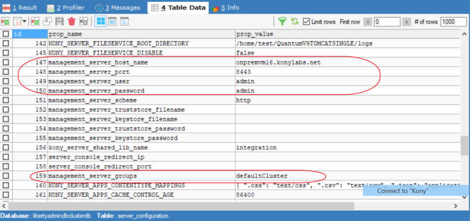

                            

Setting up Volt MX Foundry in WebSphere Liberty
==============================================

Installing Console Services on WebSphere Liberty Profile involves the following steps:

*   [WebSphere Liberty Profile Pre-installation tasks](Installing_Foundry_WebSphereLiberty.md#WebSphere)
*   [Installation of Foundry on WebSphere Liberty Profile](#installation-of-foundry-on-websphere-liberty-profile)
*   [WebSphere Clustered setup](#websphere-clustered-setup)

You can also migrate your existing WebSphere Basic Profile to WebSphere Liberty Profile by following the steps mentioned at [Migration from WebSphere Basic Profile to WebSphere Liberty Profile](#migration-from-websphere-basic-profile-to-websphere-liberty-profile).

Installation of Foundry on WebSphere Liberty Profile.
----------------------------------------------------

1.  Use the Command line Installer ([Download Link](https://community.hclvoltmx.com/downloads)) to generate the deployment artifacts for WebSphere Liberty Profile and to execute the database migration scripts.
2.  In the `server.xml` template file, update the following:
    1.  Provide the location of the Database connector driver jar. To do so, uncomment the appropriate file set present under the `<library id="DatabaseConnector">` tag, and then replace the `<CLI_INSTALL_LOCATION>` tag with the appropriate value.
    2.  Based on the selected Foundry components, uncomment the appropriate `<dataSource>` tags, and then substitute the `<DB_PREFIX>` and `<DB_SUFFIX>` tags with the corresponding prefix and suffix provided as an input while executing the database migration scripts.
3.  Copy the generated wars from the `<CLI_INSTALL_LOCATION>/deployments` folder to the apps folder of the server.
4.  Copy `<CLI_INSTALL_LOCATION>\jboss-logging-3.1.0.cr2` to `<LIBERTY_HOME>\servers\<serverName>\libs\identity`.
    
    > **_Note:_** This step is needed if Volt MX Foundry Identity is selected as one of the components to be installed.
    
5.  In case of a cluster deployment, copy the `com.ibm.websphere.collective_1.8.xx.jar` file from the `<LIBERTY_HOME>\lib` folder to `<LIBERTY_HOME>\servers\<serverName>\libs`.
6.  Start the server by executing the command `server run <serverName>` or `server start <serverName>` in the headless mode.

WebSphere Clustered setup
-------------------------

A **WebSphere Clustered Liberty setup** consists of a controller server and multiple servers that belong to a collective on which Volt MX Foundry is deployed. For information about setting up a Liberty cluster, refer to [Setting up the server-management environment for Liberty by using collectives](https://www.ibm.com/support/knowledgecenter/en/SSAW57_liberty/com.ibm.websphere.wlp.nd.multiplatform.doc/ae/tagt_wlp_server_management.md).

After successfully setting up a cluster, follow the same steps for the Liberty Standalone server. The steps need to be repeated on each of the cluster server members.

HCL recommends that you use IBM’s **IHS Load Balancer** with WebSphere. For information about setting up the IHS Load Balancer, refer to [Configuring IBM HTTP Server with WebSphere Application Server](https://www.ibm.com/support/knowledgecenter/en/SSEQTJ_9.0.5/com.ibm.websphere.ihs.doc/ihs/tihs_install_config_twas.md).

> **_Important:_** For the IHS load balancer, the value for `AcceptAllContent` in the `plugin-cfg.xml` file must be set as true.

Migration from WebSphere Basic Profile to WebSphere Liberty Profile
-------------------------------------------------------------------

1.  Take a backup of all the existing apps and the database schemas.
2.  Setup the WebSphere Liberty profile configuration by following the steps that are mentioned in [Setting up Volt MX Foundry in WebSphere Liberty](#setting-up-volt-mx-foundry-in-websphere-liberty).

> **_Important:_** Replace the `<DB_PREFIX>` and `<DB_SUFFIX>` tags that are present in the `server.xml` file with the prefix and the suffix of the existing schema.

4.  Deploy the existing WAR files by placing them in the apps folder. In case of a clustered setup, repeat this step for every server that is present in the cluster.
5.  In case, you have web applications published in the WebSphere basic profile and need to migrate them to the Liberty profile, follow this step:
    *   Update the Integration cluster name, Management server host name, user, and password in the `server_configuration` table of **adminDB** for the Liberty profile.  
        For more information, refer to the following screenshot.  
        
6.  Start the servers, and after a successful launch of the Volt MX Foundry Console, import all the existing apps and configurations.

Reference: Liberty server.xml template file
-------------------------------------------

```
<?xml version="1.0" encoding="UTF-8"?><server description="new server">

    <!-- Enable features -->
    <featureManager>
		<feature>servlet-3.1</feature>
		<feature>jsp-2.2</feature>
		<feature>adminCenter-1.0</feature>
		<!--Needed if admin Center is enabled-->
		<feature>websocket-1.1</feature>
		<feature>transportSecurity-1.0</feature>
		<feature>restConnector-2.0</feature>
		<feature>jndi-1.0</feature>
		<feature>appSecurity-2.0</feature>
		<feature>jdbc-4.2</feature>
	<!--<feature>clusterMember-1.0</feature> Enable for Cluster deployment--> 
    </featureManager>
	
    
    <!--For a user registry configuration, configure your user registry. For example, configure a basic user registry using the
        basicRegistry element. Specify your own user name below in the name attribute of the user element. For the password, 
        generate an encoded password using bin/securityUtility encode and add it in the password attribute of the user element. 
        Then uncomment the user element. -->
    <basicRegistry id="basic" realm="BasicRealm"> 
		<user name="admin" password="admin"/>
    </basicRegistry>
	
	<!-- Assign 'admin' to Administrator -->
   <administrator-role>
      <user>admin</user>
   </administrator-role>
   	
	<!-- SSL ENABLEMENT This template enables security. To get the full use of all the capabilities, a keystore and user registry are required. 
	For the keystore, default keys are generated and stored in a keystore. To provide the keystore password, generate an 
         encoded password using bin/securityUtility encode and add it below in the password attribute of the keyStore element. 
         Then uncomment the keyStore element. 
    <ssl id="defaultSSLSettings" sslProtocol="TLSv1.2" keyStoreRef="defaultKeyStore" />
	<keyStore id="defaultKeyStore" password="{xor}EzY9Oi0rJg=="/>
	
	<variable name="defaultHostName" value="<YOUR_SERVER_HOSTNAME>" />
    
    <!-- To access this server from a remote client add a host attribute to the following element, e.g. host="*" -->
	<!-- <httpEndpoint id="defaultHttpEndpoint" host="*" httpPort="9080" /> -->
    <!-- <httpEndpoint id="defaultHttpEndpoint" host="*" httpPort="9080" httpsPort="9443"/> -->
				  
                  
    <!-- Automatically expand WAR files and EAR files -->
    <applicationManager autoExpand="true"/>
    <applicationMonitor updateTrigger="mbean"/>
	
	<remoteFileAccess>
		<writeDir>${server.config.dir}</writeDir>
	</remoteFileAccess>
	
	<logging hideMessage="SRVE9967W"/>
	
	<library id="DatabaseConnector">
    <!-- Uncomment the below based on which database type(s) you would be using. 
	In case of a RDBMS application connecting to a database type different than the Foundry database, 
	additionally uncomment the appropriate database connector jar -->
		<!-- Oracle 
		<fileset dir="${server.config.dir}/libs" includes="ojdbc8.jar"/> -->
		<!-- MySQL 
		<fileset dir="${server.config.dir}/libs" includes="mysql-connector-x-8.x.x.jar"/> -->
		<!-- SQLServer 
		<fileset dir="${server.config.dir}/libs" includes="mssql-jdbc-7.2.2.jre11.jar"/> -->
		<!-- MariaDB 
		<fileset dir="${server.config.dir}/libs" includes="mariadb-java-client-2.3.0.jar"/> -->
	</library>
	
	
	
<!--Foundry Console Start -->
<dataSource id="WAASDB_JNDI" jndiName="jdbc/workspacesglobaldb">
    <jdbcDriver libraryRef="DatabaseConnector"/>
	<!-- Oracle properties
	<properties.oracle URL="jdbc:oracle:thin:@<db_host>:<db_port>/<db_service_id>" user="<prefix>MFCONSOLEDB<suffix>" password="<password>"/> -->
	
	<!-- MySQL/MariaDB properties
	<properties databaseName="<prefix>mfconsoledb<suffix>" serverName="<db_host>" portNumber="<db_port>" user="<user>" password="<password>"/> -->
	<!-- SQL Server properties
	<properties.microsoft.sqlserver databaseName="<prefix>mfconsoledb<suffix>" serverName="<db_host>" portNumber="<db_port>" user="<user>" password="<password>"/> -->
</dataSource>

<dataSource id="ACCOUNTSDB_JNDI" jndiName="jdbc/voltmxaccounts">
	<jdbcDriver libraryRef="DatabaseConnector"/>
	<!-- Oracle properties
	<properties.oracle URL="jdbc:oracle:thin:@<db_host>:<db_port>/<db_service_id>" user="<prefix>MFACCOUNTSDB<suffix>" password="<password>"/> -->
	
	<!-- MySQL/MariaDB properties
	<properties databaseName="<prefix>mfaccountsdb<suffix>" serverName="<db_host>" portNumber="<db_port>" user="<user>" password="<password>"/> -->
	<!-- SQL Server properties
	<properties.microsoft.sqlserver databaseName="<prefix>mfaccountsdb<suffix>" serverName="<db_host>" portNumber="<db_port>" user="<user>" password="<password>"/> -->
</dataSource>

<!-- Foundry Console END -->


<!-- Foundry Identity Start -->
<dataSource id="AUTHCONFIG_JNDI" jndiName="jdbc/authconfig">
	<jdbcDriver libraryRef="DatabaseConnector"/>
	<!-- Oracle properties
	<properties.oracle URL="jdbc:oracle:thin:@<db_host>:<db_port>/<db_service_id>" user="<prefix>IDCONFIGDB<suffix>" password="<password>"/> -->
	
	<!-- MySQL/MariaDB properties
	<properties databaseName="<prefix>idconfigdb<suffix>" serverName="<db_host>" portNumber="<db_port>" user="<user>" password="<password>"/> -->
	<!-- SQL Server properties
	<properties.microsoft.sqlserver databaseName="<prefix>idconfigdb<suffix>" serverName="<db_host>" portNumber="<db_port>" user="<user>" password="<password>"/> -->
</dataSource>

<dataSource id="AUTHGLOBAL_JNDI" jndiName="jdbc/authglobaldb">
	<jdbcDriver libraryRef="DatabaseConnector"/>
	<!-- Oracle properties
	<properties.oracle URL="jdbc:oracle:thin:@<db_host>:<db_port>/<db_service_id>" user="<prefix>IDCONFIGDB<suffix>" password="<password>"/>  -->
	
	<!-- MySQL/MariaDB properties
	<properties databaseName="<prefix>idconfigdb<suffix>" serverName="<db_host>" portNumber="<db_port>" user="<user>" password="<password>"/> -->
	<!-- SQL Server properties
	<properties.microsoft.sqlserver databaseName="<prefix>idconfigdb<suffix>" serverName="<db_host>" portNumber="<db_port>" user="<user>" password="<password>"/> -->
</dataSource>
<!-- Foundry Identity End -->

<!-- Foundry Integration Start -->

<dataSource id="ADMINDB_JNDI" jndiName="jdbc/voltmxadmindb">
	<jdbcDriver libraryRef="DatabaseConnector"/>
	<!-- Oracle properties
	<properties.oracle URL="jdbc:oracle:thin:@<db_host>:<db_port>/<db_service_id>" user="<prefix>ADMINDB<suffix>" password="<password>"/> -->
	
	<!-- MySQL/MariaDB properties
	<properties databaseName="<prefix>admindb<suffix>" serverName="<db_host>" portNumber="<db_port>" user="<user>" password="<password>"/> -->
	<!-- SQL Server properties
	<properties.microsoft.sqlserver databaseName="<prefix>admindb<suffix>" serverName="<db_host>" portNumber="<db_port>" user="<user>" password="<password>"/> -->
</dataSource>

<dataSource id="REPORTSDB_JNDI" jndiName="jdbc/voltmxreports">
	<jdbcDriver libraryRef="DatabaseConnector"/>
	<!-- Oracle properties
	<properties.oracle URL="jdbc:oracle:thin:@<db_host>:<db_port>/<db_service_id>" user="<prefix>MFREPORTSDB<suffix>" password="<password>"/> -->
	
	<!-- MySQL/MariaDB properties
	<properties databaseName="<prefix>mfreportsdb<suffix>" serverName="<db_host>" portNumber="<db_port>" user="<user>" password="<password>"/> -->
	<!-- SQL Server properties
	<properties.microsoft.sqlserver databaseName="<prefix>mfreportsdb<suffix>" serverName="<db_host>" portNumber="<db_port>" user="<user>" password="<password>"/> -->
</dataSource>

<!-- Foundry Integration End -->

<!-- Foundry Engagement Start -->
<dataSource id="VPNSDB_JNDI" jndiName="jdbc/vpnsdb">
	<jdbcDriver libraryRef="DatabaseConnector"/>
	<!--Oracle properties
	<properties.oracle URL="jdbc:oracle:thin:@<db_host>:<db_port>/<db_service_id>" user="<prefix>VPNSDB<suffix>" password="<password>"/> -->
	
	<!-- MySQL/MariaDB properties
	<properties databaseName="<prefix>vpnsdb<suffix>" serverName="<db_host>" portNumber="<db_port>" user="<user>" password="<password>"/> -->
	<!-- SQL Server properties
	<properties.microsoft.sqlserver databaseName="<prefix>vpnsdb<suffix>" serverName="<db_host>" portNumber="<db_port>" user="<user>" password="<password>"/> -->
</dataSource>
<!-- Foundry Engagement End -->

<library id="identityLibs">
  <file name="${server.config.dir}/libs/identity/jboss-logging-3.1.0.cr2.jar" />
</library>
<!--Enable for Cluster deployment. Navigate to <LIBERTY_HOME>/lib folder to find the appropriate jar version.--> 
<!--library id="ServerDeployer">
  <fileset dir="${server.config.dir}/libs" includes="com.ibm.websphere.collective_1.8.xx.jar" />
</library-->
<!-- In case of deploying ear files change the type to ear instead of war -->
<application id="authService" name="authService" location="authService.war" type="war">
  <classloader commonLibraryRef="identityLibs,DatabaseConnector"/>
</application>

<application id="services" name="services" location="services.war" type="war">
      <classloader commonLibraryRef="DatabaseConnector"/>
</application>

<application id="admin" name="admin" location="admin.war" type="war">
      <classloader commonLibraryRef="DatabaseConnector"/>
      <!--Enable for cluster deployment.-->
      <!--classloader commonLibraryRef="ServerDeployer"/-->
</application>

<application id="middleware" name="middleware" location="middleware.war" type="war">
      <classloader commonLibraryRef="DatabaseConnector"/>
</application>

<application id="apps" name="apps" location="apps.war" type="war">
      <classloader commonLibraryRef="DatabaseConnector"/>
</application>

<application id="accounts" name="accounts" location="accounts.war" type="war">
      <classloader commonLibraryRef="DatabaseConnector"/>
</application>

<application id="mfconsole" name="mfconsole" location="mfconsole.war" type="war">
        <classloader commonLibraryRef="DatabaseConnector"/>
</application>

<application id="workspace" name="workspace" location="workspace.war" type="war">
      <classloader commonLibraryRef="DatabaseConnector"/>
</application>

<application id="apiportal" name="apiportal" location="apiportal.war" type="war">
      <classloader commonLibraryRef="DatabaseConnector"/>
</application>

<application id="vpns" name="vpns" location="vpns.war" type="war">
      <classloader commonLibraryRef="DatabaseConnector"/>
</application>

</server>
```
