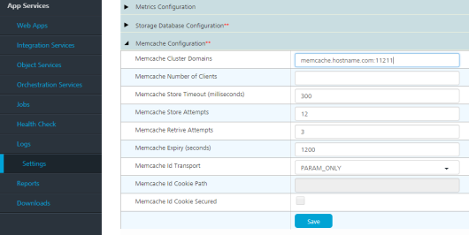
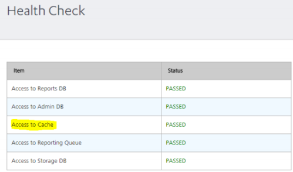

                             

Post-Installation Tasks
=======================

<h2 id="configuring-secure-sockets-layer-ssl-certificate">Configuring Secure Sockets Layer (SSL) Certificate</h2>

You can troubleshoot trusted certification issues.

> **_Important:_** Apple's App Transport Security (ATS) mandates HTTPS for all communication and requires the use of TLS v1.2 or higher for all SSL certificates and load balancers. <br/> <br/>
For Apple apps to work properly and adhere to App Store guidelines, you must enable your Volt Foundry on-premises instance with SSL and configure your network infrastructure to use TLS version 1.2 or higher. For more information, please refer to the following: [HCL Basecamp article on ATS Compliance](https://support.hcltechsw.com/csm?id=kb_article&sysparm_article=KB0083519).

After installing Volt Foundry on HTTPS, import your SSL certificate (for example, `domain.subdomain.crt`) into your Volt Foundry Installer's JRE trusted certificate authority (CA) certificates file - for example, `<INSTALL_DIR>/jre/lib/security/cacerts`  
  
If your SSL certificate is not configured, the system displays an error - "peer not authenticated."

**To enable communication between Volt Foundry Console and other products such as Volt Foundry Integration, and Volt Foundry Engagement Services, follow these steps:**

*   import each product's certificate (Volt Foundry Integration, and Volt Foundry Engagement Services) into the Volt Foundry console (for example, `<INSTALL_DIR>/jre/lib/security/cacerts`).
*   import console cert into the product boxes cacerts such as Volt Foundry Integration, Volt Foundry Engagement Services, and Volt Foundry Management.


<h3 id="how-to-add-an-installer-generated-self-signed-ssl-certificate-to-cacerts">How to Add an Installer Generated Self-Signed SSL Certificate to Cacerts</h3>
<p>To add an installer generated self-signed SSL certificate to cacerts, follow these steps:</p>
<ol>
  <li>From your Volt Foundry installed system, open the Linux terminal, and run the following command to generate an <code>intermediate.crt</code> file from the keystore:
    <pre><code style="display:block;background-color:#eee;">&lt;USERINSTALLDIR&gt;/jre/bin/keytool -export -alias "&lt;HOST_URL_SSL_CONF&gt;" -file &lt;USERINSTALLDIR&gt;/intermediate.crt -keystore &lt;USERINSTALLDIR&gt;/keystore.jks -storepass &lt;Passsword_of_keystore&gt;</code></pre>
    <p>Based on the hostname and keystore password provided at the <a href="Installing_VoltMX_Foundry_on_Linux.html#SSL_Hostname">SSL Certificate window</a>, the preceding command exports the required certificate from the source keystore with the given name - for example, <code>intermediate.crt</code>.</p>
  </li>
  <li>Run the following command to import the <code>intermediate.crt</code> certificate file into your Volt Foundry Installer’s JRE trusted certificate authority (CA) certificates file:
    <pre><code style="display:block;background-color:#eee;">&lt;USERINSTALLDIR&gt;/jre/bin/keytool -import -noprompt -trustcacerts -alias "&lt;HOST_URL_SSL_CONF&gt;" -file &lt;USERINSTALLDIR&gt;/intermediate.crt -keystore &lt;USERINSTALLDIR&gt;/jre/lib/security/cacerts -storepass changeit</code></pre>
  </li>
</ol>


### How to Add an Existing SSL Certificate to Cacerts

If Java does not identify a certificate issuer by default, you need to import an SSL into your cacerts.

To add an existing SSL certificate to cacerts, follow these steps:

Use the following steps to import your existing certificate to cacerts with the proper value of alias, keystore location and keystore password.

1.  From your Volt Foundry installed system, open the Linux terminal, and run the following command to add an `intermediate.crt` file from the keystore:
```
    <USERINSTALLDIR>/jre/bin/keytool -export -alias "<yourcertificate_domain>" -file <USERINSTALLDIR>/intermediate.crt -keystore <keystore_location>-storepass <Passsword_of_keystore>
```

2.  Run the below command to import the `intermediate.crt` certificate file into your Volt Foundry Installer's JRE trusted certificate authority (CA) certificates file:
```
    <USERINSTALLDIR>/jre/bin/keytool -import -noprompt -trustcacerts -alias "<yourcertificate_domain>" -file <USERINSTALLDIR>/intermediate.crt -keystore <USERINSTALLDIR>/jre/lib/security/cacerts -storepass changeit
```

JDK Version Compatibility
-------------------------

In case if you upgrade your JDK version in your middleware server, to enable JDK version compatibility, make the appropriate changes in an app server's  `middleware.properties` file located in your middleware server installation folder.

For example: When you upgrade JDK V 1.6 to JDK V 1.7 (vice-versa), you can still run your middleware server. Volt Foundry's run-time apps cannot be accessed. If you try to access any apps at runtime, the system throws an error message due to JDK version incompatibility.

1.  In your middleware server installation folder, open the  `middleware.properties` file located at the below path:
    *   for JBoss: `<installer folder>\middleware_home\middleware\middleware-bootconfig`
    *   for Tomcat: `<installer folder>\middleware_home\middleware\middleware-bootconfig`
2.  Make the following changes in the  `middleware.properties` file.
    
    *   `ssl.trustStore=/<java_home>/jre/lib/security/cacerts`
    *   `ssl.keyStore=/<java_home>/jre/lib/security/cacerts`

How to Switch between JDK Versions
----------------------------------

Ensure that you make necessary changes in the `middleware.properties` file before you switch between Java version such (for example, JDK V 1.6 to JDK V 1.7 or JDK V 1.7 to JDK V 1.6).

To configure JDK version in middleware, follow these steps:

1.  In your middleware server installation folder, open the  `middleware.properties` file located at the below path:
    *   for JBoss:<code>       
        &lt;installer folder&gt;\middleware_home\middleware\middleware-bootconfig  
        </code>
    *   for Tomcat: `<installer folder>\middleware_home\middleware\middleware-bootconfig`

2.  In the `middleware.properties` file, do the following changes:
    *   **Java 6**
```
        ssl.SocketFactory.provider=sun.security.ssl.SSLSocketFactoryImpl
        ssl.ServerSocketFactory.provider=sun.security.ssl.SSLServerSocketFactoryImpl
```
    *   **Java 7** 
```
    ssl.SocketFactory.provider=com.sun.net.ssl.internal.ssl.SSLSocketFactoryImplssl.ServerSocketFactory.provider=com.sun.net.ssl.internal.ssl.SSLServerSocketFactoryImpl
```

Configure Deployment of mbaasportal.war File for Multi-Node - JBoss
-------------------------------------------------------------------

Once Volt Foundry installation succeeds, the Volt Foundry Console will not be displayed as the **enable-welcome-root** value is set to **true** in the`domain.xml` file**.**

To configure mbaasportal.war, follow these steps:

1.  In the master node, open the `domain.xml` file from `JBOSSDIR\domain\configuration`, and search for enable-welcome-root="true."
2.  Replace enable-welcome-root="true" with enable-welcome-root="false."

Log Locations for Volt Foundry
--------------------------------

*   Log Locations for Single Node Installation: [Logs\_for\_Single Node\_Installation](../../../Foundry/voltmx_foundry_windows_install_guide/Content/Logs_for_SingleNode_Installation.md)

*   Log Locations for Multinode Installation: [Logs\_for\_Multi-Node\_Installation](../../../Foundry/voltmx_foundry_windows_install_guide/Content/Logs_for_Multi-Node_Installation.md)
*   **Logging Format**:
    
    To store more and more information in the logs, Volt Foundry uses custom logging format. The format is:  

    `[<service-name>][%5p][%d{dd MMM yyyy HH:mm:ss,SSS}]:%x:[%t]:[%c:%M:%L]:%m%n`
    
    Here is what each parameter in the above format means:  

    `<service-name>` - This parameter is the name of the service as mentioned below:  

    *   Accounts: `console.accounts`
    *   Console: `console.portal`
    *   Workspace: `console.workspace`
    *   Identity: `auth.service`
    *   Integration: `app.services`
    *   Engagement Service: `engagement.service`
    
    `%5p` - Priority/level of logging event justified to a length of five characters. The logging level is customizable for both on-premise and Cloud.
    <br>    
    `%d` - {dd MMM yyyy HH:mm:ss,SSS}- Date and time in the mentioned format.
    <br>
    `%x` - Thread context related information like X-VoltMX-RequestId (or id to correlate request across services).
    <br>
    `%t` - the name of the thread that generated the logging event.
    <br>
    `%c` - the category of logging event.
    <br>
    `%M` - the method name where the logging request was issued.
    <br>
    `%L` - the line number from where the logging request was issued.
    <br>
    `%m` - the application supplied message associated with the logging event.
    <br>
    `%n` - the platform dependent line separator character or characters.
    <br>
    For example, a typical logging request could look like this:  

    <pre><code style="display:block;background-color:#eee;">[app.services][ERROR][09 Feb 2016 18:48:55,863]:[ 016575f0-7342-4c32-9ceb-726569003277]:[http-bio-8080-exec-23]:[com.voltmx.console.service.testtool.ServiceTestController:executeTestService:143]:error occurred while testing service.
    
    java.lang.NullPointerException

    at com.hcl.middleware.connectors.dataadapter.DataAdapterConnector
    .prepareMapDataControllerRequest(DataAdapterConnector.java:259)

    at …</code></pre>


<h2 id="how-to-configure-memcache-for-integration-services">How to Configure Memcache for Integration Services</h2>

*   For Volt Foundry version 7.3 or above, you can configure the memcache from Admin console.
    
    To configure memcache in Foundry 7.3 or above versions, follow these steps:
    
    1.  Open Admin console (http/https://&lt;server-host&gt;:&lt;server-port&gt;/admin).
    2.  In the left pane, go to the **Settings** tab.
    <br/>
        
          
    <br/>
        
    3.  Under the **Runtime Configuration** tab, expand the **Memcache Configuration** key.
    4.  In the **Memcache Cluster** field, provide your memcache **hostname/IP** and **port** details separated with a colon. For example, <hostname/IP>:<Port>
    5.  Save the changes.

*   For below Foundry 7.3, you can configure the memcache using queries on **voltmxadmindb**.  

    
    To configure memcache in below Foundry 7.3, follow these steps:
    
    Since UI is not available in version below 7.3, you must update the property value in the **server\_configuration** table of VOLTMXADMINDB database.
    
    1.  Execute the following steps:
```
        UPDATE <VOLTMXADMINDB>.server_configuration set prop_value =
        '<memcache_hostname>’:’<memcache_port>’' , created_date = CURRENT_TIMESTAMP , updated_date
        = CURRENT_TIMESTAMP WHERE prop_name = 'memcache.cluster';
```     
        **Verification:** To verify whether the memcache configuration is successfully done, go to the **Health Check** page and look for **Access to Cache** entry.
        
        > **_Note:_** It may take up to 5 minutes for the healthcheck to reflect the cache status. If you are still unable to find the particular entry in the **Health Check** page, try clearing the healthcheck cache using the following URL:  
        https://&lt;server-host&gt;:&lt;server-port&gt;/admin/healthcheck?output=json
        
        
        

Configuring Datasource for performance improvements for JBoss pre-existing and Domain Mode
------------------------------------------------------------------------------------------

While using pre-configured JBoss or JBoss in Domain Mode, add the following snippet to the datasource to improve the performance.

```
<pool>  
<min-pool-size>10</min-pool-size>  
<max-pool-size>30</max-pool-size>  
<flush-strategy>IdleConnections</flush-strategy>  
</pool>
```

> **_Note:_** For the bundled version, the installer will add the default size to the datasources.

Steps to enable SAPJCo
----------------------

The installer provides the following artifacts:

1.  SapJCoDestinationProvider.jar
2.  Module.xml (for JBoss)

You can download the other artifacts **libsapjco3.so** (for Linux) or **sapjco3.dll** (for Windows), and **sapjco3.jar** from [https://websmp204.sap-ag.de/connectors](https://websmp204.sap-ag.de/connectors).

The SapJCoDestinationProvider.jar can be located at:

*   `<USER_INSTALL_DIR>/Integration/sapjco/main` - for JBoss

The Module.xml can be located at:

*   `<USER_INSTALL_DIR>/Integration/sapjco/main`

### Steps for Tomcat

1.  Navigate to `<USER_INSTALL_DIR>/tomcat/lib`, and add the following files:
    
    *   **sapjco3.jar**
    *   **libsapjco3.so/sapjco3.dll**
    
    > **_Note:_** The **SapJCoDestinationProvider.jar** is already placed in the `<USER_INSTALL_DIR>/tomcat/lib` by the installer.
    
2.  Restart the server

### Steps for JBoss

**For Windows**: Place the **sapjco3.dll** in the **jboss/bin** folder or **C:/Users/<USER\_NAME>/System32** folder.

**For** **Linux**: Place the **libsapjco3.so** in the **/usr/bin** folder or any location on the machine and append the path to the $LD\_LIBRARY\_PATH variable

#### JBoss - Standalone (Bundled)

1.  Navigate to `<USER_INSTALL_DIR>/jboss/modules/org/sapjco/main`, and add the following files:
    *   **sapjco3.jar**
    *   **SapJCoDestinationProvider.jar**
2.  Navigate to `<USER_INSTALL_DIR>/jboss/modules/org/sapjco/main/`
    *   In `module.xml`, under the **\<resources\>** tag add `<resource-root path="sapjco3.jar"/>`.
    *   In `standalone-full.xml`, under the **\<global-modules\>** tag add <code>&lt;module name="org.sapjco" slot="main"/&gt;</code>.

#### JBoss - Standalone(Pre-configured)/Domain mode

1.  Navigate to `<JBOSS_DIR>/modules/org/sapjco/main`, and add the following files:
    *   **sapjco3.jar**
    *   **SapJCoDestinationProvider.jar**
2.  Navigate to `<JBOSS_DIR>/modules/org/sapjco/main`.
    *   In `module.xml`, under the **\<resources\>** tag add <code>&lt;resource-root path="sapjco3.jar"/&gt;</code>.
    *   In `standalone.xml` or `domain.xml`, in the subsystem add `<subsystem xmlns="urn:jboss:domain:ee:4.0">`. Add the following tag:
```
<global-modules>  
<module name="org.sapjco" slot="main"/>  
</global-modules>
```

Setting Custom -D Parameters
----------------------------

*   **Tomcat**: Add custom parameters in `<TOMCAT_FOLDER>/bin/catalina(.sh/.bat) “JAVA_OPTS=$JAVA_OPTS <CUSTOM_PARAMETERS>`.
*   **JBoss**: Add custom parameters in `<JBOSS>/bin/standalone(.sh/.bat) “JAVA_OPTS=$JAVA_OPTS <CUSTOM_PARAMETERS>`.

How to change Hostname and Port
-------------------------------

In the `<USER_INSTALL_DIR>/scripts` a `<DB_TYPE>_changeHostDetails_script.sql` file is generated which consists of the SQL queries to be executed when the user wants to change the hostname and port on which Volt Foundry is running.

1.  Execute the query to create procedure.
2.  Call the procedure with the existing values, as follows:
```
call DYN_UPDATE3 ( AUTHCONFIGDB, ACCOUNTSDB, WORKSPACESGLOBALDB, ADMINDB, VMSDB, OLD_HOST, NEW_HOST, OLD_PORT, NEW_PORT );
```
