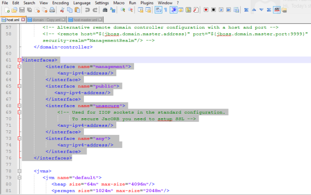

                            

Update Listen Interfaces in host.xml for JBoss Cluster
------------------------------------------------------

For JBoss domain mode installation, configure the following interface address.

1.  Go to `<JBOSS EAP dir>/domain/configuration/host.xml`
2.  In place of existing  `interfaces` xml tag, replace the default content with below details:

```
<interfaces>
        <interface name="management">
            <any-ipv4-address/>
        </interface>
        <interface name="public">
           <any-ipv4-address/\>
        </interface>
        <interface name="unsecure">
            <!-- Used for IIOP sockets in the standard configuration.
                 To secure JacORB, you need to set up SSL -->
            <any-ipv4-address/>
        </interface>
		<interface name="any">  
            <any-ipv4-address/>  
        </interface> 
    </interfaces>
```



Comment the javax-persistence-module for Volt MX Engagement Services on JBoss Cluster
-------------------------------------------------------------------------------------

If you are installing Volt MX Engagement Services on JBoss domain mode installation, comment the below persistence module in the `domain.xml` file.

1.  Go to `<JBOSS EAP dir>/domain/configuration/domain.xml`
2.  Comment the below `xml` tag. Comment the persistence module at four places in the `domain.xml` file.

```
<!-- <subsystem xmlns="urn:jboss:domain:jpa:1.1">
                <jpa default-datasource="" default-extended-persistence-inheritance="DEEP"/>
            </subsystem> \-->
```

Create Locator Component for Oracle Database
--------------------------------------------

By default when an Oracle database is created using DBCA or Oracle Installer Enterprise Edition with create database option, the SDO\_Geometry object type will be default created as part of locator component.

If the database is created using scripts by following the manual process, then the Locator component will not be created. You need to create the locator component for your Oracle database separately.

Verify if the locator component is already installed

Run the below queries in the Oracle database used for Installer:

```
Select comp_name, version, status from dba_registry where upper(comp_name) like '%MEDIA';

Select username from dba_users where username = 'MDSYS'
```

If the above statements return zero records and MDSYS schema is not created, then follow these steps to create the MDSYS schema and install the locator component manually.

The following steps need to be executed by a SYSDBA only.

To create Locator or MDSYS schema, follow these steps in option #1 or option #2:

*   **Option #1**. Follow DBCA or Oracle Installer enterprise edition with the create database option to create Oracle database. Use the same database during Volt MX Foundry Installation.
*   **Option #2**. Run the following scripts on the database to be used for Volt MX Foundry, where Oracle locator is not installed.
    
    1.  Connect as SYSDBA
        
```
sqlplus "/as sysdba"
```
    2.  Create MDSYS User if not exists:
        
```
Create user mdsys identified by secret default tablespace sysaux
```
        
        A secret is a dummy password. Provide the password that is used during MDSYS user creation.
        
    3.  Run the below SQL to grant the privileges:
```
SQL>@?/md/admin/mdprivs.sql
```
    4.  Connect to MDSYS user:
```
Conn mdsys/secret
```
        
        A secret is dummy password. Provide the password that is used during MDSYS user creation.
        
    5.  Run the below SQL to create the locator objects:
```
SQL>@?/md/admin/catmdloc.sql
```
    
    All the above `.sql` files executed will be available as part of database software `md` folder.
    
    After executing the above steps, execute the following query to check if everything is fine:
    
```
Select * from dba_objects where owner='MDSYS' and object_name like 'SDO%';
```
    
    Once the Oracle locator is installed, run the Installer to set up Volt MX Foundry. The system should not throw the error: `Invalid Data Type SDO_GEOMENTRY`
    
    > **_Note:_** As per Oracle 12c Release 1 (12.1) documentation, Oracle Locator is available with the following editions:
    
    *   Oracle Database Standard Edition One
    *   Oracle Database Standard Edition
    *   Oracle Database Enterprise Edition
    *   Oracle Database Express Edition (Oracle Database XE)
    
      For more information regarding Oracle licensing, refer to Oracle Database documentation.
    

Configure Load Balancer as Proxy in JBoss Multinode Setup (Optional if SSL Offloading at Load Balancer)
-------------------------------------------------------------------------------------------------------

1.  Go to your Volt MX Foundry install directory and open the `domain.xml` file.

1.  In the `domain.xml`, update all the `http connector tags` to include the scheme and proxy-port details.
    
    For example,`  
    <connector name="http" protocol="HTTP/1.1" scheme="https" socket-binding="http" proxy-port="443"/>`
    

Configure Load Balancers for Sending Host Information in Multi-node
-------------------------------------------------------------------

When the user is installing Volt MX Foundry on multinode environment, the user should check whether the parameter: `ProxyPreserveHost`  is set to  `On`  in the Load balancer configuration file to send host in the headers.

*   **For JBoss**, To deploy metrics in domain mode, follow these steps:
    
    If the `ProxyPreserveHost` is not configured, the load balancer will not send host in the headers. Users cannot launch Volt MX Foundry Console.
    
    The above configuration is based on the load balancer.
    
    For example:
    
    *   For **Apache**: `ProxyPreserveHost`  On
    *   For **HAProxy**: preserve host flag is not required.

How to Configure Heap and PermGen Size - JBoss
----------------------------------------------

For Oracle Java 7 and Java 8, configure the heap settings for your application servers. In the case of Oracle Java 7, you also need to configure PermGen settings.

> **_Note:_** From V8 SP4 FP1 HF1 onwards, Java 11 is supported for bundled Tomcat and JBoss servers.

### Configuring Heap and PermGen Size for JBoss

In case of multinode, do the following:

*   Configure the Min -`Xms2048m` / Max - `Xmx4096m` heap settings in the file: `{ Server directory }/domain/configuration/host.xml`
*   Configure the Min -`Xms2048m` / Max - `Xmx4096m` heap settings in the file: `{ Server directory }/domain/configuration/domain.xml`
*   permgen settings : -XX:PermSize=`1024m` -XX:MaxPermSize=`2048m`

In case of single node, configure the settings in `{ Install directory }/jboss/standalone/configuration/standalone.xml`

How to Disable Weak Ciphers in JBoss
------------------------------------

To disable weak ciphers, replace the `https-listener` under JBoss `subsystem/undertow`, for example, `<subsystem xmlns="urn:jboss:domain:undertow:3.1">`

For example, the following is a sample for https connector tag:

```
<https-listener name="https" socket-binding="connect" security-realm="ApplicationRealm" verify-client="REQUIRED"/>
```

For example, the following is a sample modified https connector tag:

```
<https-listener name="https" enabled-protocols="TLSv1,TLSv1.1,TLSv1.2" enabled-cipher-suites="SSL_RSA_WITH_3DES_EDE_CBC_SHA,SSL_DHE_RSA_WITH_3DES_EDE_CBC_SHA, TLS_RSA_WITH_AES_128_CBC_SHA,TLS_DHE_DSS_WITH_AES_128_CBC_SHA, TLS_DHE_RSA_WITH_AES_128_CBC_SHA,TLS_RSA_WITH_AES_256_CBC_SHA, TLS_DHE_DSS_WITH_AES_256_CBC_SHA,TLS_DHE_RSA_WITH_AES_256_CBC_SHA, TLS_ECDH_ECDSA_WITH_3DES_EDE_CBC_SHA,TLS_ECDH_ECDSA_WITH_AES_128_CBC_SHA, TLS_ECDH_ECDSA_WITH_AES_256_CBC_SHA,TLS_ECDHE_ECDSA_WITH_3DES_EDE_CBC_SHA, TLS_ECDHE_ECDSA_WITH_AES_128_CBC_SHA,TLS_ECDHE_ECDSA_WITH_AES_256_CBC_SHA, TLS_ECDH_RSA_WITH_3DES_EDE_CBC_SHA,TLS_ECDH_RSA_WITH_AES_128_CBC_SHA, TLS_ECDH_RSA_WITH_AES_256_CBC_SHA,TLS_ECDHE_RSA_WITH_3DES_EDE_CBC_SHA, TLS_ECDHE_RSA_WITH_AES_128_CBC_SHA,TLS_ECDHE_RSA_WITH_AES_256_CBC_SHA, TLS_ECDH_anon_WITH_3DES_EDE_CBC_SHA,TLS_ECDH_anon_WITH_AES_128_CBC_SHA, TLS_ECDH_anon_WITH_AES_256_CBC_SHA" verify-client="REQUIRED" security-realm="ApplicationRealm" socket-binding="connect"/>
```

How to Increase Timeout and Maximum Heap Size Settings - JBoss
--------------------------------------------------------------

Restarting JBoss can cause deployment failures. To avoid these failures, you must increase the JBoss timeout and maximum heap size settings for cluster.

To increase memory and timeout settings in JBoss (pre-configured JBoss), follow these steps:

1.  In the `standalone.bat` or `.sh` file, add the following properties to `Java_opts`:
```
\-Djboss.as.management.blocking.timeout=8400  
    \-Xms2048m  
    \-Xmx4096m
```
2.  In the `<JBoss_Home>/standalone/configuration/standalone.xml` file, add `config deployment-timeout=”8400”` in the `deployment-scanner subsystem`, shown below:
```
<subsystem xmlns="urn:jboss:domain:deployment-scanner:2.0">  
      
    <deployment-scanner path="deployments" relative-to="jboss.server.base.dir" scan-interval="5000" deployment-timeout=”8400” runtime-failure-causes-rollback="${jboss.deployment.scanner.rollback.on.failure:false}"/>  
      
    </subsystem>
```

To increase memory and timeout settings in JBoss Multinode, follow these steps:

1.  In the `domain.bat` or `.sh` file, add the following properties to `Java_opts`:
```
\-Djboss.as.management.blocking.timeout=8400
```
2.  Set the heap size for the selected server groups as below in the `<JBoss_Home>/domain/configuration/domain.xml`.
    *   Search for `<server-groups>` tag in the domain.xml and set the heap size in the JVM settings.
        
```
<heap size="2048m" max-size="4096m"/>
```

Configure the Standalone Existing JBoss
---------------------------------------

To install Volt MX Foundry on an existing standalone JBoss, follow the steps to configure the standalone JBoss:

1.  Open the `standalone.xml` from the `<JBoss_Home>/standalone/configuration`.
2.  Configure Hostname/IP in the `standalone.xml` file for JBoss, as below:
```
	<interfaces>
    		<interface name="management">
    			<inet-address value="127.0.0.1"/>
    		</interface>
    		<interface name="public">
    			<inet-address value="<myHostName>"/>
    		</interface>
    	</interfaces>
```
3.  Configure JBoss to listen for remote management requests as below:
    *   Add `<socket-binding name="management-native" interface="management" port="${jboss.management.native.port:9999}"/>` under the `<socket-binding-group>`
    *   Add following section under the `<management-interfaces>
`
```
<native-interface security-realm="ManagementRealm">  
        <socket-binding native="management-native"/>  
        </native-interface>
```
4.  For Engagement Services to work, remove the following subsystem:
```
<subsystem xmlns="urn:jboss:domain:jpa:1.1">
    <jpa default-datasource="" default-extended-persistence-inheritance="DEEP"/>|
    </subsystem>
```

### Configure the Standalone Existing JBoss with Self-Signed Certificate (JBoss 7)

If you need to use existing JBoss with self-signed certificate, follow these steps:

1.  Add an Existing SSL Certificate to Cacerts. For more details, click [How to Add an Existing Secure Sockets Layer (SSL) Certificate](../../../Foundry/voltmx_foundry_windows_install_guide/Content/Post-Installation_Tasks.md#how-to-add-an-existing-ssl-certificate-to-cacerts).
2.  Copy the keystore file to `<JBoss_Home>/standalone/configuration` folder.
    
3.  Modify the `standalone.xml` by adding the following `security-realm` in the `security-realms` section.
```
   <security-realm name="WebSocketRealm">
                     <server-identities>
                            <ssl>
                                 <keystore path="<Keystore_file_name>" relative-to="jboss.server.config.dir" keystore password="<Keystore_password>"/>
                         </ssl>
                     </server-identities>
                </security-realm>                            
    
```
    
    Here `<Keystore_file_name>` = Name of the keystore file. (for example, `keystore.jks`)`  
    <Keystore_password>` = Password of keystore file.
    

1.  In the standalone.xml, add the following `https-listener` tag for `default-server` in the Subsystem `urn:jboss:domain:undertow:3.1` .
    
```
<https-listener name="https" max-post-size="262144000" security-realm="WebSocketRealm" socket-binding="https"/>
```
