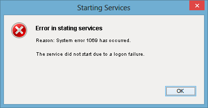

                              

Preinstallation Tasks - App Servers
===================================

The following section explains preinstallation steps required before installing your application server:

Add a User in Local Group Policy (Log on as a Service)
------------------------------------------------------

Before installing Volt MX Foundry in a new Windows node, ensure that you have privileges to **log on as a service.** The log on as a service privileges is required to start a service by a user.

When a user name does not have privileges to **log on as a service** and is tries to install Volt MX Foundry in a new Windows box, the system gives the following error:

To grant log on as service to a user, follow these steps:

1.  Click **Start**, and then click **Run** (Win+R).
2.  In the **Run** box, type **gpedit.msc**, and then click **OK**. The **Local Group Policy Editor** window appears.
3.  In the left pane, under **Local Computer Policy**, expand **Computer Configuration** > **Windows Settings** > **Security Settings** > **Local Policies** > **User Rights Assignment.**
    
    
    
4.  In the right pane, double-click **Log on as service**. The **Log on as a service Properties** window appears.
    
    
    
5.  In the **Local security setting** tab, double-click **Add User or Group** to display the **Select Users, Computers, Service Accounts, or Groups** window.
    
    
    
6.  In the **Enter the object names to select** text box, enter the user name, click **OK**. The system adds the user name in the **Local security setting** tab.

Download and Install the Unrestricted JCE Policy Files
------------------------------------------------------

In accordance with the United States of America export restrictions, Java that is bundled with the server has limited encryption key sizes that can be used in the server operation. In order to successfully convert signed client certificates or sign server Certificate Signing Request for use in the server, you must download the following bundled encryption policy .jar files and replace them with the unrestricted files published by the Java vendor.

*   `local_policy.jar`
*   `US_export_policy.jar`

  
To Configure Unrestricted JCE Policy Files for Tomcat or JBoss, follow these steps:

1.  Go to the Oracle Java SE download page [http://www.oracle.com/](http://www.oracle.com/technetwork/java/javase/downloads/index.html)
2.  Scroll down to the **Additional Resources** section. You will find **Java Cryptography Extension (JCE) Unlimited Strength Jurisdiction Policy File**.
    
3.  Download the JCE version that matches your installed JVM, for example, `UnlimitedJCEPolicyJDK<Version>.zip`
4.  Extract the downloaded zip file. The `UnlimitedJCEPolicyJDK<Version>.zip` file contains the following files:
    *   `local_policy.jar`
    *   `US_export_policy.jar`
    *   `README.txt`
5.  Copy the .jar files (`local_policy.jar` and `US_export_policy.jar`) to  `<JAVA_HOME>\jre\lib\security`  
    
    > **_Note:_** These jars will be already there so you have to overwrite them. Back up the existing jars before you overwrite them with new jars.
    
6.  Restart your application server.
    
    After the encryption policy files are installed, you should be able to successfully convert signed client certificates for use in the server.
    

Setting JVM arguments for Salesforce Services
---------------------------------------------

Configure TLSV1.2 protocol as JVM parameter because Salesforce disabled TLS 1.0 protocol. Configuring TLS protocol that enables Volt MX Foundry to work with Salesforce services.

*   **For Tomcat:**
    
    1.  Go to your Tomcat install location and open the `<Tomcat>\bin` folder.
        
        Location for bin folder: `<User_Install_Directory>\apache-tomcat-8.5.32\bin`
        
    2.  Open the `catalina.bat` file from the **bin** folder.
        
        > **_Note:_** For Windows, open the catalina.bat file.  
        For Linux, open the catalina.sh file.
        
    3.  Add the value `-Dhttps.protocols=TLSv1.2`  to  **JAVA\_OPTS**.
    4.  Save the `catalina` file. Once changes are made and saved to the master configuration, the JVM requires a restart for the arguments to take effect.
*   **For JBoss:**
    1.  Go to your JBoss install location and open the `<JBossInstallDir>\bin` folder.
    2.  Location for bin folder: `\JBossInstallDir>\bin`
    3.  Open the `standalone.bat` file from the  `bin` folder.
        
        > **_Note:_** For Windows, open the standalone.bat file.  
        For Linux, open the standalone.sh file.
        
    4.  Add the value `-Dhttps.protocols=TLSv1.2`  to  **JAVA\_OPTS**.
    5.  Save the `standalone` file. Once changes are made and saved to the master configuration, the JVM requires a restart for the arguments to take effect.
