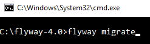
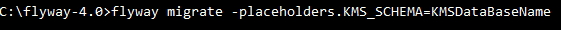
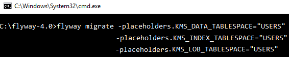
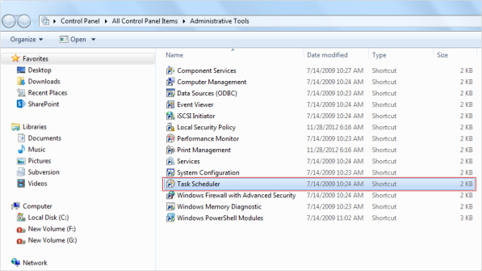
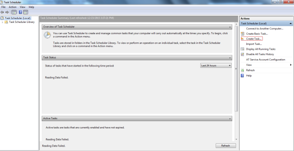
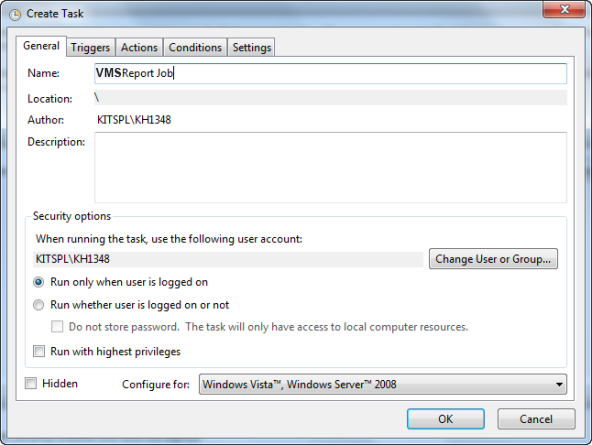
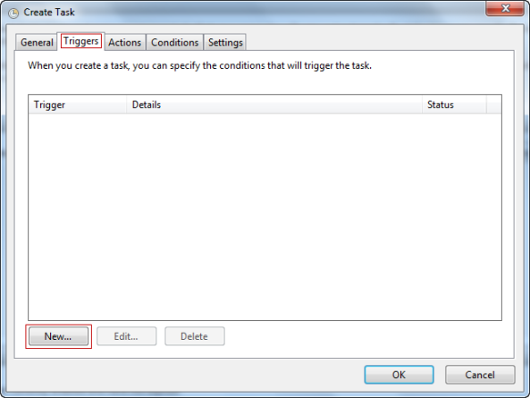
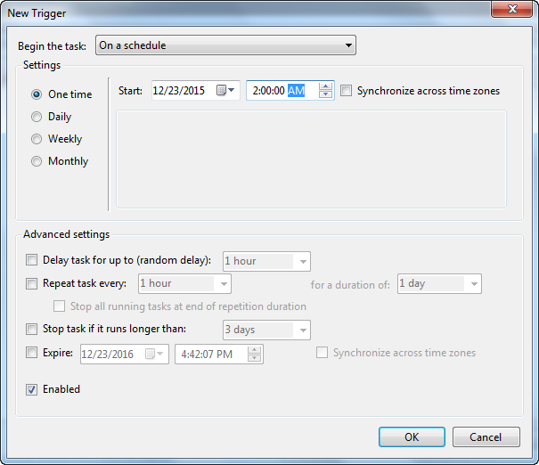
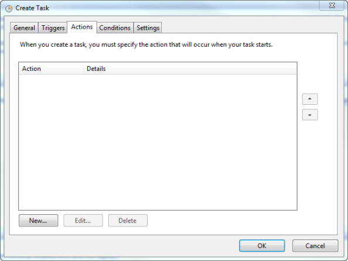
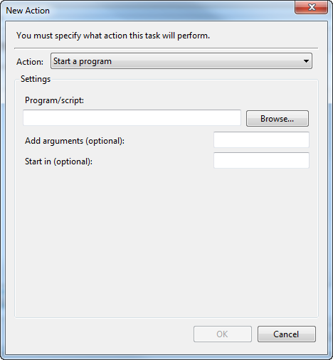

                            

Database Setup for Engagement through Flyway
============================================

For setting up database through flyway ensure you have installed the Flyway command line tool . To download the Flyway command line tool , visit the URL: [https://flywaydb.org/getstarted/download](https://flywaydb.org/getstarted/download)

### MySQL

#### Setup

Copy Mysql jdbc driver `(mysql-connector-java-8.x.x)` to Drivers folder under Flyway installation directory.

#### Configuration

Uncomment and modify following parameters in `conf/flyway.conf` file under Flyway installation directory :

*   `flyway.url = jdbc:mysql://<host>:<port>/<database>`
*   `flyway.driver = com.mysql.jdbc.Driver`
*   `flyway.user = <user name>`
*   `flyway.password = <password>`
*   `flyway.locations=filesystem:D:= <location path>`

#### Setup Process

1.  Extarct all the sql files from mysql.tar
2.  Copy all the SQL files to be executed to sql folder under flyway installation directory.
    
    OR
    
    Uncomment and set flyway.locations=<sql script folder> in `conf/flyway.conf` file.
    
3.  From the command line, use the following command:
    
    1.  `flyway migrate`
    
    
    

### Microsoft SQL

#### Setup

Copy Microsoft SQL jdbc driver( `mssql-jdbc-x.x.x.jreX`) to drivers folder under flyway installation directory.

#### Configuration

Uncomment and modify following parameters in `conf/flyway.conf` file under flyway installation directory :

*   `flyway.url=jdbc:sqlserver://<IP>:<PORT>/<database_name>:currentSchema=<schema_name>;`
*   `flyway.driver = com.microsoft.sqlserver.jdbc.SQLServerDriver`
*   `flyway.user = <user name>`
*   `flyway.password = <password>`

*   `flyway.locations=filesystem:D:= <location path>`

#### Setup Process

1.  Extarct all the sql files from sqlserver.tar
2.  Copy all the SQL files to be executed in to sql folder under flyway installation directory.
    
    OR
    
    Uncomment and set flyway.locations=<sql script folder> in `conf/flyway.conf` file.
    
3.  Before executing the third step, run the following command to create a database.
    1.  `CREATE DATABASE [DATABASE_NAME] go`
4.  From the command line, run the following command:
    
    1.  `flyway migrate -placeholders.VMS_SCHEMA=VMSDataBaseName`
    
    
    

### Oracle

#### Setup

Copy Oracle jdbc driver(`ojdbc11.jar`) to drivers folder under flyway installation directory.

#### Configuration

Uncomment and modify following parameters in `conf/flyway.conf` file under flyway installation directory :

*   `flyway.url = jdbc:oracle:thin:@//<host>:<port>:<sid>`
*   `flyway.driver = oracle.jdbc.driver.OracleDriver`
*   `flyway.user = <user name>`
*   `flyway.password = <password>`
*   `flyway.schemas=<schema>`
*   `flyway.locations=filesystem:D:= <location path>`

#### Setup Process

1.  Extarct all the sql files from oracle.tar
2.  Copy all the SQL files to be executed to sql folder under flyway installation directory.
    
    OR
    
    Uncomment and set flyway.locations=<sql script folder> in `conf/flyway.conf` file.
    
3.  From the command line, use the following command:
```
C:\>flyway migrate -placeholders.VMS_DATA_TABLESPACE="USERS" -placeholders.VMS_INDEX_TABLESPACE="USERS" -placeholders.VMS_LOB_TABLESPACE="USERS"
```

    

    

### Manual Process to configure the VMS Reports Job

You can also configure the VMS reports job as a windows scheduler task (If MS SQL Server or DB2 is running on a Windows operating system).

To setup the Windows scheduler task, follow these steps:

1.  Copy job file `${installationdir}/job/vpns_job.bat` to your Windows desktop.
2.  Copy job file `${installationdir}/job/ SQL_VPNSDB_JOB_SCHEDULE.sql` to your windows desktop.
3.  Open Task Scheduler from **Start > Control Panel > Administrative Tools > Task Scheduler**.
    
    
    
4.  Click the **Create Task** option under the **Actions** column to create a new task.
    
    
    
    The **Create Task** window appears. The **Create Task** window includes five tabs: **General**, **Triggers**, **Actions**, **Conditions** and **Settings**. By default, the **General** tab is set to active.
    
5.  **General:** Under the General tab, enter the task name as **VMS Report Job.**
    
    
    
6.  **Triggers**: Under the **Triggers** tab, click **New**.
    
    
    
    1.  Create a schedule that runs at 02:00 a.m. on daily basis.
    2.  Click **Ok** to continue.
    
    
    
7.  **Actions**: Under the **Actions** tab, click **New**.
    
    
    
    The **New Action** window appears.
    
    
    
8.  **Program/Script**: Click **Browse** to select `vpns_job.bat`. file from your system.
9.  Click **Ok** to create a new task.
