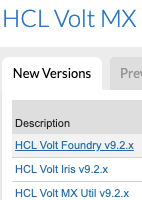

                          

Download Links
==============

Volt Foundry can be downloaded for Linux or Windows from

<ul>
<li>On-prem customers can download Volt Foundry from the <a href="https://hclsoftware.flexnetoperations.com/flexnet/operationsportal/startPage.do">HCL License and Download Portal</a>.</li>
<ul>
    <li>Select <b>Downloads</b> in the top navigation bar after login, select <b>List Downloads</b> and choose <b>HCL Volt MX.</b></li>
    <li>Select <b>HCL Volt Foundry v9.2.x</b> and choose appropriate installer</li>
    
</ul>
</ul>
<ul>
<li>There is no installation required for cloud and trial users. Volt Foundry can be accessed through the Cloud environment that you have been given access to. Links to Volt Foundry can be found in your registration emails.</li>
</ul>