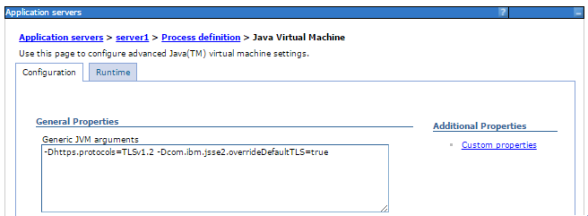
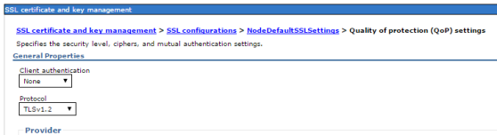

                          

Known Issues in V8 SP1
======================

Integration
-----------

*   Trace Logs:
    *   Body payload is not logged in case of JSON body, for Logging Service.
    *   On and Off functionality is not working in Trace logs.
*   Metrics Issues:
    
    *   Durations for the execution of SKY data adapter backend service and processing of internal services are not correct.
        
*   Set-param mapper fails to map ‘`SDO with collection type`’ and a ‘`property of non-collection type`’
    
*   Direction from middleware to services is not working for legacy services.
    

Offline Objects
---------------

*   Upload batching support is not available for object services with relationships (hierarchical payloads).
*   Android and iOS native apps built without using Volt MX Iris cannot be upgraded from 8.0 GA to V8 SP1. This is due to the breaking changes in the APIs.
    
    For addressing upgrade issues in native apps from 8.0 GA, refer [Offline Objects Getting Started Guide](../../../../Foundry/offline_objects_gettingstarted/Content/Offline_Objects_Getting_Started.md).  
      
    

Installer
---------

*   **Issue**
    
    While upgrading identity from Foundry 7.0/7.1 to Volt MX Foundry V8, the upgrade fails due to the following errors:
    
    *   **Error 1**:
        
        The following errors occur due to the Flyway tool version is upgraded from 3.x to 4.x.
        
        *   Failed to DROP INDEX "<auth\_schema>"."schema\_version\_vr\_idx"
        *   Failed to DROP INDEX "<auth\_schema>"."schema\_version\_ir\_idx"
            
        
        **Workaround**
        
        To avoid the issue, follow these steps respective to your database:
        
        Remove the `version_rank` column from the `schema_version` table in the `authglobaldb` by following queries before the upgrade.
        
```
DROP INDEX schema_version_ir_idx ON dbo.schema_version
        GO
        DROP INDEX schema_version_vr_idx ON dbo.schema_version
        GO
        ALTER TABLE dbo.schema_version DROP CONSTRAINT schema_version_pk
        GO
        ALTER TABLE dbo.schema_version DROP COLUMN version_rank
        GO
        ALTER TABLE dbo.schema_version ADD CONSTRAINT schema_version_pk PRIMARY KEY CLUSTERED (installed_rank)
        GO
        ALTER TABLE dbo.schema_version ALTER COLUMN version nvarchar(50) NULL
        GO
```

*   **Issue**
    
    You have published an SPA app to Foundry 7.3 Console. And you have installed Volt MX Foundry V8 connecting the existing database of the Foundry 7.3. After you upgrade the database and try to unpublish/re-publish the SPA app, the app unpublish/re-publish fails.
    
    **Workaround**
    
    When you install Volt MX Foundry running on an existing database that is created for Foundry V7.3 or older, you need to delete all existing SPA applications and re-publish the apps.
    

*   **Issue**
    
    If you have installed Foundry 7.3 or older, and when you use the existing database for Volt MX Foundry V8 on JBoss, the Web Application publish fails.
    
    **Workaround**
    
    Update the `management_server_port` in the `server_configuration` table of `admindb` with the `jboss.management.http.port` in the `<USER_INSTALL_DIR>\jboss\standalone\configuration\standalone.xml`.
    

*   **Issue**
    
    Installation of Volt MX Foundry by providing an existing service name would fail.
    
    **Workaround**
    
    Check and provide a different service name during installation.
    

*   **Issue**
    
    Internationalization(i8ln) characters not being sent in push/sms/emails from Messaging in Tomcat.
    
    **Workaround**
    
    1.  Append `“&useUnicode=true&characterEncoding=utf8;”` to the data source URL present in the vpns.xml under `conf\Catalina\localhost` folder under Apache Tomcat Server.
    2.  Restart the server.

*   **Issue**
    
    Access to reporting Queue is failed after upgrading from Foundry 7.0, 7.1 and 7.2.0.1 to Volt MX Foundry 8.1 in Tomcat and JBoss single-node.
    
    **Workaround**
    
    Update the `metric.providerURL` from `remote://XXX` to `http-remoting://XXX` in the `server_configuration` table in **admin** database.
    

*   **Issue**
    
    If you have installed Volt MX Foundry on WebSphere configured with **HTTPS**, your Volt MX Foundry console does not allow you to create an environment for Integration and Sync components.
    
    **Workaround**
    
    To add -D parameters in the JVM arguments, follow these steps:
    
    1.  Log into WebSphere Admin Console.
    2.  Go to **Application servers > server1 > Process definition > Java Virtual Machine**. 
    3.  Under the **Configuration > General Properties > Generic JVM arguments**, add the following -D parameter:
        
        \-Dhttps.protocols=TLSv1.2 -Dcom.ibm.jsse2.overrideDefaultTLS=true
        
        
        
    4.  Go to **Security > SSL certificate and key management > SSL configurations > NodeDefaultSSLSettings > Quality of protection (QoP) settings**.
    5.  Under **General Properties > Protocol**, select the TLSv1.2 protocol.
        
        
        
    6.  If your Volt MX Foundry is installed on WebSphere with IBM Java 8, add the following parameter to JVM arguments:
        
        \-Dcom.ibm.jsse2.overrideDefaultTLS=true
        
        For more details, refer to [Salesforce disabling TLS 1.0](https://help.salesforce.com/articleView?id=000221207&type=1)
