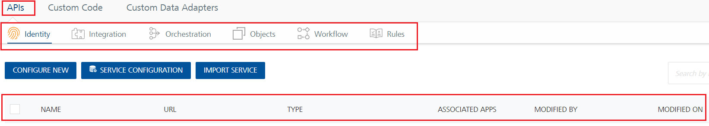

<title>Using VoltMX Foundry console to add apps and services, VoltMX Doc. Identity, Microsoft Active Directory, Salesforce, Security Assertion Markup Language (SAML), Integration, XML, JSON, SOAP, SAP, Salesforce, Orchestration, Composite Services, Looping Services, Synchronization, Messaging, Publish</title>

# APIs - API Management

A Volt MX Foundry app comprises a group of services, [shared and non-shared services](Export-Import_Apps.md#Shared-NonSharedServices). With API Management, you can manage (create, edit, and delete) shared services (identity, integration, orchestration, objects, and logic for Node.js services) without linking or configuring them within an app. After configuring the services in the **APIs** page, you can edit, clone, view a sample code, and delete a service. When you create the services in the **APIs** page, the services are not linked to apps automatically. You can link the services across any apps created for that account in Foundry Console.The **APIs** page also allows you to view the list of apps or services that are using or referencing a given service. When you make changes to the services in the **APIs** page, the changes will be reflected in the services associated with other apps.

> **_Note:_**  You can edit a service. When you make a change to the service, the changes will be reflected in the services associated with other apps.   
> You cannot delete a service if it is associated with an app or a service.

To create services through the APIs page, follow these steps:

1.  In the Volt MX Foundry Console, in the left-pane, click the **API Management** tab to display the services tabs such as **APIs**, **Custom Code**, and **Custom Data Adapters**. By default the **Identity** service tab is selected under the **APIs** tab.

    

    After creating services in the **API Management**, you can edit, clone, view a sample code, and delete a service.  

    When you create services in the **API Management** page, these services are not linked to apps automatically. You can link or unlink services to an app only through the **[Existing Services](Identity.md)** dialog while you are adding apps.

2.  From the **APIs** page, follow these steps to create services:

    - [**Identity**](#identity-service)

    - [**Integration**](#integration-service)

    - [**Orchestration**](#orchestration-service)

## Identity Service

Volt MX Foundry identity services help you secure your application by adding an authentication layer.

### How to Create an Identity Service in APIs

1.  In Volt MX Foundry Console, select **API Management** from the left navigation panel. The **Identity** page in the API tab appears by default. The **Identity** page appears and lists the existing identity services (if any). The fields for an identity service are displayed such as NAME, URL, TYPE, ASSOCIATED APPS, MODIFIED BY, and MODIFIED ON.
2.  Click **CONFIGURE NEW**. A new identity service is added.
3.  Configure the details for the identity service. For more details, refer to [Identity](Identity.md).

> **Note:**
>
> - You can perform different actions on an existing service such as edit and delete. For more details, refer to [Context Based Options](Identity14_Manage_Existing.md#UseExistingIdentity).
> - You can configure a default timeout for the apps globally in API Management. For more details, refer to [Service Configuration > Identity Timeout Settings](App_User_Session.md#AppSessionAPIMgmt).
> - Enabling cross-origin resource sharing (CORS) allows external web applications on domains to access the identity services in your Volt MX Foundry account. For more details, refer to [Identity Service Security Settings](App_User_Session.md#CORS).

## Integration Service

An Integration Service is an application component that represents the application interaction with an external system or data source.

### How to Create an Integration Service in APIs

1.  In Volt MX Foundry Console, select **API Management** from the left navigation panel.
2.  In the **[APIs](#apis--api-management)** page, click the **Integration** tab.  
    The **Integration** page appears and lists the existing integration services (if any). The fields for an integration service are displayed such as NAME, SERVICE TYPE, ASSOCIATED APPS, VERSION, MODIFIED BY, and MODIFIED ON.
3.  Click **CONFIGURE NEW**. A service definition tab is added.
4.  Configure the details for the integration service. For more details, refer to [Integration](Services.md).

    > **_Note:_**  After creating an integration service in the **APIs**, you can perform different actions on an existing service such as edit, clone, view a sample code, delete all versions of a service, manage versions of a service, and export an integration service. For more details, refer to [Context Based Options](#context-based-options).  
    > Services created under the **APIs** page are not linked to apps. You can link or unlink services to an app only through the **[Existing Services](Manage_Existing_Integration_Services.md#integration)** dialog while you are adding apps.

## Orchestration Service

An Orchestration service leverages the concept of combining multiple integration services into a single orchestration service to reduce the complexity and number of calls from the app to the backend.

### How to Create an Orchestration Service in APIs

1.  In Volt MX Foundry Console, select **API Management** from the left navigation panel.
2.  In the **[APIs](#apis--api-management)** page, click the **Orchestration** tab.  
    The **Orchestration** page appears and lists the existing orchestration services (if any). The fields for an orchestration service are displayed, such as NAME, ASSOCIATED APPS, VERSION, MODIFIED BY, and MODIFIED ON.
3.  Click **CONFIGURE NEW**. A service definition tab is added.
4.  Configure the details for the orchestration service. For more details, refer to [Orchestration](Orchestration.md).

    > **_Note:_**  After creating an orchestration service in the **APIs**, you can perform different actions on an existing service such as edit, clone, view a sample code, delete all versions of a service, manage versions of a service, and export an orchestration service. For more details, refer to [Context Based Options](#context-based-options).
    > Services created under the **APIs** page are not linked to apps. You can link or unlink services to an app only through the **[Existing Services](Orchestration.md#Reuse)** dialog while you are adding apps.

## How to View Associated Apps in APIs

After you link services (identity, integration, orchestration, and objects) created in the **APIs** page, you can view the list of apps that are associated to the services through the **Associated Apps** page. From the **Associated Apps** page, you can edit the app and unlink the app from the service.

To view associated apps, follow these steps:

1.  In the **[APIs](#apis--api-management)** page, click the service (identity, integration, orchestration, objects) tab to display the service details page.

    

2.  Click the **View** link under the **ASSOCIATED APPS** column to view the apps associated to the service. The **Associated Apps** dialog appears with the list of apps linked to the service for the current version. You can change the version of the service if required.

    

    From the **Associated Apps** page, you can perform operations such as edit the app and unlink the app from the service. For identity services, from the Associated Apps page you can also enable SSO for the application.

    - To edit the app through the **Associated Apps** page, hover your cursor over the required service, click the **Settings** button, and then click **Edit**.
    - To enable [SSO](Overview_AppSSO.md#AppSSOoverview) for the app through the Associated Apps page, hover your cursor over the required service, click the **Settings** button, and then click **Enable SSO**. You must republish the app for this new setting to take effect. For more information about SSO for applications, refer to [Application SSO](Overview_AppSSO.md#AppSSOoverview).
    - To unlink the app through the **Associated Apps** page, hover your cursor over the required service, click the **Settings** button, and then click **Unlink app**. When you click the **Unlink app** button, the app is disassociated from a particular service.

## How to Modify an Existing Service from API Management

You can perform actions on an existing service from API Management such as edit, clone, view a sample code, delete all versions of a service, manage versions of a service, and export the service to an .xml file.

To use actions for existing services from API Management, follow these steps:

1.  Go to the **API Management** page and click the **Integration** tab. The page lists the existing services (if any).
2.  Hover your cursor over the required service, click the **Settings** button to display context menu of a service. You can perform the following actions:
    *   **Edit**: Opens a service in the console and edit the service definition and operations. After you edit a service, you need to republish all the apps that are using the service to apply the changes.

        If a service is a part of a published app, you can rename that service only after the app is unpublished.

    *   **Clone**: Duplicates an existing service. Clone a service to create a different version of the service. Changes made to a cloned service will not affect the original service. The name of a cloned service indicates that it is a copy of an existing service.
    *   **Sample Code**: Generates dynamic code for each SDK type based on the configuration of a service. You can use the code in your mobile app. For example, generate the sample code for an integration or orchestration service from Volt Foundry. Then use that code in the mobile app to invoke the orchestration service instance.
    *   **Delete all versions**: Deletes all versions of a service. You cannot delete a version of the service that is in use. A service in use is a service that is referenced by a Volt Foundry app or another service or a Sync scope.

    1.  Click the **Delete all versions** button to display the **Delete Service** dialog.
    2.  Click **DELETE**. If the current of the service is not linked to any apps, the versions is deleted. Otherwise, the Error warns you that you are trying to delete the current version of the service that cannot be unlinked or deleted as it is being used by the following apps or services or Sync scopes: [App Name]

        If a service is a part of a published app, you can delete that service only after you unlink the service from all the published app.

    *   **Manage versions**: Allows you to delete one or more versions of a service.
        1.  Click the **Manage versions** button to display the **Manage versions** dialog lists versions of the service.
        2.  Hover your cursor over the required version, and click the **Delete** button. When you click the **Delete** button, the **Delete Service** dialog appears.
        3.  To confirm the deletion of the version, click **DELETE**. If the current version of the service is not linked to any apps, the versions is deleted. Otherwise, the Error warns you that you are trying to delete the current version of the service that cannot be unlinked or deleted as it is being used by the following apps or services or Sync scopes: [App Name]

            You cannot remove the current version of a service from a service level.   
            For example, If you are in the **Service Definition** tab of a service from **API Management** and try to delete a version of a service, you can delete all the versions of a service except the current version.

    *   **Console Access Control**:
    *   **Export**: Exports an existing version of a service to an XML file. You can import the service to an existing app in Volt Foundry Console. For more information, refer [Exporting and Importing an Application](Export-Import_Apps.md).
