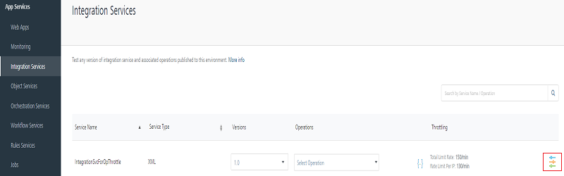
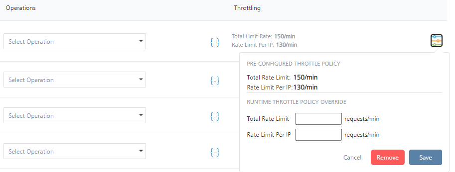
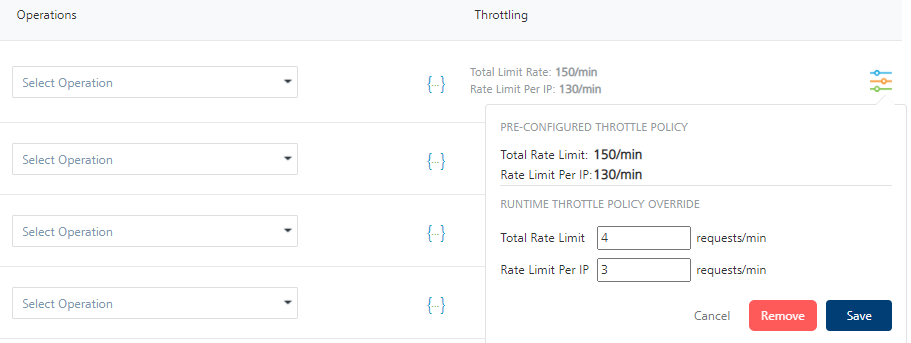

                              

User Guide: [Integration](Services.md#integration) \> [Advanced Configurations](Advanced_Configurations.md) > Override API Throttling Configuration

### Override API Throttling Configuration

After an app's integration service enabled with API throttling configuration is published, you can override throttle configuration through Admin Console.

To override API throttling configuration, follow these steps:

1.  Go to the Volt MX Foundry Admin console.
2.  In your Volt MX Foundry Admin console, in the left-pane, click on **Integration Services**. The **Integration Services** page appears. The page displays published app services.
3.  If throttling is enabled in a service, the throttling icon will be displayed under the **Throttling** section.
    
    
    
4.  Click on **Throttling** icon, a throttling pane appears.
    
    Pre-Configured throttle values will be displayed under **PRE-CONFIGURED THROTTLE POLICY.**
    
    
    
    You can override the throttle configuration by assigning values under **RUNTIME THROTTLE POLICY OVERRIDE.**
    
    
    
    1.  In the **Total Rate Limit** text box, enter a value. With this you can limit the number of requests configured in your Volt MX Foundry console in terms of Total Rate Limit.
    2.  In the **Per IP Rate Limit** text box, enter a value. With this you can limit the number of IP address requests configured in your Volt MX Foundry console in terms of Per IP Rate Limit.
    3.  Click on **Save** to override the throttle configuration.
