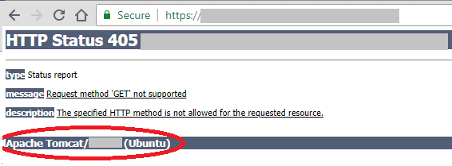

Actions in Objects
---------------------

When you access Volt Foundry V9.x by using a particular URL directly from a browser, the web page displays Tomcat Application Server's version.

For example,



For security reasons, you must disable the server information disclosure for Tomcat application server.

To avoid this disclosure information, follow these steps:

<ol>
<li>Open the Tomcat Server > <code>server.xml</code> file</li>
<li>
  Add the following:
  <pre><code>
  &lt;Valve className="org.apache.catalina.valves.ErrorReportValve"
  showReport="false" 
  showServerInfo="false"/&gt;
  </code></pre> 
</li>
<li>Save the server.xml</li>
<li>Restart the server</li>
</ol>


<!-- 1.  Open the Tomcat Server > `server.xml` file.
2.  Add the following:   
  
    ```
    <Valve className="org.apache.catalina.valves.ErrorReportValve"
        showReport="false" 
        showServerInfo="false"/>
    ```

3.  Save the server.xml.
4.  Restart the server. -->


------------------------------------------------------------------------------------------------------------------------------------------------

## How to Use Actions on an Existing Object Service Method

To use actions for an existing object service such as edit, sample code, and delete, click the Setting cogwheel of the required verb in Mapping Services pane, and can perform the following actions:

*   **Edit**: Allows you to edit a service. After you edit a service, you have to republish all the apps that are using the service to apply the changes.

    To know more about publishing an app, refer to [Publish an app](Publish.md).  

*   **Edit Configuration**: Allows you to edit the app data model and mapping for the object service.
*   **Clone**: Allows you to close the object service.
*   **Close App Data Model**: Allows you to close the app data model for object services.
*   **Sample Code**: A dynamic code is generated based on the configuration of a service. You can use this code in your SDK.
*   **Unlink**: Allows you to unlink the object service from the app.
*   **Delete**: Allows you to delete a service.

    If a service is a part of a published app, you can delete that service only after you unlink the service from all the published app.

<!-- ------------------

You can choose the desired parameters from the back-end response that need to be send to the client application by applying XPath/JSON path.

In this case, you want to show only the values from the **lat** and **lng** parameters from the **Location** parameter to the client application. In this example, use the JSON path.

To configure JSON path automatically, follow these steps:

1.  In the **Backend Response** tab, hover the mouse cursor on the **Location: lat** parameter and click **Create response**. The JSON path is automatically created in the **Response Output** for the **lat** parameter.
2.  Create the JSON path for the **Location: lan** parameter, as shown in the following screen shot:

    

1.  Now, click **Save and Fetch Response**. The desired output is displayed in the **Output Result** tab based on the JSON path that you configured, as shown in the following sample output:

    <pre class="prettyprint"><input type="button" id="button" class="btn" style="float: right;" value="Copy" onclick="var codeSnippet = this.parentNode.textContent; copyFunction(codeSnippet, this);"> Output Result
    {
      "opstatus": 0,
      <span style="background-color: #7cfc00;">"location": [
        {
          "lng": 78.486671,
          "lat": 17.385044</span>
        }
      ],
      "httpStatusCode": 200
    }</pre> -->