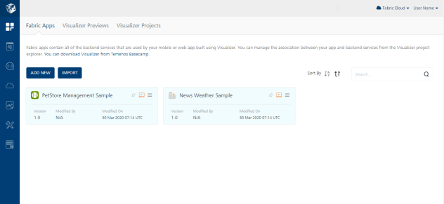
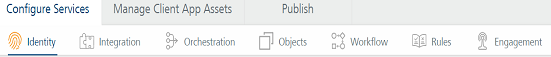

                              

User Guide: Apps - How to Add Applications

How to Add Applications
=======================

To add an app to your Volt MX Foundry, follow these steps:

1.  Go to [https://manage.hclvoltmx.com](https://manage.hclvoltmx.com/).
2.  Provide your Volt MX account login credentials, and then click **Sign in**. After validating your credentials, you are directed to your Volt MX Foundry cloud account.
3.  From Volt MX Foundry Console's left pane, click **Apps**. In the right pane, the **Foundry Apps** page appears. By default, the **Foundry Apps** page appears listing existing apps.
    
    <!--  -->
    
    *   The **Iris Previews** page lists the test live previews that you performed in a particular Cloud account. Volt MX Iris supports the Run Live Preview option that you can use to preview a prototype of your Iris application.  
        For more information on How to user Live Preview in Volt MX Iris, refer [Live Preview](../../../Iris/iris_user_guide/Content/LivePreview.md)
        
    *   The **Iris Projects** page lists the projects that you published to a particular Cloud. The Project tab in Volt MX Iris contains the Export > Cloud Project option.  
        For more information on How to share a project on the Cloud, refer [Publish your project to the cloud](../../../Iris/iris_user_guide/Content/ShareProjectOnTheCloud.md)  
        
4.  In the the **Foundry Apps** page, click **ADD NEW**. By default, the **Configure Services** tab is selected.
    
    > **_Note:_** From Volt MX Foundry V8 SP4, you can pin your favorite apps for quick access on the Apps page by clicking the **Pin To Dashboard** button of an app. So, the next time you log on to Volt MX Foundry, you will notice that all the last pinned apps are available on the Apps page (Dashboard).
    
    > **_Important:_** You can access your favorite pinned apps until you clear the cookies from your browser. You cannot access the apps you pinned in one browser by logging in from another browser or a private browser.
    
5.  A new app is added, and you are directed to the **Identity** page of the new app. From here you can manage an app and add services to your app.
    *   Manage your app as follows:
        
        *   Click the **Image** button to select an image from your local machine.
            
            > **_Note:_** The image size should be less than 20 KB.
            
        *   Click the **Sample Code** button to view the sample code of your app.
        *   Click the **Edit App Name** button to provide a unique name for your app.
        *   Click **[**Console Access Control**](../../../Foundry/voltmx_foundry_roles_access_control_guide/Content/voltmx_foundry_roles_access_control_guide.md)** button to control the access to the applications and services of apps.
        *   Click the **Delete** button to delete the app from your account.
        *   Click the **[Import](Export-Import_Apps.md)** button to import an app to your account.
        *   Click the **[Export](Export-Import_Apps.md)** button to export the current from your account.
        
        *   Under the **[Configure Services](Features.md)** tab, add and configure Volt MX Foundry services.
            
            
            
            You can add and configure the following services under the Configure Services tab:
            
            *   [Identity](Identity.md)
            *   [Integration](Services.md)
            *   [Orchestration](Orchestration.md)
            *   [Objects](Objectservices.md)
            *   [Offline sync](Legacy_Sync.md)
            *   [Engagement](Engagement.md)
            *   [Logic](Logic_in_Apps.md)  

        *    After you add services to your app, you can also do the following from an app page:

            *   [Manage Client App Assets](Manage_Client_App_Assets.md)
            *   [Publish](Publish.md)
