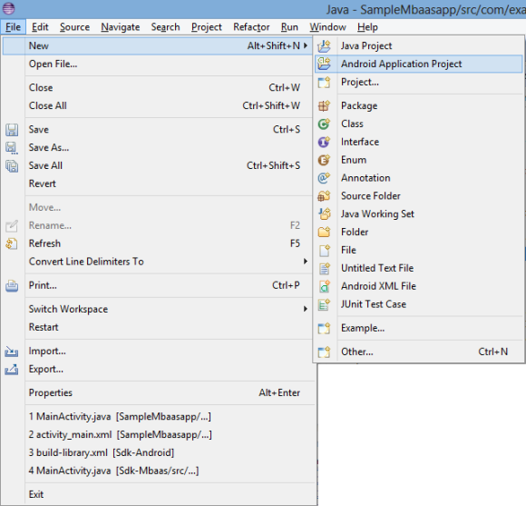
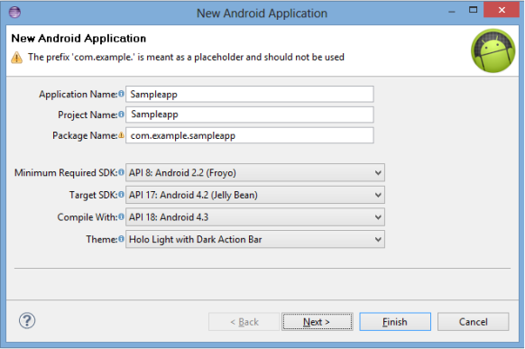
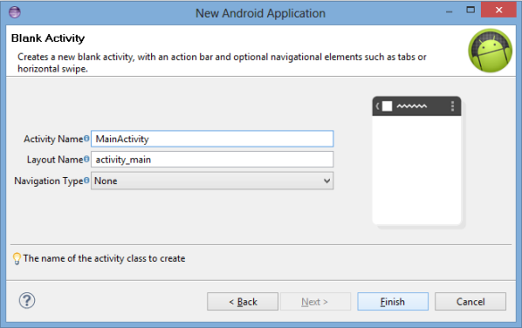
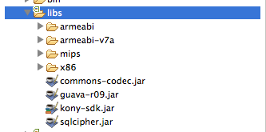
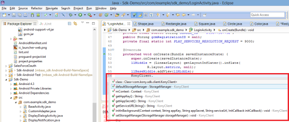
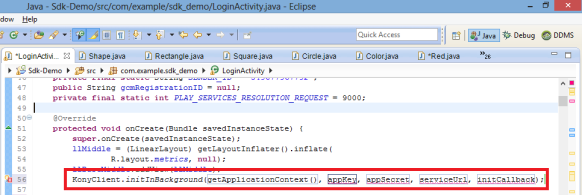
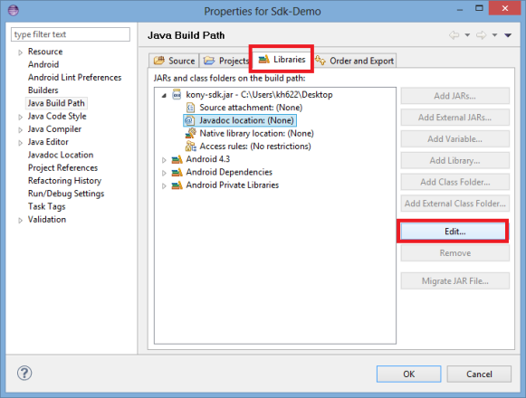
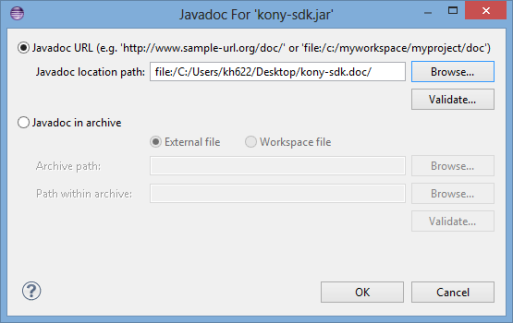
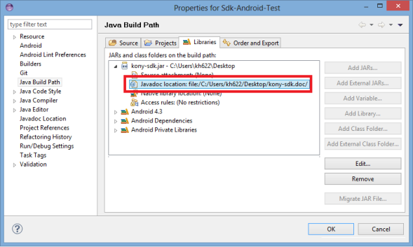

                              

User Guide: [SDKs](../Foundry_SDKs.md) > [Android SDK](Installing_Android_SDK.md) > Configuring voltmx-sdk.jar to Project - Eclipse

Configuring Volt MX Android SDK
============================

Before using Volt MX SDK APIs for Android, you must configure Volt MX Android SDK into your IDEs, such as Eclipse or Android Studio. Configuring the Volt MX Android SDK involves these steps:

*   [Configuring voltmx-sdk.jar to Project - Eclipse](#configuring-volt-mx-sdk-jar-to-project-eclipse)
*   [Configuring voltmx-sdk.doc to Project - Eclipse](#configuring-volt-mx-sdk-doc-to-project-eclipse)
    

*   [Configuring voltmx-sdk.jar to Project - Android Studio](Android_Studio.md)

Configuring voltmx-sdk.jar to Project - Eclipse
---------------------------------------------

To configure voltmx-sdk.jar file, follow these steps:

1.  Launch Eclipse.
2.  In Eclipse, click **File > New > Project > Android Application Project**.  
    
    
    
    The **New Android Application** screen appears.
    
    
    
3.  In the **New Android Application** dialog, enter the following and click **Next**. (You can leave the rest of the fields unchanged.)  
    
    *   **Application Name**: Enter the name of the application.
    *   **Project Name**: Enter the name of the project.
    *   **Package**: Enter the name of the package.
    
    
    
4.  In the **Blank Activity** screen, enter the following details for your app and click **Finish**. (You can leave the rest of the fields unchanged. For example, Navigation Type as None)  
    *   Activity Name
    *   Layout Name  
5.  To import SDK libraries to your project, follow these steps:
    1.  Unzip the `VoltMX Android SDK.zip`.
    2.  Unzip `libs.zip`.
    3.  Copy libs file into your project **libs** folder.
    4.  Copy `voltmx-sdk.jar` inside the **libs** folder. Your project **libs** folder should look like:
        
        
        
6.  Add the following permissions in your `AndroidManifest.xml`:
    1.  <uses-permission android:name="android.permission.INTERNET" />
    2.  <uses-permission android:name="android.permission.ACCESS\_NETWORK\_STATE" />
    3.  <uses-permission android:name="android.permission.ACCESS\_WIFI\_STATE" />
    4.  <uses-permission android:name="android.permission.READ\_PHONE\_STATE"/>
        
7.  Under your **Sampleapp** folder, navigate to **src > com.example.sample app**, and then click **MainActivity.java**.  
    
    
    
    The `VoltMX-Android-SDK` is now successfully configured in your project. Now you can use Volt MX APIs for the Android platform.
    
    
    

Configuring voltmx-sdk.doc to Project - Eclipse
---------------------------------------------

Volt MX  provides APIs docset to search and browse API documentation within Eclipse. The docset also provides quick help in the code completion pop-up.

To configure voltmx-sdk.doc, follow these steps:

1.  Under **Package Explorer**, right-click **Sampleapp**, and then click **Properties**. The **Properties** window appears.
    
2.  Click the **Libraries** tab, and then click the **Edit** button.  
      
    
    
    
3.  Click **Browse** to navigate your `voltmx-sdk.doc` folder and then click **OK**.
    
    
    
    The system adds the `voltmx-sdk.doc` folder under the **Libraries** tab.
    
    
