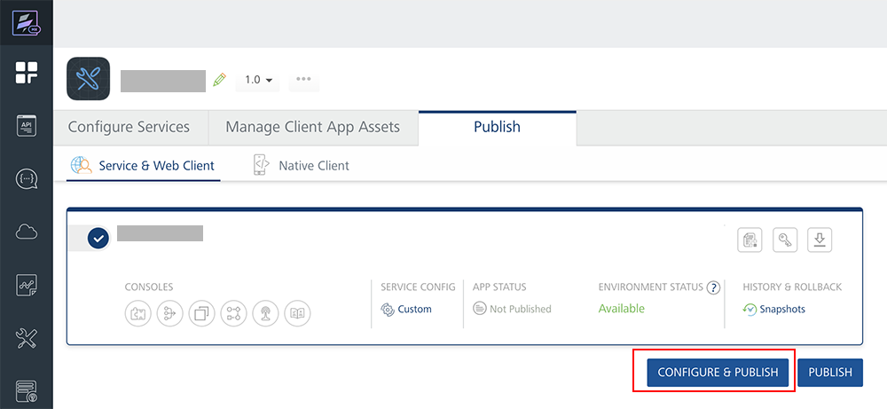
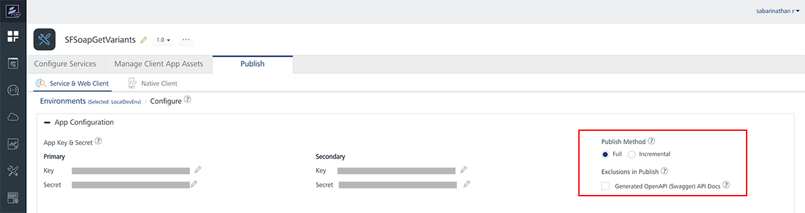
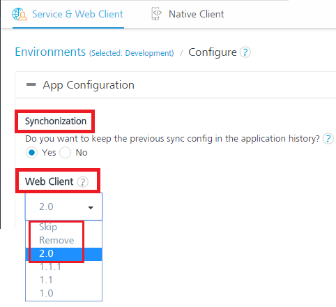

                               

User Guide: [Publish](Publish.md) > [Reconfiguration at Publish](ReconfigPublish.md) > App Reconfiguration

App Reconfiguration
===================

During app publishing, Volt MX Foundry allows you to reconfigure the default values of app services specific to an environment and publish the app to another environment.

App Key and App Secret are used by a Mobile app to identify and communicate with a published instance of a Volt MX Foundry app. You can configure specific values or let the system auto-generate those.

> **_Important:_**  For more details about How to Publish an App, refer to [Publish](Publish.md).

> **_Important:_** **Full** publish method is selected by default, you can switch to **Incremental** publish to reduce publish duration. Refer to [Publish > Delta Publish](Publish.md).

Use Cases
---------

You can use service reconfiguration based on the following scenarios:

A developer can use an app configuration in the current workspace and publish the reconfigured app to another environment. A developer can reconfigure only a few entities (such as base URL, User ID, and password).

*   For example, currently an endpoint URL of an integration service of the app is configured as `http://sample.test.com`, which is a test environment. But after an app is published in a production environment, a developer wants the integration service to communicate to a production endpoint - for example, `https://sample.com`. In such cases, a developer reconfigures the endpoint URL from http://sample.test.com    to    https://sample.com, and publishes the app to a production environment.

To display the app reconfiguration page while publishing an app, follow these steps:

1.  After you complete configuring services in an app, click the **Publish** tab.
2.  In the **[Publish](Publish.md)** page, select an environment. The **CONFIGURE & PUBLISH** and **PUBLISH** buttons are active only after you select an environment.
3.  Click **CONFIGURE & PUBLISH** to display the app reconfiguration page.
    
    
    
    The **App Configuration** page appears with the following properties:

    <table>
    <tr>
    <th>App Details</th>
    <th>Properties</th>
    </tr>
    <tr>
    <td>Primary App Key</td>
    <td rowspan="4">Primary App Key/Secret for Web Channel Secondary App Key/Secret for Native Channel.   <em><b>Note:</b></em> For more information on separate app key/secret, refer to <a href="SeparateAppKey-Secret.html">Separate Appkey/Secret for Native and Web Channels</a>.  Note that App Key needs to be unique. Additionally App Key and App Secret should only contain alpha numeric characters or '-' and must contain at least 5 and a max of 60 characters.</td>
    </tr>
    <tr>
    <td>Primary Secret</td>
    </tr>
    <tr>
    <td>Secondary App Key</td>
    </tr>    
    <tr>
    <td>Secondary Secret</td>    
    </tr>
    </table>

    
    <!-- | App Details | Properties |
    | --- | --- |
    | Primary App Key | Primary App Key/Secret for Web Channel Secondary App Key/Secret for Native Channel  **_Note:_** For more information on separate app key/secret, refer to [Separate Appkey/Secret for Native and Web Channels](SeparateAppKey-Secret.md) Note that App Key needs to be unique. Additionally App Key and App Secret should only contain alpha numeric characters or '-' and must contain at least 5 and a max of 60 characters. |
    | Primary Secret |
    | Secondary App Key |
    | Secondary Secret | -->
    
    
    

1.  Configure the following for Incremental publish. Full publish method is selected by default.
    
    | Publish Method | Details |
    | --- | --- |
    | Incremental Publish | If you select this option, the current publish will only deploy the services that have changed since the last publish to this environment. This will reduce the deployment time. |
    | Full Publish | If you select this option, the current publish will deploy all services associated to this App to the environment. |
    | Publish Linked Apps | **_Note:_** The Publish Linked Apps check box is available only for Composite Foundry apps. If you select this check box, the current publish will deploy all linked apps with the composite app to the environment. For more information on how to link apps to a Foundry app, refer to [Managing Linked Apps in a Composite Foundry App](ManagingLinkedAppsinCompositeFoundryApp.md). |
    | **Exclusions in Publish** | **Details** |
    | Engagement Services Configurations | If you select this check box, the current publish will skip swagger files. Enabling this setting skips swagger generation during app publish and improves publish time. |
    | Generated OpenAPI (Swagger) API Docs | If you select this check box, the current publish will skip swagger files. Enabling this setting skips swagger generation during app publish and improves publish time. |
    
2.  To change any value, click the **Edit** button.  
    The system displays the original value in the text box, and the **save** and **cancel** buttons next to the text box. The text field is active.
3.  Change the value in the text field.
4.  Click **save**.
5.  If you have configured sync services in your app and also uploaded a binary file for Web client, do the following:

1.  Under **Synchronization**, choose **Yes** to keep the previous sync configuration in the application history. By default, the synchronization is set to **No**.
    
    > **_Note:_** You are publishing an update to your sync configuration. If you keep the previous sync config in the application history, any devices that already have a local copy of the data can attempt to sync only the schema changes and avoid a full sync. If you do not keep the previous sync config in application history, all devices will be required to fully rebuild their local copy of the data using a full sync. In either case, the client app must be rebuilt with the new sync configuration and updated to all devices.
    
2.  Under the **Web Client**, Select the required version from the drop-down list. When you select a version and publish the app, the system overrides the existing version of the `.war` file with the selected new version in the Server. If there is no published version, the system adds the new Web client in the server.  
      
    
    *   **Skip**: If you select Skip, Web Client Assets will not be included in this Publish. If you select a version of Web Client, the last published Web Client will be deleted and the said Version of Web Client will be published to Server.
    *   **Remove**: If you select Remove, the Web Client is removed if present in the Server.
    
    
    

7.  Click **SAVE & PUBLISH** to start the publishing. The process of publishing the app begins.
