                               

User Guide: Checking App Versions in EAS

Upgrade Mechanism for App Versions on Enterprise App Store
==========================================================

Overview
--------

Enterprise App Store ([EAS](EnterpriseAppStore.md)) is an app distribution service that enables an enterprise to manage and distribute customized apps to its users.

From Volt MX Foundry V9 SP1, EAS is enhanced with the **Upgrade Mechanism** feature for apps — this feature checks versions of apps that are installed on devices through EAS and notify users about the latest versions of those apps along with the app upgrade sources. Both your Iris app and Foundry app should be configured for the upgrade mechanism feature to make your app binary version check compatible. When an app is installed through EAS and launched, it will check if there is an update available for the app. So, app users can install the proper versions of apps from EAS.

The Upgrade Mechanism for App Version on EAS feature is supported for Cloud and On-premises.

Upgrade Policy Options Available for Apps
-----------------------------------------

Volt MX Foundry provides a series of options to upgrade apps. You can access the **Upgrade Policy** functionality in the **Environments > Published Apps >** **Published Channel Assets**, and then **More Options**.

You can configure the available upgrade options suitable to your business requirements, as follows:

*   **No upgrade necessary** policy indicates that the user can continue to use the currently installed version of an app.
*   **Optional Upgrade** policy indicates that the user is using the previous version of an app, and the higher version is available on EAS. The user can choose to continue to use the current version or to upgrade to the latest version. This is optional.
*   **Mandatory Upgrade** policy indicates that the user must upgrade to the higher version of the app in order to use the app. The user cannot use the current version.

> **_Important:_** The Mandatory Upgrade and Optional Upgrade policies should only be defined when a higher version is available.

Use Case: Upgrade Mechanism for Child Apps on EAS
-------------------------------------------------

The EAS upgrade policy allows users to set different upgrade policies for the various versions of apps published on Enterprise App Store.

Let’s say you have an App Version 1.0 and Version 2.0 active on EAS, and you have released a new version 3.0 with a new security patch. This new security patch is backward compatible with v2.0 but not with v1.0. So, you no longer want to support v1.0 and want all the users for V1.0 to mandatorily upgrade. In such a case, you can set the upgrade policy for v1.0 to **MANDATORY**. So, the next time when the user launches the app, the user views a notification for mandatory upgrade and he can no longer use the app until he upgrades.

For those users on V2.0, you want them to upgrade but it is not mandatory, so you set the upgrade policy to **OPTIONAL**. When the next time the user launches the app, the notification for an optional upgrade is displayed on the device. The user can choose to close the notification and continue using V2.0 of the app.

For those users on V3.0, you can set the upgrade policy to **NO UPGRADE**. These users are not shown any upgrade notification when they launch the app next time.

Prerequisites
-------------

*   Access to a Volt MX Cloud account. If you do not have a cloud account, you can register for it at [VoltMX Cloud Registration](https://manage.hclvoltmx.com/registration).

*   Access to a Volt MX Cloud Build Environment version, Iris, and Foundry App Server for publishing apps to EAS.
*   EAS V3.1.0  

Click here for more details on EAS and Platform Versions Compatibility Chart
 
    
The following table details the supported versions of EAS source and Platform.

> **_Important:_** If you are upgrading to EAS V 2.0.1 or a higher version, you must restart the server.

<table>
<tr>
<th colspan="0"></th>
<th colspan="2">EAS Source App version</th>
<th colspan="3">Platform Supported Version</th>
</tr>
<tr>
<th>Features</th>
<th>Client App (Store.zip)</th>
<th>Server App (Kony App Store.zip)</th>
<th>Foundry</th>
<th>Iris</th>
<th>Middleware</th>
</tr>
<tr>
<td><ul><li>Initial Release</li></ul></td>
<td>1.0.0</td>
<td>1.0.0</td>
<td>NA</td>
<td>V8 SP4 FP44 or lower</td>
<td>8.4.3.x.</td>
</tr>
<tr>
<td><ul><li>Support for Web apps</li></ul></td>
<td>1.1.0</td>
<td>1.0.0</td>
<td>NA</td>
<td>V8 SP4 FP44 or lower</td>
<td>8.4.3.x.</td>
</tr>
<tr>
<td><ul><li>Support for Android 10</li><li>Support for iOS 13</li><li>Push Notifications</li></ul></td>
<td>2.0.0</td>
<td>2.0.0</td>
<td>NA</td>
<td>V8 SP4 FP48 or higher</td>
<td>8.4.3.x.</td>
</tr>

<tr>
<td><ul><li>Bug fixes</li></ul></td>
<td>2.0.1</td>
<td>2.0.1</td>
<td>NA</td>
<td>V8 SP4 FP66 or higher</td>
<td>8.4.3.10.</td>
</tr>

<tr>
<td><ul><li>Support for Desktop View</li><li>Help section in iOS Native Apps</li></ul></td>
<td>3.0.1</td>
<td>3.0.1</td>
<td>NA</td>
<td>V9 GA</td>
<td>8.4.3.10</td>
</tr>

<tr>
<td><ul><li>Support for Upgrade Policy</li></ul></td>
<td>3.1.0</td>
<td>3.1.0</td>
<td>NA</td>
<td>V9 SP1</td>
<td>V9 SP1</td>
</tr>
</table>

* SP: Service Pack
* FP: Fix Pack

   

Apps Eligible for Upgrade Policy
--------------------------------

This feature is supported for all apps built using Iris and Foundry V9 SP1 and published to EAS.

*   For your enterprise apps, you need to enable this feature. The following section details how to configure the upgrade policy to your enterprise apps.
*   To use this feature, your enterprise apps must be published to EAS.

How to Configure App Upgrade Policy for EAS
-------------------------------------------

Configuring Upgrade Mechanism to Apps involves the following two steps:

1.  **Enable App Binaries for Upgradable Compatibility.**
    1.  Link the Foundry app to your Iris Project.
    2.  Navigate to **Project Settings > Foundry**. The **Foundry Details** windows appears.
    3.  Under **Manage App Store Users**, select the **Automatically check for app upgrades** check box.
        
        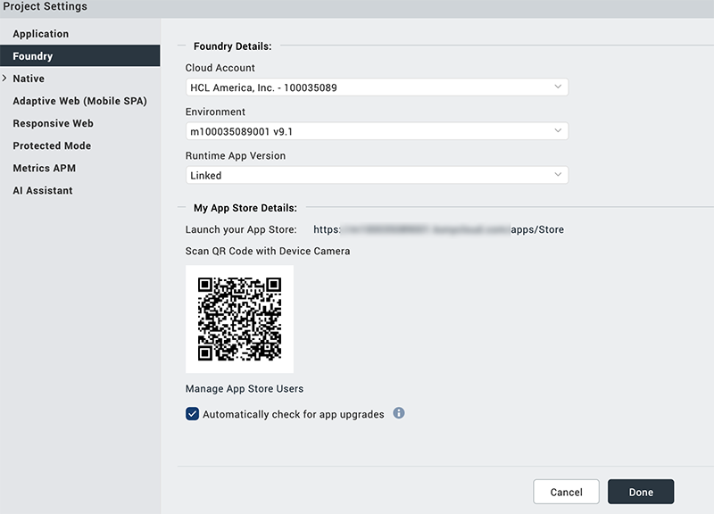
        
    4.  Click **Done**.
    5.  Build and publish the app binary enabled with upgrade version check feature to your EAS. For more information on how to build and publish apps to EAS, refer to [Publish Native Apps to the Enterprise App Store](../../../Iris/iris_user_guide/Content/EAS.md#Publish).
        
        > **_Important:_** The **Build and Publish Native** option is not enabled in Iris when it is connected to Foundry instance on-premises.  
          
        If you want to set any upgrade policy for native binaries in on-premises Foundry, you need to select the **Automatically check for app upgrades** check box in Iris, and perform **Build Native Local** to build native binaries. After the native binaries are generated, you need to upload native binaries to an Foundry environment by using the `binary-upload` MFCLI command, with the additional parameter `--upgradable`. After you publish these native binaries to EAS, you can configure upgrade policy to your app using Foundry Console.  
        For more information on `Binary-upload` and `Native-publish` commands in MFCLI, refer to [Continuous Integration for Binary-Upload and Native-Publish](CI_NativeUploadPublish.md).
        
2.  **Configure the Upgrade Policy settings for the published app binaries that are enabled for Upgradable Compatibility.**
    
    1.  Log in your Volt MX Foundry Console.
    2.  From the left pane in your Volt MX Foundry Console, click **Environments**.  
        This displays the list of clouds or environments configured for your Volt MX Foundry account.
    
    1.  Click the **More Options** button of an environment.
        
        > **_Note:_**  The **More Options** button in the **Environments** page is available only if you have the Admin access.
        
    2.  From the context menu, select **Published Apps**.
        
        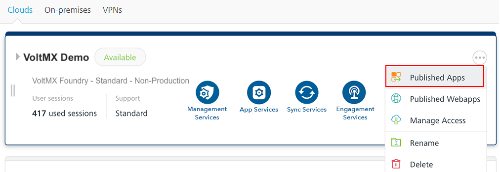
        
        The **Published Apps** page appears and displays the apps published to the environment.
        
        You can navigate to the app definition section and published services of an app from this page.
        
        **The apps published to EAS are indicated with the EAS app icon and a tooltip.**
        
        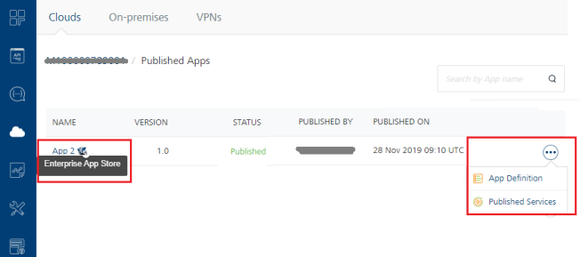
        
        > **_Note:_** For more information **Published Apps** page, refer to [Published to a Runtime Environment and EAS](Published_Apps-Environments.md).
        
    3.  To view the associated services and the channel types with the published app, click the **More Options** > **Published Services**.
        
        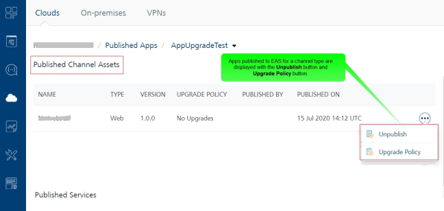
        
        > **_Note:_** For more information **Published Channel Assets** and **Published Services**, refer to [Published to a Runtime Environment and EAS](Published_Apps-Environments.md).
        
        The **Published Channel Assets** section is applicable only for the published apps to EAS. This section displays the following details:
        
        | Column | Description |
        | --- | --- |
        | NAME | Displays the name of the app binary published to EAS. |
        | TYPE | Displays the type of the channel to which the app has been published. |
        | VERSION | Displays the version of the app. |
        | UPGRADE POLICY | Displays the status of the configured Upgrade Policy option. |
        | PUBLISHED BY | Displays the name of the user who published the app. |
        | PUBLISHED ON | Displays the time-stamp when the app was published. |
        | **Unpublish** button | You can click this button to unpublish the app. |
        | **Upgrade Policy** button | Click to view and configure upgrade policy options. |
        
    4.  From **Published Channel Assets**, click **More Options** for the app binary with a specific channel type, for which you want to configure the upgrade policy.
        
        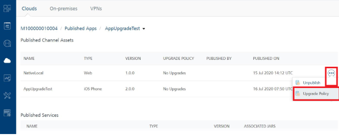
        
    5.  Click **Upgrade Policy** to view the upgrade options in the dialog that appears:
        
        *   No upgrade necessary
        *   Optional Upgrade
        *   Mandatory Upgrade
        
        <table style="mc-table-style: url('Resources/TableStyles/Basic.css');width: 840px;" class="TableStyle-Basic" cellspacing="0"><colgroup><col class="TableStyle-Basic-Column-Column1" style="width: 286px;"><col class="TableStyle-Basic-Column-Column1" style="width: 276px;"><col class="TableStyle-Basic-Column-Column1" style="width: 278px;"></colgroup><tbody><tr class="TableStyle-Basic-Body-Body1"><td class="TableStyle-Basic-BodyB-Column1-Body1"><a class="MCPopupThumbnailLink MCPopupThumbnailHover" href="Resources/Images/EASUpgradeoption1.png">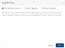</a></td><td class="TableStyle-Basic-BodyB-Column1-Body1"><a class="MCPopupThumbnailLink MCPopupThumbnailHover" href="Resources/Images/EASUpgradeoption2.png">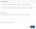</a></td><td class="TableStyle-Basic-BodyA-Column1-Body1"><a class="MCPopupThumbnailLink MCPopupThumbnailHover" href="Resources/Images/EASUpgradeoption3.png">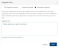</a></td></tr></tbody></table>
        
    6.  Click the required option.
    7.  Click **Apply**.
    
    Your app is updated with the upgrade policy in the server. Now when a user launches the app from EAS, the configured Upgrade Policy details are displayed on the device.
    

Sample Screen-shots for Upgrade Policy - App Launching from EAS
---------------------------------------------------------------

<table style="mc-table-style: url('Resources/TableStyles/Basic.css');width: 694px;" class="TableStyle-Basic" cellspacing="0"><colgroup><col class="TableStyle-Basic-Column-Column1" style="width: 100px;"> <col class="TableStyle-Basic-Column-Column1" style="width: 302px;"> <col class="TableStyle-Basic-Column-Column1" style="width: 292px;"></colgroup><tbody><tr class="TableStyle-Basic-Body-Body1"><td class="TableStyle-Basic-BodyE-Column1-Body1" style="text-align: center;">Device Type</td><td class="TableStyle-Basic-BodyE-Column1-Body1" style="text-align: center;">Mandatory Upgrade</td><td class="TableStyle-Basic-BodyD-Column1-Body1" style="text-align: center;">Optional Upgrade</td></tr><tr class="TableStyle-Basic-Body-Body1"><td class="TableStyle-Basic-BodyE-Column1-Body1" style="text-align: center;">iOS</td><td class="TableStyle-Basic-BodyE-Column1-Body1" style="text-align: center;">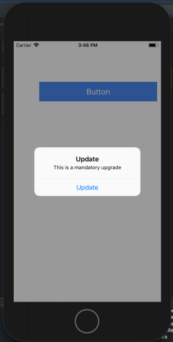</td><td class="TableStyle-Basic-BodyD-Column1-Body1">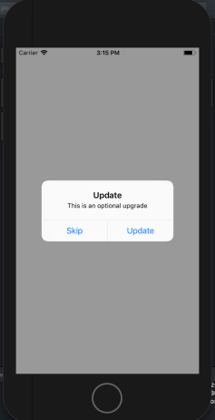</td></tr><tr class="TableStyle-Basic-Body-Body1"><td class="TableStyle-Basic-BodyB-Column1-Body1" style="text-align: center;">Android</td><td class="TableStyle-Basic-BodyB-Column1-Body1" style="text-align: center;">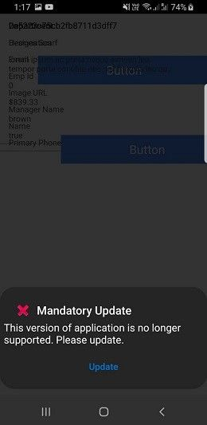</td><td class="TableStyle-Basic-BodyA-Column1-Body1">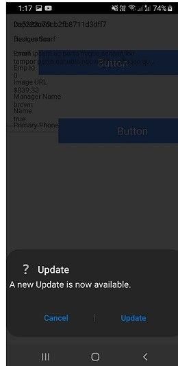</td></tr></tbody></table>
