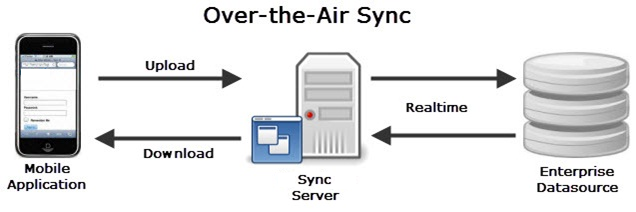
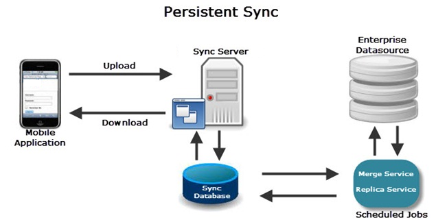

                              

User Guide: Appendix - Sync Strategy

Appendix - Sync Strategy
========================

During offline operation, the mobile application on the device is completely disconnected from the server. Instances of the same application that may run on other mobile devices at the same time, either connected to or disconnected from the server. Data stored locally on the mobile device running in offline mode may be modified or deleted or new data may be created. Potentially, the same data entity may be modified by multiple mobile clients concurrently, running either in online or offline operation, with potential effects on the server data store. These modifications that may be in conflict with others, have to be synchronized with the data on the server when a mobile application switches back to online operation. During this process, conflicts need to be reconciled and updates have to be made available to other application clients connected.

To enable the above synchronization needs the server may choose to store the data before merging it with the Enterprise Datasource. Though this is not a mandatory requirement, it is very desirable when the Enterprise Datasource has not been designed for handling additional mobile users or is only occasionally available.

Volt MX  Foundry Sync Framework provides two flexible sync strategies that help the application developer design the application that best suites the enterprise needs.

Over The Air Sync (OTAsync)
---------------------------

In this strategy whenever the mobile application invokes sync API, the Volt MX Foundry Sync server immediately merges upload packets with the enterprise server. Similarly the Volt MX Foundry Sync server queries the enterprise server for "delta" changes real-time and sends the same to the mobile application.

In this strategy, Enterprise Datasource is assumed to be available when the device starts the sync session.

Persistent Sync
---------------

In this strategy the application data is first persisted on Volt MX Foundry Sync server and later merged with the Enterprise Datasource as part of the offline process. Though this results in some data latency but ensures that the system is still functional even though the Enterprise Datasource may not be available.

In this strategy, the Sync Framework buffers / persists the backend data; during synchronization of a mobile client, the delta for that client is calculated based on the existing data in the Volt MX Foundry Sync Server. You can schedule replication jobs to occur at predetermined intervals to update the Volt MX Foundry Sync Server data. These jobs compare backend data with the data that is persisted in the Volt MX Foundry Sync Server and decide whether an object needs to be updated.

When to Use which Sync Strategy?
--------------------------------

Deciding upon to use a Sync Strategy is one of the key architectural / designs decisions that you need to make when developing any enterprise grade offline application. This is not a simple decision but is based on number of input parameters and system constraints. Below are some of the recommendations that can help you determine to choose the appropriate strategy:

### OTASync Strategy is recommended solution when:

*   The Enterprise backend is highly available to the Volt MX Foundry Sync Server. It can be assumed that the availability of connectivity between the Device and Volt MX Foundry Sync server is the same as the availability of connectivity between the Volt MX Foundry Sync Server and the Enterprise backend. So whenever the device has network availability it can directly post the changes to the Enterprise backend.
*   When there is a need to keep system and operational costs down by not having to replicate the enterprise backend on the Volt MX Foundry Sync server. Data replication does added to the amount of disk space needed to maintain the data and also resources to monitor the data.
*   The Enterprise backend is “Provisioned”. Provisioned is the term used to signify that typical database design patterns are followed like tracking deletes through a soft delete flag and tracking lastupdated timestamp for each data item (or a table row). These elements are essential for OTASync as they are needed for sending appropriate updates back to the client database and keep the processing as low as possible on the Volt MX Foundry Sync server.
*   The Enterprise backend can provide delta changes based on the last updated timestamp as that the device sends. Before we get into the details to understand the need for this, it is important to understand that the essence of OTASync strategy to is to avoid “persisting” a copy of the Enterprise backend data on the Volt MX Foundry Sync server. During OTASync, the device waits for the client changes to merge with enterprise backend and at the same time, enterprise updates to been sent to the device. Now, if the enterprise backend does not provide the ability to query “deltas”, it means that you have to do the real time delta determination. This means that current state of device data is available on the Volt MX Foundry Sync server to compare with the current state of the data on the Enterprise backend (so that you can determine the deltas between two sources). Since we don’t persist data on the Volt MX Foundry Sync server (for OTASync strategy), this means sending a snapshot of the client data with every upload request may increase the pay load of the upload request to an unmanageable level. SalesForce WebServices offers a very good design pattern on how you should design services to suite the OTASync strategy.
*   Every time the users perform a sync, they get access to the Latest updates on the Enterprise backend.

### PersistentSync is recommended solution when:

*   The Enterprise backend is not highly available. For example: the Order Processing system is busy serving desktop users during the peak hours (say 9:00 AM to 5:00 PM) and cannot take additional load of the “new” mobile users (employees accessing the system using mobile devices). So, in order to make sure that the mobile users are still able to submit requests, you have to persist these requests on Volt MX Foundry Sync server and merge with the Enterprise backend offline (during off peak hours).
*   A scheduled system down time does not allow users to access the (typically due to time zone differences)
*   The Enterprise backend is “UnProvisioned”. Provisioned is the term used to signify you have to follow typical database design patterns such as tracking deletes through a soft delete flag and tracking lastupdated timestamp for each data item (or a table row). An unprovisioned backend does not follow these characteristics and hence it means that Volt MX Foundry Sync Server has to do delta determination (which dataitems /rows are added new, deleted and updated). When we deal with row items in thousands, this can be a processor intensive and time consuming exercise. hence this is usually done offline say few times during a day for the entire dataset (data for all users in the system)
*   It is acceptable that users are productive even with information set that is “outdated” or “stale” by a few hours. Merging of the data is done usually at periodic intervals, it means that data in the Replica Database can be outdated with respect to the Enterprise backend.

### What are the prerequisites for OTASync strategy ?

In order to select the OTASync strategy for a particular SyncScope, ensure that the follow prerequisites are met:

*   Enterprise backend is Provisioned. This means that it provides a way to query updated records based on a timestamp and also query the deleted records based on a timestamp.
*   It should provide a way to get data items (rows) in batches. This is important as the device has limited memory and can process limited data at any given point in time.

### What are the prerequisites for PersistentSync strategy?

In order to select the PersistentSync strategy for a particular SyncScope, ensure that the follow prerequisites are met:

*   The system provides access to data for all users with a single login / authentication. This is essential since the replica database stores the data for all users and should be able to query the same from the Enterprise backend. The replica service does not refresh data for a particular user. It does across users. For example: it invokes getAll operation on Account objects. This means that it gets all the accounts across users and then tags the one that is updated and that is deleted. The replica service does not have any context of the users that are defined in the systems. The replica service only job is to refresh data periodically from Enterprise backend.
*   Additional storage capacity to be allocated on Volt MX Foundry Sync Server as it now also stores a copy of the Enterprise backend

ChangeTracking
--------------

Applications requiring data synchronization capabilities require that changes are tracked in the server database so that these changes can be delivered to clients during a subsequent synchronization session (and vice versa). Below, we discuss different strategies that you can apply / configure to ensure that you can share only incremental updates between client and server.

Volt MX  Foundry Sync framework provides the ability to either utilize change tracking that the datasource provides or in absence of such capability at the datasource, the Sync framework itself can change tracking in the server.

Conflict Resolution
-------------------

During synchronizing two data stores (local device client and enterprise server), conflicts may occur if the same data object is modified in both participating stores independently. You can detect the conflicts by comparing state information of the two objects. The resolution of a conflict is called reconciliation and is always performed on the enterprise schema.
