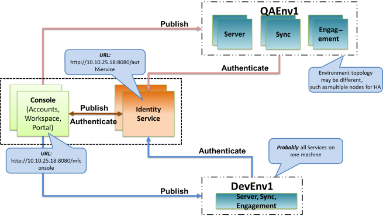

User Guide: Continuous Integration with Volt MX Foundry MFCLI

# Continuous Integration with Volt MX Foundry

[Continuous Integration](https://en.wikipedia.org/wiki/Continuous_integration) is a key modern day software development practice. Any software development project doing Agile development probably would be doing Continuous Integration (CI) too.

Volt MX Foundry being a SDLC tool, supports Continuous Integration.  Volt MX Foundry has REST APIs for import/export of an application and publish/unpublish of an application to facilitate CI.  You can consume these REST APIs directly if needed.  For this, refer to the [Continuous Integration with Volt MX Foundry APIs](CI_with_Foundry_APIs.md)documentation.

While deploying the application to different environments, you may need to reconfigure certain properties, such as the end-point URL to which the application should talk in the production environment. For these kind of reconfiguration, you can use the [Reconfiguration at Publish](ReconfigPublish.md) support. You can set environment specific properties as one time activity using Volt MX Foundry Console and these will automatically get applied during publish in CI flow.

## Volt MX Foundry Command Line Utility

Using REST APIs may not be ideal in some cases.  For example, a developer uses a shell script for Continuous Integration, then calls REST APIs and does all the response handling. The process can become tedious and time-consuming.  To make such scenarios easier, we offer Volt MX Foundry Command Line Utility.  The utility helps you export/import or publish/unpublish an application on on-premise Volt MX Foundry and Volt MX Cloud environments.

### Download Links

Volt MX Foundry Command Line Utility can be downloaded from [VoltMX download center](https://hclsoftware-fno.flexnetoperations.com/flexnet/operations/startPage).

### Examples

This section will help you better understand the utility. For example, company MoBoCo is developing the app MoBoApp. Some of the app's developers use the development environment called DevEnv1. As part of the continuous integration job that runs every night, the team wants to push the MoBoApp from DevEnv1 to QAEnv1 . The team wants automation and testing to occur at night and the following day. Consider the following scenarios.

**Scenario 1 – Promoting an app from the local development environment to local QA environment every night**

There is **one Volt MX Foundry Console connected to two environments – DevEnv1 and QAEnv1**.  The following image shows the Volt MX Foundry topology:



Using the preceding topology to promote the MoBoApp from DevEnv1 to QAEnv1 every night, a user can do the following:

```
 java -jar mfcli.jar Publish -u ciuser@moboco.com -p ciuserpwd -e QAEnv1 -a MoBoApp -au http://10.10.25.18:8080 -cu http://10.10.25.18:8080
```

Here, ciuser@moboco.com is the user with password ciuserpwd. The user's account helps to promote the MoBoApp to QAEnv1. Identity (Auth) Service and Console are running on http://10.10.25.18:8080. You can also encrypt the password before exporting an app.

> **_Note:_** The publish command could be used to publish a new application or to overwrite an existing application.

The following example shows how the publish command is used:

```
 To publish an application from an on-premise installation,  
java -jar mfcli.jar Publish -u [user] -p [password] -e [environment name] -a [app name] -au [Identity Service URL] -cu [Console URL]
```

If the end-point URL or any other property is different in QA environment, you can use the [Application Reconfiguration](ServiceReconfig.md) support to set these properties at one time action in Volt MX Foundry Console. The environment specific properties will automatically get applied every time you publish.

**Scenario 2 – Promoting an app from the local development environment to QA environment running on Volt MX Cloud every night**

This case is more complex. Developers are working against a local environment (DevEnv1), but QA is testing through an environment in Volt MX Cloud (QAEnv1). There are **two MF Consoles**. The example is a hybrid scenario of on-premise and the cloud. The following image shows the Volt MX Foundry topology:


In this example, a user needs to perform the following four steps:

1.  Encrypt the password of a user who needs to promote the MoBoApp  to  QAEnv1account.
2.  Export the app from DevEnv1 (as a .zip file).
3.  Import the app (as a .zip file) into Volt MX Cloud account.
4.  Publish the app to QAEnv1.

### Minor difference between on-premise Volt MX Foundry and Volt MX Cloud

The command line utility supports on-premise Volt MX Foundry and Volt MX Cloud. However, there are minor differences in command-line arguments. For on-premise, the utility needs to know the URL of the Identity Services and Console. For Volt MX Cloud, since the URL is constant ([](https://manage.hclvoltmx.com/)[https://manage.hclvoltmx.com](https://manage.hclvoltmx.com/)), and is hard-coded into the utility for convenience. However, Volt MX Cloud is a multiple account (tenant) service, and a user must specify the account ID using –t option. The Volt MX Cloud account ID is a nine-digit number (such as 100054321) and is located in the top-right corner of the console.

In the scenario, a user must perform the following steps:

1.  **Encrypt the password**.


    To encrypt the password, run the following command.

    ```
    java -jar mfcli.jar  encrypt password ciuserpwd
    ```

    An encrypted password is generated for the preceding ciuserpwd. Use the encrypted password in the following commands in the scenario.

2.  **Export the app from DevEnv1 (as a zip file)**


    To export the app, a user must run the following command.

    ```
    java -jar mfcli.jar Export -u ciuser@moboco.com -p encrypted_password -a MoBoApp –f .\MoBoApp.zip -au http://10.10.25.18:8080 -cu http://10.10.25.18:8080.
    ```

    In the scenario, ciuser@moboco.com is the user with password  encrypted_password. The user's account helps to export the MoBoApp as MoBoApp.zip. The Identity (Auth) Services and console are running on http://10.10.25.18:8080.

    The following is an example of how the export command is used:
    To export an application from an on premise installation - 
    
    ```
    java -jar mfcli.jar Export -u [user] -p [encrypted_password] -a [app name] -f [file name] -au [Identity URL] -cu [Console URL]
    ```

8. **Import the app (as a zip file) into Volt MX Cloud Account**  

    ```
    java -jar mfcli.jar Import -u ciuser@moboco.com -p encrypted_password -a MoBoApp –f .\MoBoApp.zip –t 100054321
    ```

    In the example, ciuser@moboco.com is the user with encrypted_password. The user's account helps to import the MoBoApp from MoBoApp.zip.

    > **_Note:_** Since no URL is provided for Identity Service and console, it is assumed that the URL is Volt MX Cloud ([](https://manage.hclvoltmx.com/)[https://manage.hclvoltmx.com](https://manage.hclvoltmx.com/)). Since Volt MX Cloud is a multiple tenants (account) service, a user must specify the account ID using –t. The account ID in the preceding example is 100054321.

    > **_Note:_** In the example, it is assumed a user is trying to overwrite the existing MoBoApp in the account. If this is new application, then do not specify any name with -a option.

    The following is an example of how the import command is used:
    To import an application to manage.hclvoltmx.com,
    ```
    java -jar mfcli.jar import -u <user> -p <password> -t <account id> [-f <file name> | -r <directory name>] [-a <app name>] [-v <app version>] [-ay] [-to <time in secs>]
    ```  

14. **Publish the app to QAEnv1**

    ```
    java -jar mfcli.jar Publish -u ciuser@moboco.com -p encrypted_password -e QAEnv1 -a MoBoApp –t 100054321
    ```

    This method is similar to local publish, except the -t option specifies the account ID.

    The following is an example of how the publish command is used:
    To publish an application to manage.hclvoltmx.com,

    ```
    java -jar mfcli.jar Publish -u [user] -p [encrypted_password] -e [environment name] -a [app name] -t [account id]
    ```

    If the end-point URL or any other property is different in QA environment running on Volt MX Cloud, you can use the [Application Reconfiguration](ServiceReconfig.md) support to set these properties at one time action in Volt MX Foundry Console. The environment specific properties will automatically get applied every time you publish.  


### Miscellaneous Features

> **_Note:_** The following section provides the supported list of MFCLI commands with the links to Foundry Console features. 

#### Get Usage

Get the usage:

<pre><code style="display:block;background-color:#eee;border:1px solid #999;padding:20px;">For example, to get summary help on all the commands,  
java -jar mfcli.jar help
Following commands are supported:-

<code>account-config</code>   Gets Auth url information for the Volt MX Foundry Command Line Utility can be downloaded from <a href="http://community.hclvoltmx.com/downloads">VoltMX download center</a>. Foundry installation. Applicable for on-premise installation only.

<code>app-upgrade</code>   Command to generate Upgraded Version app zip. Creates an upgraded app zip with a version higher than provided. <a href="Version_Upgrade_Apps_Services_MFCLI.html">Click here for more details on the app-upgrade command</a>

<code>appinfo</code>   Displays the App key, App Secret and Service URL for an application 

<code>authenticate</code>   Authenticates user with given credentials and returns the Identity token

<code>binary-upload</code>   Uploads a client binary to Foundry.
<a href="../../voltmx_foundry_user_guide/Content/CI_NativeUploadPublish.html">
Click here for more details on the binary-upload command</a>

<code>build</code>   Command to build Iris apps for different channels.
<a href="../../voltmx_foundry_user_guide/Content/CI_CloudBuild.html"> 
Click here for more details on the build command</a>

<code>build-cancel</code>   Command to cancel build for iris project

<code>build-download</code>   Command to download artifacts for given build

<code>build-status</code>   Command to check build status or fetch status url for given build

<code>build-trigger</code>   Command to trigger build for iris project 

<code>build-upload</code>   Command to upload iris project for build

<code>diagnostics</code>   Gets the diagnostics information from the Volt MX Foundry installation. Applicable for on-premise installation only

<code>encrypt</code>   Generates an encrypted password from plain text password using default key. To use custom encryption key, set the property password.encryption.key.

<code>explore-snapshots</code>   Displays the details of the available snapshots.
<a href="../../voltmx_foundry_user_guide/Content/AppPromotion.html"> 
Click here for more details on Promote a Deployment Package command</a>

<code>export</code> Exports the specified application as a .zip file or a directory

<code>export-config-properties</code>   Exports the configurable properties as a specified .zip file or directory.
<a href="../../voltmx_foundry_user_guide/Content/Export_Import_Configuration_Parameters_AppServices_MFCLI.html#import-operation-for-configurable-parameters-app-services.
html"> 
Click here for more details on the export-config-properties command</a>

<code>export-dashboards</code>   Export the custom dashboards from Foundry.

<code>export-deploymentpackage</code>   Exports the deployment package of a snapshot.
<a href="../../voltmx_foundry_user_guide/Content/AppPromotion.html"> 
Click here for more details on Promote a Deployment Package command</a> 

<code>export-reports</code>   Export custom reports for a specified application from Foundry.

<code>export-service</code>   Exports the specified service as a .zip file or a directory

<code>export-config</code>   Exports the existing integration, identity and object Service Configuration profile, for the given app and environment. Profile is downloaded as the specified .json file.
<a href="../../voltmx_foundry_user_guide/Content/ServiceConfigProfile.html#export-import-service-profiles-using-mfcli.html"> 
Click here for more details on the export-config command</a>

<code>generate-docs</code>   Generates HTML documentation for the specified Volt MX Foundry application along with the OpenAPI (Swagger) file

<code>healthcheck</code>   Gets the health check information for the environment.

<code>help</code>   Help on the tool or specific command

<code>import</code>   Imports the specified .zip file or the directory as an application

<code>import-config-properties</code>   Imports the specified .zip file or the directory as configurable properties file.
<a href="../../voltmx_foundry_user_guide/Content/Export_Import_Configuration_Parameters_AppServices_MFCLI.html#import-operation-for-configurable-parameters-app-services.html">
Click here for more details on the `import-config-properties` command</a>

<code>import-reports</code>   Import the custom reports for a specified application into Foundry.

<code>import-service</code>   Imports the specified .zip file or the directory as a service

<code>import-config</code>   Imports the specified Service Configuration profile .json file,into the given app and environment.
<a href="../../voltmx_foundry_user_guide/Content/ServiceConfigProfile.html#import-config-command.html">
Click here for more details on the import-config command</a> 

<code>license</code>   Gets the license information from the Volt MX Foundry installation. Applicable for on-premise installation only.

<code>lock-app</code>   Command to lock the app and return a locked app zip in the given location.
<a href="LockApp.html">Click here for more details on lock-app command</a>

<code>lock-config</code>   Command to lock services given a lock configuration json and an App zip. Creates a clone of the provided app with lock configuration applied.
<a href="Lock_Unlock_Fields_ObjectServices_MFCLI.html">Click here for more details on lock-config command</a>

<code>merge-service-zip</code>   Merges a given service package with a template package.

<code>merge-app-zip</code>   Merges a given app package with a template package.
<a href="../../voltmx_foundry_user_guide/Content/Merge_Templates_using_MFCLI.html#mergeapppackage.html"> 
Click here for more details on merge-app-zip command</a>

<code>native-publish</code>   Publishes the native binaries to the environment.
<a href="../../voltmx_foundry_user_guide/Content/CI_NativeUploadPublish.html"> 
Click here for more details on native-publish command</a>

<code>object-service-verbs-meta</code>   Fetches the Object Service verbs meta from the foundry application.

<code>object-services-meta</code>   Fetches the Object Services Metadata of the foundry application published to an environment.

<code>promote-deploymentpackage</code>   Promotes the imported deployment package to the environment.
<a href="../../voltmx_foundry_user_guide/Content/AppPromotion.html">
Click here for more details on Promote a Deployment Package command</a>

<code>publish</code>   Publishes the application to the environment.

<code>publish-cancel</code>   Cancel an in-progress publish/unpublish of an application to an environment.

<code>publish-status</code>   Queries the publish/unpublish status of an application in an environment.

<code>service-upgrade</code>   Command to generate Upgraded Version service zip. Creates an upgraded service zip with a version higher than provided.
<a href="Version_Upgrade_Apps_Services_MFCLI.html">Click here for more details on the service-upgrade command</a>

<code>set-appversion</code>   Sets a particular version as default among all successfully published versions of an app.

<code>unlock-config</code>   Command to remove all lock configurations from the provided App zip. Creates a clone of the provided app with locks removed.
<a href="../../voltmx_foundry_user_guide/Content/Lock_Unlock_Fields_ObjectServices_MFCLI.html">
Click here for more details on unlock-config command</a>

<code>unpublish</code>   Unpublishes the application from the environment.

<code>wrap</code>    Wraps an existing client binary with Volt MX Foundry SDK for getting analytics. Applicable for Volt MX Cloud only.

<code>wrap-delete</code>   wrap-delete command delete the analytics app and the stats captured will be not be accessible. Applicable for Volt MX Cloud only.

<code>wrap-fetch</code>   Fetch wrapped client binary. Applicable for Volt MX Cloud only. 

Usage: Run the self-executable JAR with relevant arguments. 
-u [user]           : Volt MX user required for authentication, for example, abc@voltmx.com  
  
-p [password]       : Password of the Volt MX user. This could be plain text or encrypted using
       encrypt command.  
-t [account id]     : 9 digit id of the Volt MX Cloud account (visible in top right corner in Console), for example, 100054321. Not relevant for an on-premise installation.  
  
-a [app name]       : Name of the app to be published/unpublished/exported/imported. If importing a new app, this should not be specified.  
  
-e [environment name]: Name of the environment to publish to/unpublish from. Not relevant for import/export.  
   
-f [file name]       : Name of the exported file or file to import. For example, c:\\tmp\\app.zip. Not relevant for publish/unpublish.  
   
--release-lock      : Forcibly release lock taken by previous operation (use with caution) when doing publish/unpublish. Default: false  
  
-au [Identity URL] : URL of Volt MX Foundry Identity Services, relevant for on premise installation only. For example, http://10.10.24.79:8080  
  
-cu [Console URL]   : URL of Volt MX Foundry Console, relevant for on premise installation only. For example, http://10.10.24.78:8081  
  
-r, --directory    : Name of the directory to export to or import from. For example, C:\\src\\MyApp. Either -f or -r has to be specified.

--skipwebapp	    : If true, skips the publish of web app/zip during app publish. Default: false

--mfa
       If specified, multi-factor authentication is enabled. The secret key for
       multi-factor authentication required for generating one time password (OTP) needs to
       be specified in the properties file.
       Default: false  
       For more details to enable MFA, refer
<a href="../../voltmx_foundry_user_guide/Content/MFA_for_CLI.html">
Support for Multi-Factor Authentication from MFCLI</a> 

-v, --version
       Version of the app to be imported, defaults to the version info present
       in the package. If version info is not present in package, defaults to 1.0.
       Default: 1.0 
To get more information on a specific command, type 'java -jar mfcli.jar help &lt;command&gt;' 
For example, to get detailed help on a particular command including examples on publish,   
java -jar mfcli.jar help publish  

  
To get details of an application from for Volt MX Cloud (manage.hclvoltmx.com) environment  
java -jar mfcli.jar appinfo -u &lt;user&gt; -p &lt;password&gt; -t &lt;account id&gt; -a &lt;app name&gt; [-v &lt;app version&gt;] -e &lt;environment name&gt;  
java -jar mfcli.jar appinfo -u abc@voltmx.com -p password -t 100054321 -a MyApp -v 2.0 -e MyEnv  
  
  
To get details of an application from on-premise installation  
java -jar mfcli.jar appinfo -u &lt;user&gt; -p &lt;password&gt; -au &lt;Identity URL&gt; -cu &lt;Console URL&gt; -a &lt;app name&gt; [-v &lt;app version&gt;] -e &lt;environment name&gt;  
java -jar mfcli.jar appinfo -u abc@voltmx.com -p password -au http://10.10.24.79:8080 -cu http://10.10.24.78:8081 -a MyApp -v 2.0 -e MyEnv  
  
  
To publish an application to manage.hclvoltmx.com,  
java -jar mfcli.jar Publish -u [user] -p [password] -e [environment name] -a [app name] -t [account id] [--skipwebapp]  
java -jar mfcli.jar Publish -u abc@voltmx.com -p password -e MyEnv -a MyApp -t 100054321 --skipwebapp  
  
To publish an application to an on-premise installation,  
java -jar mfcli.jar Publish -u [user] -p [password] -e [environment name] -a [app name] -au [Identity URL] -cu [Console URL] [--skipwebapp]  
java -jar mfcli.jar Publish -u abc@voltmx.com -p password -e MyEnv -a MyApp -au http://10.10.24.79:8080 -cu http://10.10.24.78:8081 --skipwebapp  
  
To unpublish an application from manage.hclvoltmx.com,  
java -jar mfcli.jar Unpublish -u [user] -p [password] -e [environment name] -a [app name] -t [account id]  
java -jar mfcli.jar Unpublish -u abc@voltmx.com -p password -e MyEnv -a MyApp -t 100054321  
  
To unpublish an application from an on-premise installation,  
java -jar mfcli.jar Unpublish -u [user] -p [password] -e [environment name] -a [app name] -au [Identity URL] -cu [Console URL]  
java -jar mfcli.jar Unpublish -u abc@voltmx.com -p password -e MyEnv -a MyApp -au http://10.10.24.79:8080 -cu http://10.10.24.78:8081  
  
To export an application from manage.hclvoltmx.com,  
java -jar mfcli.jar Export -u [user] -p [password] -a [app name] -t [account id] -f [file name] | -r &lt;directory name&gt;  
java -jar mfcli.jar Export -u abc@voltmx.com -p password -a MyApp -t 100054321 -f "c:\\tmp\\ExportedApp.zip"  
  
To export an application from an on-premise installation,  
java -jar mfcli.jar Export -u [user] -p [password] -a [app name] -f [file name] -au [Identity URL] -cu [Console URL]  
java -jar mfcli.jar Export -u abc@voltmx.com -p password -a MyApp -f "c:\\tmp\\ExportedApp.zip" -au http://10.10.24.79:8080 -cu http://10.10.24.78:8081  
  
To import an application to manage.hclvoltmx.com,  
java -jar mfcli.jar import -u &lt;user&gt; -p &lt;password&gt; -t &lt;account id&gt; [-f &lt;file name&gt; | -r &lt;directory name&gt;] [-a &lt;app name&gt;] [-v &lt;app version&gt;] [-ay] [-to &lt;time in secs&gt;]  
  
java -jar mfcli.jar Import -u abc@voltmx.com -p password -a MyApp -t 100054321 -f "c:\\tmp\\AppToImport.zip"  
  
  
-v, --version If present overwrites only an existing version of the apps. It there is no existing app version, the import command is terminated.  
  
-ay, --async If present imports the app asynchronously, polls and responds the status.   
Default: false  
  
-to, --timeout If present Timeout in seconds for asynchronous import. Polls the status of import until the given timeout.  
Default: 300  
  
To import an application to an on-premise installation,  
java -jar mfcli.jar import -u &lt;user&gt; -p &lt;password&gt; -au &lt;Identity URL&gt; -cu &lt;Console URL&gt; [-f &lt;file name&gt; | -r &lt;directory name&gt;] [-a &lt;app name&gt;] [-v &lt;app version&gt;] [-ay] [-to &lt;time in secs&gt;]  
  
java -jar mfcli.jar Import -u abc@voltmx.com -p password -a MyApp -f "c:\\tmp\\AppToImport.zip" -au http://10.10.24.79:8080 -cu http://10.10.24.78:8081  
  
To encrypt a password,  
For example, to encrypt password 'mypassword',
java -jar mfcli.jar encrypt mypasswordOr,
java -DVOLTMX_MFCLI_ENCRYPTION_KEY=2d04b412-64cc-4066-a6c8-9c1417b9b85f -jar mfcli.jar encrypt mypassword </code></pre>

#### Unpublish Command

The Unpublish feature helps you undo the publish command. The syntax for the Unpublish command is that same as the publish command's. For republish, do not unpublish.  To overwrite an existing publish, republish by executing the publish command again.  When a user does unpublish, all of the app's metadata are removed. The next publish creates fresh metadata, such as a new app key/secret. In case of republishing, when a user does publish multiple times to republish an app, all of the app's metadata are retained.

#### Authenticate API

If you have log in credentials, this authenticate command helps you to get the Auth Token out of your login credentials. For example, you can use this command to get a valid Volt MX Identity token and be able to use that token with subsequent REST API calls to interact directly like using Engagement service APIs or AppFactory APIs.

The API supports for Volt MX Auth and External auth services.

```
for Volt MX Cloud (manage.hclvoltmx.com) environment,
java -jar mfcli.jar authenticate -u <user> -p <password> -t <account id>
java -jar mfcli.jar authenticate -u abc@voltmx.com -p password -t 100054321
```
```
for on-premise installation,
java -jar mfcli.jar authenticate -u <user> -p <password> -au <Identity URL> -cu <Console URL>
java -jar mfcli.jar authenticate -u abc@voltmx.com -p password -au http://10.10.24.79:8080 -cu http://10.10.24.78:8081
```
```
To use external authentication
java -jar mfcli.jar authenticate -u <user> -p <pasword> -t <accountid> --external-auth
```

#### Force Release Lock

This utility guarantees a consistent operation during the preceding import/export/publish/unpublish commands.  The utility ensures that only one such operation per app occurs at a given time.  To do this, the utility takes a lock in the database. If there is a software defect, the DB lock is not freed. A user can use --release-lock to force the lock release. This option should be used with caution because it can cancel any existing app publish.
