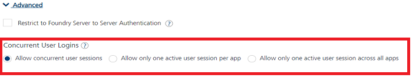
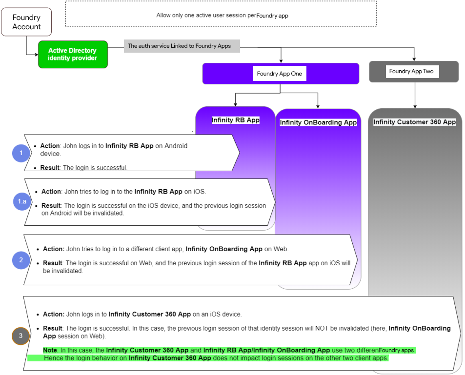
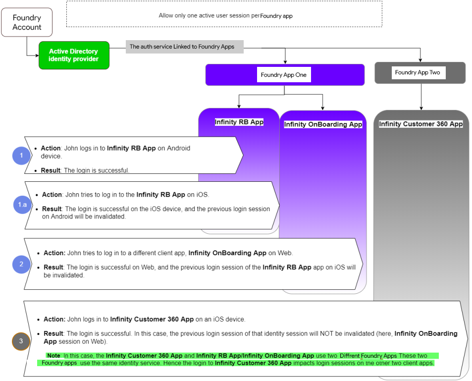

                                

User Guide: [Identity](Identity.md) > Use Case One

Concurrent User Sessions
------------------------

When an enterprise uses an identity service in the Foundry app, it would want to have control over how to handle concurrent logins. For example, a banking enterprise may not want the same user to log in concurrently from different channels of the app.

Volt MX  Foundry provides a series of options to control concurrent user sessions. You can access the **Concurrent User Logins** functionality in the **Advanced** section of an identity service definition page.

**Use Case One**: For a banking enterprise, you (app developer) are building a retail banking app and have linked an identity service (for example, Microsoft Active Directory) with a Foundry app and built client app for different channels (Android, iOS, and Web). If the app user can log in to Android and decides to login into Web app by default user session would be working in both the channels. However, for better security you may want to restrict the user session to be active only in one channel then you can use the options available in the **Concurrent User Logins** section. By using the options in this section you can have the user session in Android invalidated once the user logs into Web session.

**Use Case Two**: For the same banking enterprise in next stage you plan to build a consumer lending application. You create a new Foundry application and link the same identity service used in retail banking app and build the client application for multiple channels. In this case for better security if you want to restrict the app user to login to only one of the user applications (for example, if the user logs into a retail banking application and then wanted to check his loans using consumer lending application you want to invalidate the retail banking application session), you can use the options available in the **Concurrent User Logins** section.

In the **Concurrent User Logins** section, you can select any one of the following three options to configure user sessions:

*   [Allow concurrent user sessions (no restrictions)](#Option1): When this option is selected, an app user with unique credentials is allowed to have multiple apps from different instances.
*   [Allow only one active user session per app](#Option2): Logging into simultaneous instances of **the same app** is not supported. When this option is selected, an app user can log in to only one instance of client apps linked to a specific Foundry app which has the identity service linked. If the same user tries to log in to another instance of the same app, the previous sessions of the user belonging to the same app and identity service combination are invalidated. **[Use Case One](#Usecase1)** can be achieved using this option.  
    User Session uniqueness is determined by a combination of Foundry apps, an identity service, and a user.
    
    > **_Important:_** Apps enabled for SSO will not work if the option is selected, Allow only one active user session per app.
    
*   [Allow only one active user session across all apps](#Option3): Logging to simultaneous instances of **the same app or across apps** is not supported. When this option is selected, a unique app user can log in to only one instance of client apps linked to all Foundry apps using the identity service. If the same user tries to log in to another instance of the same app or different app, the previous sessions of the user are invalidated. **[**Use Case Two**](#Usecase2)** described can be achieved using this option.  
    User Session Uniqueness is a combination of Foundry apps and a user.
    
    > **_Important:_** Apps enabled for SSO will not work if the option is selected, Allow only one active user session across all apps.
    

The following tables provide detailed information on Concurrent User Logins.

<table style="mc-table-style: url('Resources/TableStyles/Basic.css');width: 100%;" class="TableStyle-Basic" cellspacing="0"><colgroup><col class="TableStyle-Basic-Column-Column1" style="width: 487px;"> <col class="TableStyle-Basic-Column-Column1"></colgroup><tbody><tr class="TableStyle-Basic-Body-Body1"><td class="TableStyle-Basic-BodyE-Column1-Body1" style="font-weight: bold;background-color: #afeeee;">Option 1</td><td class="TableStyle-Basic-BodyD-Column1-Body1" style="background-color: #afeeee;"><b>Allow concurrent user sessions (no restrictions).</b> This is the default option.</td></tr><tr class="TableStyle-Basic-Body-Body1"><td class="TableStyle-Basic-BodyA-Column1-Body1" style="font-weight: bold;" colspan="2">&nbsp;<u>For example</u>, An app user using the unique identity service is allowed to log in to multiple apps simultaneously in all instances, such as iOS, Android, and Web browser.</td></tr></tbody></table>

<table style="mc-table-style: url]('Resources/TableStyles/Basic.css');" class="TableStyle-Basic" cellspacing="0"><colgroup><col class="TableStyle-Basic-Column-Column1" style="width: 479px;"> <col class="TableStyle-Basic-Column-Column1" style="width: 500px;"></colgroup><tbody><tr class="TableStyle-Basic-Body-Body1"><td class="TableStyle-Basic-BodyE-Column1-Body1" style="font-weight: bold;background-color: #afeeee;">Option 2</td><td class="TableStyle-Basic-BodyD-Column1-Body1" style="background-color: #afeeee;"><b>Allow only one active user session per app</b></td></tr><tr class="TableStyle-Basic-Body-Body1"><td class="TableStyle-Basic-BodyA-Column1-Body1" style="font-weight: bold;" colspan="2"><u>For example</u>, The <code class="codefirst">Infinity RB</code>, <code class="codefirst">Infinity OnBoarding</code>, and <code class="codefirst">Infinity Customer 360</code> apps are linked to an identity service (for example, Microsoft Active Directory). A user logs in to the <code class="codefirst">Infinity RB</code> app on an Android device successfully. When the user tries to log in to another instance of the <b>same app</b>, the login is successful.<b></b>However, the previous session of that identity service is ended (here, <code class="codefirst">Infinity RB app</code> session on Android).<b> </b><b><i>Note: </i></b><b>In this case, the <code class="codefirst">Infinity Customer 360 App</code> and <code class="codefirst">Infinity RB App/Infinity OnBoarding App </code>use two different Foundry apps. Hence the login behavior on <code class="codefirst">Infinity Customer 360 App</code> does not impact login sessions on the other two client apps.</b> &nbsp; </td></tr></tbody></table>

<table style="mc-table-style: url]('Resources/TableStyles/Basic.css');" class="TableStyle-Basic" cellspacing="0"><colgroup><col class="TableStyle-Basic-Column-Column1" style="width: 496px;"> <col class="TableStyle-Basic-Column-Column1" style="width: 496px;"></colgroup><tbody><tr class="TableStyle-Basic-Body-Body1"><td class="TableStyle-Basic-BodyE-Column1-Body1" style="font-weight: bold;background-color: #afeeee;">Option 3</td><td class="TableStyle-Basic-BodyD-Column1-Body1" style="background-color: #afeeee;"><b>Allow only one active user session across all apps.</b></td></tr><tr class="TableStyle-Basic-Body-Body1"><td class="TableStyle-Basic-BodyA-Column1-Body1" style="font-weight: bold;" colspan="2">&nbsp;<u>For example</u>, The <code class="codefirst">Infinity RB</code>, <code class="codefirst">Infinity OnBoarding</code>, and <code class="codefirst">Infinity Customer 360</code> apps are linked to an identity service (for example, Microsoft Active Directory). A user logs in to the <code class="codefirst">Infinity RB</code> app on an Android device successfully. When the user tries to log in to another instance of the <b>same app or a different app</b>, the login is successful. However, the previous active sessions of the apps are ended (here, <code class="codefirst">Infinity RB</code> app session).<b><i>Note: </i></b>In this case, the <code class="codefirst">Infinity Customer 360 App</code> and <code class="codefirst">Infinity RB App/Infinity OnBoarding App </code>use two different Foundry apps. These two Foundry apps use the same identity service. Hence the login to <code class="codefirst">Infinity Customer 360 App</code> impacts login sessions on the other two client apps.&nbsp;</td></tr></tbody></table>

### How to Configure Concurrent User Active Sessions for Apps

1.  Log in to Volt MX Foundry Console.
2.  In the **Apps**, click **ADD NEW** to create an app.
    
3.  In the **Configure Services** tab > **Identity** service tab > click **CONFIGURE NEW**. 
4.  [In the service designer page of the identity service, configure the required details](ConfigureIdentiryService.md).
5.  Click the **Advanced** section > **Concurrent User Logins** section, select one of the following options:
    *   Allow concurrent user sessions (no restrictions).
    *   Allow only one active user session per app
    *   Allow only one active user session across all apps.
6.  Click **SAVE** to save the service details.
