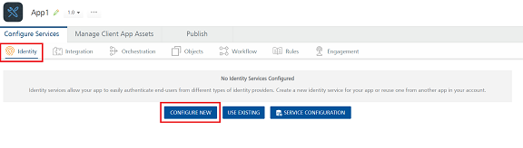
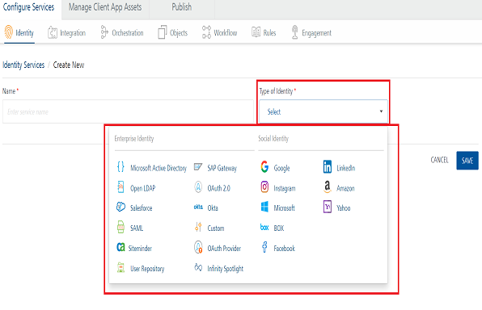

                              

User Guide: [Identity](Identity.md) > Configure identity Services

Configure Identity Service
==========================

1.  After you [create an application](Adding_Applications.md), in the **Configure Services** tab, click the **Identity** service tab, if not selected.
2.  In the **Identity** page, click **Configure New** to create an identity service.
    
    
    
    The identity service designer appears.
    
    
    

1.  Select the Identity provider from the Type of Identity list, and configure the service.
    
    For more information, refer [supported Identity providers](Identity.md#supported-identity-providers).
