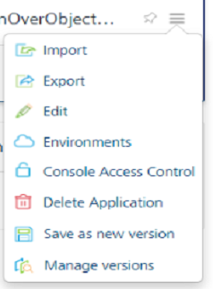
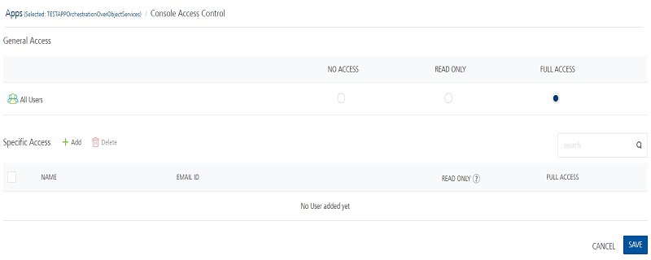
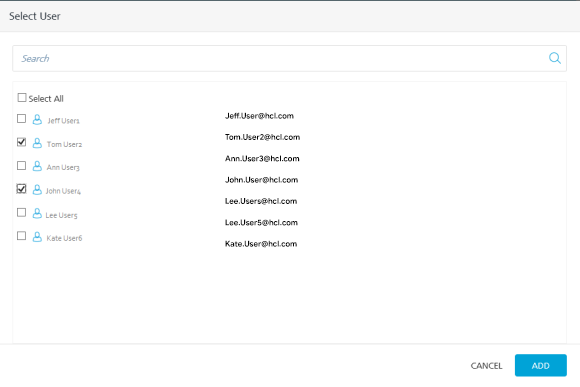
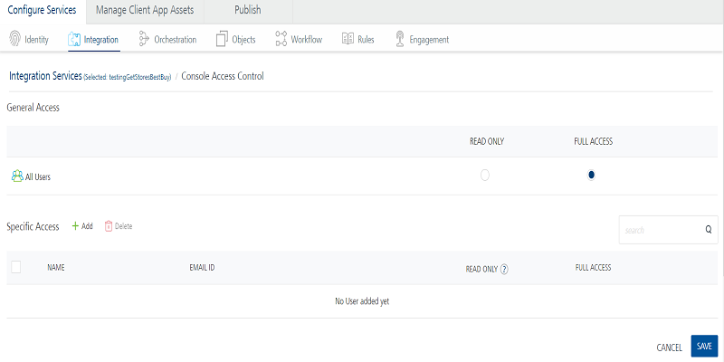

                              

User Guide: Console Access Control

Console Access Control
======================

Volt MX  Foundry supports access controls for Volt MX Foundry applications and services. Volt MX Foundry users that have the permission to create Volt MX Foundry apps and services can control the access to the applications and services.

For example, an owner invites a new user to the Volt MX Foundry account. The new user can create a Volt MX Foundry application and services, and can then control the access by other users to the application. The role of a user determines the access the user has to applications and services, the access control the user can set, and the access control that other users can set for that user. For example, a user that has a member role can create an app and then give full access to the app to specific member users, while setting read-only access for all other member users. Users that have an owner or admin role always have full access to all Volt MX Foundry apps and services.

Use Case
--------

The following describes a use case for access control of Volt MX Foundry applications and services. The scenarios in this use case help you understand how users can control access to applications and services. This use case also shows how the role of a user determines the level of access the user can control, and the user's level of access that other users can control.

Account Owner

1.  A user creates a new Volt MX Foundry account. As the user that created the account, he is the first user and is assigned the Owner role. He is referred to as AccountOwner.

An owner of a Volt MX Foundry account has full access rights to all Volt MX Foundry apps that are created on the account. The owner also has permissions to perform create, retrieve, update, and delete (CRUD) operations in all the services in all the apps.

3.  The AccountOwner invites AppUser1 and AppUser2 to the Volt MX Foundry account as members.

By default, AppUser1 and AppUser2 have the rights to create new apps and services and have full access to existing apps and services.

Create Applications

1.  AppUser1 creates App A that has a Weather Service and a News Service
2.  AppUser2 creates App B that has a GeoLocation Service and ATM Locator Service.

By default, the applications and services that users create have global read-write access for all users of the account.

Control Access to Applications

1.  AppUser2 decides that he needs to protect his App B.
2.  From the apps page, AppUser2 selects Console Access Control from the App menu.
3.  AppUser2 removes general access for all users and adds himself as a specific access user.

At this point, AppUser3 logs in and can no longer see App A in the console. If AppUser2 had set read-only for All Users, then AppUser3 could see the application, but not modify its configuration (for example, add or remove services).

Control Access to Services

1.  AppUser2 decides that he needs to control access to a service in his App B from other users.

Identity, Integration and Orchestration services are shared components. AppUser3 can still go and modify any of those services which would affect the functionality of App A. If AppUser2 wants to completely lock down App A, he would also have to change the access control of all the services associated with the app.

3.  AppUser2 opens App A and selects Console Access Control from the Settings menu for a service.
4.  AppUser2 adds himself as a specific access user to the service just as he did for App B.
5.  AppUser2 downgrades general access for all users to Read Only.

AppUser2 cannot completely remove access for all users to the service. He can only downgrade all users from Full Access to Read Only. This is because other users have access to an app, but they do not have access to all the associated services.

Full Access to App and Full Access to Service

In the case where a user has full access to the app and full access to the service:

*   The user can add and create new services, unlink the services, switch between versions of a service, delete a version of a service, and save a service as a new version.
*   The user can switch between the versions of a service, but he cannot save the service or unlink the service regardless of whether he has read-only or full access to the service.

Full Access to App and Read Only Access to Service

In the case where a user has full access to the app and read only access to the service:

*   The user can use the Use Existing option to add a service. If the user has full access rights on the service he adds, he can modify the service.
*   The user can clone a read-only service and gain full access to the new service.
*   The user can configure a new service and unlink a read-only service.
*   The user cannot edit a read-only service in the app, but he can save it (clone it) as a new service.
*   The user can change the version of the read-only service within the app.
*   The user can switch between the versions of the service within the app, as he is configuring the app and not the service. He can also unlink the same service. However he cannot create a new version of the service or delete a version because he does not have full access to the service.

Read Only Access to App and Full Access to Service

In the case where a user has read-only access to the app and full access to the service:

*   The user cannot modify the configuration of the app, and the Use Existing and Clone services are disabled.
*   The user cannot unlink a service or configure new service to the app.
*   The user can modify the service, but cannot save it as a new service within the app, as he does not have full access rights to modify the app.
*   The user cannot change the version of the service within the app.

Read Only Access to App and Read Only Access to Service

In the case where a user has read-only access to both the app and service:

*   The user cannot modify the configuration of the app, and the Use Existing and Clone services are disabled.
*   The user cannot unlink a service or configure new service to the app.
*   The user cannot edit the service and save it as a new service from within the app.

How to Use Access Control
-------------------------

You can configure access control for Volt MX Foundry applications and services. By default, all users have full access rights to create and access apps and services. Use the Apps Console Access Control page to control access to an applications. Use the Services Console Access Control page to control access to a service.

### How to Use Access Control for Applications

You can access the Apps Console Access Control page from either the Applications page or from within in an app.

To set access control from the Applications page, do the following:

1.  From Volt MX Foundry Console, click **Apps** to display the Applications page.
2.  In the **Applications** page, hover your cursor over the **App menu** button of an app.

4.  Click **Console Access Control**.

The Apps Console Access Control page appears.

To set access control from an app, do the following:

1.  From Volt MX Foundry Console, click **Apps** to display the Applications page.
2.  In the **Applications** page, select an app.
3.  Click the Console Access Control button .

The Apps Console Access Control page appears.

To set general access to an app for all users, do the following:

*   In the **General Access** area, for **All Users**, select an access control option.

By default, all users have full access rights to create and access apps. If you want to block access to any of the other members on the account, select No Access. Users with no access permissions cannot access the app and the app does appear on the Applications page.

Before you select No Access on the General Access level, add yourself or another user on the Specific Access level.

To set specific access to users for an app, do the following:

1.  In the **Specific Access** area, click **Add**.

The Select User windows appears. All the owners and admins might not be shown in the list of Specific access users.

3.  Select the users that you want to add to the Specific Access list.

The Select User window appears.

6.  Click **Add**.

The users that you selected are added to the Specific Access list.

8.  Select the access control option.

Note that the Read Only option for a user is disabled if General Access permission is set to Full Access. You cannot set access control for Specific Access at a setting lower than General Access Setting.

10.  Click **Save**.

If a member user gives a second member user Full Access permission for an app, both member users have the same permissions for the app.

To remove specific access to users for an app, do the following:

1.  In Specific Access, select the users that you want to remove.
2.  Click the **Delete** button.

You can hover your cursor over a user, and then click the Delete icon.

What Full Access Permission for an App Means

*   A user with full access can link or unlink any services to the app. The user can publish the app if the user has permissions to publish for that environment.
*   A user with full access has permission to configure and change the control access list.

What Read Only Permission for an App Means

*   A user with read-only access cannot link or unlink any services to the app. The user can publish the app if the user has permissions to publish for that environment.
    
*   A user with read-only access cannot configure or change the control access list for the app.

### How to Use Access Control for Services

You access the Services Console Access Control page from within an application or from API Management.

By default, all the services created have Full Access for all users. You can control access to identity services, integration services, orchestration services, and object services by setting the access control for the service. For example, UserA decides to give read-only access to all users for an integration service (General Access), and give full access to the service to UserB (Specific Access).

To set access control for a service from an app, do the following:

1.  From Volt MX Foundry Console, click **Apps** to display the Applications page.
2.  In the **Applications** page, open an app.
3.  In **Configure Services** tab, click the Identity, Integration, Orchestration, or Objects service tab.
4.  Hover your cursor over the required service, click the **More Options** button, and then click **Console Access Control**.

The Services Console Access Control page appears.

To set access control for a service from API Management, do the following:

1.  From Volt MX Foundry Console, click **API Management**.
2.  Under **APIs** tab, click the Identity, Integration or Orchestration service tab.
3.  Hover your cursor over the required service, click the **More Options** button, and then click **Console Access Control**.

The Services Console Access Control page appears.

To set general access to a service for all users, do the following:

*   In the **General Access** area, for **All Users**, select an access control option.

By default, all users have full access rights to create and access services. Before setting the general access to read-only for all users, give specific access to at least one user. For example, UserA adds UserB to the Specific Access user list and gives him full access. Then UserA sets Read Only for General Access. UserB now has full access to this weather services but another member user, User3, has read-only access.

To give specific access to users for an app, do the following:

1.  In the **Specific Access** area, click **Add**.

The Select User windows appears. All the owners and admins might not be shown in the list of Specific access users.

3.  Select the users that you want to add to the Specific Access list.

The Select User window appears.

5.  Click **Add**.

The users that you selected are added to the Specific Access list.

7.  Select the access control option.

Note that the Read Only option for a user is disabled if General Access permission is set to Full Access. You cannot set access control for Specific Access at a setting lower than General Access Setting.

9.  Click **Save**.
