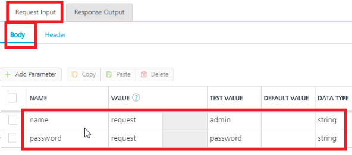
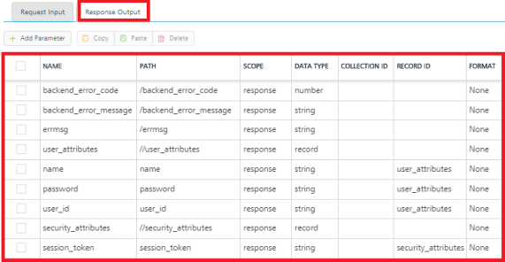

                              

User Guide: [Identity](Identity.md) > [Configure the Identity Service](ConfigureIdentiryService.md) > [VoltMX Custom Identity Service](Identity8_VoltMX_Custom.md#custom-identity-service) > How to Configure a Custom Identity Service by using an Integration Service

### How to Configure a Custom Identity Service by using an Integration service

A custom identity service is configured by pointing to an endpoint, which follows a custom identity protocol/contract.

An external back-end server can be used to configure a custom identity service, if it implements the identity protocol/contract. Otherwise you can make use of Volt MX Foundry Integration Service, which internally points to the authentication/login API of the back-end server.

For example,

*   If a back-end server **does not support** login and logout APIs, you can configure a custom auth service by pointing to an end-point.  
    _For example_, A Volt MX Foundry user creates an integration service that has a login and logout operations. Based on the input and output parameters configuration, Volt MX Foundry fetches a response for a user for login and logout operations. To get custom back-end server's error codes and error messages in the login/logout response, a developer must map error codes and messages with the parameters `backend_error_code` and `backend_error_message` in the Integration service **Response Output**. The following steps explain how to configure a custom auth service by pointing to an end-point.

To create a custom auth service by pointing to an end-point that, follow these steps:

1.  Create a **JSON** [integration **service**](#IntegrationSDpage) with the custom back-end server's base URL.
2.  Create an operation by name `login`.
    1.  In the **Target URL** field of the operation, enter the `login/authentication` API of the custom back-end server.
    2.  In the **Operation Security Level** list, select one of the **Authenticated App User** option. The **Authenticated App User** option restricts the access to clients who have successfully authenticated using an Identity Service associated with the app.
    3.  In **Request Input**, configure the login parameters for **Body**, **Header**, and **Request Template** (for example, name and password.)
        
        
        
    4.  In the **Response Output**, configure the following parameters.
        
        
        
3.  Similarly create an operation by name `logout` as in the previous step.
4.  Publish the app.
5.  Copy the `service URL` from the **[App Service Document](Publish_LifeCycle.md#app-service-document-object-services-metadata-and-sync-client-code)** in the **Publish > Environment** page.
```
 "services_meta": {
      "custom": {
       "type": "integsvc",
       "version": "1.0",
       "url": "https://test11.testtest.net:11111/services/custom"
      }
     } 
```
6.  Now, create a custom identity service.
7.  In the **Custom Identity Service Endpoint**, paste the `service URL` that you copied from the **App Service Document**.
    
    You can now test the login from your authentication server of the custom back-end.
