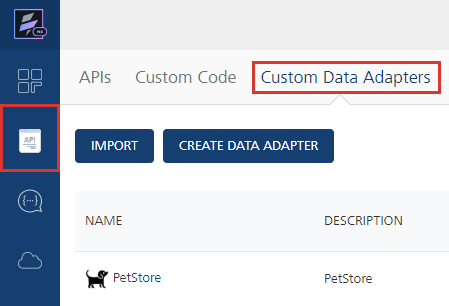
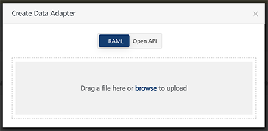
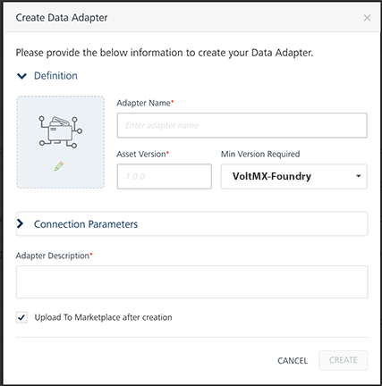
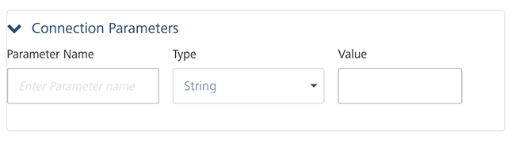

                              


Custom Data Adapters on Volt MX Foundry
======================================

Volt MX  Foundry Console supports the creation of custom data adapters. The custom data adapters uploaded into the Volt MX Foundry Console in API Management are supported in Integration and Object Services. An interface to upload, download, update, and delete data adapters is provided in the Volt MX Foundry Console. The data adapters are uploaded in a ZIP file format and stored in a workspace. Once the data adapters are uploaded successfully, you can create an integration or object service using the adapters .

Custom Data Adapters act as reusable services with a defined set of operations. These services work similar to any other service in the run-time environment. 

When to use Custom Data Adapters
--------------------------------

Consider the following scenarios in which you can use Custom Data Adapters.

**Scenario: Adding an existing service definition.custom**

Consider a scenario where you want to have a reusable service definition for your Volt MX Foundry applications, and you already have this definition available in a format compatible with Volt MX Foundry.

Instead of creating an API on Volt MX Foundry from a scratch, you can directly import your existing service definitions onto Volt MX Foundry as Custom Data Adapters. You can then use these Custom Data Adapters to create Integration or Object services.

**Scenario: Creating a service by using a code written in RAML or Swagger**

Consider a scenario where you have your API definitions in either RAML or Swagger, and this code exposes all the APIs that you want to use for your service.

Instead of creating an API with the service type as RAML or Swagger, you can directly upload the file to Volt MX Foundry and it will create a Custom Data Adapter for you. You can also add metadata for your service such as the Name, Version, and Logo.

Why use Custom Data Adapters?
-----------------------------

Custom Data Adapters are readily available as connectors. Moreover, you can add any number of services while creating a Custom Data Adapter.

You can also create a Custom Data Adapter directly from your backend API definitions if they are compatible with Volt MX Foundry. The compatible definitions can be in an XML file that you can structure according to the [Custom Data Adapter Zip Structure](#custom-data-adapter-structure).

You can also **upload** your Custom Data Adapters to the [VoltMX Marketplace](https://marketplace.demo-hclvoltmx.com/items/news-and-weather?search=Google%20News), so that other users will be able to use it.

Getting Started
---------------

You can configure Custom Data Adapters from the [API Management](../../../Foundry/voltmx_foundry_user_guide/Content/API_Management.md) section, under the **Custom Data Adapters** tab.



There are two types of Custom Data Adapters you can add to the Volt MX Foundry console.

*   **RAML or Swagger Based** - You can use this type of Custom Data Adapter if your backend can expose its API definitions to Volt MX Foundry. These API definitions should be in RAML or in Swagger. You can add these Custom Data Adapters by clicking on the **CREATE CUSTOM DATA ADAPTER** button.
*   **VoltMX Foundry App Based** - You can use this type of Custom Data Adapter if you have already configured any Volt MX Foundry services connected to your backend. These Custom Data Adapters should be in a [structured zip archive](#custom-data-adapter-structure). You can add these Custom Data Adapters by clicking on the **IMPORT** button.

Creating Custom Data Adapters
-----------------------------

You can create Custom Data Adapters on Volt MX Foundry by uploading a RAML file or Swagger file. The file should contain all the API definitions that you want to expose to Volt MX Foundry.

To create a Custom Data Adapter, follow these steps:

1.  Navigate to the **Custom Data Adapters** tab in your **API Management** section.
2.  Click on the **CREATE CUSTOM DATA ADAPTER** button. The Create Data Adapter dialog appears.
3.  Select the type of file you want to upload to Volt MX Foundry.  
    
    *   Select **RAML** if you want to upload a RAML file.
    *   Select **Open API** if you want to upload a Swagger file.
4.  **Drag and Drop** a file into the upload window.  
    Alternatively, you can **browse** for a file on your system.
5.  Enter the details for the Custom Data Adapter such as Adapter Name, Asset Version, and Description.  
    
    
    *   **Adapter Name**_\[Mandatory\]_ - Name that Volt MX Foundry displays on the console.
    *   **Asset Version**_\[Mandatory\]_ - Version number that Volt MX Foundry displays on the console. The version number follows the **X.X.XX** format.
    *   **Min Version Required** - Minimum version of Volt MX Foundry that can run the Custom Data Adapter.
    *   **Image** - Image that Volt MX Foundry displays for the Custom Data Adapter's icon.
    *   **Adapter Description**_\[Mandatory\]_ - Description that Volt MX Foundry displays on the console.
    *   **Upload to Marketplace after creation** - Select this check box if you want to upload your Custom Data Adapter to the Volt MX Marketplace.
    
    > **_Note:_** **Connection Parameters** - You can configure dynamic connection parameters that you want to pass to the Custom Data Adapter.  
    These parameters show up when you select the Custom Data Adapter as a service type for your Integration service.  
    
    
6.  Click **CREATE**.

### API Based Custom Data Adapter Example

Let us take a Swagger based example for a Custom Data Adapter that connects to the [Swagger PetStore](http://petstore.swagger.io/) from Volt MX Foundry.

You can use a [sample Swagger JSON](https://github.com/HCL-TECH-SOFTWARE/volt-mx-docs/raw/master/voltmxlibrary/foundry/zip/user_guide/PetStoreJSON.zip) for this example.

Follow the given steps to add the Swagger PetStore Custom Data Adapter.

1.  Configure your Custom Data Adapter based on the steps given in the [Creating a Custom Data Adapter](#creating-custom-data-adapters) section. Let us name the adapter **PetStoreExample**.  
    
2.  [Create an Integration Service](../../../Foundry/voltmx_foundry_user_guide/Content/Services.md) in your Volt MX Foundry application. Select your Custom Data Adapter in the **Service Type** list and click **Save**.  
    As we named our adapter **PetStoreExample**, click on PetStoreExample to use it in your service.  
    
3.  Click on **ADD OPERATION**.  
    

> **_Note:_** You can configure the **Authentication** details if you want to enable [Enhanced Identity Filters](../../../Foundry/voltmx_foundry_user_guide/Content/Identity_Filters_Integration.md) for your Service.  
You can also configure the features in the **Advanced** tab if you want to add a custom code or enable throttling for your Service. For more information, you can refer to the [Integration](../../../Foundry/voltmx_foundry_user_guide/Content/Services.md) section of the Volt MX Foundry User Guide.

5.  Add Operations based on your requirements.  
    

You can then make service calls to the Swagger PetStore from Volt MX Foundry.


Importing A Custom Data Adapter
-------------------------------

You can manually create a Custom Data Adapter with all the respective metadata on your system and import it into Volt MX Foundry. This Custom Data Adapter should be a **zip** file with all the service definitions in **XML** files and all the properties in **JSON** files. You can find more information in the [Custom Data Adapter Zip Structure](#custom-data-adapter-structure) section.

Follow the given steps to import an existing Custom Data Adapter to Volt MX Foundry.

1.  Navigate to the **Custom Data Adapters** tab in your **API Management** section.
2.  Click on the **IMPORT** button.
3.  **Drag and Drop** a zip file into the upload window.  
    Alternatively, you can **browse** for a file on your system.
    
    > **_Note:_** You can also import Custom Data Adapters from the [VoltMX Marketplace](https://marketplace.demo-hclvoltmx.com) by clicking the **IMPORT FROM VoltMX MARKETPLACE** button.
    
4.  Click **IMPORT** on the next window. This window also shows the metadata that you configured for your Custom Data Adapter.  
    

You can then use this Custom Data Adapter to create services and operations in your Volt MX Foundry Apps.

Custom Data Adapter Structure
-----------------------------

The structure of your Custom Data Adapter depends on whether it is **RAML/Swagger** based, or **Foundry App** based.

### RAML or Swagger Based Structure

If your Custom Data Adapter is based on RAML or Swagger, your zip file should contain the respective file at the root location. Let us take the same example of the [Swagger PetStore Data Adapter](#api-based-custom-data-adapter-example).

You can use a [sample PetStore.zip](https://github.com/HCL-TECH-SOFTWARE/volt-mx-docs/raw/master/voltmxlibrary/foundry/zip/user_guide/PetStoreJSON.zip) file for this example.

Ensure that the root location of your zip contains the following files.

*   **properties.json** - This JSON file should contain the metadata about the Custom Data Adapter.  
    For Example:  
    
    
<details close markdown="block"><summary>Click to view sample code</summary>
    
```
 
    /* This file contains metadata about the Swagger PetStore Data Adapter */
    {
    	"createdBy" : "VoltMX",
    	"propertiesVersion": "1.0",
    	"itemName": "PetStore",
    	"displayName": "PetStore",
    	"description": "PetStore",
    	"icon": "petstore.png",
    	"assetVersion": "1.0",
    	"createdMFVersion": "7.3",
    	"adapterType":"swagger",
    
    /* You can also configure dynamic connection properties for your data adapter */ 
    	"connectionManager":
    	{
    	"connectionProperties":
    	[
    	{
    	"displayName": "Parameter One",
    	"description": "This is the first connection parameter",
    	"name": "ParamOne",
    	"order": 0
    	},
    	{
    	"displayName": "Parameter Two",
    	"description": "This is the second connection parameter",
    	"name": "ParamTwo",
    	"order": 0
    	}
    	]
    }
    }
```
    
> **_Important:_** The value for the **adapterType** key depends on the type of file you use.
    
*   **raml** - If the adapter is based on RAML.
*   **swagger** - If the adapter is based on Swagger.
   </details> 

*   **Image** _\[Optional\]_ - You can include an image to use as the icon for the Custom Data Adapter.
    
> **_Note:_** You need to insert the name of the image under the **icon** key of the **properties.json** file to ensure that Volt MX Foundry uses the image as the logo.
    
*   **RAML** or **Swagger** File - This file should contain all your API definitions.
    

After you create all these files, your folder structure should look similar to the given image.  


You can then compress these files into a zip file and [import](#importing-a-custom-data-adapter) it into Volt MX Foundry.

### Volt MX Foundry App Based Structure

If your Custom Data Adapter is based on Service Definitions from Volt MX Foundry, you need to create folders for each service that you want to include. Let us take a sample **Google News Custom Data Adapter**.

You can use a [sample Googlenews.zip](https://marketplace.demo-hclvoltmx.com/items/news-and-weather?search=Google%20News) file for this example.

The root location of the zip files should contain the following files.

*   **properties.json** - This JSON file should contain the metadata about the Custom Data Adapter.  
    For Example:
    
    
<details close markdown="block"><summary>Click to view sample code</summary>
    
```
 
    /* This file contains metadata about the Google News Data Adapter */
    {
    	"createdBy" : "VoltMX",
    	"propertiesVersion": "1.0",
    	"itemName": "GoogleNews",
    	"displayName": "GoogleNews",
    	"description": "GoogleNews",
    	"icon": "icon.png",
    	"assetVersion": "1.0",
    	"createdMFVersion": "7.3",
    	"adapterType":"mf_app",
    	
    /* You can also configure dynamic connection properties for your data adapter */
    	"connectionManager":
    	{
    	"connectionProperties":
    	[
    	{
    		"displayName": "Parameter One",
    		"description": "This is the first connection parameter",
    		"name": "ParamOne",
    		"order": 0
    	},
    	{
    		"displayName": "Parameter Two",
    		"description": "This is the second connection parameter",
    		"name": "ParamTwo",
    		"order": 0
    	}
    	]
    }
    				}
```
    
> **_Important:_** The value for the **adapterType** key should be **mf\_app**.

</details>
    
*   **Image** _\[Optional\]_ - You can include an image to use as the icon for the Custom Data Adapter.
    
    > **_Note:_** You need to insert the name of the image under the **icon** key of the **properties.json** file to ensure that Volt MX Foundry uses the image as the logo.
    
*   **Folders** - You need to configure your services into sub-folders in your zip file's root location.
    
    
<details close markdown="block"><summary>Click to view folder structure</summary>
    
The root location of your zip file should be similar to the given image.


    
*   Ensure that the name of the first level folder matches with
    your service name.  
    In the given example, **NewsObject** is the name of the [Object Service](../../../Foundry/voltmx_foundry_user_guide/Content/Objectservices.md), and **newsService** is the name of the [Integration Service](../../../Foundry/voltmx_foundry_user_guide/Content/Services.md).
*   The second level folder's name should be **services**. The folder should contain your service definition file.
    
  
    
</details>
Once you've configured all the files and folders, you can compress it into a zip file and [import](#importing-a-custom-data-adapter) it into Volt MX Foundry.

Custom Data Adapter using Java Integration Services
----------------------------------------------------

Java services based custom data adapter is similar to foundry app based custom data adapter with a difference of 
Java service library which will get added to lib folder 

<b>Example</b>  <br>Java service custom data adapter folder structure<br>

Custom data adapter based on java services available here <code><a href="https://github.com/HCL-TECH-SOFTWARE/volt-mx-docs/raw/master/voltmxlibrary/foundry/zip/user_guide/customAdapter.zip">customAdapter.zip</a></code>
<blockquote><em><b>Note: </b></em>Multiple jars are not supported in lib folder of custom Data Adapter</blockquote>

How to import java services custom based data adapter <code><a href="https://github.com/HCL-TECH-SOFTWARE/volt-mx-docs/raw/master/voltmxlibrary/foundry/zip/user_guide/customAdapter.zip">customAdapter.zip</a></code> 

<!-- <blockquote><em><b>Known Issues: </b></em>
	<ul>
		<li>In custom code section, if we have the jar file with same name as the jar file included in custom data adapter zip file, then we need to delete the existing jar (from custom code section) before importing <code>customAdapter.zip</code> file.</li>
		<li>At present, multiple jars are not supported in lib folder of <code>customAdapter.zip</code>.</li>
	</ul>
</blockquote> -->
<ol>
<li>
In <b>Custom Data Adapter</b> section, click on Import and Browse for the <code><a href="https://github.com/HCL-TECH-SOFTWARE/volt-mx-docs/raw/master/voltmxlibrary/foundry/zip/user_guide/customAdapter.zip">customAdapter.zip</a></code> file. This <code><a href="https://github.com/HCL-TECH-SOFTWARE/volt-mx-docs/raw/master/voltmxlibrary/foundry/zip/user_guide/customAdapter.zip">customAdapter.zip</a></code> file which you are trying to import should have the lib folder and the jar file inside that lib folder. 
<blockquote><em><b>Note: </b></em>If you are including a jar file under lib folder of custom data adapter, and if it's already present in custom code section then you need to delete existing jar file from custom code section and then import custom data adapter with that jar file, otherwise it will create duplicate instance of jar and will cause ambiguity.</blockquote>

</li>
<li>
Notice the <b>Custom Code</b> section that is uploaded with the new jar file.

<blockquote><em><b>Note: </b></em>Here the lib folder is processed, jar file is extracted and it is uploaded in Custom Code section.</blockquote>
</li>
<li>Create a new integration service using this custom data adapter. Save this integration services. 

</li>
<li>Click <b>Configure New</b>, select <b>Service Type</b> value with that custom data adapter Save the integration service. 

</li>
<li>Select the imported jar file and attach it as below: 


</li>
<li>Click <b>Save and Add Operation</b> > select the Services as below > and click on <b>Add Operation</b>. 

</li>
<li>Select the <b>Configured Operations</b>.

</li>
<li>Click on <b>Save and Fetch Response</b>.

</li>
<li>Note the Output result.
<!--  -->
<pre><code style="display:block;background-color:#eee;">{
	"opstatus": 0;
	"httpStatusCode": "0"
}</code></pre>
</li>
</ol>

Managing Custom Data Adapters
-----------------------------

You can manage your Custom Data Adapters from the **API Management** section under the **Custom Data Adapters** tab.

The Custom Data Adapters page on the console has a list of all the existing Custom Data Adapters and their metadata. You can view all the apps associated with any of the Custom Data Adapters. You can also view the **Modified On** and **Modified By** details on this page.


You have some additional options available under the **ellipsis** menu, that is the **three dots** menu on the right side, for every Custom Data Adapter.


*   **Upload to Marketplace** - Publish the Custom Data Adapter to the [VoltMX Marketplace](https://marketplace.hclvoltmx.com/).
*   **Update** - Update the existing Custom Data Adapter. Clicking on this option will open a window to [import](#importing-a-custom-data-adapter) a Custom Data Adapter.
*   **Download** - Download the Custom Data Adapter as a **zip** file. The downloaded archive follows the structure mentioned in the [Custom Data Adapter Zip Structure](#custom-data-adapter-structure) section of this document.
*   **Delete** - Delete the Custom Data Adapter.


