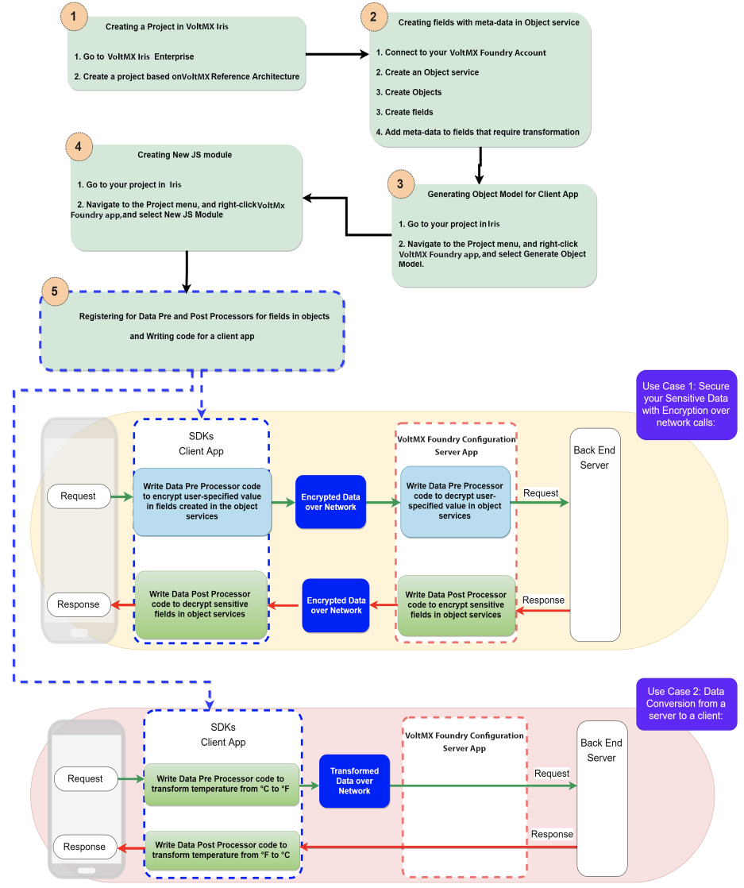
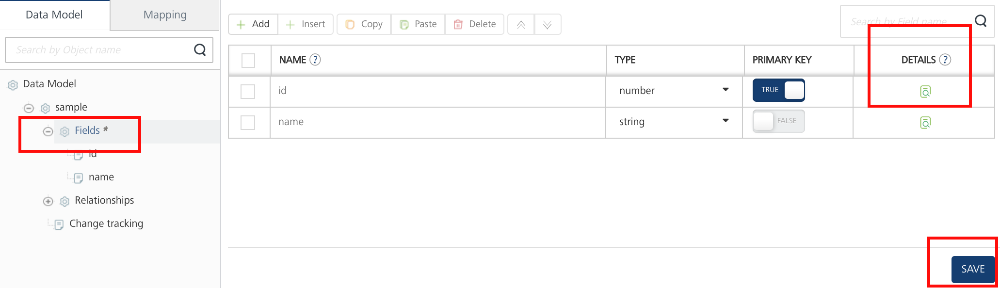
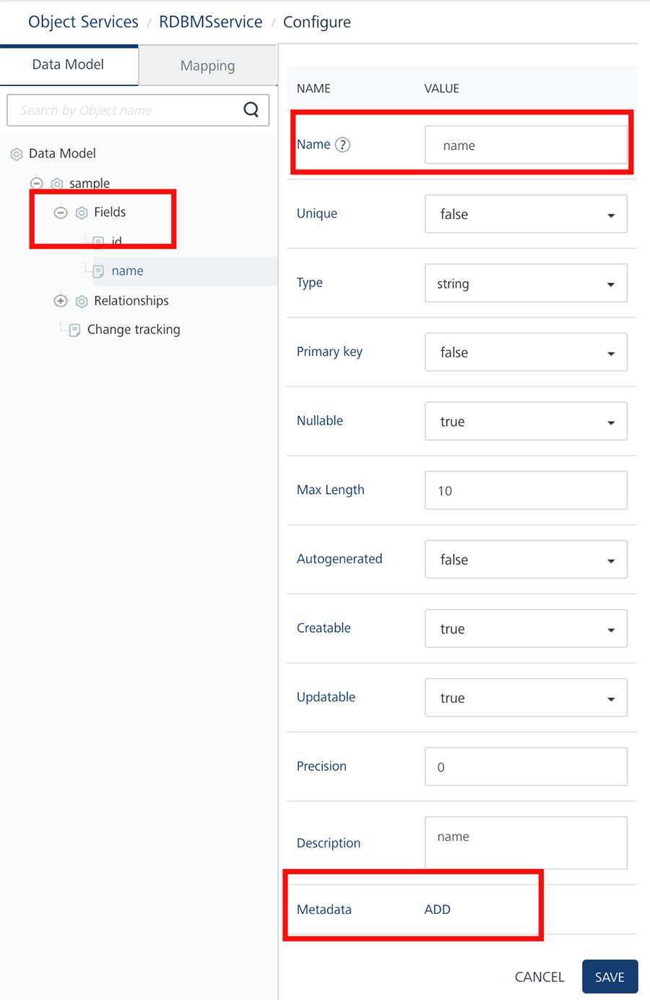
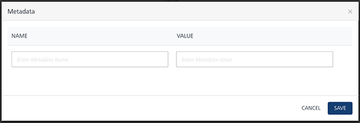
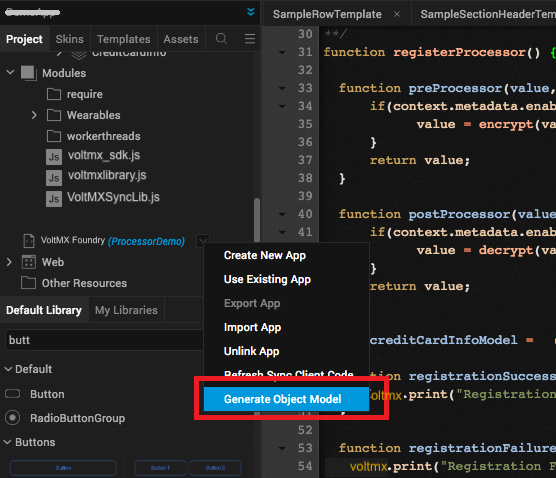
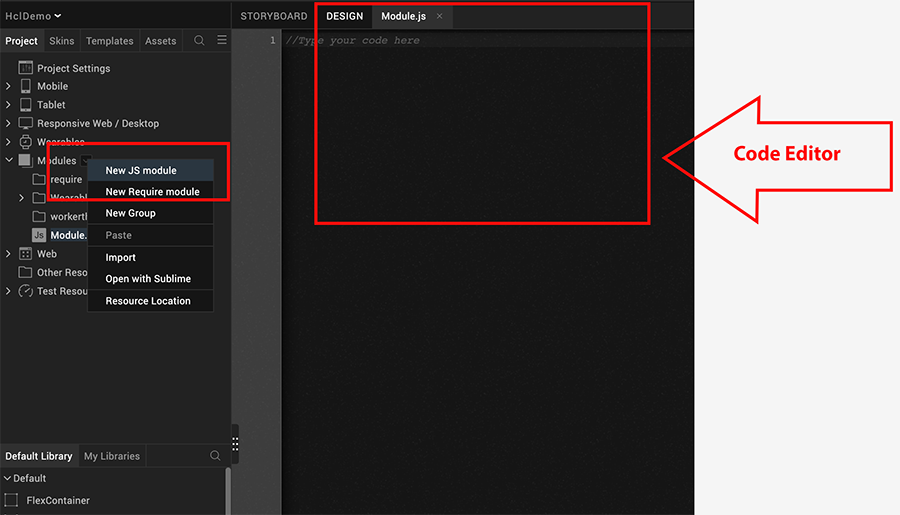

                               

User Guide: [Object Services](Objectservices.md) > Use Cases

Object Metadata for Controlling Client-side Logic
-------------------------------------------------

Object services from Volt MX V8 SP4 allow app developers to define metadata per field of the object in the Foundry server. This metadata of the Object allows app developers to control client-side logic by using the **Data Pre and Post Processors for Models** functionality which helps to access the metadata dynamically at runtime and has custom JS code written to transform the data based on the metadata. This allows app developers to modify business logic at the client app and control which fields get transformed and how.

The feature is available with object models generated from the Object services in Volt MX Iris and works for Volt MX Reference Architecture as well as Volt MX free form project types.

You can use **data pre and post processors functionality** on client apps as standalone or in conjunction with **pre and post processors on Object services** on server apps to achieve a variety of business requirements. For example, you can write your custom logic for fields in models to transform data in client before sending to back end and vice versa such as data encryption, decryption, currency or temperature conversion, prepend or append characters such as salutations (Mr. or Dr.) or currency symbol ($ or €) and so on.

### Use Cases

*   **Use Case 1: Secure your Sensitive Data with Encryption over network calls:**
    
    If you wish to encrypt sensitive fields in a transformation such as a credit card number the user specifics the card number in a client app, while non-sensitive fields like amount and vendor can go unencrypted. The user-specified value for the credit card number in the request operation gets encrypted based on the metadata specified on server and logic defined in the **Data Pre-processor** on a client in the network call. In this case, the encrypted data from a client request can be stored in databases, in Cloud, or computer hard drives.
    
    *   To decrypt the user value to the original state before sending it to the back end, you must specify custom logic in **Data Pre-processor** in the request operation of the service in Volt MX Foundry.
*   **Use Case 2: Data Conversion from a server to a client:**
    
    You can convert a temperature value in Celsius (°C) from a server and display it in Fahrenheit (°F) degrees to a client. That is, Server data is always in Celsius and client display is always in Fahrenheit. This can be extended to ensure same front-end app can be made to display temperature in Celsius or Fahrenheit depending on country. In this case, you need to specify custom logic in **Data Post-processor** in the response operation of the service in Client app for display in Fahrenheit, and **Data Pre-Processor** in client for any data modified from client app to reach server as Celsius for an upload request.
    

### Pre-requisites

*   Volt MX Iris Enterprise V8 SP4 or higher
*   Foundry application is based on Object services (data models)

### Steps to enable Client-side Logic

1.  Define metadata for fields in Objects for which transformation is required.
2.  Generate models on the client app through Iris for the object services.
3.  Register Pre and Post processors for the models that require transformation.
4.  Write custom logic to process/transform data in the pre/post processors for the models.

### Workflow of Data Pre and Post Processors on Client for Object Services



API signatures for Data Pre and Post Processors for Client Objects
------------------------------------------------------------------

### For Iris (JavaScript)

#### Registering Processors

Registering Data **Pre and Post** Processors for Models in Object Services

```
 <model>.registerProcessors
```

Models expose the `registerProcessors` API which allows registration of processors for the model object. This step should be performed at least once for each model.

#### **Signature**

```
 <model>.registerProcessors(options, successCallback, failureCallback);
```

#### **Parameters**

  
| Parameter | Type | Description | Required |
| --- | --- | --- | --- |
| successCallback | Function | The function is invoked on successful registration. | Yes |
| failureCallback | Function | The function is invoked on failure to register. | Yes |
| options | JSON | See "Register Processor Options" for supported options. | Yes |

#### Register Processor Options

  
| Parameter | Type | Description | Required |
| --- | --- | --- | --- |
| preProcessor | Function | A callback function that is invoked before saving field details into the model instance. See "Pre/Post Processor Definition" syntax and details. | No |
| postProcessor | Function | A callback function that is invoked before returning a value from the model instance. See "Pre/Post Processor Definition" syntax and details. | No |
| getFromServer | Boolean | If the **getFromServer** is set to true, refreshes object's metadata from Foundry server. By default, it is set to false and object properties meta-data is fetched from the client device cache. | No |

#### Return Type

void

#### Pre/Post Processor Definition

This section details the definition of Data pre and post-processor callbacks.

Processors should be valid function reference. A processor should accept two arguments - **value** and **context**.

*   **value**: value of the model object property to be transformed. Value is of type Object.
*   **context**: model object property specific context. context is a valid JSON. A context can contain the following properties:
    
    > **_Note:_** Each of the registered pre/post data processors callback function must return the transformed value, failure to do so results in undefined behavior.
    
    | Properties | Description |
    | --- | --- |
    | datatype | string type, denotes the datatype of object property as defined in Object service in Volt MX Foundry |
    | object | string type, contains the name of the model object |
    | objectService | string type, contains the name of the object service which contains above object |
    | field | string type. contains the name of the object property/field |
    | metadata | JSON type, field associated metadata as defined in Volt MX Foundry object service app model. |
    
    > **_Note:_** Registered pre/post processor callbacks are not invoked while updating or reading those fields for which metadata is not defined in an object service of an app in Volt MX Foundry.
    
    > **_Note:_** A single callback function can be used as both pre and post processor callbacks.
    

### Creating an Object service with meta-data and enabling Data Pre and Post processors on a Client app

You need to have an Object service with required fields enabled with meta-data in Volt MX Foundry. The following procedure explains you how to configure **meta-data** for fields in object services and enable **Data pre and post processors** based on meta-data for a client app.

1.  Go to Volt MX Iris Enterprise.
2.  Create a project based on Volt MX Architecture Reference.
    *   For example, from the **Project** menu, navigate to **New Project** \> **Create Custom App**.

1.  Connect to your Volt MX Foundry account.
2.  Configure an object and add fields:
    1.  Create an [object service](ObjectsServices/Objectservices_Stage1.md).
    2.  Create an object.
    3.  Navigate to the object > **Fields**.
    4.  Click **Add** to create a field. Specify the field name and data type and primary key, as required. Add fields in the object.
    5.  Click **SAVE** to save the field.
        
        > **_Important:_** The **View Details** button is active only after you save the field details.
        
    6.  Click the **View Details** button under the **DETAILS** column. The field details page displays the additional columns including _unique, nullable, _max length_, autogenerated, creatable, updatable, precision, description_, and _metadata_.  
        
    7.  In the **Metadata** column, click **ADD**.
        
        
        
        The Metadata dialog appears.
        
        
        
        > **_Note:_** You must enable sensitive fields with **meta-data** in object services to use the **Data Pre and Post Processors for Models** functionality.
        
    8.  Specify name and value meta-data for the selected field.
    9.  Click **ADD**.
    10.  Publish Foundry app.  

3.  Generate the object model as follows:
    1.  Navigate to the project in Iris.
    2.  Navigate to the **Project** menu, and right-click Volt MX Foundry app, and select **Generate Object Model**. Now, the object service is enabled for **Data Pre and Post Processors for Models** registration. You can now write your logic to be applied for selected fields in the data model.
        
        
        
4.   Create a JS module and write your custom code as follows:
    1.  Navigate to the **Project** menu, and right-click Volt MX Foundry app, and select **New JS module**. A new JS module is created, and the **Code** editor become active.
        
        
        
    2.  In the **Code** editor, specify your custom JS code as follows:
        1.  Specify your code for [**Data Pre and Post Processors**](#API%C2%A0sign).

            <pre><code>
            function preProcessor(value, context) {
            value = encrypt(value); //transformation logic to be applied before sending over the network.
            return value;
            }
            function postProcessor(value, context) {
                value = decrypt(value); //transformation logic to be applied before returning value to user.
                return value;
            }
            </code></pre>
        

        2.  Register fields in objects with the Data Pre and Post Processors for the client app.
            
            After you register callbacks as pre and post processors for objects, the specified callbacks are automatically invoked for every CRUD operations on that object, as shown in the following sample code snippet.

            <pre><code>
            var objModelDef\= voltmx.mvc.MDAApplication.getSharedInstance().modelStore.getModelDefinition("ObjectName");  

            function registrationSuccess() {
                alert("Registration Success");
            }  

            function registrationFailure(err) {
            alert("Registration Failure" + JSON.stringify(err));
            }  

            var options = {'preProcessor' : preProcessor, "postProcessor" : postProcessor }; objModelDef.registerProcessors(options, registrationSuccess, registrationFailure);
            
            </code></pre>

5.  Save and build the project.
    So now you have enabled security to the sensitive fields in objects in your client app.
    

### Sample Code to Encrypt/Decrypt Meta-data of the Password field for Client App

The following sample code demonstrates how to encrypt and decrypt a value for the field password over the network call on a client app.

You have created an object service as follows:  

*   Object service name: **Organization**
*   Object: **Employee**
*   Field: **password**
*   Meta-data: **enabled**

Write the logic/code for post data processor for that value password.

[Registering Processors](#API%C2%A0sign)

```
function preProcessor(value, context) {
   //transformation logic to be applied before sending over the network.
    return value;
}
function postProcessor(value, context) {
    //transformation logic to be applied before returning value to user.
    return value;
}
```

1.  PreProcessor performs encryption for fields for which metadata is defined. In this implementation, it performs encryption for the password before sending data over network.
    Below snippet shows implementation of PreProcessor for the Employee.  
        
    <pre><code>
        var AESKey = "ABCDEFGHIJKLMNOP";
        var algo = "aes";
        var prptobj = {padding:"pkcs5", mode:"ecb"};
        /**
        ** returns Base64 encoded cipherText using AES 128 algorithm.
        ** AES is symmetric algorithm
        */  
        function encrypt(plainText) {
        //pass key in wordArray format.
        var key = CryptoJS.enc.Utf8.parse(AESKey);
        var myEncryptedText = voltmx.crypto.encrypt(algo, key, plainText, prptobj);
        return (JSON.parse(myEncryptedText).ct);
        }
        function preProcessor(value, context) {
            if(context.metadata.enableEncryption === "true" && context.metadata.encryptionAlgorithm === "AES") {
                    value = encrypt(value);
            }
            return value;
        }
    </code></pre>  


2.  PostProcessor performs decryption for fields for which metadata is defined. In this implementation, it performs decryption for the password before sending data over network.
    Below snippet shows implementation of PostProcessor for the Employee. 

    <pre><code>
        var AESKey = "ABCDEFGHIJKLMNOP";
        var algo = "aes";
        var prptobj = {padding:"pkcs5", mode:"ecb"};
        /**
        ** returns plainText from encrypted using AES 128 algorithm
        ** AES is symmetric algorithm
        */
        function decrypt(cipherText) {
        //pass key in wordArray format.
        var key = CryptoJS.enc.Utf8.parse(AESKey);
        var stringifyCipher = JSON.stringify({'ct':cipherText});
        var myClearText = voltmx.crypto.decrypt(algo, key, stringifyCipher, prptobj);
        return myClearText;
        }
        function postProcessor(value, context) {
            if(context.metadata.enableEncryption === "true" && context.metadata.encryptionAlgorithm === "AES") {
                    value = decrypt(value);
            }
            return value;
        }
    </code></pre>  


**Sample Code for Context**

The following sample JSON code snippet demonstrates for `context`, for which context is defined for the password property of Employee model object in Organization object service:

```
 
context = {
    "datatype": "string",
    "object": "Employee",
    "objectService": "Organization",
    "field": "password",
    "metadata": {"enableEncryption": true, "encryptionAlgorithm": "AES", "encryptionKey": "XXXXXX"}
}
```

### Advanced Features in Data Pre and Post Processors for Client App

De-registering Processors

To de-register the processors, use null/undefined as callback function, as shown in the following sample code snippet.

``` 

var employeeModel = voltmx.mvc.MDAApplication.getSharedInstance().modelStore.getModelDefinition("Employee");
 
function registrationSuccess() {
    alert("Registration Success");
}
 
function registrationFailure(err) {
  alert("Registration Failure" + JSON.stringify(err));
}
 
//unregister preProcessor.
var options = {'preProcessor' : null};
 
employeeModel.registerProcessors(options, registrationSuccess, registrationFailure);
```

Refreshing metadata in Processors

Use the option `getFromServer` while registering the processors to refresh meta-data associated with object properties from the server. By default the `getFromServer` is set to false and cached meta-data is used.

```
 
function preProcessor(value, context) {
    value = encrypt(value); //transformation logic to be applied before saving value to database or sending to network.
    return value;
}
 
function postProcessor(value, context) {
    value = decrypt(value); //transformation logic to be applied before returning value to user.
    return value;
}
 
var employeeModel = voltmx.mvc.MDAApplication.getSharedInstance().modelStore.getModelDefinition("Employee");
function registrationSuccess() {
    alert("Registration Success");
}
 
function registrationFailure(err) {
  alert("Registration Failure" + JSON.stringify(err));
}
 
// Refresh metadata from server
var options = {'preProcessor' : preProcessor, "postProcessor" : postProcessor, "getFromServer": true };
 
employeeModel.registerProcessors(options, registrationSuccess, registrationFailure);
```
