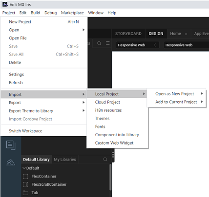
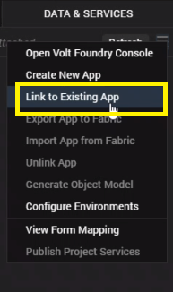
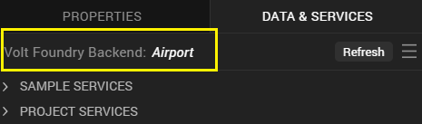
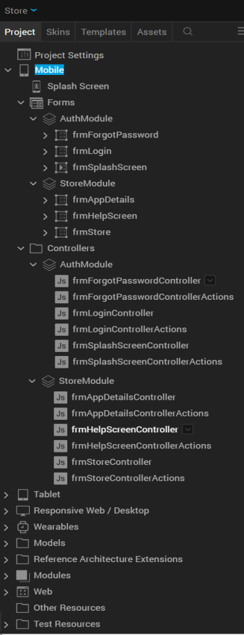
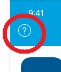
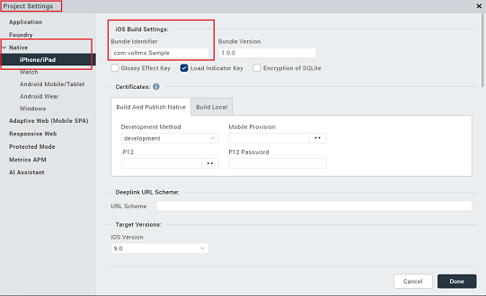
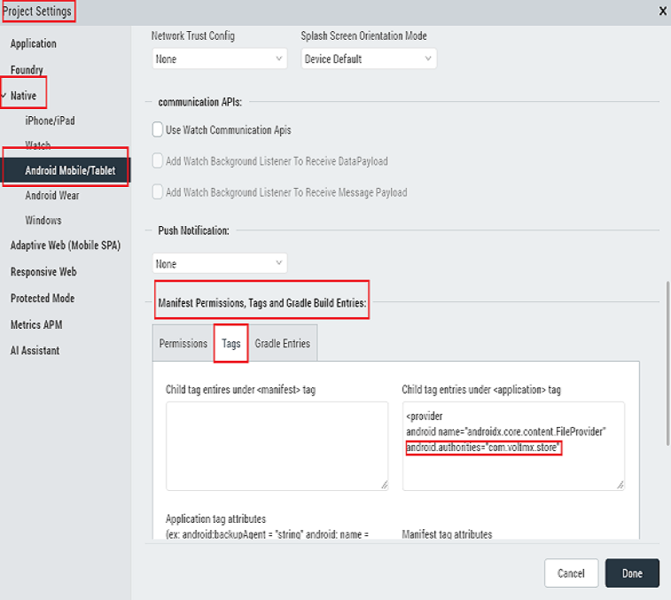
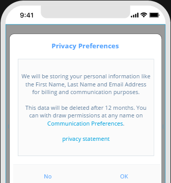
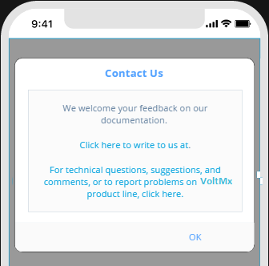
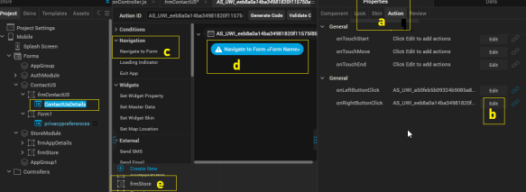

                               

User Guide: EAS App Implementation

Walk-through of Volt MX Enterprise App Store (EAS) Source Application
=====================================================================

EAS App Implementation
----------------------

Volt MX Enterprise App Store (EAS) is a simplified app distribution service that enables an enterprise to securely and easily distribute and manage apps to the users. All features of Volt MX EAS are available on Cloud and On-Premises. For more information on EAS, refer to [VoltMX Enterprise App Store (EAS) Service for Digital App Distribution](EnterpriseAppStore.md).

From Volt MX AppPlatform V8 SP4 JuneFP onwards, Volt MX allows you to access the complete EAS App assets including the front-end project details and the back-end app. You can download the EAS App assets from the [VoltMX Marketplace](https://marketplace.hclvoltmx.com/). These assets contain the source code of the Enterprise App Store, which is available for you to edit as per your requirement. You may choose to re-brand the app, or add specific forms to best suit your requirements.

For example, you can brand some of the following use cases:

*   Name, Slogan, Style
*   Graphics: Logo, app icon, splash screen, and visual image of the app
*   Look of the app
    
*   Brand keywords

App Architecture under Volt MX Reference Architecture
-----------------------------------------------------

*   **Volt MX Reference Architecture**: Volt MX EAS App is built on the Volt MX Reference Architecture. Volt MX Reference Architecture encapsulates your app's code into Volt MX's implementation of the Model View Controller (MVC) software architecture. Under Volt MX Reference Architecture, the code for your app has a clear division between the domain objects that model the app's functional domain and the presentation objects that represent what the user sees on the screen. Therefore, domain objects work independently of the presentation objects and can support multiple presentations, even simultaneously. Both domain objects and presentation objects are encapsulated into specific modules that Volt MX Reference Architecture generates automatically for you from the user interface that you create in Volt MX Reference Architecture Iris. For more information on Volt MX Reference Architecture Reference Architecture, refer to [A Deeper Look at Volt MX Reference Architecture Reference Architecture](../../../Iris/voltmx_ref_arch_api/Content/A_Deeper_Look_at_VoltMX_Reference_Architecture.md).
*   Extensibility and Customization: While Volt MX Reference Architecture EAS provide optimal functionality out of the box, HCL understands that each enterprise has unique requirements. The solutions can be easily extended to support business-specific applications and requirements by leveraging the power of the Volt MX platform. This allows customers to add their own functionality via third-party solutions or their own built-in modules on the Volt MX AppPlatform. For more information on Extensibility and Customization, refer to [Extensibility](https://voltmxsolutions.atlassian.net/wiki/spaces/ARBD/pages/271811283/Extension+Points#ExtensionPoints-commanpatternBusinessExtensionsusingCommandPattern).
    
    Volt MX EAS is built by using the industry-leading Volt MX Iris and Volt MX Foundry tools, which allow enterprises to customize and extend the following:
    
    *   Look and feel of the application
    *   Business rules that define the application functionality
    *   Rules around the data flow between the device and the back end
    
    Further, the solution includes an extension framework that allows implementation teams to do the following:
    
    *   Introduce a new form in an existing business workflow
    *   Replace an existing business logic method with new implementation
    *   Programmatically add new widgets to existing forms
    *   Update various properties of widgets
    *   Hide a feature that the bank does not need

Prerequisites to Configure EAS Source App in Iris
-------------------------------------------------------

Before you start using the source of the EAS App, ensure you have access to the following:

*   Access to a Volt MX Cloud account. If you do not have a cloud account, you can register for it at [VoltMX Cloud Registration](https://manage.hclvoltmx.com/registration).
*   Access to a Volt MX Cloud Build Environment, Volt MX Iris Starter, and access to Foundry App Server for publishing apps to EAS. 

    

Click here for more details on EAS and Platform Versions Compatibility Chart
 
    
    The following table details the supported versions of EAS source and Platform.

    > **_Important:_** If you are upgrading to EAS V 2.0.1 or a higher version, you must restart the server.

    <table>
    <tr>
    <th colspan="0"></th>
    <th colspan="2">EAS Source App version</th>
    <th colspan="3">Platform Supported Version</th>
    </tr>
    <tr>
    <th>Features</th>
    <th>Client App (Store.zip)</th>
    <th>Server App (Kony App Store.zip)</th>
    <th>Foundry</th>
    <th>Iris</th>
    <th>Middleware</th>
    </tr>
    <tr>
    <td><ul><li>Initial Release</li></ul></td>
    <td>1.0.0</td>
    <td>1.0.0</td>
    <td>NA</td>
    <td>V8 SP4 FP44 or lower</td>
    <td>8.4.3.x.</td>
    </tr>
    <tr>
    <td><ul><li>Support for Web apps</li></ul></td>
    <td>1.1.0</td>
    <td>1.0.0</td>
    <td>NA</td>
    <td>V8 SP4 FP44 or lower</td>
    <td>8.4.3.x.</td>
    </tr>
    <tr>
    <td><ul><li>Support for Android 10</li><li>Support for iOS 13</li><li>Push Notifications</li></ul></td>
    <td>2.0.0</td>
    <td>2.0.0</td>
    <td>NA</td>
    <td>V8 SP4 FP48 or higher</td>
    <td>8.4.3.x.</td>
    </tr>

    <tr>
    <td><ul><li>Bug fixes</li></ul></td>
    <td>2.0.1</td>
    <td>2.0.1</td>
    <td>NA</td>
    <td>V8 SP4 FP66 or higher</td>
    <td>8.4.3.10.</td>
    </tr>

    <tr>
    <td><ul><li>Support for Desktop View</li><li>Help section in iOS Native Apps</li></ul></td>
    <td>3.0.1</td>
    <td>3.0.1</td>
    <td>NA</td>
    <td>V9 GA</td>
    <td>8.4.3.10</td>
    </tr>

    <tr>
    <td><ul><li>Support for Upgrade Policy</li></ul></td>
    <td>3.1.0</td>
    <td>3.1.0</td>
    <td>NA</td>
    <td>V9 SP1</td>
    <td>V9 SP1</td>
    </tr>
    </table>

    * SP: Service Pack
    * FP: Fix Pack

    
   
    
*   Configure the various Project Settings.
    *   Go to **Project** > **Settings** and configure the build settings for each Native platform. For more information on **Project Settings**, click [here](../../../Iris/iris_user_guide/Content/Project_Properties_In_Iris_Starter.md#top).
*   Platform specific prerequisites:
    *   If you choose to build an application for the **iOS** platform, you must provide the Mobile Provision, .P12, P12 password, and the Development method. To do so, go to **Project Settings > Native > iPhone/iPad**. For more details on the iOS configurations, click [here](https://support.hcltechsw.com/csm?id=kb_article&sysparm_article=KB0083760).
    *   If you choose to build an application for the **Android** platform in **Release** **mode**, then the Android signing details are mandatory. To do so, go to **Project Settings** > **Native** > **Android Mobile/Tablet**. For more details on Android sign in details, click [here](https://support.hcltechsw.com/csm?id=kb_article&sysparm_article=KB0083782).
*   If you choose to build an application in **Protected mode**, then setting the public and private keys is mandatory. To do so, go to **Project Settings > Protected Mode**. For more details on how to generate public and private keys, click [here](../../../Iris/iris_user_guide/Content/ApplicationSecurity.md#Key).

Downloading EAS App Assets
--------------------------

The EAS App assets are divided as follows:

*   `store.zip` is the front-end source app of the EAS.
*   **`voltmx_app_store.zip`**is the back-end source app of the EAS.

  
| Store.zip | Volt MX App Store.zip |
| --- | --- |
| `store.zip` is the Iris project created for EAS based on Volt MX Reference Architecture. The Store project contains the client app/front-end app details of the EAS App. It contains the details of the project layout, modules and forms, and the client-side code of the front-end app. The **Store** project is associated with the **Volt MX App Store** App for the linked services. | **`` `voltmx_app_store.zip` ``** is the Server app containing the services linked to the EAS App. |

### Downloading Front-end Project for EAS App for Volt MX Iris

**Store** is the front-end project of the EAS created based on the Volt MX Reference Architecture. You can download the EAS App assets from [VoltMX Marketplace](https://marketplace.hclvoltmx.com/). The store.zip app contains details such as forms for supported channels, splash screen, client-side code, and modules and forms of EAS.

For Cloud, the Store app is bundled with the front-end and Server apps.

1.  Go to [VoltMX Marketplace](https://marketplace.hclvoltmx.com/items/store-0).
2.  Click **Download**. The `store.zip` file gets downloaded to your local system. For more details on EAS versions, refer to [EAS and Platform Versions Compatibility Chart](#VersionsEASPlatforms).

### Downloading Server App (Volt MX App Store) for Volt MX Foundry

The **Volt MX App Store** is the Server app (Volt MX Foundry), which contains services linked to EAS. You can download the source app (Volt MX App Store) from Marketplace.

1.  Go to [VoltMX Marketplace](https://marketplace.hclvoltmx.com/items/voltmx-app-store).
2.  Click **Download**. The `voltmx_app_store.zip` file gets downloaded to your local system. For more details on EAS versions, refer to [EAS and Platform Versions Compatibility Chart](#VersionsEASPlatforms).
    

Configuring EAS App in Iris
---------------------------------

### Importing EAS Front-End Project in Iris

You can view the layout of the front-end app and the source code by importing the Store project to Volt MX Iris.

1.  Make sure you are logged into Volt MX Iris.
2.  From the **Project** menu, click **Import >** **Local Project** > **Open as New Project**.
    
    
    
3.  In the **Import** dialog box, select **Select archive files**, and then click **Browse** to select the **store.zip** file that you have downloaded.
    
    The Store project gets imported to your Iris. [You can view the layout of the EAS project](#the-layout-of-the-front-end-app).
    

### Importing Server App to Volt MX Foundry

The Volt MX App Store app is available in your account in Volt MX Foundry by default. The app should be existing always in your account for EAS to work. The Volt MX App Store app is configured with the required services to be used in an app for EAS, for example, Identity Services.

In case you want to import a different version of the app, you can re-import it from [VoltMX Marketplace](https://marketplace.hclvoltmx.com/).

1.  Log in to Volt MX Foundry.
2.  In the **Apps** > **Foundry App**, click **IMPORT**, and drag and drop or browse for the **`voltmx_app_store_v1.0.zip`** file to upload.
3.  In the **Open** dialog, select the **Volt MX App Store** app that you downloaded.
    
    > **_Important:_** Ensure the Volt MX App Store App must be published to Server before you build and publish the EAS App in Iris.
    
4.  Associate the Store project with the Server app. For more information, refer to [How to Link EAS Front-End Project with Back-End App](#importing-server-app-to-foundry).
    

### Associating Front-end Project with Server App

To publish your app to Volt MX Foundry, your Volt MX Iris client app must be associated with a Volt MX Foundry app. After you import the Store project in Iris, you must associate it with the Volt MX App Store App.

1.  In Volt MX Iris, sign in to your Volt MX Cloud account. To do so, from the top right corner of the Iris window, click **Login**. The Volt MX Account sign-in window opens. Enter your HCL Cloud email and password credentials, and then click **Sign in**.
2.  In Iris, open the **Store** project.
3.  From the **Data & Services** panel, click **Open Foundry Console** **\> Use Existing** or **Link to Existing App**. The list of pre-configured services appears.
    
    
    
4.  In the Volt MX Foundry Applications, search for **Volt MX App Store**, and then click **ASSOCIATE**.
    
    The Volt MX App Store app is associated with the Store project.
    
    
    

Source of EAS App
-----------------

### Structure of the EAS Front-end Project - Store Project

#### The Layout of the Front-End App

Volt MX EAS Source app is supported for Native channels: iOS and Android.

  
| Elements in the Store Project | Project Structure UI in Iris |
| --- | --- |
| **App Meta Data**:   * Store app name  * Default app icon These details are displayed based on the metadata of the app.   **Supported Channels in EAS**:   * Mobile  * Tablet  * Responsive Web/Desktop   **Forms and Controllers** - **Forms** (two modules) **AuthModule**:   * frmForgotPassword  * frmLogin  * frmSplashScreen |  |

| StoreModules | Channels |
| --- | --- |
|frmAppDetails | * Mobile * Responsive Web/Desktop |
|frmHelpScreen | * Mobile (for iOS only) |
| > **_Note:_** The frmStore screen contains the Help button for iOS devices only. When you click the Help button, the help is displayed in the frmHelpScreen for iOS mobile devices. And for iOS tablets, the help is displayed in a pop-up window. |
| frmStore | * Mobile  * Tablet  * Responsive Web/Desktop |

**Controllers**

*   **AuthModule**
    *   frmForgotPasswordController
    *   frmForgotPasswordControllerActions
    *   frmLoginController
    *   frmLoginControllerActions
    *   frmSplashScreenController
    *   frmSplashScreenControllerActions
*   **StoreModule**
    *   frmAppDetailsController
    *   frmAppDetailsControllerActions
    *   frmHelpScreenController
    *   frmHelpScreenControllerActions
    *   frmStoreController
    *   frmStoreControllerActions

#### Supported Functionality and Forms - EAS Front-End Project

*   The `frmSplashScreen` form connects to the Server and fetches the login details of the Store app.
    
    *   If the Volt MX User Store custom auth type is enabled, the `frmLogin` form appears.
    *   If the OAuth 2.0 auth type is enabled, the login screen for that service provider type appears.
    
    The startup screen is displayed after the default splash screen.
    
    *   The `frmForgotPassword` form allows you to retrieve your login password for EAS.
*   The `frmAppDetails` form displays the metadata of an app.
*   If auth is not enabled, the `frmStore` form is displayed with the list of published apps.
    
    > **_Note:_** For iOS apps, if the device displays the **Untrusted Enterprise Developer** pop-up message, you must trust your iOS certificates. The `frmStore` form displays with the **Help** button, which you can follow in your device to trust your iOS certificate. For more details, refer to [Trust iOS Certificates](EnterpriseAppStore.md#trust-ios-certificates).
    

#### Reference Architecture Extensions

*   **AuthModule** supports end-user login.
    *   BusinessControllers: contains custom business logic for authentication for the complete Store project.
    *   PresentationController: contains auth success and failure cases. Based on each case type, the required actions are called in the form Controllers. This is a common controller for all the supported channels.
        
        > **_Important:_** For channel specific auth success and failure cases, you must use PresentationController_&lt;Channel&gt; to configure auth handles.
        
*   **StoreModule**
    *   BusinessControllers: handles the fetching list of published apps, logic to download and launch apps; contains the list of apps and custom business logic for authentication for the complete Store project.
    *   PresentationController: handles the presentation of apps such as in-progress status of app downloads, success, and failure cases. Based on each case type, the required actions are called in the form Controllers. You can add filters to customize the order of apps list. This is a common controller for all the supported channels.
        
        > **_Important:_** For channel specific presentation of apps, you must use PresentationController_&lt;Channel&gt; to configure store handles.
        

### Source Details of EAS Back-End App - Volt MX App Store App

The **Volt MX App Store** is the Server app (Volt MX Foundry), which contains the following services linked to EAS.

*   Identity Services: By default, the AppStoreUserRepository Identity Service of User Repository type is configured to authenticate EAS. You can configure another service type, if required.
*   Objects Services: By default, the EASDownloadBinaryService Object Service of File Store type is configured to store binaries of all the published apps. You cannot modify this service.
    *   By default, the EASMetaServices Object Service of Store type is configured to store the metadata of all the published apps. You cannot modify this service.
        
*   Contains uploaded app binaries to publish them to EAS.
*   Contains environments for Server and Volt MX App Server (EAS).

Branding Enterprise App Store to your Requirements
--------------------------------------------------

You can use the source app of the EAS to brand it to suit according to your business requirements.

Volt MX allows developers to access complete suite of the EAS App source. You can view details of the source code of the app, structure, layout, forms, and functionality, and linked services, and can customize the brand according to business requirements as well.

For example, you can brand an app for the following business requirements:

*   Name, Slogan, Style
*   Graphics: Logo, app icon, splash screen, and visual image of the app.
*   Look of the app
    
*   Brand keywords

### Branding EAS App to your Company Logo and Splash Screen

#### Changing an App Icon

1.  In Iris Project, click the **Splash Screen**.
2.  Click the **Assets** tab, right-click **Media**, and then click **Resource Location**.
3.  In the `..\\Store\resources` folder, open **common** for the channel type, for example, mobile or tablet.
4.  Change the image file of the app icon. Ensure the file name is same as the existing one. For example, `icon.png`.

#### Replacing Image for the existing Splash Screen

The splash screen and the frmSplashScreen can be same or different. You can modify the splash screen in the following two ways:

To replace the existing splash screen, follow these steps:

1.  In Iris Project, click the **Splash Screen**.
2.  Click the **Assets** tab, right-click **Media**, and then click **Resource Location**.
3.  In the `..\\Store\resources` folder, open **common** folder.
4.  Replace the new splash screen with the one existing. Ensure the file name is same as the existing one. By default, the image resource name is `` `splash_eas.png` `` for mobile and tablet. By default, the image resource name is `` `splash_screen.png` `` for responsive web.

#### Adding New Image to Splash Screen

If you choose to add new image to splash screen, the new image name must be

1.  In Iris Project, click **Splash Screen**.
2.  Click the **Assets** tab, right-click **Media**, and then click **Resource Location**.
3.  In the `..\\Store\resources` folder, open **common** folder.
4.  Add the new splash screen file to the common folder.
5.  Now, you must link the new image to the start-up screen in your store project as follows:
    1.  In **Iris > Store** project, expand the channel type. For example, **Mobile**.
    2.  Click **Splash Screen**.
    3.  In Properties > **Splash Screen > General**, click **Edit**.
    4.  In the **Splash Image** dialog box, select the new file.
6.  Go to **Forms** > **AuthModules** > **frmSplashScreen**, double-click the **Splash Screen** and select the new image file.

> **_Important:_** All images must be maintained with the default set scaling. 

#### Changing the EAS Package Name

If you want to build the EAS app with a custom **Package Name** and **Bundle Identifier**, you must configure the native settings in the Store project that you imported to Iris.

*   **iOS**
    1.  Ensure that you imported the Store.zip app into Iris project.
    2.  In Iris, open **Project Settings**.
    3.  Open **Project Settings**, click **Native**.
        
    
        
    4.  Click **iPhone/iPad** > **iOS Build Settings** > **Bundle Identifier**, change the package name.
        
        > **_Important:_** The **Bundle Identifier** must match with the iOS Certificates that you configured in the Store project. For more details, refer to [Platform specific prerequisites](../../../Iris/iris_user_guide/Content/EAS.md#Build).
        
    5.  Click **Done**.

*   **Android**
    1.  Ensure that you imported the Store.zip app into Iris project.
    2.  In Iris, open **Project Settings**.
    3.  In the **Project Settings** dialog, click the **Native**.
    4.  Click ****Android Mobile/Tablet****, and do the following:
        1.  Under **General Settings** > **Package Name**, specify the desired package name.
        2.  Under **Manifest Permission, Tags and Gradle Build Entries**, click the **Tags** tab.
        3.  Under the `Child tag entries under <application> tag` text box, specify the same package name value for `android:authorities="<package_name>"`.
    5.  Click **Done**.
        
    
        

### Adding Contact Us Form and Support Details

You can add new forms to your EAS App as per your business requirements.

For example, to add the **Contact Us** form to your EAS App and provide a link to the new form within the **StoreModule > fromStore** form. The following steps details how to add a **Contact Us** form, provide contact details, and links to the form for a Mobile channel. In this example, you will be using the sample component: **privacypreferences**, which contains ready-to-use text placeholder and action buttons to navigate between forms.

> **_Important:_** While modifying the source app, ensure that you follow [VoltMX Reference Architecture and Extensibility Guidelines](../../../Iris/voltmx_ref_arch_api/Content/A_Deeper_Look_at_VoltMX_Reference_Architecture.md) lines to support product upgrades. 

*   Add new form to the project as follows:
    1.  In **Iris**, open the **Store** project, and ensure you are in the **DESIGN** mode.
    2.  Click **Store project > Mobile**, right-click **Forms**, and click **New Group**.
    3.   Right-click the NewGroup and rename the new group to `ContactUS`.
    4.  Right-click the ContactUS Group, and click **New Form**.
    5.   Rename the new form to `frmContactUs`.
*   Download the **Privacy Preferences (GDPR)** component from Marketplace. To do so, click **Marketplace** menu > **Browse** and search for Privacy Preferences (GDPR). Click **Import to Collection Library**.
*   Click `frmContactUs` form.
From the downloaded components section, drag and drop the **privacypreferences** component to the `frmContactUs` form. The privacypreferences component is added to the form. You can change the caption, as follows:

*   In **Properties** panel, click **Component**.
*   Change the **ID** to `ContactUsDetails`.

Now, you will be modifying the actions and text in the component details section according to the your business requirement for the **Contact Us** form as shown in the following table.

#### Supported Functionality and Forms - EAS Front-End Project

The `frmSplashScreen` form connects to the Server and fetches the login details of the Store app. If the Volt MX User Store custom auth type is enabled, the `frmLogin` form appears. If the OAuth 2.0 auth type is enabled, the login screen for that service provider type appears. The startup screen is displayed after the default splash screen.The `frmForgotPassword` form allows you to retrieve your login password for EAS. The `frmAppDetails` form displays the metadata of an app. If auth is not enabled, the `frmStore` form is displayed with the list of published apps. > **_Note:_** For iOS apps, if the device displays the **Untrusted Enterprise Developer** pop-up message, you must trust your iOS certificates. The `frmStore` form displays with the **Help** button, which you can follow in your device to trust your iOS certificate. For more details, refer to [Trust iOS Certificates](EnterpriseAppStore.md#trust-ios-certificates).

#### Reference Architecture Extensions

**AuthModule** supports end-user login.BusinessControllers: contains custom business logic for authentication for the complete Store project.PresentationController: contains auth success and failure cases. Based on each case type, the required actions are called in the form Controllers. This is a common controller for all the supported channels.> **_Important:_** For channel specific auth success and failure cases, you must use PresentationController_&lt;Channel&gt; to configure auth handles. **StoreModule** BusinessControllers: handles the fetching list of published apps, logic to download and launch apps; contains the list of apps and custom business logic for authentication for the complete Store project. PresentationController: handles the presentation of apps such as in-progress status of app downloads, success, and failure cases. Based on each case type, the required actions are called in the form Controllers. You can add filters to customize the order of apps list. This is a common controller for all the supported channels.> **_Important:_** For channel specific presentation of apps, you must use PresentationController_&lt;Channel&gt; to configure store handles.

### Source Details of EAS Back-End App - Volt MX App Store App

The **Volt MX App Store** is the Server app (Volt MX Foundry), which contains the following services linked to EAS. Identity Services: By default, the AppStoreUserRepository Identity Service of User Repository type is configured to authenticate EAS. You can configure another service type, if required. Objects Services: By default, the EASDownloadBinaryService Object Service of File Store type is configured to store binaries of all the published apps. You cannot modify this service.By default, the EASMetaServices Object Service of Store type is configured to store the metadata of all the published apps. You cannot modify this service. Contains uploaded app binaries to publish them to EAS. Contains environments for Server and Volt MX App Server (EAS).

Branding Enterprise App Store to your Requirements
--------------------------------------------------

You can use the source app of the EAS to brand it to suit according to your business requirements. Volt MX allows developers to access complete suite of the EAS App source. You can view details of the source code of the app, structure, layout, forms, and functionality, and linked services, and can customize the brand according to business requirements as well. For example, you can brand an app for the following business requirements: Name, Slogan, Style Graphics: Logo, app icon, splash screen, and visual image of the app. Look of the app Brand keywords

### Branding EAS App to your Company Logo and Splash Screen

#### Changing an App Icon

In Iris Project, click the **Splash Screen**. Click the **Assets** tab, right-click **Media**, and then click **Resource Location**. In the `..\\Store\resources` folder, open **common** for the channel type, for example, mobile or tablet. Change the image file of the app icon. Ensure the file name is same as the existing one. For example, `icon.png`.

#### Replacing Image for the existing Splash Screen

The splash screen and the frmSplashScreen can be same or different. You can modify the splash screen in the following two ways: To replace the existing splash screen, follow these steps:

In Iris Project, click the **Splash Screen**. Click the **Assets** tab, right-click **Media**, and then click **Resource Location**. In the `..\\Store\resources` folder, open **common** folder. Replace the new splash screen with the one existing. Ensure the file name is same as the existing one. By default, the image resource name is `` `splash_eas.png` `` for mobile and tablet. By default, the image resource name is `` `splash_screen.png` `` for responsive web.

#### Adding New Image to Splash Screen

If you choose to add new image to splash screen, the new image name must be

In Iris Project, click **Splash Screen**. Click the **Assets** tab, right-click **Media**, and then click **Resource Location**. In the `..\\Store\resources` folder, open **common** folder. Add the new splash screen file to the common folder. Now, you must link the new image to the start-up screen in your store project as follows:

In **Iris > Store** project, expand the channel type. For example, **Mobile**.Click **Splash Screen**. In Properties > **Splash Screen > General**, click **Edit**.In the **Splash Image** dialog box, select the new file.

Go to **Forms** > **AuthModules** > **frmSplashScreen**, double-click the **Splash Screen** and select the new image file.

> **_Important:_** All images must be maintained with the default set scaling.

#### Changing the EAS Package Name

If you want to build the EAS app with a custom **Package Name** and **Bundle Identifier**, you must configure the native settings in the Store project that you imported to Iris. iOS

Ensure that you imported the Store.zip app into Iris project.In Iris, open **Project Settings**.Open **Project Settings**, click **Native**.Click **iPhone/iPad** > **iOS Build Settings** > **Bundle Identifier**, change the package name.> **_Important:_** The **Bundle Identifier** must match with the iOS Certificates that you configured in the Store project. For more details, refer to [Platform specific prerequisites](../../../Iris/iris_user_guide/Content/EAS.md#Build).Click **Done**.

Android

Ensure that you imported the Store.zip app into Iris project.In Iris, open **Project Settings**.In the **Project Settings** dialog, click the **Native**.Click ****Android Mobile/Tablet****, and do the following:

Under **General Settings** > **Package Name**, specify the desired package name.Under **Manifest Permission, Tags and Gradle Build Entries**, click the **Tags** tab.Under the `Child tag entries under <application> tag` text box, specify the same package name value for `android:authorities="<package_name>"`.

Click **Done**.

### Adding Contact Us Form and Support Details

You can add new forms to your EAS App as per your business requirements. For example, to add the **Contact Us** form to your EAS App and provide a link to the new form within the **StoreModule > fromStore** form. The following steps details how to add a **Contact Us** form, provide contact details, and links to the form for a Mobile channel. In this example, you will be using the sample component: **privacypreferences**, which contains ready-to-use text placeholder and action buttons to navigate between forms. > **_Important:_** While modifying the source app, ensure that you follow [VoltMX Reference Architecture and Extensibility Guidelines](../../../Iris/voltmx_ref_arch_api/Content/A_Deeper_Look_at_VoltMX_Reference_Architecture.md) lines to support product upgrades. Add new form to the project as follows:

In **Iris**, open the **Store** project, and ensure you are in the **DESIGN** mode.Click **Store project > Mobile**, right-click **Forms**, and click **New Group**. Right-click the NewGroup and rename the new group to `ContactUS`.Right-click the ContactUS Group, and click **New Form**. Rename the new form to `frmContactUs`.

Download the **Privacy Preferences (GDPR)** component from Marketplace. To do so, click **Marketplace** menu > **Browse** and search for Privacy Preferences (GDPR). Click **Import to Collection Library**. Click `frmContactUs` form. From the downloaded components section, drag and drop the **privacypreferences** component to the `frmContactUs` form. The privacypreferences component is added to the form. You can change the caption, as follows:In **Properties** panel, click **Component**.Change the **ID** to `ContactUsDetails`.Now, you will be modifying the actions and text in the component details section according to the your business requirement for the **Contact Us** form as shown in the following table.

#### Supported Functionality and Forms - EAS Front-End Project

*   The `frmSplashScreen` form connects to the Server and fetches the login details of the Store app.
    
    *   If the Volt MX User Store custom auth type is enabled, the `frmLogin` form appears.
    *   If the OAuth 2.0 auth type is enabled, the login screen for that service provider type appears.
    
    The startup screen is displayed after the default splash screen.
    
    *   The `frmForgotPassword` form allows you to retrieve your login password for EAS.
*   The `frmAppDetails` form displays the metadata of an app.
*   If auth is not enabled, the `frmStore` form is displayed with the list of published apps.
    
    > **_Note:_** For iOS apps, if the device displays the **Untrusted Enterprise Developer** pop-up message, you must trust your iOS certificates. The `frmStore` form displays with the **Help** button, which you can follow in your device to trust your iOS certificate. For more details, refer to [Trust iOS Certificates](EnterpriseAppStore.md#trust-ios-certificates).
    

#### Reference Architecture Extensions

*   **AuthModule** supports end-user login.
    *   BusinessControllers: contains custom business logic for authentication for the complete Store project.
    *   PresentationController: contains auth success and failure cases. Based on each case type, the required actions are called in the form Controllers. This is a common controller for all the supported channels.
        
        > **_Important:_** For channel specific auth success and failure cases, you must use PresentationController_&lt;Channel&gt; to configure auth handles.
        
*   **StoreModule**
    *   BusinessControllers: handles the fetching list of published apps, logic to download and launch apps; contains the list of apps and custom business logic for authentication for the complete Store project.
    *   PresentationController: handles the presentation of apps such as in-progress status of app downloads, success, and failure cases. Based on each case type, the required actions are called in the form Controllers. You can add filters to customize the order of apps list. This is a common controller for all the supported channels.
        
        > **_Important:_** For channel specific presentation of apps, you must use PresentationController_&lt;Channel&gt; to configure store handles.
        

### Source Details of EAS Back-End App - Volt MX App Store App

The **Volt MX App Store** is the Server app (Volt MX Foundry), which contains the following services linked to EAS.

*   Identity Services: By default, the AppStoreUserRepository Identity Service of User Repository type is configured to authenticate EAS. You can configure another service type, if required.
*   Objects Services: By default, the EASDownloadBinaryService Object Service of File Store type is configured to store binaries of all the published apps. You cannot modify this service.
    *   By default, the EASMetaServices Object Service of Store type is configured to store the metadata of all the published apps. You cannot modify this service.
        
*   Contains uploaded app binaries to publish them to EAS.
*   Contains environments for Server and Volt MX App Server (EAS).

Branding Enterprise App Store to your Requirements
--------------------------------------------------

You can use the source app of the EAS to brand it to suit according to your business requirements.

Volt MX allows developers to access complete suite of the EAS App source. You can view details of the source code of the app, structure, layout, forms, and functionality, and linked services, and can customize the brand according to business requirements as well.

For example, you can brand an app for the following business requirements:

*   Name, Slogan, Style
*   Graphics: Logo, app icon, splash screen, and visual image of the app.
*   Look of the app
    
*   Brand keywords

### Branding EAS App to your Company Logo and Splash Screen

#### Changing an App Icon

1.  In Iris Project, click the **Splash Screen**.
2.  Click the **Assets** tab, right-click **Media**, and then click **Resource Location**.
3.  In the `..\\Store\resources` folder, open **common** for the channel type, for example, mobile or tablet.
4.  Change the image file of the app icon. Ensure the file name is same as the existing one. For example, `icon.png`.

#### Replacing Image for the existing Splash Screen

The splash screen and the frmSplashScreen can be same or different. You can modify the splash screen in the following two ways:

To replace the existing splash screen, follow these steps:

1.  In Iris Project, click the **Splash Screen**.
2.  Click the **Assets** tab, right-click **Media**, and then click **Resource Location**.
3.  In the `..\\Store\resources` folder, open **common** folder.
4.  Replace the new splash screen with the one existing. Ensure the file name is same as the existing one. By default, the image resource name is `` `splash_eas.png` `` for mobile and tablet. By default, the image resource name is `` `splash_screen.png` `` for responsive web.

#### Adding New Image to Splash Screen

If you choose to add new image to splash screen, the new image name must be

1.  In Iris Project, click **Splash Screen**.
2.  Click the **Assets** tab, right-click **Media**, and then click **Resource Location**.
3.  In the `..\\Store\resources` folder, open **common** folder.
4.  Add the new splash screen file to the common folder.
5.  Now, you must link the new image to the start-up screen in your store project as follows:
    1.  In **Iris > Store** project, expand the channel type. For example, **Mobile**.
    2.  Click **Splash Screen**.
    3.  In Properties > **Splash Screen > General**, click **Edit**.
    4.  In the **Splash Image** dialog box, select the new file.
6.  Go to **Forms** > **AuthModules** > **frmSplashScreen**, double-click the **Splash Screen** and select the new image file.

> **_Important:_** All images must be maintained with the default set scaling.

#### Changing the EAS Package Name

If you want to build the EAS app with a custom **Package Name** and **Bundle Identifier**, you must configure the native settings in the Store project that you imported to Iris.

*   iOS
    1.  Ensure that you imported the Store.zip app into Iris project.
    2.  In Iris, open **Project Settings**.
    3.  Open **Project Settings**, click **Native**.
        
        
        
    4.  Click **iPhone/iPad** > **iOS Build Settings** > **Bundle Identifier**, change the package name.
        
        > **_Important:_** The **Bundle Identifier** must match with the iOS Certificates that you configured in the Store project. For more details, refer to [Platform specific prerequisites](../../../Iris/iris_user_guide/Content/EAS.md#Build).
        
    5.  Click **Done**.
*   Android
    1.  Ensure that you imported the Store.zip app into Iris project.
    2.  In Iris, open **Project Settings**.
    3.  In the **Project Settings** dialog, click the **Native**.
    4.  Click ****Android Mobile/Tablet****, and do the following:
        1.  Under **General Settings** > **Package Name**, specify the desired package name.
        2.  Under **Manifest Permission, Tags and Gradle Build Entries**, click the **Tags** tab.
        3.  Under the `Child tag entries under <application> tag` text box, specify the same package name value for `android:authorities="<package_name>"`.
    5.  Click **Done**.
        
        
        

### Adding Contact Us Form and Support Details

You can add new forms to your EAS App as per your business requirements.

For example, to add the **Contact Us** form to your EAS App and provide a link to the new form within the **StoreModule > fromStore** form. The following steps details how to add a **Contact Us** form, provide contact details, and links to the form for a Mobile channel. In this example, you will be using the sample component: **privacypreferences**, which contains ready-to-use text placeholder and action buttons to navigate between forms.

> **_Important:_** While modifying the source app, ensure that you follow [VoltMX Reference Architecture and Extensibility Guidelines](../../../Iris/voltmx_ref_arch_api/Content/A_Deeper_Look_at_VoltMX_Reference_Architecture.md) lines to support product upgrades.

1.  Add new form to the project as follows:
    1.  In **Iris**, open the **Store** project, and ensure you are in the **DESIGN** mode.
    2.  Click **Store project > Mobile**, right-click **Forms**, and click **New Group**.
    3.   Right-click the NewGroup and rename the new group to `ContactUS`.
    4.  Right-click the ContactUS Group, and click **New Form**.
    5.   Rename the new form to `frmContactUs`.
2.  Download the **Privacy Preferences (GDPR)** component from Marketplace. To do so, click **Marketplace** menu > **Browse** and search for Privacy Preferences (GDPR). Click **Import to Collection Library**.
3.  Click `frmContactUs` form.
4.  From the downloaded components section, drag and drop the **privacypreferences** component to the `frmContactUs` form. The privacypreferences component is added to the form. You can change the caption, as follows:
    
    *   In **Properties** panel, click **Component**.
    *   Change the **ID** to `ContactUsDetails`.
    
    Now, you will be modifying the actions and text in the component details section according to the your business requirement for the **Contact Us** form as shown in the following table.
    
    | Default text and actions in the Component | Modified details in the Component sectionfor the Contact Us form |
    | --- | --- |
    |  |  |
    
5.  Click `ContactUsDetails` to edit component properties.
    
    1.  In **Properties** > **Component**, do the following:
        1.  In **Header Text**, change the text to `Contact Us`.
        2.  In **Message**, specify the contact details.
            
            For example, Volt MX Support URL:  
            `
We welcome your feedback on our documentation.   <a href="https://techpubs@voltmx.com/">Click here to write to us at</a>.  \n<a href="https://support@voltmx.com/">For technical questions, suggestions, and comments, or to report problems on Volt MX product line, click here.</a>​​​​​​​​​​​​​​​​​​​​​​​​​​​​​​​​​​​​\n
`
            
    
    1.  To add the link to the **OK** button, do the following:
        1.  On **Properties**, click **Action**.
        2.  From **onRightButtonClick**, click the **Edit** button.
        3.  From **Action ID** **\> Navigation**, click **Navigate to Form**.
        4.  Click the `Navigate to Form <Form Name>` element.
        5.  Click `frmStore`. By doing this, when you click the **OK** button on the **Contact Us** form, the `frmStore` form appears.
            
            
            
    
    1.  For the **Contact Us** form, you do not need any action for the **No** button. So, you can hide the button by removing the text, as follows:
        1.  From **Properties** panel, click **Component**.
        2.  In **Left Button Text** field, delete the caption.
6.  Now, add the link to the new button widget in the **frmStore** form to navigate to the **Contact Us** form.
    1.  Select the `frmStore` form.
    2.  From **Iris > Default Library**, drag and drop the **Button** widget to the form.
        
        You can change the button properties such as skin and text.
        
    3.  On **Properties**, click **Action**.
    4.  From **onClick**, click the **Edit** button.
    5.  From **Action ID** **> Navigation**, click **Navigate to Form**.
    6.  Click the `Navigate to Form <Form Name>` element.
    7.  Click `frmContactUs`. By doing this, when you click the newly added widget on the `frmStore` form, the `frmContactUs` form appears.
        
        You can build or preview the EAS App to view the customized results now.
        

### Modifying Server EAS App for Identity Services and Metadata of Binaries

#### Configuring Identity Services for EAS Authentication

You can configure new Identity Services and Object Services for EAS in the **Volt MX App Store** App. After you configure the new services, you must map the new services in the project and update the source code of the Store project.

#### Configuring Properties for Client Binaries

For information on how to configure basic properties such as the description of a client binary file, the icon of a binary, and the related screenshots of a binary file. refer to [Configuring Properties for Client Binaries in VoltMX Foundry](../../../Foundry/voltmx_foundry_user_guide/Content/EnterpriseAppStore.md#configuring-properties-for-client-binaries).

Publishing EAS App
------------------

EAS native apps need to be distributed in the same way as you distribute the other native apps. So, to distribute EAS native apps to end-users, you must publish your EAS native apps to the EAS Web app. End-users can access the EAS Web app to view and download EAS native apps on devices like any other native apps. By default, the EAS Web app is selected while publishing the apps to EAS.

### Build and Publish App Binaries to EAS using Volt MX Iris

With Iris Starter, you can build client binaries and publish them directly to Volt MX App Server from Iris. For more information, refer to Publishing Native Apps to Enterprise App Store from Iris Starter.

*   For more information on how to build app binaries and publish them to EAS, refer to [**Publish to Enterprise App Store section** in Publishing Client Binaries to Volt MX App Server from Volt MX Iris (for Cloud only)](../../../Iris/iris_user_guide/Content/EAS.md#Publish).
    

### Publish App Binaries to EAS using Volt MX Foundry

By using Volt MX Foundry, you can upload the client binaries and publish them to Volt MX App Server. After an app is published to Volt MX App Server, an authorized end-user can access the EAS Client app to view the available applications and download them using a mobile device.

*   For more information on how to upload app binaries to the Server and publish them to EAS by using Volt MX Foundry, refer to [Publishing Client Binaries to Volt MX App Server from Volt MX Foundry](../../../Foundry/voltmx_foundry_user_guide/Content/EnterpriseAppStore.md#publishing-client-binaries-to-app-server-from-foundry).
