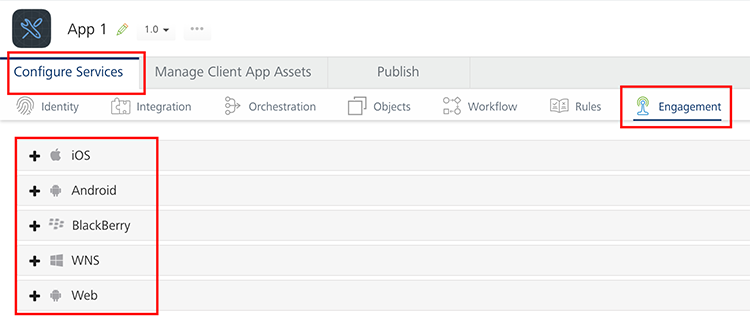
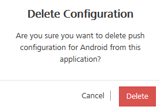
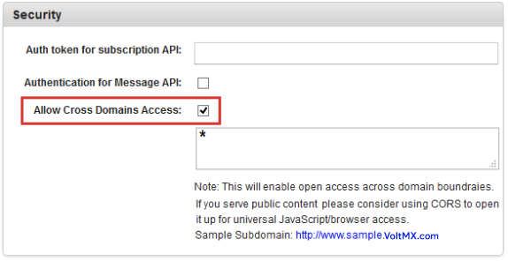
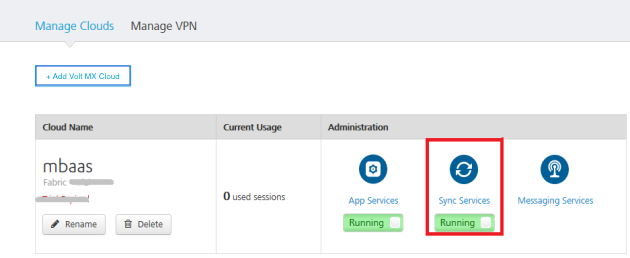
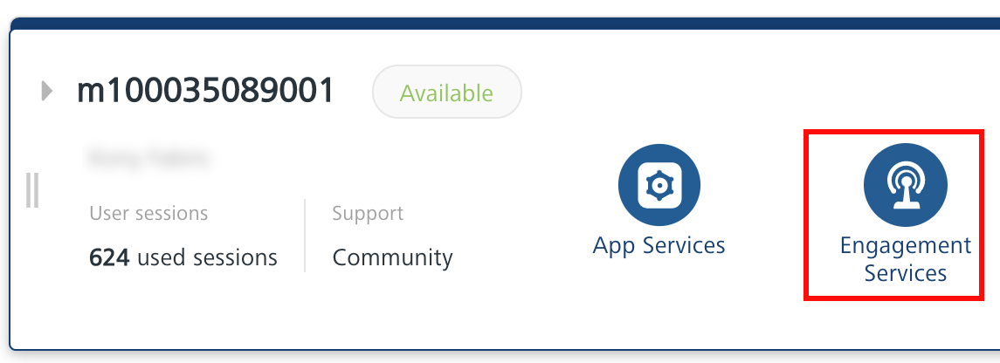

                              

User Guide: Engagement

Engagement
==========

Engagement service allows you to upload push certificates for iOS, Android,and Windows 8 RT platforms.

Menu path:

After you [create an application](Adding_Applications.md), in the **Configure Services** tab, click the **Engagement** service tab.

For sending messages, follow these steps:

1.  Add Push Certificates
2.  Access Engagement Console
3.  Send a Push Message

Add Push Certificates
---------------------

Volt MX  Foundry Engagement supports the following platforms:

1.  [iOS](#ios)
2.  [Android](#android)
3.  [WNS](#wns)

This section details the process for adding push certificates to your application.

### iOS

> **_Note:_** Refer to the following section for creating a push certificate: [Engagement Services Console User Guide > Applications](../../../Foundry/vms_console_user_guide/Content/Apps/Applications.md)

To add iOS Push Certificates for your app, follow these steps:

1.  Expand **iOS**. A list of configurable items appear.
2.  **Application Mode**: An appropriate application mode.
    *   Production mode: When selected, production certificates and associated password details are entered while sending push notifications. Push notifications are delivered in real-time.
    *   Development mode: When selected, you can still send push message notifications, but delivery of push notifications are not real-time.
3.  **iPhone Push Certificate**: From here, you can upload, download, or delete a certificate.
    *   Click **Browse** to upload an iPhone certificate.
    *   Click **Download** to download an iPhone certificate.
    *   Click **Delete** to delete an iPhone certificate.
4.  **Certificate Password**: Enter the password for iPhone, and then click Save to complete the configuration process.
5.  **iPad Push Certificate**: From here, you can upload, download, or delete a certificate.
    *   Click **Browse** to upload an iPhone certificate.
    *   Click **Download** to download an iPhone certificate.
    *   Click **Delete** to delete an iPhone certificate. 
6.  Click **Save** to complete the configuration process for iOS platform.

### Android

> **_Note:_** Refer to the following section for creating a push certificate: [Engagement Services Console User Guide > Applications](../../../Foundry/vms_console_user_guide/Content/Apps/Applications.md)

To add Android details or Jpush details (app key and master secret), follow these steps:

1.  Expand **Android**. A list of configurable items appear.
2.  Volt MX Engagement Services supports two options for sending push notifications to Android devices. The Google Cloud Messaging network is the recommended network, but for certain geographies such as China, JPush may be required to reliably deliver push notifications. You may select to use either network option or configure both and allow your app to specify at the time of subscription which network it will use.

    **FCM Legacy API**

    *   Enter the **Google Cloud Messaging (GCM)** authorization key, and then click **Save** to complete the configuration process. 
        
        > **_Note:_** Google Cloud Messaging for Android (GCM) is a service that helps you to send data from servers to Android applications on Android devices. This can be a lightweight message telling the Android application that there is new data to be fetched from the server (for example, a movie uploaded by a friend), or it can be a message containing up to 4kb of payload data (so apps like instant messaging can consume the message directly). The GCM service handles all aspects of queuing of messages and delivery to the target Android application running on the target device.  
          
        Click the Create an Android GCM Key (Via Google Old Console) link for more details on how to subscribe for GCM Authorization Key.

    **FCM HTTPV1 API**

    *   Provide the details of **FCM Project URL** and **Service_Account_key.json**, and then click **Save** to complete the configuration process. 
        
        > **_Note:_** FCM HTTPV1 API for Android (FCM) is a service that helps you to send data from servers to Android applications on Android devices. This can be a lightweight message telling the Android application that there is new data to be fetched from the server (for example, a movie uploaded by a friend), or it can be a message containing up to 4kb of payload data (so apps like instant messaging can consume the message directly). The FCM HTTPV1 service handles all aspects of queuing of messages and delivery to the target Android application running on the target device.  
          
        Click the Create an Android FCM Project URL and Service Account Key (Via Firebase Console) link for more details on how to subscribe for FCM Project URL and Service Account Key
        
    **JPush**

    *   Enter the following details for **JPush**:
        
        1.  **App Key**: Enter the app key.
            
        2.  **Master Secret**: Enter the master secret.
            
        
        For more details , refer to [Engagement Services Console User Guide > Android Platform > Create a JPush App Key and Master Secret](../../../Foundry/vms_console_user_guide/Content/Apps/Adding_Platform.md#Create_a_JPush_Key)
        
3.  To delete push configuration for Android, click **Delete Configuration**.
    

    ****
    
4.  Click **Delete** to confirm.
    
    > **_Important:_** From PhoneGap application, to use Engagement services (subscription, push messages and fetch messages), you must enable cross-origin resource sharing (CORS) in Volt MX Foundry Engagement console.  
      
    To enable CORS, in **VoltMX Foundry Engagement Console > General > Settings > Security**, select the **Allow Cross Domains Access** check box. In Volt MX Foundry Engagement Console, by default the check box is cleared.  
    
    For more details, refer to [VoltMX Foundry Messaging Console > General > Settings > Security](../../../Foundry/vms_console_user_guide/Content/Administration/General_-_Settings.md#Security) section.  

    
      
    
    

### WNS

> **_Note:_** Refer to the following section for creating a push certificate: [Engagement Services Console User Guide > Applications](../../../Foundry/vms_console_user_guide/Content/Apps/Applications.md)

> **_Note:_** Windows push certificate is a purchased SSL certificate that is converted to correct format for uploading to Volt MX Foundry.

To add Windows Push Certificates for your app, follow these steps:

1.  Expand **WNS**. A list of configurable items appear.
2.  **Secret**: Enter the secret key details.
    
    > **_Note:_** Windows Secret is an associated secret key that contains strings used in authentication with Volt MX Foundry Messaging APIs. It is used in authentication on the client side during registration.
    
3.  **SID**: Enter the SID details, and then click Save to complete the configuration process.
    
    > **_Note:_** Windows SID is a security identifier that is a unique, immutable identifier of a user, user group or other security principal. A security principal has a single SID for life, and all properties of the principal, including its name, are associated with the SID. This design allows a principal to be renamed (for example, from "John" to "Jane") without affecting the security attributes of objects that refer to the principal.
    
4.  To delete push configuration for Windows, click **Delete Configuration**.

Accessing Engagement Services Console
-------------------------------------

Volt MX  Engagement Services Console allows you to add and manage applications, view the stored certificates, and manage a subscribers list.

To view your Volt MX Engagement Services Console, click **Engagement** from your cloud account Environments.

> **_Note:_** For more information on Volt MX Engagement Services Console, refer to the following guide: [Engagement Services Console User Guide](../../../Foundry/vms_console_user_guide/Content/Introduction_1.md).
