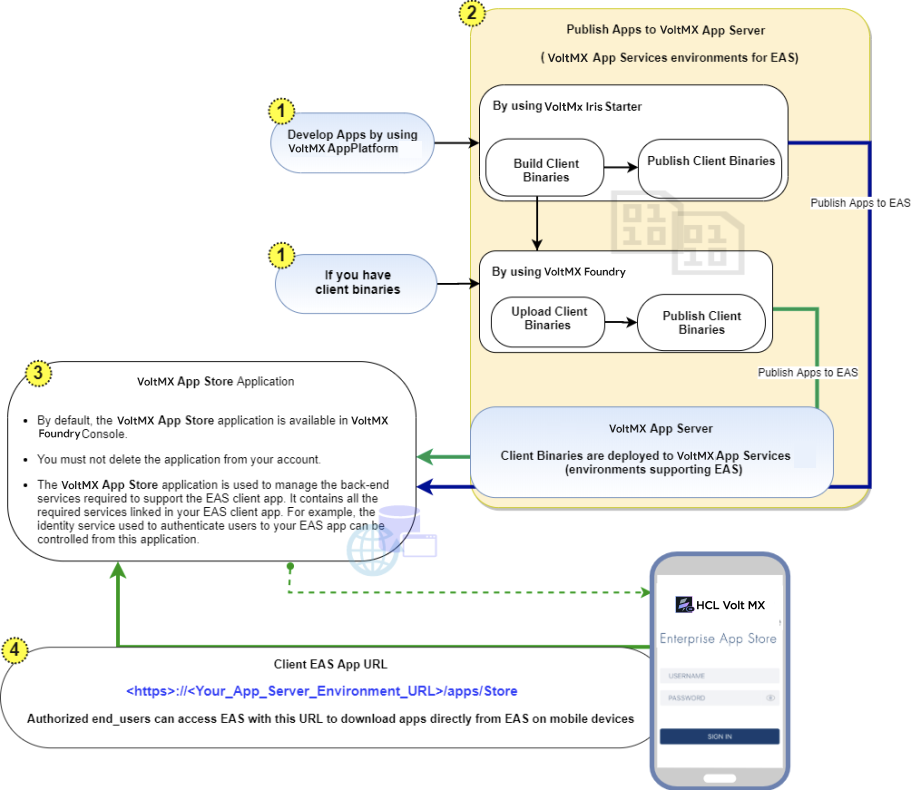
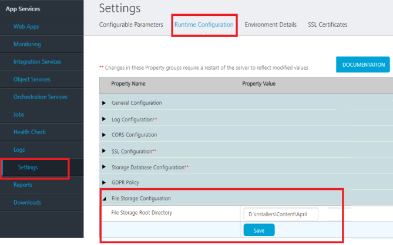
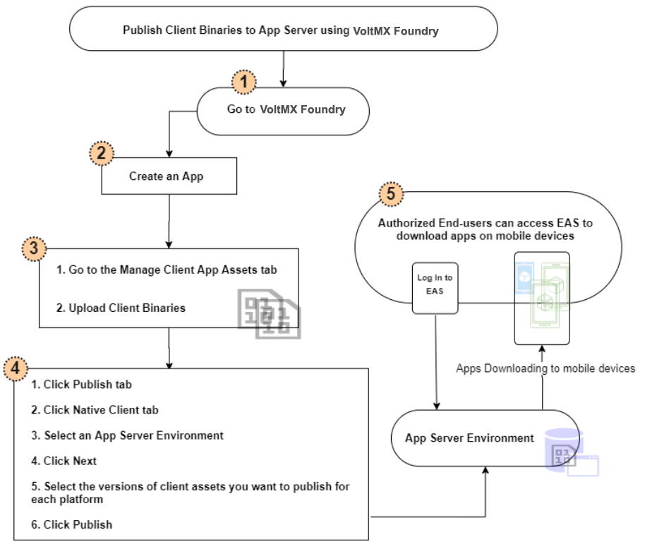
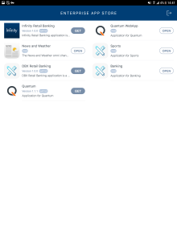
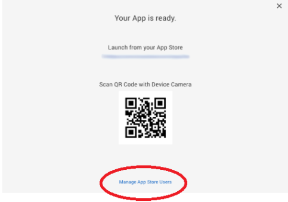
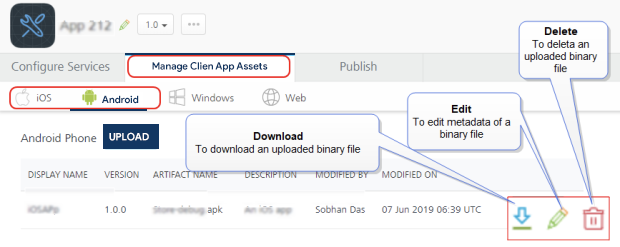

                               

User Guide: EAS Overview

Volt MX  Enterprise App Store (EAS) Service for Digital App Distribution
=======================================================================

Overview
--------

Volt MX  Enterprise App Store (EAS) is a simplified app distribution service that enables an enterprise to securely and easily manage and distribute their apps to their users. All features of Volt MX EAS are available on Cloud and On-Premises.

With Volt MX AppPlatform Release V8 Service Pack 4, Volt MX App Server has been enhanced to provide the backend support for the Volt MX Enterprise App Store.

> **_Note:_** From Volt MX AppPlatform V8 SP4, Volt MX EAS Service is available to all Volt MX AppPlatform users by default.

After an app is built by using Volt MX AppPlatform, Volt MX EAS service allows Volt MX AppPlatform users (**Admin/Member/Owner**) to choose to publish an app to the Volt MX App Server available in their Volt MX Foundry account. AppPlatform users can then allow authenticated access to certain end-users. The authorized end-users can access the published apps directly from Volt MX EAS, just like how you can access apps from the Google Play Store and the Apple App Store.

The following table details Volt MX Foundry roles to manage EAS Apps 

  
| **EAS Apps Management** ||||
| --- | --- | --- | --- |
| PERMISSIONS | **User Roles in Volt MX Foundry** |||
| --- | --- | --- | --- |
| OWNER | ADMIN | MEMBER |
| --- | --- | --- |
| Developing Apps |  |  |  |
| Publishing Apps to EAS (VoltMX App Server) |  |  |  |
| Unpublishing Apps to EAS |  |  |  |
| **Setting Public access mode for an EAS App**: By default, the authentication is disabled for EAS. So, when an app is published to the EAS, users can view and download your published apps from the EAS client app without logging in to EAS. |  |  |  |
| **Setting Protected access mode for the EAS App**: Users with Volt MX Foundry account can enable authentication to EAS so that, only authorized users can log in to the EAS and access the published apps |  |  |  |

Workflow of Apps for Volt MX App Server
---------------------------------------

****

Prerequisites for Cloud
-----------------------

*   Access to a Volt MX Cloud account. If you do not have a cloud account, you can register for it at [VoltMX Cloud Registration](https://manage.voltmx.com/registration).
*   Access to a Volt MX Cloud Build Environment version, and access to Foundry App Server for publishing apps to EAS.
    
    

Click here for more details on
**EAS and Platform Versions Compatibility Chart**  
    The following table details the supported versions of EAS source and Platform.
    
> **_Important:_** If you are upgrading to EAS V 2.0.1 or a higher version, you must restart the server.
  
| EAS Source App version || **Platform Supported Version** |||
| --- | --- | --- | --- | --- |
| Client App (Store.zip) | Server App (VoltMX App Store.zip) | Foundry |   Iris | Middleware |
| --- | --- | --- | --- | --- |
| 1.0.0 - Initial Release | 1.0.0 | NA | V8 SP4 FP44 or lower | 8.4.3.x. |
| 1.1.0 - Support for Web apps | 1.0.0 | NA | V8 SP4 FP44 or lower | 8.4.3.x. |
| 2.0.0 - Support for Android 10   Support for iOS 13   Push Notifications | 2.0.0 | NA | V8 SP4 FP48 or higher | 8.4.3.x |
| 2.0.1 - Bug fixes | 2.0.1 | NA | V8 SP4 FP66 or higher. | 8.4.3.10 |
| 3.0.1 - Support for Desktop View   Help section in iOS Native Apps | 3.0.1 | NA | V9 GA | 8.4.3.10 |
| 3.1.0 - Support for Upgrade Policy | 3.1.0 | NA | V9 SP1 | V9 SP1 |
| **SP**: Service Pack**FP**: Fix Pack |||||
    

Prerequisites for On-premises
-----------------------------

*   EAS app can be found in the local Foundry install folder, for example: 
    `C:\VoltMXFoundryInstaller-GA-9.5.2.3\tomcat\webapps\accounts\WEB-INF\classes\EASApps\Volt MX App Store (v1.0)`

*   For publishing apps to the Enterprise App Store, you have to have Volt MX Foundry App Server.
    

Click here for more details on
 **EAS and Platform Versions Compatibility Chart**  
    The following table details the supported versions of EAS source and Platform.
    
> **_Important:_** If you are upgrading to EAS V 2.0.1 or a higher version, you must restart the server.
    
| EAS Source App version || **Platform Supported Version** |||
| --- | --- | --- | --- | --- |
| Client App (Store.zip) | Server App (VoltMX App Store.zip) | Foundry |   Iris | Middleware |
| --- | --- | --- | --- | --- |
| 1.0.0 - Initial Release | 1.0.0 | NA | V8 SP4 FP44 or lower | 8.4.3.x. |
| 1.1.0 - Support for Web apps | 1.0.0 | NA | V8 SP4 FP44 or lower | 8.4.3.x. |
| 2.0.0 - Support for Android 10Support for iOS 13Push Notifications | 2.0.0 | NA | V8 SP4 FP48 or higher | 8.4.3.x |
| 2.0.1 - Bug fixes | 2.0.1 | NA | V8 SP4 FP66 or higher. | 8.4.3.10 |
| 3.0.1 - Support for Desktop ViewHelp section in iOS Native Apps | 3.0.1 | NA | V9 GA | 8.4.3.10 |
| 3.1.0 - Support for Upgrade Policy | 3.1.0 | NA | V9 SP1 | V9 SP1 |
| **SP**: Service Pack**FP**: Fix Pack |||||

*   Set the variable `max_allowed_packet` as per the size of your application:
    
    > **_Important:_** **For on-premises**: If the size of your application is more than the variable size of server database, an error occurs. Ensure the variable `max_allowed_packet` is set to a higher value than the application size.  
      
    To avoid this error, increase the global variable in the server database.  
      
    \- Modify the SQL Statement to set global `max_allowed_packet`\=`10*1024*1024`.  
    In this statement, the server database size is configured to 10-Megabytes(MB).  
      
    For example, if your application size is 1024-kilobytes (1 MB) and you try to publish an application from Volt MX Studio of 2048-Kilobytes(2 MB) an error appears while publishing. Increase the size of server database to a value more than 2048-Kilobytes (2 MB), for publishing the application. Refer to [Increase innodb\_log\_file\_size in my.ini file- MySQL](../../../Foundry/voltmx_foundry_windows_install_guide/Content/DB_Pre-installation_Tasks.md).
    
*   Before you publish apps to EAS you must set the `File Storage Root Directory` path in the **Settings > Runtime Configuration > File Storage Configuration** in App Services Console.
    *   VoltMX Foundry uses client app binaries uploaded to the location set in `File Storage Root Directory` and publishes them to EAS. So, the `File Storage Root Directory` path should be in the same system as the Volt MX Foundry installation.
        
        > **_Important:_** If your Volt MX Foundry is on Windows and the path is in the **D** drive, then provide the value as **D**:  
          
          
          
        For example,  
        Volt MX Foundry is installed on `D:\Installers\VoltMXFoundry`  
        The file path can be `` `D:\Installers\Content\VoltMXEAS` ``
        
        [Configuring File Storage Root Directory (Target location) path:  
        ](javascript:void(0);)
        
        1.  Sign in to your on-premises instance of Volt MX Foundry.
        2.  From the left navigation pane, select **Environments**.
        3.  Click the server icon to open the **Admin Console**.
        4.  From the left navigation pane of the **Admin Console**, select **Settings**.
        5.  Click on the **Runtime Configuration** tab and expand the **File Service Configuration** section.
            
            
            
        6.  Provide the path of your file system target location under **File Service Root Directory**.
        

Supported Channels and Platforms for Volt MX App Server
-------------------------------------------------------

*   The following table details the supported channels and apps in EAS:

  
| Android | iOS | Desktop |
| --- | --- | --- |
| Mobile (Native and Web Apps) Tablet (Native and Web Apps) | Mobile (Native and Web Apps) Tablet (Native and Web Apps) | Web Apps |

*   EAS support is available from Volt MX AppPlatform V8 SP4 onwards.

Publishing Apps to EAS (VoltMX App Server)
-------------------------------------------

### Publishing Client Binaries to Volt MX App Server from Volt MX Iris (for Cloud only)

*   With Iris Starter, you can build client binaries and publish them directly to Volt MX App Server from Iris. For more information, refer to [Publishing Native Apps to Enterprise App Store from Iris Starter](../../../Iris/iris_user_guide/Content/EAS.md).

> **_Note:_** If you are a Volt MX Iris Enterprise user, you must publish apps to EAS from Volt MX Foundry Console. The behavior of EAS is the same for Volt MX Iris Enterprise and Iris Starter Editions.

### Publishing Client Binaries to Volt MX App Server from Volt MX Foundry

By using Volt MX Foundry, you can directly upload client binaries and publish them to Volt MX App Server. After an app is published to Volt MX App Server, an authorized end-user can access EAS Client app to view available applications and download them using a mobile device.

The following flow diagram explains the process of publishing client binaries to Volt MX App Server by using Volt MX Foundry

To publish client binaries to Volt MX App Server by using Volt MX Foundry, follow these steps:

1.  Create an app in Volt MX Foundry.
2.  In the App details page, click the [**Manage Client App Assets**](Upload_Native_Client_Binaries.md#Uploadin) tab for the app. By default, the iOS tab is selected.
    
    
    
3.  **Upload the client binaries for supported platforms such as iOS, Android** , and Web, as follows:
    
    1.  In the **Mange Client App Assets**, click the tab for iOS or Android or Web.
        1.  Click the **UPLOAD** button for the specific channel.  The **Upload** dialog appears for the selected channel.
            
              
            (This sample screen shot is for native phone binary upload)
            
            > **_Important:_** **For on-premises**: If the size of your application is more than the variable size of server database, an error occurs. Ensure the variable max\_allowed\_packet\_size is set to a higher value than the application size.  
              
            To avoid this error, increase the global variable in the server database.  
              
            \- Modify the SQL Statement to set global max\_allowed\_packet=10\*1024\*1024.  
            In this statement, the server database size is configured to 10-Megabytes(MB).  
              
            For example, if your application size is 1024-kilobytes (1 MB) and you try to publish an application from Volt MX Studio of 2048-Kilobytes(2 MB) an error appears while publishing. Increase the size of the server database to a value more than 2048-Kilobytes (2 MB) for publishing the application. Refer to [Increase innodb\_log\_file\_size in my.ini file- MySQL](../../../Foundry/voltmx_foundry_windows_install_guide/Content/DB_Pre-installation_Tasks.md).
            
        2.  Drag and drop the app binary or click **Browse** and navigate to the required app binary file.
    
    1.  In the **Display Name** field, specify the name of the application. The app is displayed with the specified name in EAS when you view the App Store in a mobile device. This field is optional.
        
        If the display name is not specified for the app binary, the published app is displayed with the default Volt MX Foundry app name in EAS.
        
    2.  In the **Version** field, add the version for the app.
    3.  To add the app icon, click the **Plus** symbol in the **App Icon** section and navigate to the icon file. This is applicable to native binary.
    4.  To change the screens, click the **Plus** symbol in the **Screenshot** section and navigate to the required image file. This is applicable to native binary.  
    5.  In the **Description** field, add the description of the app.
        
    6.  Click **UPLOAD**. The add details are updated to the selected channel.
        
    
    > **_Important:_** In the case of Web binary, if you have uploaded a Web binary file, you must publish the Web binary to the server as follows:  
      
    1\. Go to the **Publish** tab. By default, the **Service & Web Client Publish** tab is selected.  
    2\. Under the **Select environment to publish**, click an environment.  
    3\. Click the **PUBLISH** button. The process of publishing the app begins.  
    After the binary is published, the publish status changes to **Published** in the **Select environment to publishing** section.  
    
4.  **After you upload a app binary to the server, you must publish the binary to the EAS as follows:**  
    1.  Go to the **Publish** tab. By default, the **Service & Web Client Publish** tab is selected.
    2.  Click **Native Client**. The **Native Client** page lists Volt MX App Server environments suitable for EAS.  
        The list also displays one of the following app publish statuses and availability status for that environment.  
        
        | APP PUBLISH STATUS ||
        | --- | --- |
        | Published: An app is published to a cloud or environment. You can unpublish the app, if required. ||
        | Not Published: An app is not published to a cloud or environment. You can publish the app, if required. ||
        | Error: An app is canceled while publishing or unpublishing. You can publish or unpublish the app, if required. ||
        | ENVIRONMENT STATUS ||
        | **Busy**: Server is busy publishing another app.App publish request will not be submitted for publishing.For example, When you try to publish an app in a Busy environment, the error message is displayed “`Server is busy processing another request. Please try after some time`” ||
        | **Available**: Server is ready for publishing the app.You can publish/unpublish an app to this environment successfully.For example:When an environment status is Available, if you try to publish an app, the app is submitted for publishing and processed via the publish life-cycle successfully.When an environment status is Available, and if multiple apps (app1 and app2) are sent for publishing simultaneously from different users of the same Foundry account, then the app which is submitted for publish first (say app1) will be processed for publishing, and for app2 the error message will be the shown “`Server is busy processing another request. Please try after some time`” ||
        | **Unknown**: Unable to fetch the server status.App publish request will not be submitted for publishingFor example: When an environment status is Unknown, if you try to publish an app, the app is submitted for publishing, but the publishing might not be successful. ||
        
    3.  Select the required **VoltMX App Services** environment.
    4.  Click **NEXT**.
    5.  In the **Select assets to Publish** page, select the version of each client binary you want to publish to the selected environment.
    6.  Click **PUBLISH**. The process of publishing the app begins.
        
        > **_Important:_** If you are publishing the Volt MX App Store version 2.0.1 or higher to an environment where the lower version of the Volt MX App Store is already published, then in order to get the latest changes, you must restart the application server.  
          
        For more information on How to Stop and Start a Deployment Application Server, refer to [How to Stop and Start Volt MX Foundry](../../../Foundry/voltmx_foundry_windows_install_guide/Content/Starting_VoltMX_Foundry_Console.md).
        
        When the app is published, the **Application published** window appears and displays link to the **App Store** and **Manage App Store Users**, along with the **QR Code** to access the EAS.
        
        | App Store URL |||
        | --- | --- | --- |
        | If you open the **App Store URL** by using a **mobile device**, the **Responsive Web view** of the EAS Store displays all the published native and Web apps.If you open the **App Store URL** by using a **PC system** (for example, **Desktop or Macbook**), the **Desktop view** of the EAS Store displays all the published Web apps suitable for Desktop only. [For more details. refer to Downloading Apps from EAS](#downloading-apps-from-eas) |||
        | App Store QR Code |||
        | If you open the **App Store QR Code** by using a **mobile device**, the **Responsive Web view** of the EAS Store displays all the published native and Web apps. |||
        
        > **_Note:_** By default, the authentication is disabled for EAS. Users can view your published apps from EAS client app without having to log in.To enable authentication to your app, refer to [Securing Apps in EAS](#securing-apps-in-app-server-for-eas).
        

Accessing EAS App Link
----------------------

### To access EAS link after the app is published (VoltMX Foundry)

*   When the app is published, the **Application published** window appears and displays link to the **App Store** and **Manage App Store Users**, along with the **QR Code** to access the EAS
    
    
    
    > **_Important:_** Use the **App Store** link on a browser or scan the displayed **QR** code to launch the Enterprise App Store on your mobile.  
      
    You can manage access to EAS by using the **Manage App Store Users** link, which allows you to manage user access to published apps. When you click on the **Manage App Store Users** link, the **My App Store Login** window appears.  
    For more information on how to configure users for EAS, refer to [Manage App Store Users](../../../Iris/iris_user_guide/Content/EAS.md#Manage).  
    
    

### To access EAS link from the published Environment (VoltMX Foundry)

1.  Publish an app to an EAS environment.
2.  Click **Publish**.
3.  Click **Native Client**.
    
    If the app status shows as **Published** in the environment, the **VoltMX logo** become active.
    
4.  Click the **VoltMX Logo** to view links to the **App Store** and **Manage App Store Users**, along with the **QR Code** to access the EAS.
    
    
    
    
    
    > **_Important:_** Use the **App Store** link on a browser or scan the displayed **QR** code to launch the Enterprise App Store on your mobile.  
      
    You can manage access to EAS by using the **Manage App Store Users** link, which allows you to manage user access to published apps. For more information on how to secure, refer [Securing Apps by using Volt MX Foundry](#securing-apps-by-using-foundry).
    
    > **_Note:_** By default, the authentication is disabled for EAS. Users can view your published apps from EAS client app without having to log in.To enable authentication to your app, refer to [Securing Apps in EAS](#securing-apps-in-app-server-for-eas).
    

### To access EAS link from the App Service Document and App Key (VoltMX Foundry)

*   After you publish an app to EAS, navigate to Volt MX App Store. Click **Publish**. If the app status shows as **Published** in an environment, click the **App Key** to view link to the **App Store**.
*   The App Service Document is available in [Publish -> Environment -> Download -> App Service Document](Publish_LifeCycle.md#app-service-document-object-services-metadata-and-sync-client-code). The EAS client app is available at `<https://<your_App_Server_Environment_URL>/apps/store`. You can retrieve this URL from your App Service Document, as the URL under **Webapp**.
    

#### Handling EAS Unavailability

If the Volt MX App Store app is in an unpublished state, and the user tries to access the Enterprise App Store URL, the app displays the warning message of the problem.

Downloading Apps from EAS
-------------------------

The EAS client app is available at `<https://<your_App_Server_Environment_URL>/apps/store`.

> **_Note:_** You can enable the authentication for your apps if required. For details, refer to [Securing Apps in EAS](#securing-apps-in-app-server-for-eas).

1.  To launch EAS on your mobile device, go to the URL `<https://<your_App_Server_Environment_URL>/apps/store` from your mobile device.
    
    The EAS client app is launched in the mobile device displaying all the published apps.
    
    *   If you have published the app using Iris, your published app will be listed with the Iris app name.
    *   If you have published the app using Volt MX Foundry, your published app will be listed with the same name as your linked Volt MX Foundry app. You can use the **Display Name** field to change the name of your application. As a result, the modified name of the app will be displayed in EAS.
        
        *   Sample Screen-shots for EAS in Desktop View
            
            | Desktop ||
            | --- | --- |
            | EAS Client App Home Page | App Details page in the EAS Client App |
            | --- | --- |
            |  |  |
            
        
        *   **Sample Screen-shots for EAS in Native Mobile View**
            
            | Native Mobile |||
            | --- | --- | --- |
            | EAS Client App Home Page | App Details page in the EAS Client App | Help Screen for iOS only |
            | --- | --- | --- |
            |  |  |  |
            
        *   Sample Screen-shots for EAS in Native Tablet View
            
            | Native Tablet |||
            | --- | --- | --- |
            | EAS Client App Home Page | App Details page in the EAS Client App | Help Screen for iOS only |
            | --- | --- | --- |
            |  |  |  |
            
        
        *   Sample Screen-shots for EAS in Web Mobile View
            
            | Web Mobile ||
            | --- | --- |
            | EAS Client App Home Page | App Details page in the EAS Client App |
            | --- | --- |
            |  |  |
            
        *   Sample Screen-shots for EAS in Web Tablet View
            
            | Web Tablet ||
            | --- | --- |
            | EAS Client App Home Page | App Details page in the EAS Client App |
            | --- | --- |
            |  |  |
            
              
            
2.  To download an app, click the **GET** button of the app. The application will start downloading to your mobile device.

Trust iOS Certificates
----------------------

While viewing the iOS apps installed from EAS, if your iOS device displays the **Untrusted Enterprise Developer** pop-up message, you cannot view these apps. You must trust iOS certificates on your devices before viewing the apps.

1.  Go to your iOS device **Settings** > **General** > **Profiles** or **Profiles & Device Management**.
2.  Under the **Enterprise App**, choose the profile.
    
    For more information, tap the **Help** button in your app.  
    
    
    The **Help** screen appears and displays the help details.  
    
    
    > **_Note:_** The following pop-up message appears if your iOS certificates are not trusted while viewing the app installed from EAS.  
    
    

Securing Apps in Volt MX App Server for EAS
-------------------------------------------

The Volt MX Enterprise App Store (EAS) is a platform for sharing mobile apps. The default authentication type for EAS is Volt MX User Repository. The authentication type is disabled, by default. After an app is published to Volt MX App Server, users can view your published apps from EAS client app without logging in. You can browse and download apps from the store. An organization that uses Volt MX EAS can customize the user access based on their requirements.

> **_Note:_** By default, from Volt MX AppPlatform V8 SP4, Volt MX EAS Service is available to all users with the **Store URL** that is displayed in the **Your App is ready** dialog window after your app is published.

To secure your apps, you can enable authentication. When you enable authentication to apps in EAS, by default the **VoltMX User Repository** is associated to the **VoltMX App Store** for authentication. All users registered in the Volt MX User Repository are authorized to access this app by specifying log-in credentials.

> **_Note:_** When you log in to EAS by providing login credentials, the login details are stored in the browser settings of the mobile device. So, when you try to launch EAS on the same device next time, your authentication happens automatically, and you can start downloading apps.

> **_Important:_** If you log out from EAS in a mobile device, and try to launch the EAS on the same device next time, the **Log In** screen appears, which helps you to enter the credentials to launch the EAS.  

> **_Note:_** By default, the authentication is disabled for EAS. Users can view your published apps from EAS client app without having to log in.To enable authentication to your app, refer to [Securing Apps in EAS](#securing-apps-in-app-server-for-eas).

You can **enable** authentication to apps in EAS by using **VoltMX Foundry**, **VoltMX Iris Starter**, and **VoltMX App Services Console**.

#### Securing Apps by using Volt MX Foundry

When the app is published, the **Application published** window appears and displays link to the **App Store** and **Manage App Store Users**, along with the **QR Code** to access the EAS.

> **_Important:_** Use the **App Store** link on a browser or scan the displayed **QR** code to launch the Enterprise App Store on your mobile.  
  
You can manage access to EAS by using the **Manage App Store Users** link, which allows you to manage user access to published apps. When you click on the **Manage App Store Users** link, the **My App Store Login** window appears.  
For more information on how to configure users for EAS, refer to [Manage App Store Users](../../../Iris/iris_user_guide/Content/EAS.md#Manage).  

#### Securing Apps by using Volt MX Iris Starter (for Cloud only)

In the case of Volt MX Iris Starter, after you publish an app to EAS, you can view the Manage App Store Users link to enable authentication for the apps in the **Your App is ready** dialog.

For more details on how to manage users, refer to the **Manage App Store Users** section in the [Accessing Enterprise App Store on Iris Starter](../../../Iris/iris_user_guide/Content/EAS.md).

.

#### Securing Apps by using Volt MX App Services Console

The following procedure explains how to enable security to an app in EAS.

1.  Log in to App Services Console, where you have published the app for EAS.
2.  Navigate to **Settings**.
3.  Click the **Configuration Parameters** tab.
4.  Click the **Client App Properties** tab and specify the following details:
    *   Field Name: `VOLTMX_APPSTORE_LOGIN`.
        
    *   Field Value: `true`. The Field Value is a case-sensitive in small letters.
        
5.  Click **Save** to save the settings. Now your app has enabled for authentication.
6.  Navigate to the **VoltMX App Store** app in your Volt MX Foundry account.
7.  Click the **Identity** tab. The associated Volt MX User Repository is listed in the **Identity** page. Add users and groups if required. Your app is enabled with authentication for these users.
8.  Publish the **VoltMX App Store** app to the Volt MX App Services environment. Now, when a user launches EAS, the log in screen appears on a mobile device.
    *   In the case of the app that you want to access is protected by an authorization service, the Login page for EAS appears. For example, the following screen is EAS login screen based on OAuth.
        
        
        
9.  Enter the user name and password.
    
10.  Click **SIGN IN**.

Forgot Password for Client Apps for EAS (for Cloud only)
--------------------------------------------------------

The default authentication type for EAS is Volt MX User Repository. After an app is published to Volt MX App Server, any user from Volt MX User Repository can access EAS without authentication by using the URL of the published app.

When you enable authentication to apps in EAS, the authorized users must specify login credentials to access app published to EAS.

In this case if you forget your login password for EAS, you can reset the password by clicking the **Forgot Password** button on the Login screen in your mobile device. An email will be sent to your registered mail account for the resting password.

> **_Note:_** The Forgot Password functionality is only available for Volt MX User Repository auth provider.

Switching Between Identity Services in Volt MX App Store App for EAS
--------------------------------------------------------------------

After you [enable authentication](#Manage) to apps for EAS, you can switch between identity services configured in your Volt MX Foundry account.

1.  Go to Volt MX Foundry Account.
2.  Navigate to the **VoltMX App Store**.
3.  Click the **Identity** tab. The authentication service type is listed in the Identity page. The default identity service type is `User Repository`, and the service name is `AppStoreUserRepository`.
4.  [Configure a new identity service](../../../Foundry/voltmx_foundry_user_guide/Content/ConfigureIdentiryService.md) or [use an existing identity service](../../../Foundry/voltmx_foundry_user_guide/Content/Identity14_Manage_Existing.md#how-to-use-an-existing-identity-service).
    
    The new service is listed in the **Identity** page. You need to have only one service in the list. In the case of more than one service listed, the first service from the list is used for authentication.
    
5.  Publish the app to App Server.
    
    Now, the new service is associated to the app, and the existing identity service is unlinked from the app. When a user launches EAS, the user must specify the login credentials configured based on the new identity service that you have associated with the app.
    

Configuring Properties for Client Binaries
------------------------------------------

After you upload client binaries in Volt MX Foundry, you can reconfigure a few of the basic properties such as the description of a binary, the icon of a binary, and the related screen shots of a binary file. You can reconfigure these properties of the client binaries only by using Volt MX Foundry.

1.  Open the app where assets are available.
2.  Click the [**Manage Client App Assets**](Upload_Native_Client_Binaries.md#Uploadin) tab.
3.  Click the required platform tab, for example iOS or Android.
    
    
    
4.  In the **Description** field, modify the text if required.
5.  Click the **Edit**. The **Upload** dialog appears for the selected channel.
    
    You can perform various actions for a client binary such as the download, edit, and delete.
    
    *   To change the app display name, click the **Display Name** text field and modify the name.
    *   To change the app icon, click the **Plus** symbol in the **App Icon** section and navigate for the icon file.
    *   To change the screens, click the **Plus** symbol in the **Screenshot** section and navigate for the required image file.
    *   To change the description, modify the text in the **Description** field.
        
        
        
6.  Click **UPLOAD**. The modified details are updated to the client binaries.
    
7.  Publish the client binaries to EAS.

Download Volt MX App Store App to Volt MX Foundry Account (for Cloud only)
-------------------------------------------------------------------------

The **VoltMX App Store** app is available in an account in Volt MX Foundry by default, and the app should exist in your account always. The **VoltMX App Store** app is configured with required services to be used in an app for EAS, for example, Identity Services.

In case you had deleted the **VoltMX App Store** app from your Volt MX Foundry Account, you can re-import it by raising a request with the Volt MX Support Team. To register and raise a customer ticket, refer to [https://basecamp.voltmx.com](https://basecamp.voltmx.com/s/).

> **_Note:_** For more information on how to customize EAS App for branding, refer to [Walk-through of Volt MX Enterprise App Store (EAS) Source Application](EAS_NativeApp_Walk-through.md).

Unpublish an App from the EAS using Volt MX Foundry
--------------------------------------------------

Once your app is published to the Enterprise App Store (EAS) , if you want to unpublish it for any reason, you can do so in Volt MX Foundry.

**To unpublish an app from the EAS using Volt MX Foundry, follow these steps:**

1.  Go to your app in Volt MX Foundry Console.
2.  Go to the **Publish** tab. The **Publish** tab has the **Service & Web Client** and **Native Client** tabs. By default, the **Service & Web Client Publish** tab is selected.
3.  Click the **Native Client** Tab.
4.  Select the environment.
5.  click **UNPUBLISH.**

> **_Note:_** You can also unpublish the published app through the Volt MX VoltMX Iris. For more information, refer [Unpublish an App from the EAS using Volt MX Iris](../../../Iris/iris_user_guide/Content/EAS.md).

Limitations for EAS
-------------------

#### Android Limitations for EAS

When you try to download multiple apps simultaneously, the alert message dialog appears `This site is attempting to download multiple files. Do you want to allow this?`. Perform one of the following actions:

*   If you click **Allow**, the download multiple apps task is resumed and start downloading the apps.
    
*   If you click **Block**, all apps currently in the process of downloading, will stop.  
    To continue downloading apps from EAS, you must un-block pop-ups from site settings in your browser in your Android mobile browser.

#### **iOS** Limitations for EAS

When you launch EAS from the Safari browser, and click the **GET** button of the app, an alert message dialog appears asking for `Open this page in iTunes`.

*   If you want to continue to download the app from EAS, click **OK**. The app files will start downloading to your mobile device.
*   If you click **Cancel** and try to download the same app or another app, an error message appears `Safari cannot open the page because the address is invalid`. All the apps download in-progress are stopped.
    *   If you want to continue to download apps from EAS, you must refresh the browser page in the iOS mobile device.

#### **Supported Databases** (on-premises only)

*   MySQL
*   MSSQL 
*   Oracle
*   MariaDB
    
    > **_Note:_** IBM DB2 is not supported.
