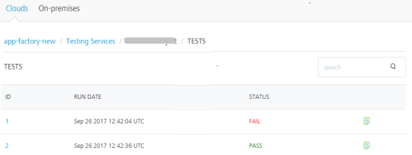

                               

User Guide: Managing Cloud Environments

Environments - Volt MX Cloud
============================

By default, at least one Cloud/Environment is configured for your Volt MX Cloud account. Environments can include at least one server or a combination of all servers, such as Volt MX Foundry Integration, Volt MX Foundry Engagement, Volt MX Foundry Sync, and Volt MX Foundry Management. You can view your clouds in the **Environments** page in Volt MX Foundry console for Cloud.

For more details on HCL AppFactory such as how to configure your first app using your source code repository, build and deploy apps, deliver apps, refer [HCL AppFactory User Guide](../../../Foundry/voltmx_appfactory_user_guide/Content/Introduction.md).

> **_Important:_**  Ensure that your environments include all required servers that are part of an app.   
For example, if your environment contains only Volt MX Foundry Sync, and you try to publish an app with Volt MX Foundry Engagement, the system throws an error.

From the **Environments** (VoltMX Cloud) page, you can navigate to the existing Clouds in your account:

*   **Clouds**: Following consoles are available for each of the cloud account:
    
    *   **App Services**: For more information, refer [Appendix - App Services](Appendix_-_App_Services.md).
    *   **Log Services**: For more information, refer [Log Services](Logging_as_a_Service.md).
    *   **Volt Foundry Messaging**: For more information, refer [Volt Foundry Messaging](../../../Foundry/vms_console_user_guide/Content/Introduction_1.md).
    
    > **_Note:_** You can view all applications published to a Runtime Environment. [Refer Applications Published to a Runtime Environment](Published_Apps-Environments.md)
    

Managing Cloud Environments
---------------------------

You can manage user access to the existing clouds in the **Environments** page in Foundry console such as viewing published apps to a cloud, managing features of a cloud, renaming a cloud, and deleting a cloud.

1.  From the left pane in your Volt MX Foundry Console, click **Environments**. This displays the list of environments configured for your Volt MX Foundry Cloud account.

1.  Click the **More Options** button of an environment.
    
    > **_Note:_**  The **More Options** button in the **Environments** page is available only if you have the Admin access.
    
    
    
2.  Perform the following actions for a cloud environment:
    
    <table style="mc-table-style: url]('Resources/TableStyles/Basic.css');width: 626px;" class="TableStyle-Basic" cellspacing="0"><colgroup><col class="TableStyle-Basic-Column-Column1" style="width: 146px;"><col class="TableStyle-Basic-Column-Column1"></colgroup><tbody><tr class="TableStyle-Basic-Body-Body1"><td class="TableStyle-Basic-BodyE-Column1-Body1">Published Apps</td><td class="TableStyle-Basic-BodyD-Column1-Body1">Helps you to view the list of apps published to an environment and EAS and the runtime status of the apps. <a href="Published_Apps-Environments.html" target="_blank">Click here for more information.</a></td></tr><tr class="TableStyle-Basic-Body-Body1"><td class="TableStyle-Basic-BodyE-Column1-Body1">Manage Access</td><td class="TableStyle-Basic-BodyD-Column1-Body1">Helps you to manage environment access for all the existing users in a particular account. <a href="ManageCloudFeatures.html" target="_blank">Click here for more information.</a></td></tr><tr class="TableStyle-Basic-Body-Body1"><td class="TableStyle-Basic-BodyE-Column1-Body1">Rename</td><td class="TableStyle-Basic-BodyD-Column1-Body1">Helps you to rename this cloud environment.</td></tr><tr class="TableStyle-Basic-Body-Body1"><td class="TableStyle-Basic-BodyB-Column1-Body1">Delete</td><td class="TableStyle-Basic-BodyA-Column1-Body1">Helps you to delete this cloud environment.</td></tr></tbody></table>
    

Limiting the Size of Storage Services - Environments in Cloud for Starter Edition
---------------------------------------------------------------------------------

The **Limiting space for storage service** feature enables to limit the total storage used at a tenant level (Multi-tenant) for users in Cloud environments for Volt MX Apps Server. This feature is enabled for Volt MX Foundry Starter Edition.

By default, all Cloud users in Volt MX Starter Edition are provisioned with 1 GB size limit for storage services on App Servers. So, users can use the default storage in the run-time server to deploy the resources such as Web Apps, Native Apps, Storage Objects, and Runtime Services (for custom JARS and data in DB)

The **Environments** page displays the users’ usage of storage resources for app server in the Volt MX Foundry, as follows:

*   **Storage** displays the amount of storage used and the allowed total storage limit for that environment.
*   **Last updated on** displays the last time when it was measured.
*   A user can check the latest status of the storage occupied and limit by clicking the **Refresh** button.

The following are the notification messages for space for storage services:

*   When the storage space occupied by a tenant reaches 90%, a warning notification mail will be sent.
*   When the storage space occupied by a tenant reaches 100%, an error notification mail will be sent.
*   Once the space occupied by a tenant reaches 100%, apps publish will be blocked and an error message will be sent. All create/update calls for storage services will also be blocked for the tenant.
*   If the storage space had reached 90% or 100%, then space is cleared up later, and then increased it again to reach 90% or 100%, corresponding notification mail will be sent again.

> **_Note:_** The storage limit can be increased based on user's request in case the user wants to upgrade his resources for Starter Edition. For example, A user buys SMB edition and wants to increase the limit of the storage DB, he can request Volt MX for upgrading storage size limit.

HCL AppFactory Cloud
------------------------

The HCL AppFactory is a combination of agile methodologies and tools that allow teams to deliver apps at scale. HCL AppFactory® allows building omni-channels mobile applications with a few clicks. The AppFactory runtime automates SDLC process of your product lifecycle and reduces Time to Market by cost effective automatic solution of product release management. Finally, deploy the application to a specific environment and test the application in that environment using automated testing on real devices.

Using HCL AppFactory Cloud, you can view the list of app builds, configured apps, and test results corresponding to the apps. You can enable HCL AppFactory Cloud in Volt MX Cloud account. For more details on how to enable HCL AppFactory, contact [support@voltmx.com](mailto:support@voltmx.com).

Once HCL AppFactory Cloud is enabled, you can view the HCL AppFactory Cloud along with other clouds in the **Environments** page in Volt MX Foundry Console.

You can perform the following tasks through HCL AppFactory Cloud in Volt MX Foundry Console:

*   Click **Source Code Control** to navigate to your GitHub page for code check-ins and develop apps.
*   Click **Build Management** to navigate to your source automation server (for example, Jenkins) to automate the software development process.
*   Click **Test Services** to view results of build execution and test execution.
    
    The **Testing Services** pages detail app names, test project creation date, test results and statuses, and build statuses of your apps.
    
    
    
    *   The **TESTS** page displays a list of test results for a project/app. For viewing the details, you can click **View** button.  
        
        
        
        Test results will retrieve stored assets, videos, and logs.  
        Click **View**. The following screen appears with details:
        
        
        
        *   To view the test results of an app, click **View** in the **TESTS** screen. The following screen appears with sample details:
            
            
            
    *   The **BUILDS** page displays a list of builds triggered and build status for selected channels in a project. For viewing the details, you can click the **View** button.  
          
        Click **View**. The following screen appears with details:
        
        
        
        *   To view the results of a build or app, click **View** in the **BUILDs** screen. The following screen appears with sample details:
            
            
