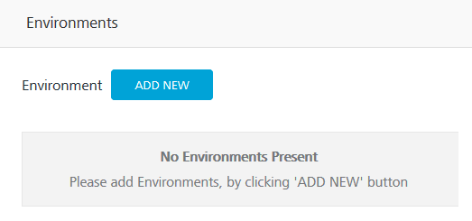
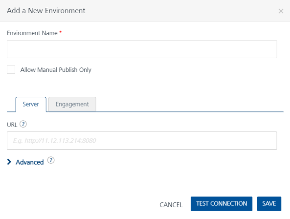
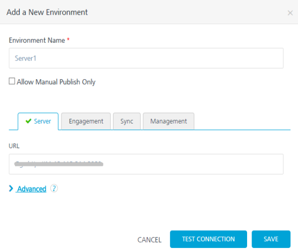
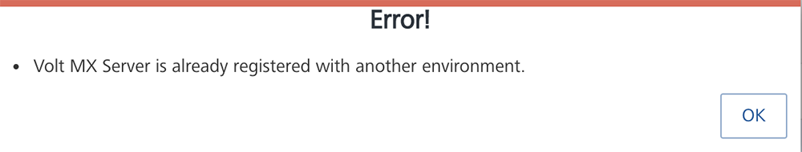
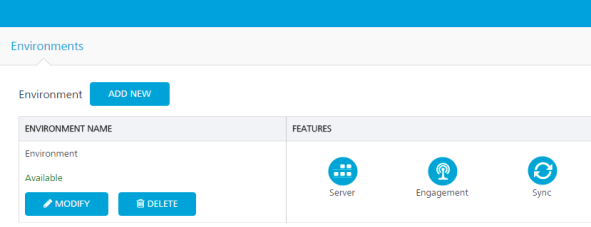
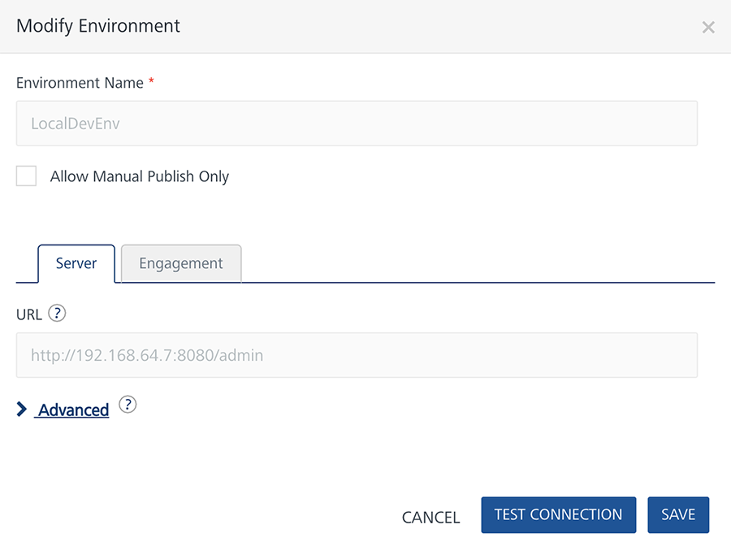
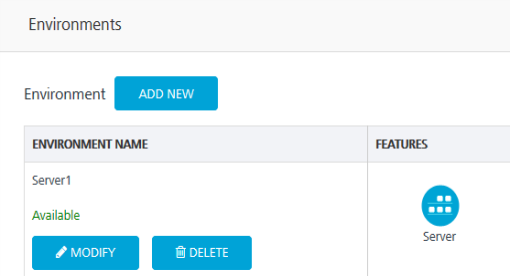
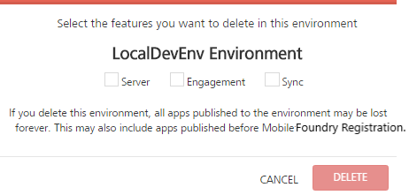

                              

User Guide: How to Add an Environment

Environments - On-Premises
==========================

You need to create an environment to publish your apps. Environments can include at least one server or a combination of all servers, such as Volt MX Foundry Integration, Volt MX Foundry Engagement, Volt MX Foundry Sync, and Volt MX Foundry Management.

> **_Important:_**  As a user, you must be an admin or owner to access the Environments page and perform different tasks based on your role.

> **_Important:_**  Ensure that your environments include all required servers that are part of an app.   
  For example, if your environment contains only Volt MX Foundry Sync, and you try to publish an app with Volt MX Foundry Engagement, the system throws an error.

How to Add an Environment
-------------------------

You can add environments with different combinations of servers.

To add an environment, follow these steps:

1.  In your Volt MX Foundry account, in the left-pane, click **Environments**. The **Environments** page appears.
    
    
    
2.  Click the **ADD NEW** button. The **Add a New Environment** dialog appears.
    
    
    
3.  In the **Environment Name** text box, enter an environment name.
    
    > **_Note:_** Your Environment name can only contain letters, numbers, and hyphens (-). A hyphen cannot appear at the beginning or at the end of a name. A number cannot appear at the beginning of a name. A name should be a minimum of three characters and a maximum of 20 characters long.  
    
4.  Select the **Allow Manual Publish Only** check box for not publishing the .war file if you have uploaded it for **Web** platform under the **Manage Client App Assets** tab. By default, the **Allow Manual Publish Only** check box is cleared.
    
5.  In the services section, follow these steps.
    
    The **Add a New Environment** dialog contains the Server, Engagement, Sync, and Management tabs. The input values are URL, username, and password. By default, the system will display the **Server** tab. 
    
    1.  In the **Server** tab, provide the following details:
        
        *   **URL**: Enter the URL for your Volt MX Foundry Integration.  
            The URL format is: `<http or https>://<server_host>:<server_port>`  
            For example, a sample URL: `http://mbaastest30.hcl.net:53504`
        *   Under **Advanced:**
            
            *   **Feature Username**: By default, this field shows the default username of Volt MX Foundry Integration. You can modify the username, if required.
            
            *   **Feature Password**: By default, this field shows the default password of Volt MX Foundry Integration. You can modify the password, if required.
        
        > **_Note:_**  You need to modify the username and password only if these credentials are changed via Volt MX Foundry Server Console.
        
    
    

Click here to configure other environments such as Engagement, Sync, or Management.

    
1.  To configure the Volt MX Foundry Engagement, click the **Engagement** tab, and provide the following details:
    *   **URL**: Enter the URL for your Volt MX Foundry Engagement.
        *   Under **Advanced**:
            
        *   **Feature Username**: By default, this field shows the default username of Volt MX Foundry Engagement. You can modify the username, if required.
            
        *   **Feature Password**: By default, this field shows the default password of Volt MX Foundry Engagement. You can modify the password, if required.
                
        > **_Important:_**  Support for Volt MX Foundry Engagement is available from Volt MX Foundry Engagement Version 6.0.1 onwards.
                
2.  To configure the Volt MX Foundry Sync, click the **Sync** tab, and provide the following details:
    *   **URL**: Enter the URL for your Volt MX Foundry Sync.
    *   Under **Advanced**:
            
    *   **Feature Username**: By default, this field shows the default username of Volt MX Foundry Sync. You can modify the username, if required.
            
    *   **Feature Password**: By default, this field shows the default password of Volt MX Foundry Sync. You can modify the password, if required.
3.  To configure the Volt MX Foundry Management, click the **Management** tab, and provide the following details:
    *   **URL**: Enter the URL for your Volt MX Foundry Management.
    *   Under **Advanced**:
            
    *   **Feature Username**: By default, this field shows the default username of Volt MX Foundry Management. You can modify the username, if required.
            
    *   **Feature Password**: By default, this field shows the default password of Volt MX Foundry Management. You can modify the password, if required.

    
6.  Once you enter details, click **TEST CONNECTION**.  
    If the server details are correct, the system displays a check mark next to a service, shown below:
    
    
    
    > **_Important:_**  The system allows you to add a unique server URL to only one environment.  
    If a server is already configured with an environment and you try to add the same server to another environment, the system will throw an error, shown below:   
      
    Click **OK** to confirm.
    
7.  Click **SAVE** to apply the environment capabilities. The environment is created in the **Environments** page.  
    
    
    
    The **Environment** list view displays the following columns:
    
    *   **Environment Name**: Displays the name of the environments.
    *   **Administration**: Displays servers configured for an environment such as Volt MX Foundry Integration, Volt MX Foundry Engagement, Volt MX Foundry Sync, and Volt MX Foundry Management.

How to Modify an Environment
----------------------------

The Volt MX Foundry Console allows you to view as well as add servers to an environment.

To modify an environment, follow these steps:

1.  In your Volt MX Foundry account, click **Environments**. The **Environments** page appears.
2.  Click **MODIFY** for an environment.
    
    
    
    The **Modify Environment** page appears, shown below:
    
    
    
    You cannot edit the **Environment Name** and **URL** fields.
    
3.  You can modify the environment, if required. Select the **Allow Manual Publish Only** check box for not publishing the .war file if you have uploaded it for **Web** platform under the **Manage Client App Assets** tab.
    
4.  Click other tabs to add servers.
5.  Click **TEST CONNECTION** to validate the details.
6.  Click **SAVE**.

> **_Note:_** You can view all the applications published to a Runtime Environment. Refer to [Applications Published to a Runtime Environment](Published_Apps-Environments.md).

How to Delete an Environment
----------------------------

When an environment is deleted, the system deletes the environment and its data from the console.

1.  In your Volt MX Foundry account, click **Environments**. The **Environments** page appears.
    
    
    
2.  In the **Environment Name** column, select an environment, and then click **DELETE**.
    
    The **Delete** confirmation dialog appears, shown below:
    
    
    
    > **_Note:_**  The **DELETE** button dims when you have not selected any check boxes for an environment. When you select a check box for an environment, only then the **DELETE** button is available.
    
3.  Select the check box for each of the listed environments and click **DELETE.**
    
    The system deletes the environment from the grid. If you delete this environment, all apps published to the environment may be lost forever. This may also include apps published before Volt MX Foundry registration.
    
    > **_Note:_** You can view all the applications published to a Runtime Environment. Refer to [Applications Published to a Runtime Environment](Published_Apps-Environments.md).
