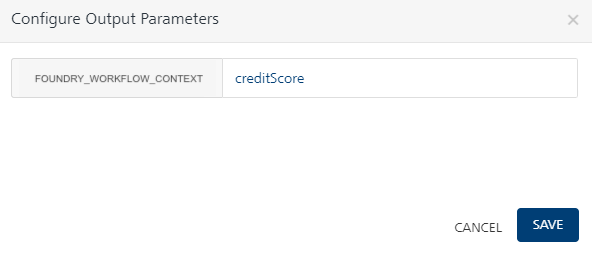
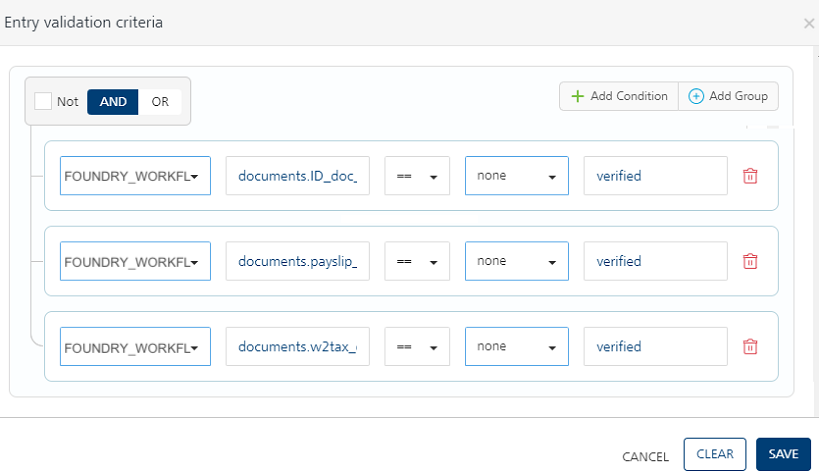

                              

Event Triggered Workflow Implementation
=======================================

Usecase
-------

Let us create a simple Loan application Workflow that is invoked whenever an event is raised on Foundry for when a customer submits a Loan application.

In this example, the loan application process will have the following steps:

*   In the example provided, the Signal Start node – “Start – submit application” is configured to listen to an event topic name – “LoanProcess/startProcess”. This event will be fired whenever an object “LoanObject’s POST verb is called and it raises an event to topic “LoanProcess/startProcess” on the incoming request.

    
    

*   When a loan application is submitted, the object POST fires an event “LoanProcess/startProcess” on the incoming request. In turn, the Signal Start node of the workflow that is listening to this event is triggered asynchronously and the workflow starts execution.
    
    
    
*   Using the mapping configuration in the Process Incoming parameters dialog, map the SSN and application ID from incoming Event payload that is already copied into DEVICE\_REQUEST scope and set them as Correlation ID. In addition, map the loanAmount parameter as well and all these 3 parameters are then stored in startSignalParams in workflow\_context.
    
    > **_Important:_** A Correlation ID is mandatory to uniquely identify the workflow instance to start or resume. You can map Correlation ID to any parameter from the Event payload that is available in the DEVICE\_REQUEST namespace. In this case, the SSN and application ID are mapped as Correlation ID.
    
*   In the next service task – Equifax:getCreditScore, the credit score of the user is retrieved based on SSN from the integration service. In our example, a mock service has been used to calculate the credit score.
    
*   The next node in this example is a Catch Signal. Whenever a workflow needs to pause for another intervention/ external event, the Workflow will pause at a Catch Signal and it will resume automatically after another configured event is raised to which the paused workflow is listening, and it resumes.
*   The workflow will arrive at the Catch-document verification node and remain in a paused state. Let’s say after the customer submits the loan application and we have run his credit score, the business process is now waiting to complete his document verification process. Hence to model this, we can have a Catch Signal node that is waiting for an event to be raised on topic – “LoanProcess/documentsValidation”.
    
    
    
*   As we can see from the Process Incoming Payload pop-up of the Catch Signal properties, once an event “LoanProcess/documentsValidation” is raised by some other foundry service, the workflow resumes execution. At this point, we can once again map the parameters from incoming Event payload into workflow\_context like shown.
    
    > **_Important:_** The Correlation ID parameters already configured in the Signal Start event will be used in the Catch Signal event to identify and resume the workflow instance, please ensure that the Event payload contains the Correlation ID parameters with the same field names as mapped from DEVICE\_REQUEST scope in Signal Start. In our example, we have to ensure to pass applicationId, SSN in the Event payload when resuming execution on Catch signal.
    
*   The next task in our example is an Exclusive gateway that checks for Document verification status and based on that workflow takes different execution paths. This is determined from the doc\_status parameters from the Event payload of “loanProcess/eventListener”
    
*   In case of Pending Documentation : If the document verification is in a pending state, a Throw Signal node is configured to raise an event to Foundry, with the topic name “loanProcess/eventListener”. You can use the Configure Event payload pop-up to construct the event payload from the workflow namespaces. In our example, once this event “loanProcess/eventListener” is fired, an Email integration service that is listening to this event will get invoked. To this extent, we are passing ToEmail, Subject, Message as Event payload from Throw Signal in the workflow.
    
*   **In case of Valid Documentation**:
    1.  After the documents are verified, the applicant’s loan application request is checked for loan eligibility, based on a rules service and it returns a decision of either Approval or Rejection.
    
    *   **If eligible for the loan**
        1.  An event is raised using Throw Signal that fires an event “loanProcess/eventListener”. This in-turn triggers an email integration service that is used to notify the user about the approval status of the loan application.
            
        2.  4\. The event workflow is completed for the request.
            
    *   **If not eligible for the loan**
        1.  An event is raised using Throw Signal that fires an event “loanProcess/eventListener”. This in-turn triggers an email integration service that is used to notify the user about the Rejection status of the loan application.
        2.  The event workflow is completed for the request.
    

Loan Application Event Triggered Workflow
-----------------------------------------

### Pre-requisites

To create a workflow for the steps that were discussed in this example, you must have the necessary Integration Services configured in your Volt MX Foundry console.

<!-- [Click here](https://docs.voltmx.com/9_x_PDFs/voltmxfoundry/EventTriggeredWorkflow(v1.0).zip) to download the EventTriggeredWorkflow sample app required to create the workflow and import the same into your Volt MX Foundry console.  -->

[Click here](https://github.com/HCL-TECH-SOFTWARE/volt-mx-docs/raw/master/voltmxlibrary/foundry/zip/user_guide/EventTriggeredWorkflow(v1.0).zip) to download the EventTriggeredWorkflow sample app required to create the workflow and import the same into your Volt MX Foundry console. 

### Create Workflow

To create the Loan Application workflow, do the following:

*   From the dashboard in Volt MX Foundry console, click the Foundry app where you have imported the Integration Services related to this use case, and click the Workflows tab. The Workflow’s landing page appears.
*   Click **Configure New** from the landing page, the Configure New screen appears.
*   In the **Name** field, type a unique name for the new Workflow service. For example, **LoanApplication**.
*   Select the **Event** from the **Trigger** list.
*   The Start Signal is placed in the canvas by default. Select the Start Signal in the Workflow canvas area and click the Properties pane:  
    *   In the **Name** field, type the required name of the Start Signal based on the activity it handles. For example, **Start - submit loan application**.
    *   In the **Event Topic Name** field, type the topic name of the event - LoanProcess/startProcess.
        
    *   In the **Process Incoming Payload**, click **EDIT CONFIGURATION** to map the request input parameters and Correlation ID from Event Payload to workflow\_context here.
        
        *   Correlation ID is mandatory to uniquely identify the workflow instance to start or resume. Based on the Correlation ID, an event for the given topic name is raised. You can map Correlation ID to any parameter from the Event payload that is available in the DEVICE\_REQUEST namespace.
        *   Select SSN and application ID device request params as Correlation ID params
        *   Type a key name “startSignalParams” in the text input next to FOUNDRY\_WORKFLOW\_CONTEXT. The parameters mapped in the table below will get stored in workflow\_context using the “startSignalParams” key name.
        
        
        
*   Drag and drop a Service Task next to the Start Signal and connect them. Click the Properties pane. You can do the following in the Properties pane:  
    *   In the **Name** field, type the required name of the service task based on the activity it handles. For example, **Equifax: getCreditScore**.
    *   From the **Service Type** list, select **Integration Service**.
    *   From the **Integration Services Linked** list, select **EquifaxSvc**.
    *   From the **Operations** list, select **getCreditScore**.
    *   Click Input Parameters **Configure** to manage the integration service’s request input parameters. In the **Namespace** column, select **DEVICE\_REQUEST** for the input parameter displayed and type appropriate data for each parameter in the **Value** column.  
        
    *   Click Output Parameters **Configure** to store the integration service’s output response. The response from each service task is saved in the FOUNDRY\_WORKFLOW\_CONTEXT namespace under the key name specified here. Type **creditScore** which acts as a variable for the namespace (Foundry\_Workflow\_Context.creditScore).  
        
    
*   Drag and drop a Catch Signal Event next to the ****Equifax: getCreditScore**** service task and connect them. Click the Properties pane. You can do the following in the Properties pane:
    *   In the **Name** field, type the required name of the exclusive gateway based on the activity it handles. For example, **Catch - document verification**.
    *   In the **Event Topic Name** field, type the topic name of the event. For example, LoanProcess/documentsValidation
        
    *   In the **Process Incoming Payload**, click **EDIT CONFIGURATION** to copy the request input parameters from Event Payload to workflow\_context here.
        
        The event payload for the configured Event topic is available in the DEVICE\_REQUEST namespace. Users can copy required data from Identity/Session as well as Event Payload to workflow\_context here.
        
        > **_Note:_** The Correlation ID parameters already configured in the Signal Start event will be used in the Catch Signal event to identify and resume the workflow instance. Ensure that Event payload contains following Correlation ID parameters with same field names as mapped from DEVICE\_REQUEST scope in Signal Start:  
        `applicationId` and `SSN`
        
        
        
*   Drag and drop an Exclusive Gateway next to the Catch Signal and connect them. Click the Properties pane. You can do the following in the Properties pane:
    
    *   In the **Name** field, type the required name of the exclusive gateway based on the activity it handles. For example, **document verification status**.
        
    *   As **document verification status** is an exclusive gateway, two flows emerge from here. One flow determines the path of the workflow if the documents are in verified status. Name the flow as **Documents verified**. The other flow determines the path of the workflow if the documents are invalid. Name the flow as **Documents pending.**
*   Click the **Documents verified** flow, and do the following:  
    *   In the Properties pane, click **Edit** under **Entry Validation criteria**.
    *   Click **Add Condition**. Select **FOUNDRY\_WORKFLOW\_CONTEXT** from the **Namespace** list, and in the **Value** field type documents.ID\_doc\_status.
    *   Click **Add Condition**. Select **FOUNDRY\_WORKFLOW\_CONTEXT** from the **Namespace** list, and in the **Value** field type documents.payslip\_doc\_status.
    *   Click **Add Condition**. Select **FOUNDRY\_WORKFLOW\_CONTEXT** from the **Namespace** list, and in the **Value** field type documents.w2tax\_doc\_status.
    *   From the operators list select `== and choose ‘none’for namespace and type verified` and click **Save**, for all the conditions.
      
    
*   Click the **Documents pending** flow, and do the following:  
    *   In the Name, type documents pending.
*   Connect the **Documents pending** flow with a Throw Signal Event and click the Properties pane. You can do the following in the Properties pane:
    *   In the **Name** field, type the required name of the message task based on the activity it handles. For example, **Throw signal**.
    *   In the **Event Topic Name** field, type the required name of the event's topic. For example, **loanProcess/eventListener**.
    *   Under Configure Event Payload, click CONFIGURATION, and do the following:
        
        *   Click **Add Parameter**. Type ‘to’ under Name column, select **DEVICE\_REQUEST** from the **Namespace** list and in the **Value** field type emailId.
        *   Click **Add Parameter**. Type ‘subject’ under Name column, select String datatype, select **None** from the **Namespace** list and in the **Value** field type Please submit all the documents.
        *   Click **Add Parameter**. Type ‘message’ under Name column, select String datatype, select **None** from the **Namespace** list and in the **Value** field type Hello,   You have not submitted required documents. In order to proceed further, please submit required documents.  Thanks.
        *   Click **Save**.
        
        
        
*   Connect the **Throw Signal** node with the **Catch - document verification**.
*   Connect the **Documents verified** flow with a Business Rules Task and click the Properties pane. You can do the following in the Properties pane:  
    *   In the **Name** field, type the required name of the service task based on the activity it handles. For example, **Rule Task - check eligibility**.
    *   Link this task to a Rules service and select **checkLoandEligibility** for Rule Set and **isLoanEligible** for Rule in the respective drop-downs as you have done in the previous service task.
    *   Click Input Parameters **Configure** to manage the integration service’s request input parameters.
        *   In the **Namespace** column, select FOUNDRY\_WORKFLOW\_CONTEXT the input parameter and type creditScore.score in the **Value** column.
        *   In the **Namespace** column, select FOUNDRY\_WORKFLOW\_CONTEXT the input parameter and type startSignalParams.loanAmount in the **Value** column as the output of the **loanAmount** was stored in FOUNDRY\_WORKFLOW\_CONTEXT.
            
            
            
    *   Click Output Parameters **Configure** to manage the Rule service’s output response. The response from each service task is saved in the FOUNDRY\_WORKFLOW\_CONTEXT namespace. Type **eligibility** as a key name to store the Rule output into workflow\_context as (Foundry\_Workflow\_Context.eligibility).
    
*   Drag and drop an Exclusive Gateway next to the **Rule Task - check eligibility** task click the Properties pane. You can do the following in the Properties pane:
    *   In the **Name** field, type the required name of the exclusive gateway based on the activity it handles. For example, **Check Eligibility**.
*   As **Check Eligibility** is an exclusive gateway, two flows emerge from here. One flow determines the path of the workflow if the loan is **Eligible**, and the other flow determines the path of the workflow if the loan is **Ineligible**.
*   Click the **Eligible** flow, and do the following:
    *   In the Properties pane, click **Edit** under **Entry Validation criteria**.
    *   Click **Add Condition**. Select **FOUNDRY\_WORKFLOW\_CONTEXT** from the **Namespace** list and type “eligibility.status” on the LHS.
    *   From the operators list select `== and choose ‘none’ namespace from drop-down and type ‘Approve’ on RHS` and click **Save**.
*   Connect the **Eligible** flow with a Throw Signal Event and click the Properties pane. You can do the following in the Properties pane:
    *   In the **Name** field, type the required name of the message task based on the activity it handles. For example, **Loan Application Approved**.
    *   **Event Topic Name**: Enter the event topic name, loanProcess/eventListener.
    *   Under **Configure Event Payload**, click **EDIT CONFIGURATION**, and do the following:
        
        *   Click **Add Parameter**. Type ‘to’ under **Name** column, select **DEVICE\_REQUEST** from the **Namespace** list and in the **Value** field type emailId.
        *   Click **Add Parameter**. Type ‘subject’ under **Name** column, select String datatype, select **None** from the **Namespace** list and in the Value field type "Your loan application has been approved."
        *   Click **Add Parameter**. Type ‘message’ under **Name** column, select String datatype, select **None** from the **Namespace** list and in the **Value** field type Hello,   Your loan application has been approved.  Thanks.
        *   Click **Save**.
        
        
        
*   Place an **End** node after the **Loan Application Approved** service task to finish the loan application flow path.
    
*   Click the **Ineligible** flow, and do the following:
    *   In the Properties pane, click **Edit** under **Entry Validation criteria**.
    *   Click **Add Condition**. Select **FOUNDRY\_WORKFLOW\_CONTEXT** from the **Namespace** list and type “eligibility.status” on the LHS.
        
    *   Click **Add Condition**. Select **BACKEND\_RESPONSE** from the **Namespace** list and in the **Value** field type WorkflowField.
    *   From the operators list select `==` and choose `‘none’ namespace from drop-down and type ‘Reject’ on RHS` and click **Save**.
*   Connect the **Ineligible** flow with a Throw Signal Event and click the Properties pane. You can do the following in the Properties pane:
    *   In the **Name** field, type the required name of the message task based on the activity it handles. For example, **Loan Application Rejected**
    *   Event Topic Name : loanProcess/eventListener
    *   Under Configure Event Payload, click EDIT CONFIGURATION, and do the following:
        
        *   Click **Add Parameter**. Type ‘to’ under **Name** column, select **DEVICE\_REQUEST** from the **Namespace** list and in the **Value** field type emailId.
            
        *   Click **Add Parameter**. Type ‘subject’ under **Name** column, select String datatype, select None from the **Namespace** list and in the **Value** field type Your loan application is Rejected.
            
        *   Click **Add Parameter**. Type ‘message’ under **Name** column, select String datatype, select **None** from the **Namespace** list and in the **Value** field type Hello, Your loan application has been rejected due to low credit score. Thanks.
            
        *   Click **Save**.
        
            
        
*   Place an **End** node after the **Loan Application Rejected** Throw Signal Event to finish the **Ineligible** flow path.

### How to Set the corresponding Triggering Events and Listening Events

The following steps help you how to configure the Events on the object verbs and in the Email integration service.

*   The workflow execution will be started by firing a “Loan Application /Start process” event. Go to object services, select **LoanObject**, choose the Mapping tab, and select **CREATE** verb. Under that, go to the **Advanced Setting**, choose the **Server Events** tab and check “Raise event on Incoming Request” and type the Topic name “Loan Application/ Start Process” here.
    
    
    
*   The workflow execution will pause at the Catch signal and can be resumed by firing a “LoanProcess/documentsValidation” event. Go to object services, select **LoanObject**, choose the Mapping tab, and select **UPDATE** verb. Under that, go to Advanced setting, choose Server Events Tab and check “Raise event on Incoming Request” and type the Topic name “LoanProcess/documentsValidation” here.
    
    
    
*   Similarly to configure the listener for the topics raised by “Throw Signal” on workflow, go to Integration services, choose Email Service, select Email\_Operations\_SendEmail. Under that, expand **Advanced** section, open **Server Events** tab and check “Subscribe to an event”, type “loanProcess/eventListener”
    
    
    

Once the Workflow is created, do the following to publish the Foundry app:

*   Click the Publish tab.
*   Select the required runtime environment.
*   Click Publish.

Test the Workflow
-----------------

After the app is successfully published, you can check the workflow functionality through the following means:

*   Runtime server (Admin console)
*   Postman

### Runtime Server (Admin Console)

Click the Workflow icon in the Consoles section of the environment where the Foundry app is published. The Workflow Services screen from Admin Console appears in a new tab.

The Workflow Services screen lists all the workflows that were created and published in the current environment. To test the workflow which you have created (LoanEligibilityProcess), do the following:

1.  Log in App Services Console where you have published the Events Workflow app.
2.  From the left-side menu, click Object Services.
3.  Locate the loanApplicationSvc Object service. From the App Data Model Objects column select the operation, LoanObject.
4.  From the Operations list, select create (POST). The Request Input screen of the selected operation appears.
5.  Provide the input request body here. The request input will contain fields like the following:  
    
    <pre><code>
    {
        "applicationId": "",
        "SSN": "",
        "loanAmount": "",
        "emailId": "",
        "phoneNo": ""
    }
    </code></pre>

7.  Click **Get Response**. The response will have the following parameters:  

    <pre><code>
    {
        "applicationId":1,"opstatus":0,"httpStatusCode":0
    }
    </code></pre>

9.  Now you can check the status of the LoanEligibilityProcess workflow from the Workflow service tab. The workflow would have been started due to the Event triggered from the object CREATE and now the Workflow status will be Paused at the **Document Verification** catch signal task.
    In order to resume the workflow from the Catch signal, it needs to receive another event which will get fired on the Update operation of the object.
        
10.  Repeat Step 2 and Step 3.
11.  From the Operations list, select `update` operation. The Request Input screen of the selected operation appears.
12.  Provide the value for `ID_doc_status`, `payslip_doc_status`, and `w2tax_doc_status` parameters as **verified** so that the exclusive gateway condition will evaluate to true and workflow will proceed to the subsequent Rule task.
    
    > **_Important:_** The value for these three doc\_status parameters should be the same and in a case sensitive (lower case), for example, `verified`.
    
    > **_Important:_** You must send all the following **mandatory** Correlation ID parameters (SSN, applicationID) in the update operation, as below:
    
    <pre><code>
    {
        "applicationId": "",
        "SSN": "",
        "loanAmount": "",
        "emailId": "",
        "phoneNo": ""
         "ID_doc_status": "",
        "payslip_doc_status": "",
        "w2tax_doc_status": "",  
    }
    </code></pre>

13. Click **Get Response**.  

    <pre><code>
    {
            "totalRecords":1,"updatedRecords":1,"applicationId":12,"opstatus":0,"httpStatusCode":0
    }
    </code></pre>
    
    > **_Important:_** If the Exclusive Gateway condition is not satisfied, the workflow again goes to a paused state in Catch Signal. Refer to Step 7 in this procedure.
    
14.  Now you can check the status of the LoanEligibilityProcess workflow from the Workflow service tab. The Workflow status will be Completed.

> **_Note:_** In this testing process, it is assumed that all the service tasks, exclusive gateways, and message tasks used were executed successfully.

> **_Note:_** To view the execution status of a workflow service by using Volt MX App Services Console, refer to [VoltMX App Services Console > Workflow Services](../../../Foundry/vmf_integrationservice_admin_console_userguide/Content/Workflow.md) section.
