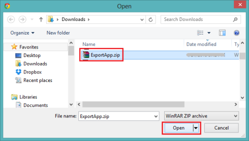
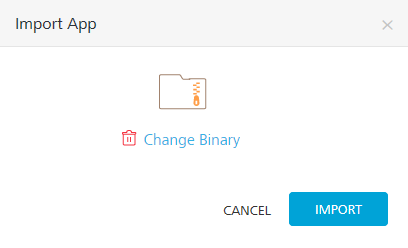

User Guide: Introduction

# Exporting and Importing an Application

## Introduction

You can export apps from one workspace (VoltMX account) and import them to different workspaces of the Volt MX Foundry Console. An exported or imported app has services configured into it.

A Volt MX Foundry app comprises a group of services. They are:

- Non-shared services that cannot be shared with other apps, such as Volt MX Foundry Sync and Volt MX Foundry Messaging.
  - Volt MX Foundry Sync enables developers to add synchronization capabilities to mobile applications. Fundamental to Sync Framework is the ability to support offline and collaborative data between devices and the back-end systems.
  - Volt MX Foundry Messaging allows developers to upload push certificates for iOS, Android, BlackBerry, and Windows 8 RT platforms.
- Shared services that can be shared with other apps, such as custom code JAR files, integration services, and orchestration services.
  - The integration service of an application represents the application interaction with the external data source.
  - Service orchestration coordinates or integrates several services and exposes them as a single service.

> **_Important:_**  Support for importing and exporting apps is available for identity services, such as Volt MX SAP, Volt MX Custom Identity, Salesforce, and Facebook.

## Use Cases

You use exporting and importing apps based on the following scenarios:

- To move an app from one workspace (VoltMX account) to another workspace of the Volt MX Foundry installation. For example, a user completes the development of an app in a developer environment and later wants to move the app to a system integration testing (SIT) or user acceptance testing (UAT) workspace. A user exports an app from a developer environment and then imports the app into another workspace of the Volt MX Foundry installation. The user then moves the app to a production workspace.
- To merge changes made to an app in the repository (also known as check-in or commit) with the changes you have on your machine, such as Git source control management system.  
  For example, a user exports an app from the Volt MX Foundry portal and merges the services of the app to the Git repository.

  > **_Important:_**  To merge configuration changes made to an existing app to a source control system (for example, Git), you must export an updated app with the same details as the earlier version of the app in the source control system.

  > **_Important:_**  You must republish the app for the new settings to take effect.

- To back up and restore (rollback) Volt MX Foundry apps. You can do backup of a Volt MX Foundry app package, and then you can restore the app to a previously defined state. You can restore a complete app or the services part of the app. For example, you can restore a complete app package to recover from an error.

## How to Export an App

When an app is exported from a workspace, the exported app is saved with the same name of the app - for example, `ExportApp.zip`. An exported .zip file has an app's configured services information, such as icon files, certificates, .XML files, and meta files.

> **_Note:_**  You cannot import an exported app after you modify the structure in the exported app. Support for importing an edited zip (exported app) file is not available. If you try to import an edited ZIP file, the system may fail to import the app successfully.<br>  
> An exported zip file should have the correct folder structure. An exported zip file should have correct references in meta files. For more details about the folder structure of an exported app, refer to the [Folder Structure of an Exported App](#folder-structure-of-an-exported-app) section.

> **_Important:_**  Before exporting an app, do not unlink identity services that are referenced in the integration services of the app.  
> If you unlink a referenced identity service in the **Identity** tab and try to export an app, the system fails to export that app.

> **_Important:_**  Before exporting an app, do not unlink integration services that are referenced in the orchestration services of the app. If you unlink a referenced integration service and try to export an app, the system fails to export that app.

To export an app from a workspace (VoltMX account), follow these steps:

1.  From the Volt MX Foundry Console, click **Apps** to display the **[Applications](Adding_Applications.md#AppsinAppsPage)** page.
2.  In the **Applications** page, hover your cursor over the **App menu** button of one of the apps in the list. Click **Export**.

    

    The system saves the app as  <code><em>&lt;_AppName_&gt;</em>.zip</code> in your browser's default download location.

    > **_Important:_**  You must republish the app for the new settings to take effect.

> **_Note:_**  You can also export an App via API. For more details, refer to [Continuous Integration - Export an app via API](CI_with_Foundry_APIs.md#export-an-app)

## How to Import an App as a New App

With importing an app as a new app, you can create new apps quickly by reusing configurations from existing apps. You save time because this method reduces the number of steps needed to re-create an app. After you import an app as a new app, you can modify configurations in the app as required.

After an app is exported, you can import it as a new app or overwrite an existing app across various Volt MX Foundry Consoles. When you import an app as a new app, the system imports the app into the console. The imported app includes all data from the original app and the name of the app. The imported app is listed in the **Applications** page.

To import an app as a new app, follow these steps:

1.  From the Volt MX Foundry Console, click **Apps**. The **Applications** page appears.
2.  In the **Applications** page, click the **Import** button.

    

    The **Import App** dialog appears.

    

3.  In the **Import App** dialog, do one of the following:
    - Drag and drop an app zip file into the dialog box.
    - Click **Browse** to select the app through the Microsoft Windows **Open** dialog box, click on the zip file of the app you want to import, and click **Open**.

      

    - Click **Add from Volt MX Marketplace**. Select the app you want to import, and click **Import**.
4.  In the **Import App** dialog, the selected file is added under **Import Options > App Name**. To change the selected file, click **Change Binary**, select the app file you want, and click **Open**.

    

5.  Under the **Import Options**, choose one of the following options.
    - Click **Import as New** to import the app as new. Click **Import**. The app is imported as a new app.

      > **_Important:_**  You must republish the app for the new settings to take effect.

    - Click **Overwrite Existing** to overwrite an existing app, and then do the following:
      1.  Click the **Select App** list, and select one of the existing apps from the list, and then click **Import**.
      2.  If there are any associated JAR files or services in the app that will conflict with the account, they will be listed in the Import App dialog box.  
          
      - If you want to download a file containing a list of the asset conflicts, click the **Conflict Assets List** button.
      - If you want to cancel the app import, click **Cancel**.
      - If you want to finish the import, click **Confirm Overwrite**.
      > **_Important:_**    While overwriting an app, if the app names are same, the new data will override the existing data.
      Based on various services configured in an existing app, the system overwrites the existing data from a zip file. For example:
      - While overwriting an app, if a provider in that Volt MX account exists with the importing identity provider name, the system fails to import the zip file.
      - While overwriting an app, if the existing app has identity, integration, and orchestration services, these services will be unlinked from the existing app.
      - While overwriting an app, if the names of the existing app's integration and orchestration services are the same as those in the zip file, these services will be updated.
      - While overwriting an app, all non-shared services (synchronization and engagement) are overwritten into the existing app. The existing app will only contain new data. You cannot retrieve old data in the existing app.
      > **_Note:_**  You can also import an app via API. For more details, refer to [Continuous Integration - Import an app via API](CI_with_Foundry_APIs.md#import-an-app)

## How to Import an App to an Existing App

You can update an existing app's configurations with the latest configurations made in another app in a different workspace. You can reuse the updated configurations from other apps to save time and development cost.

After an app is exported, you can import the app to an existing app in the Volt MX Foundry Console.

While importing an app to an existing app, if the app names are same, the system overrides the existing data with new data in the imported zip file. The app name will not be changed.

If the app names are different and you import an app, the existing app and data will be overwritten with the new app name and information in the zip file.

To import an app to an existing app, follow these steps:

1.  From the Volt MX Foundry Console, click **Apps**. The **Applications** page appears.
2.  In the **Applications** page, hover your cursor over the App menu button of one of the apps from the list. The **App menu** appears.

    

3.  Click **Import**. The **Import App** dialog appears.

    

4.  In the **Import App** dialog, click **Browse** to display Microsoft Windows **Open** dialog.

    

5.  In the **Open** dialog, locate your exported app (for example, `ExportApp.zip` file), and select it. Click **Open**.  
    In the **Import App** dialog, the selected file is added. To remove the selected file, click the **Remove** button.

    

6.  Click **Import** to import the app. The existing app is updated with the data in the imported zip file.

> **_Note:_**  You can also import an app via API. For more details, refer to [Continuous Integration - Import an app via API](CI_with_Foundry_APIs.md#import-an-app)

## Folder Structure of an Exported App

The folder structure of an exported an app (a zip file) has folders, files, and certificates configured for that app. Do not make any changes to the folder structure outside Volt MX Foundry Console. If you make changes to the folder structure of an app, the system may throw an error while importing that app. The following section explains the hierarchical directory tree of an exported app:

```
 //Folder structure of an exported app

/Apps
/App1
Meta.json
Icon file
/\_Messaging
Meta.json
AppleCert1.p12
AppleCert2.p12
AppleCert3.p12
AppleCert4.p12
/\_Sync
Meta.json
/SyncScope1
Meta.json
Syncobject1.xml
Syncobject2.xml
…
/App2
…
/\_Identity
/Identity1
Meta.json
Metadata1.xml
…
/\_Integration
/Service1
/Endpoints
Endpoint1.xml
/Operations
Operation1.xml
Operation2.xml
…
WSDLFile
/\_Orchestration
/Orch1
Operation1.xml
Operation2.xml
…
/\_JARs
Jar1.jar
Jar1.meta
…

```

The logical flow of an exported app folder structure has four levels of folders. The primary, or root, level is the Apps folder, which contains all sublevel folders including files and metadata. The following table explains hierarchical levels of an exported app folder structure:

| Root | Second Level               | Third Level                           | Fourth Level                          |
| ---- | -------------------------- | ------------------------------------- | ------------------------------------- |
| Apps |                            |                                       |                                       |
|      | /App1 Meta.json Icon file  |                                       |                                       |
|      |                            | /\_Messaging Meta.json AppleCert1.p12 |                                       |
|      |                            | /\_Sync Meta.json                     |                                       |
|      |                            |                                       | /SyncScope1 Meta.json Syncobject1.xml |
|      | /\_Identity                |                                       |                                       |
|      |                            | /Identity1 Meta.json Metadata1.xml    |                                       |
|      | /\_Integration             |                                       |                                       |
|      |                            | /Service1                             |                                       |
|      |                            |                                       | /Endpoints Endpoint1.xml              |
|      |                            |                                       | /Operations Operation1.xml            |
|      |                            | WSDLFile                              |                                       |
|      | /\_Orchestration           |                                       |                                       |
|      |                            | /Orch1 Operation1.xml                 |                                       |
|      | /\_JARs Jar1.jar Jar1.meta |                                       |                                       |

### Apps Section

The root level (for example, App1) section has details of the apps meta file, icon file, messaging (meta file and certificates), and sync (meta file and objects). While exporting an app, an <appname>.zip file is saved with the root app name. You can rename an exported zip file, if required.

```
 //Sample data in apps (root) section of an exported app folder structure

/App1
Meta.json
Icon file
/\_Messaging
Meta.json
AppleCert1.p12
AppleCert2.p12
/\_Sync
Meta.json
/SyncScope1
Meta.json
Syncobject1.xml
Syncobject2.xml
…

```

#### App Meta File

The apps meta (meta.jason) file has configuration (shared and non-shared) details of an app, such as icon file, identity services, integration services, and orchestration services, shown below:

```
 //Sample data in the app meta file of an exported app folder structure

{
"Icon": "Iconfile",
  "description": "description",
"Identity": [\--> referencing identity providers
"Identity1","Identity2"
],

"Integration": [
"Service1","Service2", referencing integration services
],
"Orchestration": [
"Orch1","Orch2", referencing orchestration services
],
}

```

#### App Icon File

The icon file is an image file for an app.

#### Messaging Section

The messaging section has referenced (non-shared) messaging services configured for an app, such as meta file and certificates configured for messaging services.

```
 //Sample data in the messaging section of an exported app folder structure

/\_Messaging
Meta.json
AppleCert1.p12
AppleCert2.p12
AppleCert3.p12
AppleCert4.p12

```

##### Messaging Meta file

The messaging meta file contains information about configurations, such as ID, password, certificates, and push URL for messaging services for different platforms (Android, iPad, iPhone, BlackBerry, Windows 7, and Windows 8).

> **_Important:_** The configuration details, ID, password and push URL are not encrypted in the meta file.

```
 //Sample data in the messaging meta file of an exported app folder structure

{
"appleProdmode" : true/false,
"iphonecertprod" : {
"certName" : "AppleCert1.p12",
"passwd" : "<password>",
},
"iphonecertdev" : {
"certName" : "AppleCert2.p12",
"passwd" : "<password>",
},
"ipadcertprod" : {
"certName" : "AppleCert3.p12",
"passwd" : "<password>",
},
"ipadcertdev" : {
"certName" : "AppleCert4.p12",
"passwd" : "<password>",
},
"Android": {
"Key": "<GCM Key>",
},
"Blackberry": {
"id": "",
"passwd": "",
"pushurl": "",
},
"Windows": {
"id": "",
"passwd": "",
"windows7": true/false,
"windows8": true/false,
},
}

```

#### Synchronization Section

The synchronization section has the referenced (non-shared) SyncScopes configured for an app. A `syncobject.xml` file includes Sync objects of an app, such as attributes, target and source relationships, client-side filters, and life-cycle methods.

The following is the folder structure of a synchronization service:

```

//Sample data in the synchronization section of an exported app folder structure

/\_Sync
Meta.json
/SyncScope1 --> SyncScope1 is the name of the SyncScope
Meta.json
Syncobject1.xml
Syncobject2.xml
…

```

##### SyncConfig Meta file (/\_Sync/Meta.json)

The SyncConfig meta file has information about database types.

> **_Note:_** Foundry 6.0.2 supports only MySQL database.

```
 //Sample data in the SyncConfig meta file of an exported app folder structure

{
"PersistentDBType": "MYSQL/Oracle/MYSQL Server",
}

```

##### SyncScope Meta File (/\_Sync/<sync scope name>/Meta.json)

The SyncScope meta file has information about SyncScope configuration parameters specific to Sync (such as ChangeTrackingPolicy, ConflictPolicy, namespace, and strategy). The SyncScope meta file refers to an integration service and Sync interceptor jar.

The following is the meta file structure of a SyncScope service:

```
 //Sample data in the SyncScope meta file of an exported app folder structure

[
"SyncScope1": { --> Sync scope name
"Strategy": "",
"NameSpace": "",
"ChangeTrackingPolicyType": "",
"SoftDeleteFlag": "",
"LastUpdateTimeStamp": "",
"ConflictPolicyType": "",
"DataSource": "Service1", --> Referencing integration service
"SyncJar": "Jar1", --> referencing Sync interceptor jar
       "className": "sample", --> Class name used in case of custom Sync
},
…
]

```

### Identity Section

The identity section has the referenced (shared) identity services configured for an app.

The following is the folder structure of an identity service:

```
 //Sample data in the identity section of an exported app folder structure

/Identity
/Identity1 --> Identity1 is the name of the identity service
Meta.json
Metadata1.xml --> This metadata is required for identity providers that have metadata, such as, SAML.
.
```

#### Identity meta file

The identity `meta.json` file has the configuration, type and metadata file information of the identity service. The identity metadata is required only for SAML identity services.

The following is the meta file structure of an identity service:

```
 //Sample data in the identity meta file of an exported app folder structure

{
"name": <name of the identity provider>,
"displayName": <display name of the identity provider>,
"version": <version>,
"loginText": <login text of the identity provider>,
"metaPreference": <meta preference >,
"type": <type of identity provider>,
"config": {}, --> configuration details of the identity provider
}

```

### Integration Section

The integration section has the referenced (shared) integration services configured for an app, such as endpoints details of a particular service type, operations details of a particular service type, and additional attributes/elements for design time data.

The following is the folder structure of an integration service:

```

//Sample data in the integration section of an exported app folder structure

/\_Integration
/Service1 --> Service1 is the name of the integration service
/Endpoints --> only one endpoint per service is allowed Endpoint1.xml
/Operations
Operation1.xml
Operation2.xml
…
WSDLFile
```

This section contains the Web Services Description Language (WSDL) file used by the soap integration service.

#### Endpoints file

The endpoints file has configured endpoints including the integration type, address, and credentials.

The following is the endpoint file structure of an integration service:

```

//Sample data in the endpoints file of an exported app folder structure

<?xml version="1.0" encoding="UTF-8"?>
<endpoint name="default" type="[type]" encryptSecureInfo="false">
   <config>
      <entry>
         <key>config1</key>
         <value>value1</value>
      </entry>
      …
   </config>
</endpoint>

```

#### Operation file

This file contains XMLs of operations configured for an integration service.

#### WSDL File

This section contains the WSDL file used by the SOAP integration service.

### Orchestration Section

This section contains only one `operation.xml` file. The orchestration section has the referenced (shared) orchestration services configured for an app.

The following is the folder structure of an orchestration service:

```
 //Sample data in the orchestration section of an exported app folder structure

/\_Orchestration
/Orch1 --> Orch1 is the name of the orchestration service
Operation1.xml --> looping or concurrent operation  
```

#### Operation file

An operation file of an orchestration service has looping or composite operation configured for an orchestration service.

### Custom Code JARs Section

This section has the referenced (shared) custom code JAR files configured for an app.

The following is the folder structure of custom code JARs:

```
 //Sample data in the custom code JARs section of an exported app folder structure

/\_JARs
Jar1.jar --> The JAR file
Jar1.meta.json --> Meta for the JAR file contains information about dependent jars.
Jar2.jar
Jar2.meta.json
…

```

### JAR Meta File

This file contains metadata of the JAR file.

The following is the structure of a JAR meta file:

```
 //Sample data in the JAR meta file of an exported app folder structure

{
"dependent_jars": [ --> JARs files that depend on other JAR files.
   "jar1.jar","jar2.jar"
]
}

```
