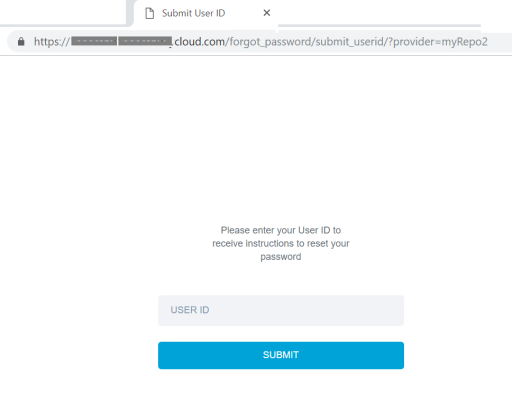
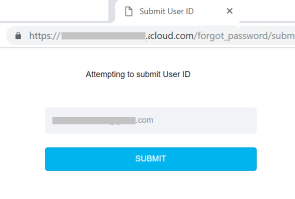
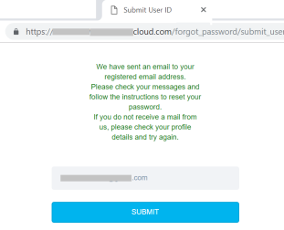
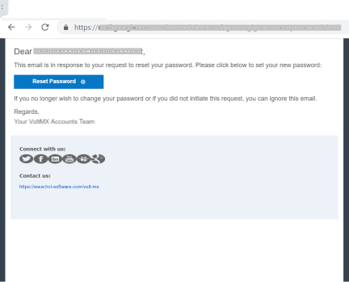
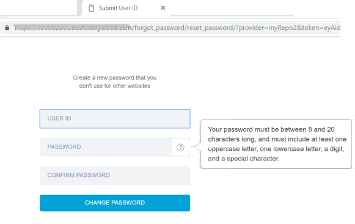
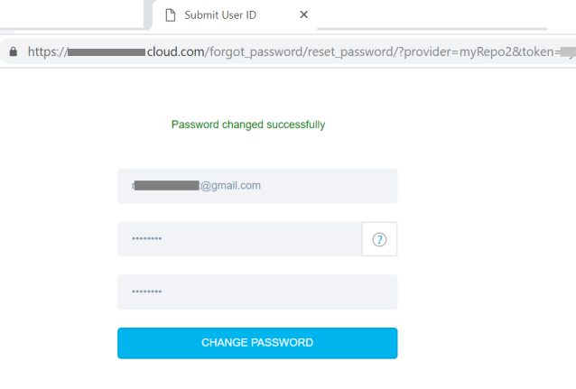
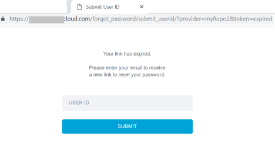

                              

User Guide: [Identity](Identity.md) > [Configure the Identity Service](ConfigureIdentiryService.md) > [User Repository](UserRepositoryIdentityService.md) > Reset Password

Reset Password for Authentication based on User Repository Identity Service
---------------------------------------------------------------------------

For apps built based on Volt MX Foundry SDKs and User Repository identity service, an app user can now reset the password of the app.

*   For example, you use User Repository identity service for authentication in for app and build the app by using Volt MX Foundry SDKs. In this case, if an app user forgets the password to log in to the app, the user can reset the password based on the registered email ID.

> **_Note:_** From Volt MX AppPlatform V8 SP4, the forgot password functionality is available only for Volt MX Cloud Users.

### Prerequisites

You must meet the following prerequisites:

*   The client app must have a User Repository Identity Service.

### How to Reset password based on Authentication for User Repository Identity Service

To reset a password, do the following:

1.  After an app is published successfully, open the [service document](Publish_LifeCycle.md#app-service-document-object-services-metadata-and-sync-client-code) file of your app. The service document contains all configured services.
    
    The following is a sample code for Login, which contains meta data of an identity service including the following details:
    
    *   `forgot_pswd_submit_userid`: URL of your reset password request.
    *   `url`: URL of your Volt MX Cloud account
    
```
  "login": [
      {
       "forgot_pswd_submit_userid": "https://00000000.auth.voltmxcloud.com/forgot_password/submit_userid/",
       "reset_pswd": "https://000000000.auth.voltmxcloud.com/forgot_password/reset_password/",
       "alias": "myRepo1",
       "type": "basic",
       "prov": "myRepo1",
       "url": "https://000000000.auth.voltmxcloud.com"
      },
```
2.  Specify the identity **provider** name as a query parameter to the URL.
    
    For example, if an app user forgets the login password, the user can reset the password using the URL set for the Key: `forgot_pswd_submit_userid` from app service document.
    
```
 https://<mytenantID.auth.voltmxcloud.com/forgot_password/submit_userid/?provider=userstore
```
    *   **Userstore** is the name of an identity service.
    *   If you create a user repository identity service, you can provide the name of the service as **provider** name in the query parameter.  
        For example, `"``prov``": "``myRepo1``"`
3.  Go to the **reset\_pswd** URL by using a browser. The **Submit User ID** screen appears.
    
    
    
4.  Specify your User Id.
5.  Click **SUBMIT**. The reset password mail process starts and sends an email to your registered email account.
    
    
    
    
    
6.  Click the **Reset Password** link from the email that you received.
    
    
    
    The new password window appears.
    
    
    
7.  Specify the following details:  
    *   **User ID**: Email of a user.
    *   **Password**: Enter a new password for your account pertaining to the password criteria.  
        
        > **_Note:_** Your password must be between 8 to 20 characters long, and must include at least one uppercase letter, one lowercase letter, a digit and a special character.
        
    *   **Confirm Password**: Re-enter your new password for the confirmation.
8.  Click **CHANGE PASSWORD**. A confirmation window is displayed saying, **Password Changed Successfully**.
    
    
    

#### Characteristics of Reset URL

The following are the characteristics of the reset URL:

*   Forgot Password URL is valid for one-time use.
*   Forgot Password URL is valid for one hour. Using old forgot password links throw an error:
    
    
    
*   Forgot Password URL must not be formed with the user request input.

#### Limitations

*   A Reset Password link is sent to your registered email ID. The link is valid for 1 day. A reset password link can be used only once.
