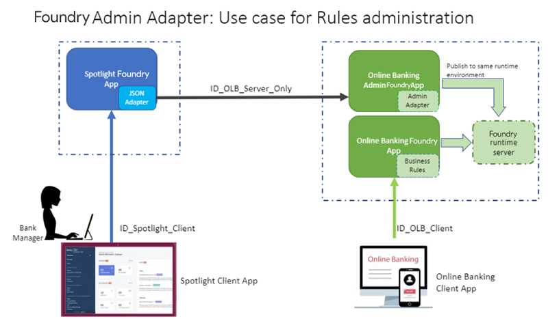
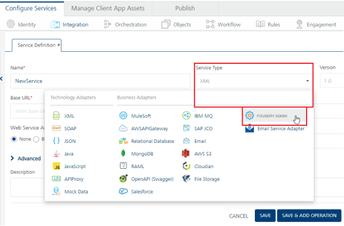
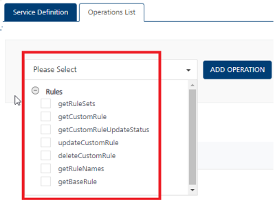

                                

User Guide: [Integration](Services.md#integration) \> [Configure the Integration Service](ConfigureIntegrationService.md) > Foundry Admin Adapter

Foundry Admin Adapter
====================

From V9SP1, a new type of integration connector — **Foundry Admin** has been introduced in Foundry. The Foundry Admin Adapter allows the use of administrative functions (exposed via secure APIs ) on a Foundry runtime server. This permits external systems to invoke these APIs to read or modify settings on the Foundry server.

Managing and Customizing Rules
------------------------------

The Foundry Admin adapter exposes APIs for managing and customizing rules published to a target runtime server.

*   With the Foundry Admin Adapter, you can invoke the Admin endpoints for rules services and manage the published business rules logic. These operations include getting a list of rulesets published to an environment, fetching rules given a ruleset name, read a base rule and custom rule of a particular rule version, create/update custom rules logic, delete a custom rule, and get status of custom rules update/delete actions.  
    
*   With the Foundry Admin Adapter, a Business administration app (for example, `Spotlight`) can access and manage business rules of an Online banking client app. This is to ensure that external clients get the flexibility of customizing its Business Rules without having to change the application or publish the Foundry app again and again.
    
*   For this, the Online banking app should expose the Rules management APIs via the Foundry Admin Adapter. The Spotlight Foundry app should talk to these Rules management APIs (as part of Foundry Admin Adapter) through a JSON integration service.
    
    
    

Use Case: Modifying base rules logic dynamically on the run-time server by using a client, for example, Customer 360 (Spotlight)

Consider the following examples:

*   Banks might want to from time-to-time review and update the eligibility criteria for a particular banking product.
*   Based on a customer segment, Bank might want to offer some pre-approved credit card products.
*   During festive seasons, Banks might want to run promotional campaigns for Car Loans and so modify the Business rules to arrive at qualifying customers.

In all of these scenarios, it is noticed that the Business Rules need to be updated by a Bank Manager or Bank Employee through Customer 360 (Spotlight). In order to facilitate this, Rules in Foundry provides the option to update the Rule logic (the MVEL logic a developer configured while developing the App), while retaining the Input and Output parameters that the Rule accepts. This way, a consumer banking app like Online banking or Loans/ Mortgage could get the flexibility of customizing its Rule logic without having to change the application or publish the Foundry app again and again. And by updating and customizing the Rule logic through a Business admin app like Customer 360 (Spotlight), Banks can be guaranteed that only a Bank Manager persona is able to update the Rule logic and no one else without the requisite authority can change those business rules.

**Prerequisites**

*   A Foundry app should contain a **rules set** configured using the Rules Service and the app should be **published to an environment**. For more information on Rules, refer to [Rules as a Service](Rules_as_a_Service.md).
*   A Foundry app should contain a **Foundry Admin** integration service and the app should be published to **the same environment** where you have published your rules services.
    
    > **_Important:_** The Rules service and the Admin adapter integration services can be in the same app or separate apps. If these services are created in separate apps, these two apps should be published in the same environment.
    
    > **_Note:_** Since the Foundry Admin adapter exposes the Administrative functions on the runtime server, only an authorized user should be able to access them. Hence only the Authenticated App User and Private security levels are supported. Anonymous and Public security levels are not supported for the operations exposed in this adapter.
    

Perform the following steps to Invoke the Rules Admin APIs using the Foundry Admin Adapter
-----------------------------------------------------------------------------------------

*   [Step1: Configure a **Rules Service** and publish it to an environment](#step1-configure-a-and-publish-it-to-an-environment)
*   [Step2: Configure an Integration Service using the **Foundry Admin** adapter](#step2-configure-an-integration-service-using-the-adapter)  
    
*   [Step3: Configure the Operations for Managing the Rules](#step3-configure-the-operations-for-managing-the-rules)
*   [Step4: Publish the Foundry app containing the Integration Service to that environment](#step4-publish-th)

### **Step1: Configure a **Rules Service** and publish it to an environment**

1.  Create a Foundry app containing a **rules set** of a Rules Service.  
    For more in formation on Rules, refer to [Rules as a Service](Rules_as_a_Service.md).
2.  Publish the app to an environment, for example, **A**.

### Step2: Configure an Integration Service using the **Foundry Admin** adapter

> **_Note:_** The Foundry Admin adapter integration service can be configured in the same Foundry App that you created in Step1. Or it can be in a different app.

To configure the Foundry Admin Adapter in the **[Integration service definition](ConfigureIntegrationService.md)** tab, follow these steps:

1.  In the **Name** field, provide a unique name for your service.
2.  From the **Service Type** list, select _Foundry Admin_.
    
    
    
3.  In the **Authentication** section, the Use Existing Identity Provider list displays the existing Identity services available in the Volt MX Foundry App. Select an Identity Service from the list. This will add a security layer onto your Foundry Admin service. If you select an Identity Service, you must provide appropriate login details to invoke the Admin APIs from the client app.
4.  

The Advanced section contains the following additional configurations. You can configure them if required:

    
    | Field | Description |
    | --- | --- |
    | Custom Code | Custom Code enables you to specify dependent JAR. To specify dependent JAR, select the JAR containing preprocessor or postprocessor libraries from the drop-down list, or click **Upload New** to browse the JAR file from your local system. This step allows you to further filter the data sent to the back end.    **_Important:_** Make sure that you upload a custom JAR file that is built on the same JDK version used for installing Volt MX Foundry Integration.For example, if the JDK version on the machine where Volt MX Foundry Integration is installed is 1.6, you must use the same JDK version to build your custom jar files. If the JDK version is different, an unsupported class version error will appear when a service is used from a device. |
    | Throttling | API throttling enables you to limit the number of request calls within a minute. If an API exceeds the throttling limit, it will not return the service response.   **To specify throttling in Volt MX Foundry Console, follow these steps:**   In the **Total Rate Limit** text box, enter a required value. With this value, you can limit the number of requests configured in your Volt MX Foundry console in terms of Total Rate Limit.   In the **Rate Limit Per IP** text box, enter a required value. With this value, you can limit the number of IP address requests configured in your Volt MX Foundry console in terms of Per IP Rate Limit.   **To override throttling in App Services Console, refer to** [Override API Throttling Configuration](API_Throttling_Override.md#override-api-throttling-configuration).    **_Note:_** Enable API throttling in a clustered environment by configuring the VOLTMX\_SERVER\_NUMBER\_OF\_NODES property in the **server\_configuration** table available in Admin database. This property indicates the number of nodes configured in the cluster. The default value is 1. |

    

    
    > **_Note:_** All options in the Advanced section are optional.
    
5.  In the **Description** field, provide a suitable description for the service.
6.  Click **Save** or **Save and Add Operation** to save your service definition.

### Step3: Configure the Operations for Managing the Rules

1.  Click **Save and Add Operation** in your service definition page to save your service definition and display the New Operation tab for adding operations.  
    OR  
    Click Add Operation to add a new operation or from the tree in the left pane, click Add > Add New Operation.
2.  In **Operations List** tab, select the required operation and click **Add Operation**. A new operation is created and listed in the Operations List tab with Rules as default prefix. The operations available are:

    *   getRuleSets
    *   getRuleNames
    *   getBaseRule
    *   updateCustomRule
    *   getCustomRuleUpdateStatus
    *   getCustomRule
    *   deleteCustomRule

    
    
    
3.  Select the new operation that was added to configure the operation. Refer to the following sections to know more about the configurations you can do for each operation.
    
    #### Configure Operations
    
    Perform the following steps to configure each Admin operation:
    
    *   Click the required operation from the operations list. The operation details page appears.
    *   Provide the following information in the details page:
        
        | Field | Description |
        | --- | --- |
        | Name | The operation name appears in the Name field. You can modify the name, if required. |
        | Operation Security Level | It specifies how a client must authenticate to invoke this operation.Since the Foundry Admin adapter exposes the Administrative functions on the runtime server, only an authorized user should be able to access them. Hence only the Authenticated App User and Private security levels are supported. Anonymous and Public security levels are not supported for the operations exposed in this adapter.   **Select one of the following security operations in the Operation Security Level field.**  **Authenticated App User** – It restricts the access to clients who have successfully authenticated using an Identity Service associated with the app.  **Private (Internal Server Only)** - It blocks the access to this operation from any external client. It allows invocation either from an Orchestration/Object Service, or from the custom code in the same run-time environment.   **_Note:_** The field is set to Authenticated App User, by default. |
        | Mapped To | Displays the operation with which the adapter is linked with in the back end. This field is non editable. |
        | Action | Displays the type of connector (service or object) with which this operation is linked with. This field is non editable. |
        
        
        

 The Advanced section contains the following additional configurations related to request (or) response operations. You can configure them if required:

            
        <table style="margin-left: 0;margin-right: auto;mc-table-style: url]('../Resources/TableStyles/Basic.css');" class="TableStyle-Basic" cellspacing="0"><colgroup><col class="TableStyle-Basic-Column-Column1" style="width: 174px;"><col class="TableStyle-Basic-Column-Column1"></colgroup><tbody><tr class="TableStyle-Basic-Body-Body1"><td class="TableStyle-Basic-BodyE-Column1-Body1">Custom Code Invocation</td><td class="TableStyle-Basic-BodyD-Column1-Body1">You can add pre and post processing logic to services to modify the request inputs. When you test, the services details of various stages in the service execution are presented to you for better debugging. All options in the Advanced section are optional. For more details, refer to <a href="Java_Preprocessor_Postprocessor_.html" target="_blank">Preprocessor and Postprocessor</a>.</td></tr><tr class="TableStyle-Basic-Body-Body1"><td class="TableStyle-Basic-BodyE-Column1-Body1">Additional Configuration Properties</td><td class="TableStyle-Basic-BodyD-Column1-Body1">Additional Configuration Properties allows you to configure service call time out cache response. For information on different types of configuration properties, refer <a href="Java_Preprocessor_Postprocessor_.html#timeout_cachable" target="_blank">Properties</a>.</td></tr><tr class="TableStyle-Basic-Body-Body1"><td class="TableStyle-Basic-BodyE-Column1-Body1">Front-end API</td><td class="TableStyle-Basic-BodyD-Column1-Body1">Front-end API allows you map your endpoint ](or) backend URL of an operation to a front-end URL. For detailed information, refer Custom <a href="FrontEndAPI.html" target="_blank">Front-end URL</a>.</td></tr><tr class="TableStyle-Basic-Body-Body1"><td class="TableStyle-Basic-BodyB-Column1-Body1">Server Events</td><td class="TableStyle-Basic-BodyA-Column1-Body1">Using Server Events you can configure this service to trigger or process server side events. For detailed information, refer <a href="ServerEvents.html">Server Events</a>.</td></tr></tbody></table>

        

        
        > **_Note:_** All options in the **Advanced** section for operations are not mandatory.
        
    *   Enter the **Description** for the operation.
    
    **Request Input Parameters**
    
    The Request Input parameters will list a set of required input params to invoke a particular rule operation. These mandatory params have to be configured to use these operations
    
    You can define the Body and Header related input parameters from the Request Input tab. By default, the Body tab is selected. You can do the following to configure the input parameters in the Body tab:
    
    | Field | Description |
    | --- | --- |
    | Name | The name for the request input parameter. |
    | Value | The options available in the **Value** list determine the source from where the value of the input parameter must be retrieved.   **Select request or session or Identity.**  Request: It denotes that the value for the input parameter is available in the request received from the client app (device request). The default value will be honored if the request does not have the value. The Test value is honored only when you test the service from Fabric Console.  Session: If you select Session, the value of the input parameter will be picked up from session context. The Default and Test value fields are disabled.  Constant: Select Constant if you want to define the value for the input parameter in the Quantum Fabric console directly.  Identity: Select Identity if you want to retrieve the request input parameters from the identity provider response attributes.  For example - If an identity provider responds with a profile that has userid as one of its attributes after a successful login , please use 'profile.userid' as value to pass it as request parameter to the backend. This will help to filter the response based on the value mentioned in 'userid'. For more details to configure identity filters, refer to Enhanced Identity Filters - Integration Services.   **_Note_**: When you start editing this field, dependent identity services are auto populated.  **_Note_**: The field is set to Request, by default.  **_Note_**:For more information on Externalizing Identity Services, refer to [Replace the Identity Service references in a Foundry app](Replacing_Identity_Services.md).  |
    | Test Value | A test value is used for testing the service. |
    | Default Value | The default value is used in the run-time when the service cannot find the defined header parameter value. |
    | Data Type |   **Select one of the following data types.**  **String** - A combination of alpha-numeric and special characters. Supports all formats including UTF-8 and UTF-16 with no maximum size limit.  **Date** - A value that is in date format.  **Record** - A value is in an array. You must specify appropriate Record ID if the Record is the data type.  **Boolean** - A value that can be true or false.  **Number** - An integer or a floating number.  **Collection** - A group of data, also referred as data set. |
    | Collection ID | Determines the location of the input value if there is a list of collections in the input received. |
    | Record ID | Determines the location of the input value if there is an array of records in the input received. |
    | Description | Enter the description for the request. |

    
    
    
    The following input parameters are displayed by default for operations: These input parameters are mandatory.
    
    | Operation | Input Parameters (mandatory) |
    | --- | --- |
    | Rules\_getRuleSets | N/A |
    | Rules\_getRuleNames | ruleSetName  version |
    | Rules\_getBaseRule | ruleSetName  version  ruleName |
    | Rules\_updateCustomRule | ruleSetName  versionruleName  customRule  **_Important:_** Your custom rule must be encoded in the Base64 format. |
    | Rules\_getCustomRuleUpdateStatus | updateRequestId |
    | Rules\_getCustomRule | ruleSetName  version  ruleName |
    | Rules\_deleteCustomRule | ruleSetName  version  ruleName |
    | **_Note:_** Quick Reference - For more information on descriptions, input parameters, sample Request/Response codes, and error scenario, refer to [Operations supported in Foundry Admin Adapter](#operations-supported-for-foundry-admin-adapter-with-sample-request-response-and-error-scenario) ||
    
    Click the **Header** tab to configure the header parameters. The parameters configured here will be appended to the header of the input request. Configure the following fields to define header parameters:
    
    | Field | Description |
    | --- | --- |
    | Name | The name for the request input parameter. |
    | Value | The options available in the **Value** list determine the source from where the value of the input parameter must be retrieved.     **Select request or session or Identity.**  **Request**: It allows the user to configure the default and test value. The default value is honored if the request does not have the input value. The Test value is honored only when you test the service from Foundry Console.  **Session**: It represents that the header parameters will be picked up from the session context. The Default and Test value fields are disabled  **Constant**: It denotes that you can define a constant value for the header. The Default and Test value fields are disabled.  **Expression**: It represents that you can configure velocity template expressions for the value of the header. The Default and Test value fields are disabled.. For example, $Session.param1 $Request.param2 where 'param1' is coming from session scope and 'param2' is coming from request scope.    **_Note:_** The field is set to **Request**, by default. |
    | Test Value | A test value is used for testing the service. |
    | Default Value | The default value is used in the run-time when the service cannot find the defined header parameter value. |
    | Description | Enter the description for the request. |

    
    ### Response Output Parameters
    
    In the Response Output tab, you can configure the output parameters that you are expecting the service to return after the service is executed.
    
    By default, the following output parameters are returned from the back end for each of the operations:
    
    | Operation | Output Parameters |
    | --- | --- |
    | Rules\_getRuleSets | ruleSets |
    | Rules\_getRuleNames | ruleNames |
    | Rules\_getBaseRule | rule |
    | Rules\_updateCustomRule | updateRequestId |
    | Rules\_getCustomRuleUpdateStatus | ruleStatus |
    | Rules\_getCustomRule | rule |
    | Rules\_deleteCustomRule | updateRequestId |
    | **_Note:_** Quick Reference - For more information on descriptions, input parameters, sample Request/Response codes, and error scenario, refer to [Operations supported in Foundry Admin Adapter](#operations-supported-for-foundry-admin-adapter-with-sample-request-response-and-error-scenario) ||
    
    You can configure the following information about each output parameter:
    
    | Field | Description |
    | --- | --- |
    | Name | The name for the response output parameter. |
    | Path | Determines the path where you want to store the output value from the response. |
    | Scope | It determines how you want to use the output value. It has the following options:**Response** - Select this option if you want to add the output in the response sent to the client app user.**Session** - Select this option if you want to add the output in the session information. This information will not be sent to the client app user. |
    | Data Type | **Select one of the following data types.**  **String** - A combination of alpha-numeric and special characters. Supports all formats including UTF-8 and UTF-16 with no maximum size limit  **Date** - A value that is in date format.  **Record** - A value is in an array. You must specify appropriate Record ID if the Record is the data type.  **Boolean** - A value that can be true or false.  **Number** - An integer or a floating number.  **Collection** - A group of data, also referred as data set. |
     |
    | Collection ID | Determines the location of the output value if there is a list of collections in the output received. |
    | Record ID | Determines the location of the output value if there is an array of records in the output received. |
    | Description | Enter the description for the request. |

    
    Other common options available in the **Request Input** and **Response Output** tabs are as follows:
    
    *   **Add Parameter**: Click **Add Parameter**  to add an entry (if the entries for input and the output tabs do not exist).
    *   **Copy, Paste**: Select the check box of an entry, and click **Copy** and **Paste**, if you want to make duplicate entries.
    *   **Delete**: Select the check box of an entry and click **Delete**, if you want to delete an entry.
    *   **Enable pass-through**: Select the **Enable pass-through** check box if you want to forward the body of the client's request to back end as it is. For more details on API Proxy service, refer to [How to Enable Pass-through Proxy for Operations](API_Proxy_Adapter.md#how-to-enable-pass-through-proxy-for-operations).

### Step4: Publish th**e Foundry app containing the Integration Service to that environment**

1.  Publish the Integration Service using the **Foundry Admin** to the same environment where you published your rules services in [Step1](#step1-configure-a-and-publish-it-to-an-environment).
    
    > **_Important:_** The Rules Set of a Rules Service and the Foundry Admin adapter integration services can be in the same app, or separate apps.  
    \- **Different Foundry apps**: If you have created a rules set of a Rules Service in one Foundry app, and the Foundry Admin integration service in another Foundry app, both these apps should be published to the same environment.
    

Operations supported for Foundry Admin Adapter (with Sample Request/Response and Error Scenario)
-----------------------------------------------------------------------------------------------

The following table lists the pre-built operations supported in Foundry Admin Adapter, which includes configuration parameters, sample Request/Response and Error Scenario.

Rules_getRuleSets

<table class="TableStyle-Basic" cellspacing="0" style="mc-table-style: url('Resources/TableStyles/Basic.css');width: 820px;"><colgroup><col class="TableStyle-Basic-Column-Column1" style="width: 163px;"> <col class="TableStyle-Basic-Column-Column1"></colgroup><tbody><tr class="TableStyle-Basic-Body-Body1"><td class="TableStyle-Basic-BodyE-Column1-Body1" style="font-weight: bold;text-align: left;">Description</td><td class="TableStyle-Basic-BodyD-Column1-Body1">Operation to get all the published rule sets for that environment.</td></tr><tr class="TableStyle-Basic-Body-Body1"><td class="TableStyle-Basic-BodyE-Column1-Body1" style="font-weight: bold;text-align: left;">Parameter Names: (All mandatory)</td><td class="TableStyle-Basic-BodyD-Column1-Body1">N/A</td></tr><tr class="TableStyle-Basic-Body-Body1"><td class="TableStyle-Basic-BodyB-Column1-Body1" style="font-weight: bold;text-align: left;">Sample Response</td><td class="TableStyle-Basic-BodyA-Column1-Body1"><input type="button" id="button" class="btn" style="float: right;" value="Copy" onclick="var codeSnippet = this.parentNode.textContent; copyFunction(codeSnippet, this);">{ "Response": { "ruleSets": [ { "ruleSetName": "creditRulesV2", "ruleSetVersion": "2.0" }, { "ruleSetName": "creditRulesV1", "ruleSetVersion": "1.0" }, { "ruleSetName": "VehicleLoan", "ruleSetVersion": "1.0" } ] }, "opstatus": 0, "httpStatusCode": 200 }</td></tr></tbody></table>

Rules_getRuleNames

<table class="TableStyle-Basic" cellspacing="0" style="mc-table-style: url('Resources/TableStyles/Basic.css');width: 820px;"><colgroup><col class="TableStyle-Basic-Column-Column1" style="width: 163px;"> <col class="TableStyle-Basic-Column-Column1"></colgroup><tbody><tr class="TableStyle-Basic-Body-Body1"><td class="TableStyle-Basic-BodyE-Column1-Body1" style="font-weight: bold;text-align: left;">Description</td><td class="TableStyle-Basic-BodyD-Column1-Body1">Operation to get all the rule names created for a given rule set and version.</td></tr><tr class="TableStyle-Basic-Body-Body1"><td class="TableStyle-Basic-BodyE-Column1-Body1" style="font-weight: bold;text-align: left;">Parameter Names: (All mandatory)</td><td class="TableStyle-Basic-BodyD-Column1-Body1"><b>ruleSetName</b> (String): Name of the rule set. <b>version</b> (String): The version of the rule set. This version is same as the service version in Foundry console. Example it should be in this format <code class="codefirst">1.0</code> or <code class="codefirst">2.0</code></td></tr><tr class="TableStyle-Basic-Body-Body1"><td class="TableStyle-Basic-BodyB-Column1-Body1" style="font-weight: bold;text-align: left;">Sample Response</td><td class="TableStyle-Basic-BodyA-Column1-Body1"><input type="button" id="button" class="btn" style="float: right;" value="Copy" onclick="var codeSnippet = this.parentNode.textContent; copyFunction(codeSnippet, this);">{ "Response": { "ruleNames": [ "creditEligibility", "loanEligibility" ] }, "opstatus": 0, "httpStatusCode": 200 }</td></tr></tbody></table>

Rules_getBaseRule

<table class="TableStyle-Basic" cellspacing="0" style="mc-table-style: url('Resources/TableStyles/Basic.css');width: 820px;"><colgroup><col class="TableStyle-Basic-Column-Column1" style="width: 163px;"> <col class="TableStyle-Basic-Column-Column1"></colgroup><tbody><tr class="TableStyle-Basic-Body-Body1"><td class="TableStyle-Basic-BodyE-Column1-Body1" style="font-weight: bold;text-align: left;">Description</td><td class="TableStyle-Basic-BodyD-Column1-Body1">Operation to get the base rule for the specified rule set, rule name and version.</td></tr><tr class="TableStyle-Basic-Body-Body1"><td class="TableStyle-Basic-BodyE-Column1-Body1" style="font-weight: bold;text-align: left;">Parameter Names: (All mandatory)</td><td class="TableStyle-Basic-BodyD-Column1-Body1"><b>ruleSetName</b> (String) : Name of the rule set. <b>version</b> (String): The version of the rule set. This version is same as the service version in Foundry console. Example it should be in this format <code class="codefirst">1.0</code> or <code class="codefirst">2.0</code> <b>ruleName</b> (String): The name of the rule under the rule set.</td></tr><tr class="TableStyle-Basic-Body-Body1"><td class="TableStyle-Basic-BodyE-Column1-Body1" style="font-weight: bold;text-align: left;">Sample Response</td><td class="TableStyle-Basic-BodyD-Column1-Body1"><input type="button" id="button" class="btn" style="float: right;" value="Copy" onclick="var codeSnippet = this.parentNode.textContent; copyFunction(codeSnippet, this);">{ "Response": { "rule": "name: \"Check lease buyout for vehicle with year &gt; 2010 and amount between 0 to 10000\"\ndescription: \"Check lease buyout for vehicle with year &gt; 2010 and amount between 0 to 10000\"\ncondition: \"Check.isEqualToIgnoringCase(purposeOfLoan, \\\"Lease buyout\\\") &amp;&amp; Check.isEqualToIgnoringCase(vehicleType, \\\"Vehicle\\\") &amp;&amp; vehicleYear &gt; 2010 &amp;&amp; Check.isWithin(0, 10000, loanAmount) &amp;&amp; Check.isEqualToIgnoringCase(estimatedCreditRating, \\\"Excellent\\\")\"\nactions:\n - \"results.appendJson(\\\"{\\\\\\\"Vehicle Loan\\\\\\\": [{\\\\\\\"Loan Terms\\\\\\\": 12, \\\\\\\"Rate\\\\\\\": 2.35, \\\\\\\"Best Offer\\\\\\\": \\\\\\\"N\\\\\\\"}, {\\\\\\\"Loan Terms\\\\\\\": 24, \\\\\\\"Rate\\\\\\\": 2.36, \\\\\\\"Best Offer\\\\\\\": \\\\\\\"N\\\\\\\"}, {\\\\\\\"Loan Terms\\\\\\\": 36, \\\\\\\"Rate\\\\\\\": 2.37, \\\\\\\"Best Offer\\\\\\\": \\\\\\\"N\\\\\\\"}, {\\\\\\\"Loan Terms\\\\\\\": 48, \\\\\\\"Rate\\\\\\\": 2.38, \\\\\\\"Best Offer\\\\\\\": \\\\\\\"N\\\\\\\"}, {\\\\\\\"Loan Terms\\\\\\\": 60, \\\\\\\"Rate\\\\\\\": 2.39, \\\\\\\"Best Offer\\\\\\\": \\\\\\\"N\\\\\\\"}]}\\\")\"" }, "opstatus": 0, "httpStatusCode": 200 } The given sample rule checks the account code, if the account code is equal to 1, then the account type parameter is set as Loan Account. The <code class="codefirst">results</code> object is used to modify the result of an operation.</td></tr><tr class="TableStyle-Basic-Body-Body1"><td class="TableStyle-Basic-BodyB-Column1-Body1" style="font-weight: bold;text-align: left;">Error Scenario</td><td class="TableStyle-Basic-BodyA-Column1-Body1"><input type="button" id="button" class="btn" style="float: right;" value="Copy" onclick="var codeSnippet = this.parentNode.textContent; copyFunction(codeSnippet, this);">{ "errmsg": "Unable to find rule for specified rule set.", "opstatus": 20013, "httpStatusCode": 400 } { "errmsg": "Internal server error.", "opstatus": 20013, "httpStatusCode": 500 }</td></tr></tbody></table>

Rules_updateCustomRule

<table class="TableStyle-Basic" cellspacing="0" style="mc-table-style: url('Resources/TableStyles/Basic.css');width: 820px;"><colgroup><col class="TableStyle-Basic-Column-Column1" style="width: 163px;"> <col class="TableStyle-Basic-Column-Column1"></colgroup><tbody><tr class="TableStyle-Basic-Body-Body1"><td class="TableStyle-Basic-BodyE-Column1-Body1" style="font-weight: bold;text-align: left;">Description</td><td class="TableStyle-Basic-BodyD-Column1-Body1">Operation to update the custom rule for the specified rule set, rule name and version.</td></tr><tr class="TableStyle-Basic-Body-Body1"><td class="TableStyle-Basic-BodyE-Column1-Body1" style="font-weight: bold;text-align: left;">Parameter Names: (All mandatory)</td><td class="TableStyle-Basic-BodyD-Column1-Body1"><b>ruleSetName</b> (String): Name of the rule set. <b>version</b> (String): The version of the rule set. This version is same as the service version in Foundry console. Example it should be in this format <code class="codefirst">1.0</code> or <code class="codefirst">2.0</code> <b>ruleName</b> (String): The name of the rule under the rule set <b>customRule</b> (String): <b>The base64 encoded custom rule.</b><b><i>Important: </i></b>Your custom rule must be encoded in the Base64 format.For example, if you have any custom rule in MVEL, you can refer to any Base64 Encoder like <a href="https://www.base64encode.org/" target="_blank">https://www.base64encode.org/</a>, encode and use the encoded rule logic as input parameter.</td></tr><tr class="TableStyle-Basic-Body-Body1"><td class="TableStyle-Basic-BodyE-Column1-Body1" style="font-weight: bold;text-align: left;">Sample Response</td><td class="TableStyle-Basic-BodyD-Column1-Body1"><input type="button" id="button" class="btn" style="float: right;" value="Copy" onclick="var codeSnippet = this.parentNode.textContent; copyFunction(codeSnippet, this);">{ "Response": { "updateRequestId": "67" }, "opstatus": 0, "httpStatusCode": 202 }</td></tr><tr class="TableStyle-Basic-Body-Body1"><td class="TableStyle-Basic-BodyB-Column1-Body1" style="font-weight: bold;text-align: left;">Error Scenario</td><td class="TableStyle-Basic-BodyA-Column1-Body1"><input type="button" id="button" class="btn" style="float: right;" value="Copy" onclick="var codeSnippet = this.parentNode.textContent; copyFunction(codeSnippet, this);">{ "errmsg": "Rule is not base64 encoded.", "opstatus": 20013, "httpStatusCode": 400 } { "errmsg": "Unable to find rule for specified rule set.", "opstatus": 20013, "httpStatusCode": 400 } { "errmsg": "Rule should not be empty.", "opstatus": 20013, "httpStatusCode": 400 } { "errmsg": "Internal server error.", "opstatus": 20013, "httpStatusCode": 500 }</td></tr></tbody></table>

Rules_getCustomRuleUpdateStatus

<table class="TableStyle-Basic" cellspacing="0" style="mc-table-style: url('Resources/TableStyles/Basic.css');width: 820px;"><colgroup><col class="TableStyle-Basic-Column-Column1" style="width: 163px;"> <col class="TableStyle-Basic-Column-Column1"></colgroup><tbody><tr class="TableStyle-Basic-Body-Body1"><td class="TableStyle-Basic-BodyE-Column1-Body1" style="font-weight: bold;text-align: left;">Description</td><td class="TableStyle-Basic-BodyD-Column1-Body1">Operation to get the status of the update/delete action on the custom rule.</td></tr><tr class="TableStyle-Basic-Body-Body1"><td class="TableStyle-Basic-BodyE-Column1-Body1" style="font-weight: bold;text-align: left;">Parameter Names: (All mandatory)</td><td class="TableStyle-Basic-BodyD-Column1-Body1"><b>updateRequestId</b> (String) : The updateRequestId returned as response of update/delete action on custom rule.</td></tr><tr class="TableStyle-Basic-Body-Body1"><td class="TableStyle-Basic-BodyB-Column1-Body1" style="font-weight: bold;text-align: left;">Sample Response</td><td class="TableStyle-Basic-BodyA-Column1-Body1"><input type="button" id="button" class="btn" style="float: right;" value="Copy" onclick="var codeSnippet = this.parentNode.textContent; copyFunction(codeSnippet, this);">{ "Response": { "ruleStatus": [ { "updateRequestId": 19, "errorMessage": "", "action": "ASSET_UPDATE", "status": "completed" } ] }, "opstatus": 0, "httpStatusCode": 200 }</td></tr></tbody></table>

Rules_getCustomRule

<table class="TableStyle-Basic" cellspacing="0" style="mc-table-style: url('Resources/TableStyles/Basic.css');width: 820px;"><colgroup><col class="TableStyle-Basic-Column-Column1" style="width: 163px;"> <col class="TableStyle-Basic-Column-Column1"></colgroup><tbody><tr class="TableStyle-Basic-Body-Body1"><td class="TableStyle-Basic-BodyE-Column1-Body1" style="font-weight: bold;text-align: left;">Description</td><td class="TableStyle-Basic-BodyD-Column1-Body1">Operation to get the custom rule for the specified rule set, rule name and version.</td></tr><tr class="TableStyle-Basic-Body-Body1"><td class="TableStyle-Basic-BodyE-Column1-Body1" style="font-weight: bold;text-align: left;">Parameter Names: (All mandatory)</td><td class="TableStyle-Basic-BodyD-Column1-Body1"><b>ruleSetName</b> (String) : Name of the rule set. <b>version</b> (String): The version of the rule set. The version of the rule set. This version is same as the service version in Foundry console. Example it should be in this format <code class="codefirst">1.0</code> or <code class="codefirst">2.0</code> <b>ruleName</b> (String): The name of the rule under the rule set</td></tr><tr class="TableStyle-Basic-Body-Body1"><td class="TableStyle-Basic-BodyE-Column1-Body1" style="font-weight: bold;text-align: left;">Sample Response</td><td class="TableStyle-Basic-BodyD-Column1-Body1"><input type="button" id="button" class="btn" style="float: right;" value="Copy" onclick="var codeSnippet = this.parentNode.textContent; copyFunction(codeSnippet, this);">{ "Response": { "rule": "name: \"Check lease buyout for vehicle with year &gt; 2010 and amount between 0 to 10000\"\r\ndescription: \"Check lease buyout for vehicle with year &gt; 2010 and amount between 0 to 10000\"\r\ncondition: \"Check.isEqualToIgnoringCase(purposeOfLoan, \\\"Lease buyout\\\") &amp;&amp; Check.isEqualToIgnoringCase(vehicleType, \\\"Vehicle\\\") &amp;&amp; vehicleYear &gt; 2010 &amp;&amp; Check.isWithin(0, 10000, loanAmount) &amp;&amp; Check.isEqualToIgnoringCase(estimatedCreditRating, \\\"Excellent\\\")\"\r\nactions:\r\n - \"results.appendJson(\\\"{\\\\\\\"Vehicle Loan\\\\\\\": [{\\\\\\\"Loan Terms\\\\\\\": 20, \\\\\\\"Rate\\\\\\\": 4.35, \\\\\\\"Best Offer\\\\\\\": \\\\\\\"N\\\\\\\"}, {\\\\\\\"Loan Terms\\\\\\\": 24, \\\\\\\"Rate\\\\\\\": 2.36, \\\\\\\"Best Offer\\\\\\\": \\\\\\\"N\\\\\\\"}, {\\\\\\\"Loan Terms\\\\\\\": 36, \\\\\\\"Rate\\\\\\\": 2.37, \\\\\\\"Best Offer\\\\\\\": \\\\\\\"N\\\\\\\"}, {\\\\\\\"Loan Terms\\\\\\\": 48, \\\\\\\"Rate\\\\\\\": 2.38, \\\\\\\"Best Offer\\\\\\\": \\\\\\\"N\\\\\\\"}, {\\\\\\\"Loan Terms\\\\\\\": 60, \\\\\\\"Rate\\\\\\\": 2.39, \\\\\\\"Best Offer\\\\\\\": \\\\\\\"N\\\\\\\"}]}\\\")\"" }, "opstatus": 0, "httpStatusCode": 200 }</td></tr><tr class="TableStyle-Basic-Body-Body1"><td class="TableStyle-Basic-BodyB-Column1-Body1" style="font-weight: bold;text-align: left;">Error Scenario</td><td class="TableStyle-Basic-BodyA-Column1-Body1"><input type="button" id="button" class="btn" style="float: right;" value="Copy" onclick="var codeSnippet = this.parentNode.textContent; copyFunction(codeSnippet, this);">{ "errmsg": "Unable to find rule for specified rule set.", "opstatus": 20013, "httpStatusCode": 400 } { "errmsg": "Internal server error.", "opstatus": 20013, "httpStatusCode": 500 }</td></tr></tbody></table>

Rules_deleteCustomRule

<table class="TableStyle-Basic" cellspacing="0" style="mc-table-style: url('Resources/TableStyles/Basic.css');width: 820px;"><colgroup><col class="TableStyle-Basic-Column-Column1" style="width: 163px;"> <col class="TableStyle-Basic-Column-Column1"></colgroup><tbody><tr class="TableStyle-Basic-Body-Body1"><td class="TableStyle-Basic-BodyE-Column1-Body1" style="font-weight: bold;text-align: left;">Description</td><td class="TableStyle-Basic-BodyD-Column1-Body1">Operation to delete the custom rule for the specified rule set, rule name and version.</td></tr><tr class="TableStyle-Basic-Body-Body1"><td class="TableStyle-Basic-BodyE-Column1-Body1" style="font-weight: bold;text-align: left;">Parameter Names: (All mandatory)</td><td class="TableStyle-Basic-BodyD-Column1-Body1"><b>ruleSetName</b> (String): Name of the rule set. <b>version</b> (String): The version of the rule set. The version of the rule set. This version is same as the service version in Foundry console. Example it should be in this format <code class="codefirst">1.0</code> or <code class="codefirst">2.0</code> <b>ruleName</b> (String): The name of the rule under the rule set.</td></tr><tr class="TableStyle-Basic-Body-Body1"><td class="TableStyle-Basic-BodyE-Column1-Body1" style="font-weight: bold;text-align: left;">Sample Response</td><td class="TableStyle-Basic-BodyD-Column1-Body1"><input type="button" id="button" class="btn" style="float: right;" value="Copy" onclick="var codeSnippet = this.parentNode.textContent; copyFunction(codeSnippet, this);">{ "Response": { "updateRequestId": "68" }, "opstatus": 0, "httpStatusCode": 202 }</td></tr><tr class="TableStyle-Basic-Body-Body1"><td class="TableStyle-Basic-BodyB-Column1-Body1" style="font-weight: bold;text-align: left;">Error Scenario</td><td class="TableStyle-Basic-BodyA-Column1-Body1"><input type="button" id="button" class="btn" style="float: right;" value="Copy" onclick="var codeSnippet = this.parentNode.textContent; copyFunction(codeSnippet, this);">{ "errmsg": "Unable to find rule for specified rule set.", "opstatus": 20013, "httpStatusCode": 400 }</td></tr></tbody></table>

Common Error Scenarios across all operations:

<table class="TableStyle-Basic" cellspacing="0" style="mc-table-style: url('Resources/TableStyles/Basic.css');width: 820px;"><colgroup><col class="TableStyle-Basic-Column-Column1" style="width: 163px;"> <col class="TableStyle-Basic-Column-Column1"></colgroup><tbody><tr class="TableStyle-Basic-Body-Body1"><td class="TableStyle-Basic-BodyB-Column1-Body1" style="font-weight: bold;text-align: left;">Sample Response</td><td class="TableStyle-Basic-BodyA-Column1-Body1"><input type="button" id="button" class="btn" style="float: right;" value="Copy" onclick="var codeSnippet = this.parentNode.textContent; copyFunction(codeSnippet, this);">{ "errmsg": "ruleSetName, version and ruleName are mandatory fields", "opstatus": 20013, "httpStatusCode": -1 } { "errmsg": "ruleSetName, version, ruleName and customRule are mandatory fields", "opstatus": 20013, "httpStatusCode": -1 } { "errmsg": "ruleSetName and version are mandatory fields", "opstatus": 20013, "httpStatusCode": -1 } { "errmsg": "updateRequestId is mandatory field", "opstatus": 20013, "httpStatusCode": -1 } { "errmsg": "IO error occurred while {0} with error message: {1}", "opstatus": 20013, "httpStatusCode": -1 } { "errmsg": "Invalid JSON format received as response while {0} with error message: {1}", "opstatus": 20013, "httpStatusCode": -1 } <b><i>Note: </i></b> {0} will be replaced by the operation name. for example,"getting the base rule" {1} will be replaced by the actual exception error message.</td></tr></tbody></table>

