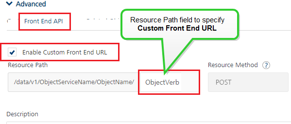
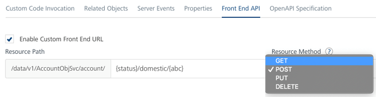

### Custom Front End URL for Verbs in Object Services

#### Resource URL/Front End URL

From Foundry V9 SP3 onwards, using Foundry, you can map an object verb to a custom Front End URL, which is then exposed for those object verbs as part of API Developer portal. With this feature, the objects and their associated verbs can be exposed as URLs that follow the REST API convention.

For example:

The following is a sample format for Foundry exposed runtime endpoint URL of **standard verbs (GET, POST, PUT, DELETE)** to send an object service request:


```
 BaseURL/services/data/v1/<Object_Service_Name>/objects/<Object_Name>
```

*   HTTP method: GET/POST/PUT/ DELETE (depending on the standard verb)


The following is a sample format for Foundry runtime endpoint URL of a **custom verb** of an object:


```
 BaseURL/services/data/v1/<Object_Service_Name>/operations/<Object_Name>/<CustomVerbName>
```

*   HTTP method: POST (all custom verbs have POST method by default)


The following is a sample of a custom **Front End URL** of an object verb:


```
 BaseURL/services/data/v1/<Object_Service_Name>/<Object_Name><Front_End_URL>  

```

*   In this the URL path upto object_name is platform generated. You can configure a custom REST based URL path after the “object_name” as highlighted above.


To walk-through defining front-end URLs for service APIs with Foundry, take a look at our hands-on tutorial for [API Management – Front End URLs](https://www.youtube.com/watch?v=jSpnInWJyv0&feature=youtu.be).


**Advantages:**

*   A front-end URL contains a custom data, which does not expose the original data of the back-end operation.
*   You can map more than one front-end URLs to one base back-end URL and perform different operations. For example, you can configure four of the front-end URLs to perform CRUD operations based on the same back-end URL.

> ***Note:*** By default, the **Front End URL** check box is not selected. And the URL path (populated with an operation name by default) in the **Resource Path** field is disabled from editing.

**To enable a front end URL for an object verb, do the following:**

1.  Open the Foundry app containing with an object service.
2.  Navigate to the Object Service > the **Mapping** tab.
3.  Under **Mapping** pane, select the object and then a verb. The **Mapping Details** page appears for the verb.
4.  Click the **Advanced** section > the **Front End API** tab, select the **Enable Custom Front End URL** check box. The **Resource Path** field is editable now.
    
    
    
5.  Configure the front-end URL in the **Resource Path** field.
    
    By default, the **Resource Path** field is configured with the `/services/data/v1/<Object_Service_Name><Object_Name>/<Object_verb>`.
    
6.  You can specify the resource parameters within parentheses provided those parameters are defined in the object model.
    
    For example,
    
    In order to define a REST endpoint that translates to below endpoint
    
    GET: /services/data/v1/AccountObjSvc/Account/active/domestic/abc
    
    You can configure the Front End URL as below and change the Resource method to GET:
    
    
    
    > ***Important:*** Here ensure that the parameters mentioned within `{}` are object fields, if not Foundry will not allow that configuration.

7. Save the verb.
    
<!-- 7.  Configure `request input parameters` in curly braces ( { } ) to the **Front_End_URL**, if required.
    
    For example:
    
```
 /services/data/v1/<Object_Service_Name>/<Object_Name>/<Front_End_URL>
```
    
    A `Front_End_URL` can be any `/<configured URL``>` and also include  `/{Request_Input_param}` as part the of the configured Front End URL.
    
8.  Save the verb. -->

> ***Important:*** If you clear the **Front End URL** check box, the Console resets the default value in the URL path. And you cannot access the endpoint by using the **Front_End_URL** that you configured earlier.

The Front-end URL is divided into two parts.

<table>
<tr>
<th>&lt;BaseURL&gt;/services/data/v1/&lt;Object_Service_Name&gt;/&lt;Object_Name&gt;</th>
<th>&lt;Front_End_URL&gt;</th>
</tr>
<tr>
<td>
<ul><li>BaseURL</li>
<ul><li>You cannot edit the value in the <code>/&lt;BaseURL&gt;</code>.</li></ul>
</ul>
</td>
<td><ul><li>You can enter an appropriate resource path with path parameters for the front-end URL of the operation.</li></ul></td>
</tr>
<tr>
<td>
<ul><li>Resource Path:</li>
<ul><li>You cannot edit the value in the <code>/services/data/v1/.</code></li>
<li>The <code>/&lt;Object_Service_Name&gt;</code> is the auto-generated name as per the name that you specify for the object service.
</li>
<li>The <code>/&lt;Object_Name&gt;</code> is the auto-generated name as per the name that you specify for the object in the object service.
</li>
</ul>
</ul>
</td>
</tr>
</table>


 

#### Resource Method/Front End HTTP Method

You can select which HTTP method to invoke on the integration server. Select the Front End HTTP Method field. By default, the field is set to Post method in case of custom verbs in an object.

> ***Note:*** The front-end HTTP methods are used for all non-SDK clients such as API Management users. Invoking a service from an SDK will continue to use the POST method for operations.
