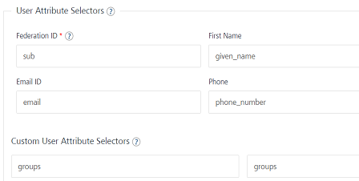

                               

User Guide: [Identity](Identity.md) > [Configure the Identity Service](ConfigureIdentiryService.md) > Groups Support in Identity Services

Groups Support for Identity Services
------------------------------------

You can configure custom parameters to get information about groups from identity services.

Based on the groups' information in the result response of identity services, you can use the response from the identity services to handle your logic/code on the client side. You can also target functionality to a specific group.

### Groups Support in Identity Services

The following identity service types support the configuration of custom properties to get information about groups.

  
| Identity Service Type | Parameters that you need to configure in the Volt MX Foundry Console |
| --- | --- |
| Okta | Follow the give steps to configure custom parameters for an Okta Identity Service:
Go to the okta identity service configuration. Add groups in the scope field**Callback URL**:<URL>**Scope**: openid profile email phone groups Expand the **Advanced** section to view the **User attribute selectors**. You need to add a custom profile attribute selector with value as `groups`.

These steps will make sure groups are returned as part of the login response and as part of **getUserAttributes** API response. They can also be consumed using the identity scope parameters in integration service. |
| Lightweight Directory Access Protocol (LDAP) | Configure the following custom parameter in [LDAP Identity Service type](Identity2_MS_AD.md#ldap-ldaps): In **Custom User Attribute Selectors** section has Attribute Name and Attribute Selectors. Attribute Name = groupsAttribute Selector = `memberof` |
| Custom | For [custom identity](Identity8_VoltMX_Custom.md), Volt MX identity returns attributes from the backend login response. Therefor, if you want to receive the information about groups in the response for a custom identity service, the backend login response should include the groups attributes. You can refer to the following example for more information. Sample Backend Login Response with groups information: { “user\_attributes”:{ “first\_name”:”John”, “last\_name”:”Doe”, “groups”:\[ “Everyone”, “Admins” \] }, “security\_attributes”:{ “session\_token”:”<backend\_token>”, … … }, } |

> **_Note:_** For more details on how to use Groups in apps, refer to [Using Groups in an App](GroupsinUserRepository.md).
