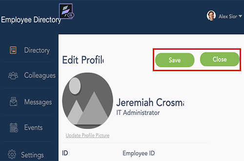
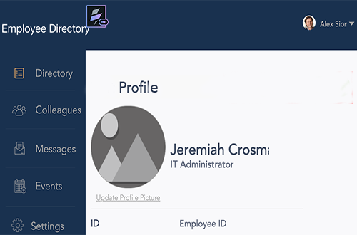
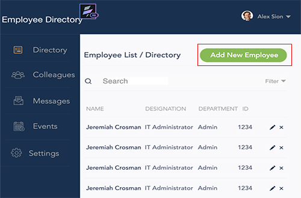
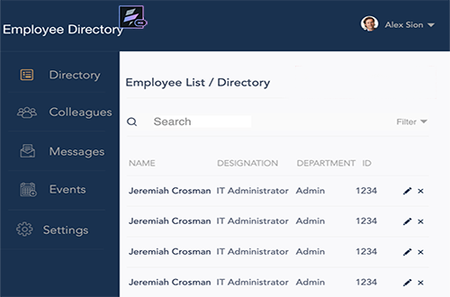
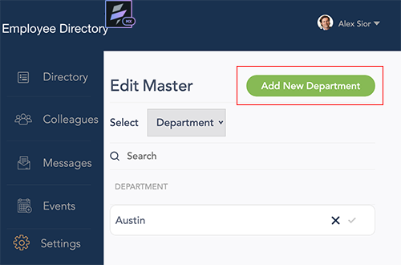
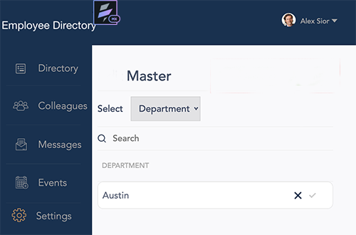
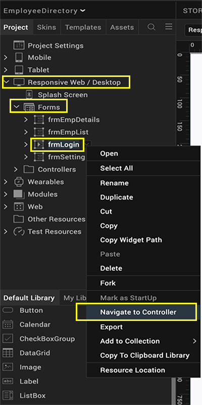
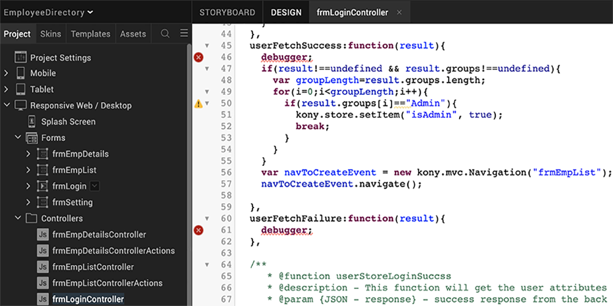
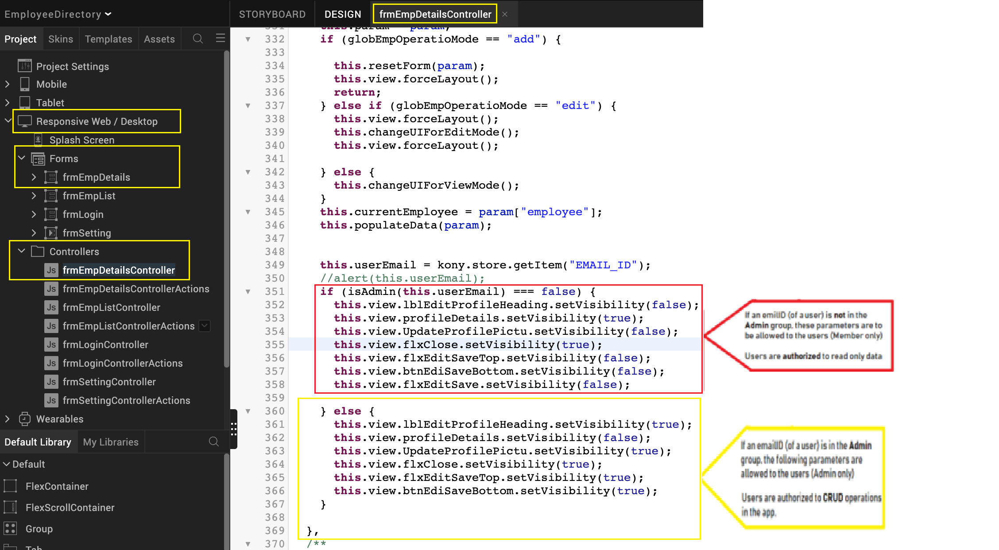

                               

User Guide: [Identity](Identity.md) > [Configure the Identity Service](ConfigureIdentiryService.md) > Using Groups in an App

Using Groups in an App
----------------------

You can now create groups by using User Repository identity service. Admins and Members are the default groups available in the User Repository identity service. Users can create custom groups as well. When a user is added, the user must be part of a group. By default, all users are associated to the **Members** group.

Based on the groups you create in User Repository and the response in identity service, you can now directly handle your logic/code in controllers created in MVC (modules in non-MVC) platform, for apps. Your logic/code can include selected functionality targeted to a specific set of users in a group.

> **_Note:_** For configuring groups for other identity service types, refer [](GroupsinIdentityServices.md)Groups Support for Identity Services.

### Use Case

To understand the functionality of **Groups** feature, let us take an example of the sample app EmployeeDirectory. You will learn how to handle groups to authenticate CRUD operations in user forms in the app.

*   **Desktop web version (Users of Member group log in/Client app)**: The app comes pre-configured with Login, Menu, Filter and List/Detail interface with Search and Dictionary functionality. Users in the Member group can search, discover and know more about your co-workers.
*   **Desktop web version (admin only)**: In addition to the capabilities of the member role, users in the Admin group can create, edit, save, and delete employee records. The responsive web app comes with an Admin Console which lets the user to perform CRUD operations.
    
    *   For example, in the sample app: **EmployeeDirectory** is linked to the User Repository identity service. You create one set of users and associate them to a group: Members, and another set of users to the Admin group. Based on the response from the identity service, now you can write your logic/code for admin app and client app.
    
    The following table details the forms used in the EmployeeDirectory sample app versions authenticated and authorized based admin and member groups.
    
    | Forms available to users in the **Admin** group (allows **CRUD** operations) | Forms available for users in the Member group (allows **Read-only** operations) |
    | --- | --- |
    | Form: Employee DetailsNavigation: Directory; Default launch screento allow **CRUD** operations to manage the User profiles |   |
    | Form: Employee List / DirectoryNavigation: Directory; Default launch screento allow **CRUD** operations to manage users in the Employee List |  |
    | Form: Edit Master Navigation: Directory; Default launch screento allow **CRUD** operations to manage details for department, designation, and location in the Employee List |  |
    

### How to Use Groups in Apps (Based on Sample App - EmployeeDirectory)

1.  Import the [EmployeeDirectory](https://marketplace.hclvoltmx.com/items/employee-directory-1) app into your project in Volt MX Iris.
2.  Navigate to app to the Volt MX Foundry services by using the Data panel.
    
    By default, Volt MX User Repository (Userstore) identity service is linked to the app.
    
3.  Create a user (User1) and associate the user to the default group **Member**.
4.  Create another user (User2) and add the user to the new group **Admin**.
    
    Sample Test Response:
    
```
 {  
        "profile": {
            "userid": "User1@voltmx.com",
            "email": "User2@voltmx.com",
            "firstname": "User_Admin",
            "lastname": "Das",
            "user_attributes": {
                "user_id": "User1@voltmx.com",
                "groups": [
                    "Admin"
                ]
            },
            "profile_attributes": 
        },}
```
5.  In **VoltMX Iris**, link the Volt MX Foundry app to your project.
    1.  Open the project.
    2.  Navigate to **Responsive Web/Desktop > Forms**, and right-click **frmLogic**.
    3.  Click **Navigate to Controller**.
        
        
        
        The **frmLoginController** module is selected. The frmLoginController details sample code to fetched groups details that you configured in Volt MX Foundry User Store:
        
        
        
        | Sample Code | Description |
        | --- | --- |
        | `if (result.group[i]=="Admin")``voltmx.store.setItem("isAdmin", true);` | The Admin is the group in User Repository, which can contain users. You can write your logic to allow these users to perform CRUD operations in the Admin app version. |
        | In this case, `(result.group[i]=="Admin")`,the logic checks if the result in the response from user repository contains **Admin** under the `groups` tag, In this case: `(voltmx.store.setItem("isAdmin", true)`,if you set the group is true, the group details are stored in the array: **group\[i\]** ||
        
6.  Navigate to Responsive **Web/ Desktop > Forms**, and right-click **frmEmpDetails**. The **frmEmpDetailsController** module contains your code/logic to access CRUD operations than the user (Admin) is authorized to perform, such as view user details, create a new, update user details, and delete a user.
    
    
    
7.  Build the app.
