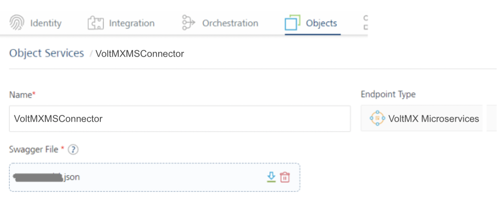
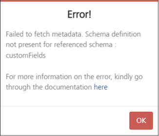
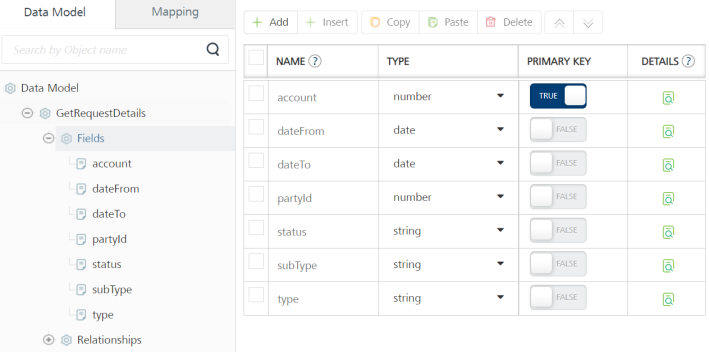
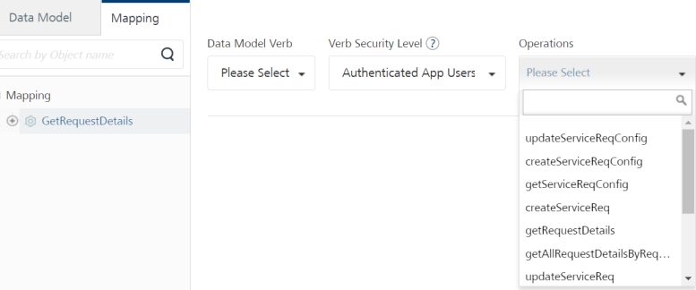
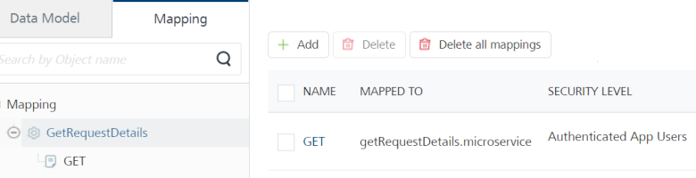
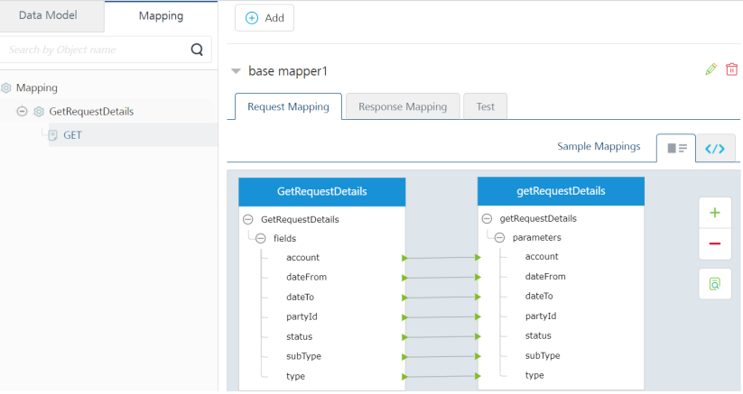
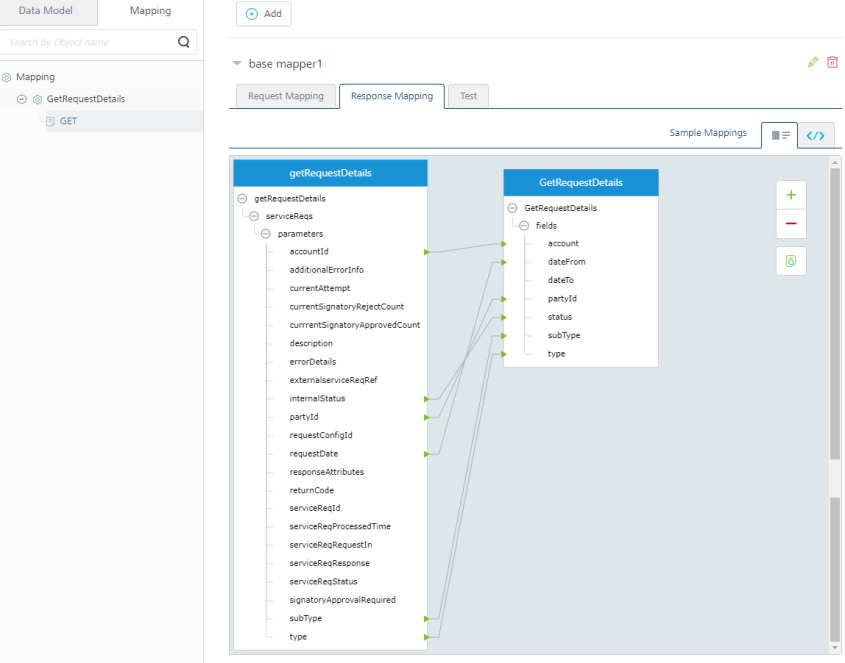
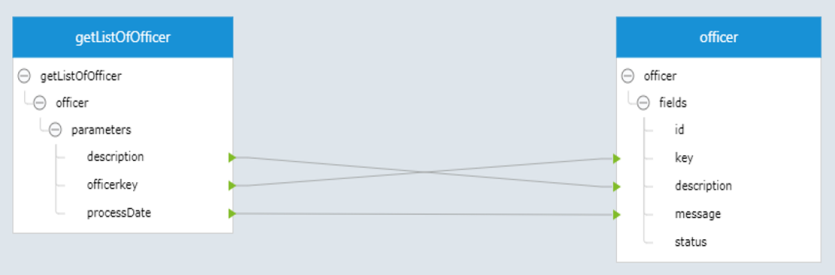
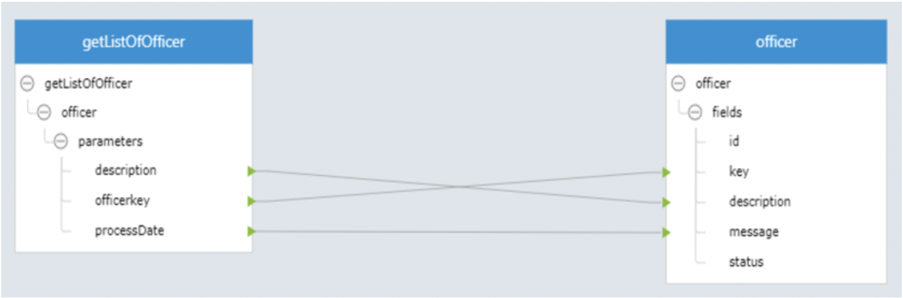

   

HCL Microservices Adapter for Object Services
=================================================

The HCL Microservices Adapter is an interface supported in Object Services from Foundry V9SP5 GA onwards. The adapter allows you to connect to the back-end HCL Microservices via Object Services.

> **_Important:_** The HCL Microservices adapter only supports Open API (Swagger) 3.0 specification. It supports uploading a Swagger file along with external reference files.  

<br>

> **_Important:_** Supports more than one Swagger definition file in a . ZIP file.

**Use Case**:

Currently, any team trying to connect to HCL microservice must use Foundry JSON services to implement microservices manually. When the team should modify request payloads, each required JSON template must be changed manually, which is time-consuming as well.

Using the HCL Microservices adapter in object services, you can upload a valid Swagger JSON file containing all APIs to connect to the hosted microservices. The object service retrieves the metadata from the uploaded Swagger file and displays all the APIs as back-end operations in the Object services. You can use an existing Swagger engine to connect to hosted back-end APIs. So you can use the object services capabilities to link microservices APIs for these objects. For more information on Foundry Object Services, refer to [Object Services](Objectservices.html).

The HCL Microservices adapter helps you to improve the Foundry app development aspects as follows:

*   To access microservices back-end operations in an object service.
*   To manage APIs definitions with OpenAPI spec, instead of changing individual JSON integration services.
*   To upgrade newer versions of APIs definitions is faster. You need to upload a newer version of the Swagger JSON file to the adapter to get the latest APIs definitions.
*   To create a new data model to link microservices: You can create your custom app data model and map it to microservices operations.

The following sections help you create a HCL Microservices object service.

Creating a HCL Microservices Object Service
-----------------------------------------------

*   [Configuring a HCL Microservices End-point Adapter](#creating-a-hcl-microservices-object-service)
*   [Configuring a Data Model for HCL Microservices](#Create_Op)
*   [Mapping Operations to Back-end Methods for HCL Microservices](#Create_Op)
*   [Visual Mapping Operations to Back-end Methods for HCL Microservices (for Requests and Responses)](#Visual)

### Configuring a HCL Microservices End-point Adapter

To configure a HCL Microservices in object service, you need to upload a Swagger file and a Swagger external reference file(s) containing specifications for the required APIs to the service.

1.  In your VoltMX Foundry Console > Foundry Apps, click **ADD NEW** to create an app.
2.  Under Configure Services, click the **Objects** tab, and click **CONFIGURE NEW** to create an object service.
3.  In the [Object Service Definition](ConfigureIntegrationService.md) tab, configure the service definition parameters. For more information, refer to the following sections.
    
    <table style="mc-table-style: url('Resources/TableStyles/Basic.css');width: 80%;" class="TableStyle-Basic" cellspacing="0"><colgroup><col class="TableStyle-Basic-Column-Column1" style="width: 15%;"><col class="TableStyle-Basic-Column-Column1" style="width: 65%;"></colgroup><tbody><tr class="TableStyle-Basic-Body-Body1"><th class="TableStyle-Basic-BodyE-Column1-Body1">Parameter</th><th class="TableStyle-Basic-BodyD-Column1-Body1">Description</th></tr><tr class="TableStyle-Basic-Body-Body1"><td class="TableStyle-Basic-BodyE-Column1-Body1"><p>Name</p></td><td class="TableStyle-Basic-BodyD-Column1-Body1"><p>Specifies the name that Foundry uses to identify the service on the console.</p></td></tr><tr class="TableStyle-Basic-Body-Body1"><td class="TableStyle-Basic-BodyE-Column1-Body1"><p>Version</p></td><td class="TableStyle-Basic-BodyD-Column1-Body1"><p>Specifies the version number of the service. The version number ranges from <b>1.0</b> to <b>999.99</b>.</p><p>If you create a new service, the version number is <b>1.0</b> by default, and it cannot be changed.</p></td></tr><tr class="TableStyle-Basic-Body-Body1"><td class="TableStyle-Basic-BodyB-Column1-Body1"><p>Description</p></td><td class="TableStyle-Basic-BodyA-Column1-Body1"><p>Specifies the description of the service that is displayed on the console.</p></td></tr></tbody></table>
    
4.  From the **Endpoint Type** list, select the **HCL Microservices** on the [Object Service Definition](ConfigureIntegrationService.md#IntSD) page.
5.  Under Swagger File, click **UPLOAD FILE** to select your Swagger File.
    
    <table style="mc-table-style: url('Resources/TableStyles/Basic.css');width: 80%;" class="TableStyle-Basic" cellspacing="0"><colgroup><col class="TableStyle-Basic-Column-Column1" style="width: 15%;"><col class="TableStyle-Basic-Column-Column1" style="width: 65%;"></colgroup><tbody><tr class="TableStyle-Basic-Body-Body1"><th class="TableStyle-Basic-BodyE-Column1-Body1">Parameter</th><th class="TableStyle-Basic-BodyD-Column1-Body1">Description</th></tr><tr class="TableStyle-Basic-Body-Body1"><td class="TableStyle-Basic-BodyB-Column1-Body1">Swagger File</td><td class="TableStyle-Basic-BodyA-Column1-Body1"><p>Specifies the JSON,or YAML file that contains the required API specifications. You can also upload a zip file that contains the JSON or YAML file along with external reference files, if any.</p><p>To upload an OpenAPI specification file, click <b>UPLOAD FILE</b>, and then select a file from your local system.</p><p madcap:conditions="Default.V9SP2M1">After you upload a file, Foundry displays connection parameters based on the OpenAPI spec version that is mentioned in the file.</p><p class="Note" madcap:autonum="<b><i><span style=&quot;color: #0a9c4a;&quot; class=&quot;mcFormatColor&quot;>Note: </span></i></b>">In the following sections, all references (screen-shots, objects, operations, and mapping) are based on the sample Swagger JSON file for the Service Request microservice.</p></td></tr></tbody></table>
    
    > **_Important:_** It supports uploading a Swagger file along with external reference files.
    
    <details close markdown="block"><summary>OpenAPI uploaded with External Reference Files</summary>
    <blockquote><em><b>Important: </b></em>If the extension files are empty and there are references in the main JSON file to schemas/custom fields of these extensions, an error message will be popped up. To prevent the error message, you need to add dummy schemas/custom fields to the extension files.<br/>
    </blockquote>
    For example,<br>
    <p>1. You have uploaded a mircoservices zip file provided by the Infinity microservices team. The path for uploading the zip file: Object Services > Service Definition page > <b>Swagger File</b>.</p>
     
    <p>In case the uploaded zip file contains empty extension files whose references are present in the main JSON file, an error window will pop up when you click on the Mapping tab &gt; Mapping &gt; &lt;<b>Object</b>&gt; of the Object Service in the Foundry Console.</p>
    <p>Failed to fetch metadata. Schema definition not present for referenced schema : customFields.</p>
    
    <p>- You will be redirected to this documentation page when you click on here.</p>
    <p>- You will be redirected to the previous page in Console when you confirm OK.</p>

    <p>If the main OpenAPI file contains a reference to a schema from external files, for example:</p>
    <pre><code style="display:block;background-color:#eee;">ServiceRequest: 
          properties: 
            account: 
              type: string 
              description: Account Id 
              example: '87907' 
            requestIn: 
              $ref: 'srmsExternalRef.yaml#/components/schemas/requestIn' 
            signatoryApprovalRequired: 
              type: string 
              description: signatory Approved or Not 
              example: true  
    </code></pre>
    <ul>
    <li>Make sure the external reference file exists in the zip.</li>
    <li>The schema should be present in that file. Otherwise the console will throw an error when you try to create a verb and map an operation.<br/>
    The <code>srmsExternalRef.yaml</code> file would look like this:
    <pre><code style="display:block;background-color:#eee;">ServiceRequest: 
      Components: 
                schemas: 
                  serviceReqRequestIn: 
                        type: object 
                        properties: 
                          xyz: 
                              type: string 
                              description: Generic serviceReq ID 
                              example: ORD127REDFDSAS 
                        description: Request In for ServiceReq 
                        example: 
                          checkIssueId: SB.2406 
                          note: CreateNew 
                  requestIn: 
                        type: object 
                        properties: 
                        description: Request Load for Creating ServiceReq 
                        example: 
                          checkIssueId: SB.2406 
                          note: CreateNew
    </code></pre>
    </li>
    <li>If you do not have fields in a schema, you can keep an empty properties field, as mentioned in the requestIn schema of the above example.</li>
    </ul>
    </details>

    
6.  Enter the following connection parameters. The adapter will provide an option for you to enter an header Key and value:  

    <details close markdown="block"><summary>Connection Parameters</summary>
    <table style="mc-table-style: url('Resources/TableStyles/Basic.css');width: 80%;" class="TableStyle-Basic" cellspacing="0"><colgroup><col class="TableStyle-Basic-Column-Column1" style="width: 15%;"><col class="TableStyle-Basic-Column-Column1" style="width: 65%;"></colgroup><tbody><tr class="TableStyle-Basic-Body-Body1"><th class="TableStyle-Basic-BodyE-Column1-Body1">Parameter</th><th class="TableStyle-Basic-BodyD-Column1-Body1">Description</th></tr><tr class="TableStyle-Basic-Body-Body1"><td class="TableStyle-Basic-BodyE-Column1-Body1"><p>xapikey</p></td><td class="TableStyle-Basic-BodyD-Column1-Body1"><p>Specify the header value "xapikey" for AWS. If you want to have AWS authentication, you can add this value in the service configuration. This value will be added to the header parameters while connecting to the microservice.</p></td></tr><tr class="TableStyle-Basic-Body-Body1"><td class="TableStyle-Basic-BodyE-Column1-Body1"><p>xfunctionkey</p></td><td class="TableStyle-Basic-BodyD-Column1-Body1"><p>Specify the header value "xfunctionkey" for Azure. This is a common value for all Microsoft Azure deployments.</p><p>If you want to have Azure authentication, you can add this value in the service configuration. This value will be added to the header parameters while connecting to the microservice.</p></td></tr><tr class="TableStyle-Basic-Body-Body1"><td class="TableStyle-Basic-BodyE-Column1-Body1"><p>Authorization</p></td><td class="TableStyle-Basic-BodyD-Column1-Body1">These details are generated by the adapter itself, for Docker on-premises.</td></tr><tr class="TableStyle-Basic-Body-Body1"><td class="TableStyle-Basic-BodyE-Column1-Body1"><p>Server URL</p></td><td class="TableStyle-Basic-BodyD-Column1-Body1"><p>Specifies the URL of the server that hosts the APIs. The default URL is the first Server URL in the specification file.</p><p>For information about how Foundry parses the URLs, refer to the <a href="#Miscellaneous">Miscellaneous</a> section.</p><p>For example: <code class="codefirst" style="font-size: 11pt;">https://subdomain.site.com/version</code></p></td></tr><tr class="TableStyle-Basic-Body-Body1"><td class="TableStyle-Basic-BodyB-Column1-Body1"><p>Server Description</p></td><td class="TableStyle-Basic-BodyA-Column1-Body1"><p>Specifies the description for the server that is specified by the URL.</p><p>For example: <code class="codefirst" style="font-size: 11pt;">Development Server</code></p></td></tr></tbody></table>
    <b>Authentication</b>
    <table style="mc-table-style: url]('Resources/TableStyles/Basic.css');width: 80%;" class="TableStyle-Basic" cellspacing="0"><colgroup><col class="TableStyle-Basic-Column-Column1" style="width: 15%;"><col class="TableStyle-Basic-Column-Column1" style="width: 65%;"></colgroup><tbody><tr class="TableStyle-Basic-Body-Body1"><th class="TableStyle-Basic-BodyE-Column1-Body1">Parameter</th><th class="TableStyle-Basic-BodyD-Column1-Body1">Description</th></tr><tr class="TableStyle-Basic-Body-Body1"><td class="TableStyle-Basic-BodyB-Column1-Body1"><p>Use Existing Identity Provider</p></td><td class="TableStyle-Basic-BodyA-Column1-Body1"><p>Specifies the identity provider that you want to use to authenticate users for the service.</p><p>You can select any Identity Service that is created on the <madcap:variable name="MyVariables.VoltMX">Foundry cloud.</madcap:variable></p><p>For information about creating an Identity Service, refer to <a href="ConfigureIdentiryService.html" target="_blank">Configure Identity Service</a>.</p><p class="Note" madcap:conditions="Default.V9SP3" madcap:autonum="<b><i><span style=&quot;color: #0a9c4a;&quot; class=&quot;mcFormatColor&quot;>Note: </span></i></b>">For more information on Externalizing Identity Services, refer to <a href="Replacing_Identity_Services.html" target="_blank">Replace the Identity Service references in a Foundry app</a>.</p></td></tr></tbody></table>  
    </details>
    
    <details close markdown="block"><summary>Advanced</summary><table>
      <tr>
      <th>Field</th>      
      <th>Description</th>
      </tr>      
      <tr>
      <td>Custom code</td>      
      <td>
      <p>Specifies any custom JAR files that you want to associate with the service.To associate a JAR file with the service, follow either of the following steps.</p>
      <ul>
      <li>From the Select Existing JAR list, <b>select a JAR file</b> from the Foundry cloud</li>            
      <li>Click <b>Upload New</b>, and then select a JAR file from the file explorer</li>    
      </ul>
      <blockquote><em><b>Note: </b></em>For on-premises instances of Foundry, make sure that the JAR file that is built on the same JDK version that is used to install the Foundry Integration.</blockquote>
      </td>
      </tr>      
      <tr>
      <td>API Throttling</td>      
      <td>
      <p>Specifies whether Foundry must limit the number of request calls in a minute.To use <b>API Throttling</b>, follow these steps.</p>
      <ol>
      <li>In the <b>Total Rate Limit</b> box, type a required value. This limits the total number of requests that are processed by the service.</li>            
      <li>In the <b>Rate Limit Per IP</b> box, type a required value. This limits the number of requests based on the IP Address of the request.</li>    
      </ol>
      <p>You can also override throttling from the Foundry App Services Console. For more information, refer to <a href= "API_Throttling_Override.html#OverrideAPIThrottling">Override API Throttling Configuration.</a></p>
      </td>
      </tr>
    </table>
    </details>
    
7.  After you configure all the parameters, click **SAVE**.  
    
    > **_Note:_** If you want to create objects to the service, click **SAVE & CONFIGURE**.
    

### Configuring a Data Model for HCL Microservices

> **_Note:_** In the following sections, all references to screen-shots, objects, operations, and mapping are based on the sample Swagger JSON file for the Service Request microservice.

1. Click the **Data Model** tab.

2. Click **Add** to create an object and fields as per your Swagger details. The following sample object is created for GetRequestDetails and fields:

   <table>
   <tr>
   <th>Object</th>
   <th>Fields</th>
   </tr>
   <tr>
   <td><code>GetRequestDetails</code></td>        
   <td><ul><li>account</li><li>dateFrom</li><li>dateTo</li><li>partyId</li><li>status</li><li>subType</li><li>type</li></ul></td>
   </tr>
   </table>     
    


    
> **_Note:_** Currently, the option to auto-generate the data model is not supported for this adapter.
    
  For more information on creating objects and fields, refer to [Configuring a Data Model](ObjectsServices/Stage_2.html#creating-objects-definition-and-map-to-back-end-objects-manually).
    

### Mapping Operations to Back-end Methods for HCL Microservices

1.  Click the **Mapping** tab.
2.  Select an object and click **Add** to create an operation.
    
3.  Associate a back-end operation to the object verb. To do this, select the **Data Model Verb** from the list and select a back-end operation from the **Operations** list.
    
    > **_Note:_** All the operations listed in the Swagger file are displayed here. You can map the required back-end operations to verbs for objects.
    
    
    
    The following object verbs are linked to back-end operations.
    
    
    

### Visual Mapping Operations to Back-end Methods for HCL Microservices (for Requests and Responses)

The base mapper1 is created for request and response by default.

Click **EDIT** to add your custom mapping for request and response parameters, if required.

#### Request Mapping

For object request calls, you can now map the objects to the back-end operations using the Visual/XML mapping, as shown below:



#### Response Mapping

For object response calls, you can now map the back-end operations to the objects using the Visual/XML mapping, as shown below:



For more information on mapping, methods (verbs) mapping, custom verbs, and mapper elements, refer to [Mapping Operations to Back-end Methods](ObjectsServices/Objectservices_Stage3.html).

<!-- ### Testing the Operation

After creating an operation and configuring the request and response mapping, you can test the operation and validate the configuration details.

Select an environment from the **Select Environment** list and then click **SAVE AND FETCH RESPONSE** to test an operation. The result of the operation appears. For more details, refer to [Test a Service Operation](Test_a_Service_Operation.md).

For Post or Put methods that contain nested payloads, you cannot test the service from the Foundry Console. You can only send a request from the App Services Console, or from [Postman](https://www.postman.com/). -->

Limitations
-----------

### Map-record issue

When you pass an input payload where you have a scenario of mapping a record within a record, the Visual Mapper generates wrong XML mapper.

For instance, if the input payload is:

```
{
  "id": 0,
  "category": {
    "id": 0,
    "name": "string"
  },
  "name": "doggie",
  "photoUrls": [
    "string"
  ],
  "tags": [
    {
      "id": 0,
      "name": "string"
    }
  ],
  "status": "available"
}

```

where category is a record within a record.

The XML generated sample code does not include nested records as follows:

```
<?xml version="1.0" encoding="UTF-8" standalone="yes"?>
<mapper xmlns="http://www.voltmx.com/ns/mapper">  
  <map inputpath="request_in" outputpath="request_out">    
    <set-param inputpath="id" outputpath="id"/>    
    <set-param inputpath="name" outputpath="name"/>    
    <set-param inputpath="photoUrls" outputpath="photoUrls"/>    
    <set-param inputpath="status" outputpath="status"/>     
    <map inputpath="category" outputpath="category">      
      <set-param inputpath="id" outputpath="id"/>      
      <set-param inputpath="name" outputpath="name"/>    
    </map>    
    <map inputpath="tags" outputpath="tags">      
      <set-param inputpath="id" outputpath="id"/>      
      <set-param inputpath="name" outputpath="name"/>    
    </map>  
  </map>
</mapper>
```

For scenarios like this where we have a record within a record, the tag should be <map-record></map-record> instead of <map></map>.

To achieve this case, use the custom XML mapper and generate the XML as below:

```
<?xml version="1.0" encoding="UTF-8" standalone="yes"?>
<mapper xmlns="http://www.voltmx.com/ns/mapper">  
  <map inputpath="request_in" outputpath="request_out">    
    <set-param inputpath="id" outputpath="id"/>    
    <set-param inputpath="name" outputpath="name"/>    
    <set-param inputpath="photoUrls" outputpath="photoUrls"/>    
    <set-param inputpath="status" outputpath="status"/>     
    <map-record inputpath="category" outputpath="category">      
      <set-param inputpath="id" outputpath="id"/>      
      <set-param inputpath="name" outputpath="name"/>    
    </map-record>    
    <map inputpath="tags" outputpath="tags">      
      <set-param inputpath="id" outputpath="id"/>      
      <set-param inputpath="name" outputpath="name"/>    
    </map>  
  </map>
</mapper>

```

### Visual Mapper XML generation issue - dataset as back-end response

When a backend response is a dataset (array), the Visual Mapper generates wrong XML mapper. To achieve this case, use the custom XML mapper and generate the XML as below:

> **_Important:_** Responses with Datasets cannot be generated by the Visual Mapper.

For example, Backend Response sample code:

```
{
  "officer": [
    {
      "officerkey": "1",
      "description": "Implementation",
      "processDate": "2022-03-02 10:21:26.0"
    },
    {
      "officerkey": "10",
      "description": "Chief Treasury Dealer -Interbank",
      "processDate": "2022-03-02 10:21:27.0"
    },
    {
      "officerkey": "10009",
      "description": "Implementation"
    
    }
  ]
}

```

The sample visual mapper looks something like this:



The XML generated sample code is as follows:

```
<?xml version="1.0" encoding="UTF-8" standalone="yes"?>                
<mapper xmlns="http://www.voltmx.com/ns/mapper">
  <map inputpath="response_in" outputpath="response_out">
    <map inputpath="getListOfOfficer" outputpath="officer">
      <set-param inputpath="officer/officerkey" outputpath="key"/>
      <set-param inputpath="officer/description" outputpath="description"/>
      <set-param inputpath="officer/processDate" outputpath="message"/>
    </map>
  </map>
</mapper>

```

This kind of mapping iterates through getListOfOfficer dataset and fetches officerkey, description and processDate only from the first object in the officer array, but the iteration has to happen through all the objects under officer array of getListOfOfficer.

The Mapper generated Response sample code:

```
{
  "records": [
    {
      "description": "Implementation",
      "message": "2022-03-02 10:21:26.0",
      "key": "1"
    }
  ],
  "opstatus": 0,
  "httpStatusCode": 200
}

```

For correct XML mapper response, the XML sample code should look like this

```
<?xml version="1.0" encoding="UTF-8" standalone="yes"?>
<mapper xmlns="http://www.voltmx.com/ns/mapper">
  <map inputpath="response_in" outputpath="response_out">
    <map inputpath="getListOfOfficer/officer" outputpath="officer">
      <set-param inputpath="officerkey" outputpath="key"/>
      <set-param inputpath="description" outputpath="description"/>
      <set-param inputpath="processDate" outputpath="message"/>
    </map>
  </map>
</mapper>

```

Or it can also look like this

```
<?xml version="1.0" encoding="UTF-8" standalone="yes"?>
<mapper xmlns="http://www.voltmx.com/ns/mapper">
  <map inputpath="response_in" outputpath="response_out">
    <map inputpath="getListOfOfficer" outputpath="">
      <map inputpath="officer" outputpath="officer">
        <set-param inputpath="officerkey" outputpath="key"/>
        <set-param inputpath="description" outputpath="description"/>
        <set-param inputpath="processDate" outputpath="message"/>
      </map>
    </map>
  </map>
</mapper>

```

Now the Mapper response sample code is correct:

```
{
   "records": [
    {
      "description": "Implementation",
      "message": "2022-03-02 10:21:26.0",
      "key": "1"
    },
    {
      "description": "Chief Treasury Dealer -Interbank",
      "message": "2022-03-02 10:21:27.0",
      "key": "10"
    },
    {
      "description": "Implementation",
      "key": "10009"
    }
   ],
  "opstatus": 0,
  "httpStatusCode": 200
}

```

### Dynamic Map Support for Objects with No Pre-defined Fields (Free form objects)

If there is a scenario where an object/record with no pre-defined fields can be passed in runtime during the service call, the Visual Mapper generates not a proper XML.



Here the requestIn is of type object with no pre-defined fields. Here the parent level mapping doesn’t happen and hence there will be no reference to that object in the generated visual mapper XML. These kinds of objects are supported with dynamic-map.

Therefore, whenever we encounter such cases, we should add a <dynamic-map></dynamic-map> tags wherever required.

So, The XML should be like

```
<?xml version="1.0" encoding="UTF-8" standalone="yes"?>  
<mapper xmlns="http://www.voltmx.com/ns/mapper">  
<map inputpath="request_in" outputpath="request_out">  
<set-param inputpath="account" outputpath="account"/>  
<set-param inputpath="partyId" outputpath="partyId"/>  
<set-param inputpath="serviceReqConfId" outputpath="serviceReqConfId"/>  
<set-param inputpath="signatoryApprovalRequired" outputpath="signatoryApprovalRequired"/>  
<set-param inputpath="subtypeId" outputpath="subtypeId"/>  
<set-param inputpath="typeId" outputpath="typeId"/>  
<set-param inputpath="uuid" outputpath="uuid"/>  
<dynamic-map inputpath="requestIn" outputpath="requestIn">  
</dynamic-map>  
</map>  
</mapper>
```

Miscellaneous
-------------

The OpenAPI Specification (formerly: Swagger specification) is a framework used to define interfaces with which you can design, build, document, and consume REST APIs.

For more information about OpenAPI 3.0, you can refer to the following articles:

*   [A Guide to What’s New in OpenAPI 3.0](https://swagger.io/blog/news/whats-new-in-openapi-3-0/)
*   [A Visual Guide to What's New in Swagger 3.0](https://blog.readme.com/an-example-filled-guide-to-swagger-3-2/)

### OpenAPI 3.0

*   With the OpenAPI 3.0 Specification, you can add multiple URLs to your definition and also include parameters in the URL. For more information, refer to [A Visual Guide to What's New in Swagger 3.0](https://blog.readme.com/an-example-filled-guide-to-swagger-3-2#urlstructure).
    *   While creating a service for OpenAPI 3.0 in VoltMX Foundry V9 ServicePack 2, you can select only one URL as the Server URL. If your specification file contains multiple URLs, Foundry picks the first URL by default.
    *   You can change the URL before you publish the service to the run time by reconfiguring the service before a publish. For more information, refer to [Service Reconfiguration](ServiceReconfig.md).
    *   Parameters in the URL are not supported. Make sure that you add static server URLs to your specification file.
*   Extension data is not supported as Foundry parses only one specification file. If your specification file contains references to any external files, the console displays an error.  
      
    For example, if your file contains the following code snippet, the console displays an error:  
      
```
{
    "$ref": "PayInOutExtension.json#/components/schemas/customFields"
    }
```
*   The **trace** HTTP method is not supported and the APIs that use the trace method are ignored.  
    APIs that use other HTTP methods are parsed by Foundry to create operations.  

*   If the HTTP response code is not **200**, the console displays the response from the back-end server as is.  

*   **OpenID Connect** (OIDC) is not supported for authentication.  

*   **Callbacks**, which are used to define Webhooks, are not supported. **Links**, which are used to define the output of one operation as input for another operation, are not supported. Make sure that you remove Callbacks and Links from your OpenAPI 3.0 spec before you uploading it to Foundry.  

*   Serialization of parameters, which includes **style** (defines the delimiter for multiple parameters) and **explode** (specifies whether objects of an array are generated as separate parameters), is not supported.  

*   Foundry does not parse or validate **examples** from the specification file.  

