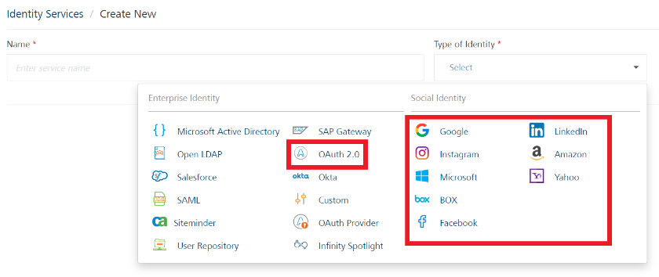

                               

User Guide: [Identity](Identity.md) > [Configure the Identity Service](ConfigureIdentiryService.md) > Volt MX Foundry OAuth 2.0

Volt MX  Foundry OAuth 2.0 Identity Service
--------------------------------------------

Volt MX  Foundry identity supports OAuth 2.0 protocol for authenticating back-end identity providers that support `RFC6749`. For more details, refer to <a href="https://www.rfc-editor.org/rfc/rfc6749" target="_blank"> https://tools.ietf.org/html/rfc6749</a>.

With **Volt MX Foundry OAuth 2.0** identity service, a user can access some of the external OAuth service providers such as Salesforce, Google, Amazon, Microsoft, Instagram, Yahoo, and Box for authentication.

From V9SP2 HotFix, you can use the Keycloak identity service for authenticating <a href="https://opensource.hcltechsw.com/volt-mx-docs/95/docs/documentation/Foundry/voltmx_foundry_user_guide/Content/Red_Hat_PAM_Adapter.html" target="_blank">Foundry Red Hat PAM Integration Services</a>.

Based on the user's request made by using SDKs, the Volt MX Foundry OAuth 2.0 identity service selects the Web server authorization grant flow (3-legged OAuth) for performing user authentication.

*   **Example for 3-legged OAuth**: When a user logs into a Volt MX Foundry application by using the Google OAuth endpoint, the authorization service (for example, Google OAuth endpoint) redirects the user to Google login page. During this stage, the callback URL is also set. The user enters login details such as userID and password. After successful authentication, the user is logged into Google account. Based on the Volt MX Foundry OAuth 2.0 identity configuration, identity service filters the user profile data from Google and stores the details in the identity session.
    

**User Profiles in Volt MX Foundry OAuth 2.0**

Different service providers implement user profiles as per their own standards. Volt MX Foundry OAuth 2.0 identity service retrieves user attributes from a user profile and saves these attributes in Volt MX Foundry Identity Sessions after successful login response.

> **_Note:_** A profile endpoint provides the profile of the logged in user.

Volt MX  Foundry OAuth 2.0 helps users to configure authorization provider to access User Profile data in one of the following ways:

*   User profile data is provided as part of the response of GET on a fixed URL.
*   User profile data is provided as part of the response of GET on a URL, but the URL itself is not fixed. However, the URL is available either in the:
    *   Response of another call  
        or
    *   In the token response
*   User profile data is available as part of the token response.

### Advantages of Volt MX Foundry OAuth 2.0 identity service

*   You can use the OAuth 2.0 identity service to retrieve and save user attributes in Volt MX Foundry identity sessions after a successful login response, and then use the attributes as client filters during Offline Sync calls.
    
    > **_Note:_**  If you enable synchronization capability in your app, Volt MX Foundry OAuth 2.0 identity service uses the user attributes retrieved from the user profile as client filters during Offline Sync calls.   
    For example, the logged in user's role (such as Manager or Employee of an organization) received as part of a User Profile after a successful OAuth login can be used as a client side filter for Offline Sync. For more details, see the <a href="https://opensource.hcltechsw.com/volt-mx-docs/95/docs/documentation/Foundry/voltmx_foundry_user_guide/Content/Legacy_Sync.html#SyncClientsideFilters" target="_blank">Synchronization > client side filters</a>. topic.
    
    
    > **_Note:_** To configure Okta identity service, you can the same steps provided for the Auth 2.0 Identity Service section as well.
    

### How to Configure a Volt MX Foundry OAuth 2.0 Identity Service

<b> To configure an identity service using Volt MX Foundry OAuth authentication mode, follow these steps:</b>

1.  Under the **[**Identity** service designer](ConfigureIdentiryService.md#IdentitySDpage)** page, type a name for the service in the **Name** text box.
    
    

Click to View image

    
    

    

2.  From the **Type of Identity** list, select **OAuth2.0**.
    
    > **_Note:_** Fields marked with an asterisk are required.
    
3.  In the **Provider Details** text box, configure the following endpoints:
    1.  **Grant Type**: A new authorization grant type is defined by providing a grant type parameter in Volt MX Foundry Console. Select the required grant type from the drop-down menu. The following are the different grant types you can select:
        1.  **Authorization code**: An authorization code grant type is used if the client wants to request access to protected resources on behalf of another third-party user. When the client requests for the authorization, the authorization server redirects to the third party URL. The client enters the authorization code and gains access to the protected resources.  
              
            From V9 ServicePack 2, Foundry supports <a href="https://www.rfc-editor.org/rfc/rfc7636" target="_blank">rfc7636</a>.
            for OAuth providers that use PKCE in the Authorization Code grant flow. For more information, refer to [PKCE Support in Foundry](#pkce-support-in-foundry).
            
        2.  **Password**: On selecting this grant type, the client needs to provide the **Token Endpoint**. The client provides their access credentials to access the URL provided in the Token Endpoint. These credentials are validated by the back-end server. If the credentials are valid, it redirects back to the Console.
            
        3.  **JWT Bearer**: When the JWT bearer grant type is selected, the provider picks the existing identity provider and pass the values as input to JWT bearer provider for the response. Apart from client specified parameters, the system picks the existing MF auth token and gets the relevant values from the session. The values are passed as input to the current JWT bearer provider login. The existing identity session is selected from the **Token Identity provider** drop-down menu.
            
        4.  **Extension**: When the extension grant type is selected, the system displays the **Extension Grant** text box to enter the grant type value. For extension grant type, the oAuth does not have any fixed value. The grant type value is dynamic, which is a client specified parameter.
            
        5.  **Client Credentials**: When the client credentials grant type is selected, the client can request an access token using only its client credentials when the client is requesting access to the protected resources under its control, or to those of another resource owner that has been previously set up with the authorization server.

    2.  **Authorize Endpoint**: Enter the URL that is provided by the endpoint service provider. For example, Salesforce or Google.  
        Sample authorize endpoint for Google: `https://accounts.google.com/o/oauth2/auth`  

    3.  **Token Endpoint**: Enter the token URL that is provided by the endpoint service provider.  
        Sample token endpoint for Google: `https://accounts.google.com/o/oauth2/token`  
        
    4.  In the **Callback URL** text box, the system displays the default URL generated by an identity service. You need to configure the callback URL details on the authorization server against your app. You cannot modify these details.  
          
        Sample callback URL: `https://<accountID>.auth.volt mxcloud.com/OAuth2/Callback`
        
        > **_Note:_**  Provide domain as a service URL.    
        > For example, configure your Google app to accept requests from authentication service by typing the `auth.volt mxcloud.com`  in the **App Domain** text field.    
        >   
        
    5.  In the **Scope** text box, enter the list of permissions that a user needs to agree to while in the user log-in page of the OAuth 2.0 service provider - for example, Gmail. The list can contain more than one permission and depends on the authorization server. For a sample of full list of permissions, refer to <a href="https://www.rfc-editor.org/rfc/rfc6749" target="_blank">OAuth 2.0 standards</a>.
        
        For example, if you configure the `email`   permission as scope, after you log in Google for the first time, Google displays the **Log in with Google** dialog with the configured permissions. Click **OK** to share your permissions (public profile and email) with Volt MX Foundry.

        **Logout URL** : Enter the Logout URL that is provided by the endpoint service provider.

         Sample Logout URL for Google: <code>https://accounts.google.com/logout</code>    

        **Revoke URL** : Enter the Revoke URL that is provided by the endpoint service provider.
     
        
4.  Under **Client Details**, configure the following parameters. The client details are used by a service provider to identify which app the authorization service is trying to access:
    From V9SP4, Foundry supports private key jwt in the OAuth 2.0 token request flow, as specified in [rfc7523](https://tools.ietf.org/html/rfc7523). 

    1. Under **Client Assertion Type**, select **Basic authentication** or **Private key jwt**. Based on your selection, configure the following parameters.  

       * **Basic authentication**:  
         *  In the **Client ID** text box, enter the client ID (for Google, app key) of the app instance that you created in service provider's developer console. For example, Google Developers Console.  
         * In the **Client Secret** text box, enter the client secret (for Google, app secret key) of the app instance that you created in service provider's developer console. For example, Google Developers Console.
    
       * **Private key jwt**:
         *  In the **Client ID** text box, type the client ID of the app instance that you created in the service provider's developer console.  
         *  In the **JWKS URL** box, Foundry displays the callback URL that you need to add to the service provider's back end or developer console.

        

For example, adding the URL to the Keycloak confidential client

        <ol>
        <li>On the service definition page of the Identity service, copy the JWKS URL.</li>
        <li>On the Keycloak console, open the app with the same Client ID that is configured in Foundry. Make sure that the Access Type is set to confidential.</li>
        <li>In the JWKS URL box, paste or type the URL that you copied from Foundry.</li>
        </ol>
        
  

    3. In the **Client Authentication Scheme**, select one of the following options to the client details as headers or form parameters:
        *   **Request Header**: To send client details as a header.
        *   **Form Param**: To send client details as form parameters.

5.  Under **User Profile Endpoint Details**, configure the following parameters to get the user profile from a service provider - for example, Google.  
    Different service providers implement user profiles as per their own standards. Volt MX Foundry OAuth 2.0 identity service retrieves user attributes from a user profile and saves these attributes in Volt MX Foundry identity sessions after a successful login response.
    
    > **_Note:_**     If you enable synchronization capability in your app, Volt MX Foundry OAuth 2.0 identity service uses the user attributes from the user profile as client filters during Offline Sync calls. For example, User Role (one of the attributes of the user profile) received as part of User Profile after a successful OAuth 2.0 login can be used as client side filter for Offline Sync. For more details, refer to <a href="https://opensource.hcltechsw.com/volt-mx-docs/95/docs/documentation/Foundry/voltmx_foundry_user_guide/Content/Legacy_Sync.html#SyncClientsideFilters" target="_blank">Synchronization > client side filters</a>.
    
    1.  Volt MX Foundry OAuth 2.0 supports four types of user profile endpoint configurations. Select one of the following profile endpoint types from the **Profile Endpoint Type** drop-down list:
        *   If you want to skip profile configuration for the provider, you can select **None**.
        *   Profile in response of URL.
        *   Profile endpoint in response of URL.
        *   Profile in Token response.
        *   Profile endpoint in Token response.
    2.  Configure the following details based on the selected profile endpoint type:
        *   To configure the **Profile in response of URL** as profile endpoint type, follow these steps:
            1.  Enter the **URL** of the endpoint. 
            2.  Under **Resource Authentication Scheme**, select one of the following authentication schemes:
                *   **Request Header**: To send access token to profile endpoint as a header.
                *   **Form Param**: To send access token to profile endpoint as form parameters.
                *   **Query Parameter**: To send access token to profile endpoint as query.
            3.  Under **Profile Request Method**, click the **GET** or **POST** option.
        *   To configure the **Profile endpoint in response of URL** as profile endpoint type, follow these steps:
            1.  Enter the **URL** of the endpoint.
            2.  In the **Profile endpoint selector**, enter the profile endpoint selector.
            3.  Under **Resource Authentication Scheme**, select one of the following authentication schemes:
                *   **Request Header**: To send access token to profile endpoint as a header.
                *   **Form Param**: To send access token to profile endpoint as form parameters.
                *   **Query Parameter**: To send access token to profile endpoint as query.
            4.  Under **Profile Request Method**, click the **GET** or **POST** option.
        *   If you select the **Profile in Token response** as profile endpoint type, follow the steps from User Attributes Selectors section.
        *   To configure the **Profile endpoint in Token response** as profile endpoint type, follow these steps:
            1.  In the **Profile endpoint selector**, enter the profile endpoint selector.
            2.  Under **Resource Authentication Scheme**, select one of the following authentication schemes:
                *   **Request Header**: To send access token to profile endpoint as a header.
                *   **Form Param**: To send access token to profile endpoint as form parameters.
                *   **Query Parameter**: To send access token to profile endpoint as query.
            3.  Under **Profile Request Method**, click the **GET** or **POST** option.  

6.  Under **User Attribute Selectors**, configure the following fields to extract the required information from the response:
    
    1.  **Federation ID**: Enter the federation ID of the user. The federation ID is a mandatory field and it is unique ID of the user at the service provider.

    2.  **First Name**: Enter the JSON path to extract the first name from the user profile information.

    3.  **Last Name**: Enter the JSON path to extract the last name from the user profile information.  

    4.  **Email ID**: Enter the JSON path to extract the email ID from the user profile information.  

    5.  **Phone**: Enter the JSON path to extract the phone number from the user profile information.  

    6.  **Display Name**: Enter the JSON path to extract the display name from the user profile information.  

    7.  **Custom User Attribute Selectors**: Enter custom attributes to add more attributes in addition to the ones defined above. For example, `groups=user.groups` to define a custom attribute with name `groups` and maps to `user.groups` JSON path in backend profile response.  
        
    
    > **_Note:_**  The parameters in **User Attribute Selectors** are supported in JSON path format.
    
    <pre><code style="display:block;background-color:#eee;">// Sample profile response in JSON format  
        {
            "id": "0001", // federation ID of the user
            "name":
                {
                    "first":"John", // first name of the user
                    "last":"Doe", // last name of the user
                    "display":"john.doe" // display name of the user
                },
            "email": // email ID of the user
                [
                    "john.doe@gmail.com",
                    "john.doe@hotmail.com"			
                ],
            "phone": "1234567890", // phone number of the user  
               "picture": "picture", //"https://my-company.com/profile/picture/1002"  
        }</code></pre>
    
    <pre><code style="display:block;background-color:#eee;">// Sample profile attributes selectors for the above response  
        "federation id": "id"
        "first name":"name.first"
        "last name": "name.last"
        "display name":"name.display"
        "phone":"phone"
        "email":"email\[0\]" 
    </code></pre>

    <pre><code style="display:block;background-color:#eee;">// Sample custom attributes selectors for the above response  
        "federation id": "id"
        "first name":"name.first"
        "last name": "name.last"
        "display name":"name.display"
        "phone":"phone"
        "email":"email\[0\]"   
        "picture": "https://my-company.com/profile/picture/1002" 
    </code></pre>  

7.  **Redirect URL on successful authentication**:
    
    *   **Any URL**: Select this to use any URL on successful authentication.
    *   **Allowed URL list**: Select this to use a specific set of URLs on successful authentication.
        *   **URL**: In the URL text box, enter the allowed URLs.
            
8.  Under **Additional Parameters**, configure the following additional parameters. Some service providers require additional parameters based on their standards. These additional parameters' name-value pairs will be sent to a service provider along with `authorization request`, `token request`, or `profile request` as header, body, query parameters, or path parameters.
    
    > **_Note:_**  You can add an entry by clicking the **Add** button if entries for the input and the output tabs do not exist.  
    To delete an entry, click the **Delete** button at the end of that entry.  
    To delete a group of entries, select the check boxes for the entries, and then click the **Delete** button under the **Additional Parameters** section.
    
    1.  Click **Add** to add an entry (row) and do the following:
    2.  Under the **KEY** field, click and enter the parameter name.
    3.  Under the **Source** field, click and select one of the following options from the drop-down list. By default, this field is set to **Constant**.
        1.  **Constant**: This mode allows you to configure the value to be sent as a part of the selected request.
            
            The value set as a part of the configuration is sent in the selected request.
            
        2.  **Identity Configuration**: In this mode, Volt MX Foundry picks up the value of the custom header from the identity configuration. The supported values are Client ID, Client Secret, Scope, and Grant Type.
        3.  **Client Specified**: In **Client Specified** mode, Volt MX Foundry picks up the value of the `value` from the client request.
            
            The value field in the configuration will be disabled. When the client tries to login, the request must contain the parameter in the request body.
            
        4.  **Identity Session**: In this mode, Volt MX Foundry picks up the value of the custom header from the identity session. The identity session contains the details of the identity providers logged into by the application. Identity session contains two different types of attributes for each provider: **Profile** and **Security**.
            
            For this mode to work, Volt MX Foundry should at least have two identity providers associated with it. The value in the provider configuration will be of the following pattern:< Provider Name >.< profile|security >.< Attribute Name >.
            
            Based on the above configuration, the value is picked up from the identity session.
            
    4.  Under the **VALUE** field, click and enter the parameter value.
    5.  Under the **LOGIN REQUEST** field, click and select one of the following options from the drop-down list. By default, this field is set to **None**.
        *   Header
        *   QueryParam
        *   FormParam
        *   PathParam
    6.  Under the **REFRESH TOKEN** field, click and select one of the following options from the drop-down list. By default, this field is set to **None**.
        *   Header
        *   QueryParam
        *   FormParam
        *   PathParam
    7.  Under the **PROFILE REQUEST** field, click and select one of the following options from the drop-down list. By default, this field is set to **None**.
        *   Header
        *   QueryParam
        *   FormParam
        *   PathParam
    8.  Under the **AUTHORIZE REQUEST** field, click and select the following options from the drop-down list. By default, this field is set to **None**.
        *   QueryParam  
        *   PathParam

        > ***Note***: If you select PathParam as the type of parameter for a request, make sure that the parameter name matches with the parameter in the respective endpoint URL. For example: if your endpoint URL is `<authURL>/authService/token/{$authkey}`, your parameter name must be <code>authKey</code>.   
        > You can use the same additional parameters for the logout and revoke endpoint URLs. 

9.  After entering the above details, click on the **TEST LOGIN** button to verify the credentials.
    
    If you have not logged in to your the social identity service (for example: Gmail), the Console redirects you to the back-end identity provider’s log-in page. Enter your credentials as required.
    
    The test results are displayed in the **Identity Response** dialog.  

    
10. Click the **Advanced** to provide additional configuration of your service definition:
    
      <table style="width: 100%;margin-left: 0;margin-right: auto;mc-table-style: url('Resources/TableStyles/Basic.css');" class="TableStyle-Basic" cellspacing="0"><colgroup><col class="TableStyle-Basic-Column-Column1" style="width: 910px;"></colgroup><tbody><tr class="TableStyle-Basic-Body-Body1" data-mc-conditions="Default.V9SP2HFP"><td class="TableStyle-Basic-BodyD-Column1-Body1"><b>Enable Refresh Login: </b>Select the Enable Refresh Login check box for extending an active app user login session through a oauth2 refresh token. OAuth2 efresh token obtained in OAuth2 token fetching API will be capable of supplying a new claims token in the event of expiry of currently held claims token.This is required because every time when a user opens the app, the user is forced to enter credentials to access the app. This can be avoided if you make use of OAuth2.0 Refresh Token Grant Type Flow. The Refresh Token Grant Type is a feature of OAuth2 services which enables exchange of backend <code class="codefirst">oauth2 refresh_token</code> for new bearer tokens (access_tokens).For example, you have selected the <b>Enable Refresh Login</b> check box in your Foundry app and built the client app. When a user logs into the app for the first time, the identity provider sends the <code class="codefirst">oauth2 refresh_token</code> in the response to the SDKs. <code class="codefirst">OAuth2 refresh_token</code> is stored by the SDKs in device data store, which is used for subsequent refresh logins.The <code class="codefirst">Refresh Token grant type /grant type (Refresh)</code> is used by clients (SDKs) to exchange a <code class="codefirst">refresh_token</code> for an <code class="codefirst">access_token</code> when the <b>access_token</b> has expired. So that, the app user is allowed to continue to have the app login session until the <code class="codefirst">refresh_token</code> expires. <b><i>Note: </i></b>After the refresh_token expires, once user uses the refresh login API, the app login session is logged out automatically and the refresh will fail. Maximum Session Duration for Refresh Login
      <ul>
      <li><b>Login + refresh login (in case of active sessions)</b>The active session gets expired if the user is not active within idle timeout or max session duration reached.In the scenario where the user does refresh login to an active session then the active session will be extended by maximum session duration.</li>
      </ul>
      <ul>
      <li><b>logout + refresh login: </b>In this scenario, user is given a new session with maximum session duration.</li>
      </ul>
      Based on the value set in for Maximum Session Duration, if the extended active login session reaches the value, the refresh login will not be possible, and the user must log in again. For example, In the following settings, if user wants to grant refresh login after 6.00 Hours, the refresh login will not be possible even though the backend refresh_token is valid for weeks. For more information, refer to <a href="ServiceConfig-Identiy-Apps.html#AppSessionMFApps" target="_blank">How to Configure App Session Settings</a>.   <b>Limitations:</b>
      <ul>
      <li>No validation to check whether same user who made a fresh login is trying for refresh a backend login. We You can do this by asking a user to set-up security pin while logging-in under refresh grant mode later.</li>
      <li>When a user does backend refresh login after an expiry of max-session limit, all other linked multi-login provider information is no longer valid and will be lost. Just the current provider will remain active.</li>

      For more information on how to configure SDKs, refer to Refresh Login API.
       
      <li>Now you can enable or disable the integrity check for an identity service at the provider level. If the integrity is disabled at the provider level, then the provider is meant for server-to-server communication only. To disable the integrity check, In <b>Advanced</b>, select the <b>Restrict to Foundry Server to Server Authentication</b> check box. This setting blocks a traditional client app from using an identity service. It will only allow the identity service to be used from a Volt MX Foundry Server to authenticate and invoke services.</li>
      <li>Concurrent User Logins</b>: Select one of the following three options to configure concurrent user login sessions. For more information, refer to <a href="ConcurrentUserLogins.html" target="_blank">Concurrent User Logins</a>.</td></tr></tbody></table></li>
      </ul>
11.   After entering the above details, click <b>SAVE</b> to save the service. The
      system displays the <b>Identity</b>page. The Volt MX Foundry OAuth 2.0 identity service is configured.
    

> **_Note:_** You can view the service in the Data Panel feature of Volt MX Iris. By using the Data Panel, you can link back-end data services to your application UI elements seamlessly with low-code to no code. For more information on Data Panel, click [here](../../../Iris/iris_user_guide/Content/DataPanel.md#top).
    

### How to Test a Volt MX Foundry OAuth 2.0 Identity Service

If you configure an OAuth 2.0 identity service in Volt MX Foundry for a mobile app, the mobile app needs to use OAuth to authorize and authenticate users before they access any APIs. You can test the login for the OAuth identity provider in the OAuth Identity service definition tab. As a response to the login, you can view the identity response and the profile and token response that you get from the backend. Also, you can use the information from the backend profile response to help you configure the user profile under User Attribute Selectors.

The primary benefit of testing the login is that you will know if there is a problem with the URL or other configuration errors during the configuration of the OAuth 2.0 connector. You can use the details captured from the response to troubleshoot and resolve any problems with the OAuth 2.0 connector.

To test a Volt MX Foundry OAuth 2.0 identity service, do the following:

<ol>
<li>In the Identity service configuration page, click <b>Test Login</b>.</li>
    A sign in screen for the OAuth 2.0 service appears. For example, the sign in screen for your Google account.
<li>Enter your credentials and click <b>Sign in</b>.</li>
</ol> 

An alert indicates a successful login and a pane appears that has tabs for Backend Token Response, Backend Profile Response, Identity Response. If your sign in failed, the error message that appears provides information about the failure.

> **_Important:_** If a custom integration service (for example, MongoDB or RAML) is linked to an OAuth2 identity service, while testing an operation of the integration service from Volt MX Foundry Console, you must pass the `x-volt-mx-oauth2-access-token` as a header and `access_token` as a header value.
  Also, If a custom integration service (for example, MongoDB or RAML) is linked to an OAuth2 identity service, while testing an operation of the integration service from Admin Console, you must pass the `x-volt-mx-oauth2-access-token`  as a header and `access_token` as a header value.  
<b>For example:</b>

 

> **_Note:_** For more information on how you can integrate Volt MX OAuth Provider, User Repository, and OAuth 2.0 Identity services to create a basic login form, refer to a Base Camp article: [Exploring Volt MX OAuth Provider](https://support.hcltechsw.com/csm?id=kb_article&sysparm_article=KB0083892).

### PKCE Support in Foundry

From V9 ServicePack2, Foundry supports PKCE in the **Authorization code** flow of OAuth 2.0.

For back-end providers that use PKCE, the Identity service acts as a passthrough, and the PKCE parameters are validated by the external providers such as Google, Linkedin, Microsoft, Amazon, Okta, Salesforce.

To use PKCE in Web Apps, you need to enable Cross-Origin Resource Sharing (CORS) settings with Echo. To do so, follow these steps.

1. From the left panel of Volt MX Foundry, go to <b>API Management.</b>
2. Under <b>Identity</b>, click <b>Service Configuration.</b>
3. In the <b>Identity Service Security</b> section, select <b>Enable
   Cross-Origin Resource Sharing (CORS).</b>
4. From the <b>Settings</b> section, select <b>Echo.</b>

For more information, refer to Service Configuration.

> **_Note:_** 

> * Foundry supports login without the PKCE parameters for backward
    compatibility with clients that do not support PKCE.
> * PKCE requires both the Client ID and Client Secret to be passed to the
    service.

If the PKCE parameters from the back-end OAuth provider follow the <a href="https://www.rfc-editor.org/rfc/rfc7636" target="_blank">rfc7636</a>. naming convention `(code_challenge, code_challenge_method, code_verifier)`, you don’t need any additional configuration and you can use the <a href="https://opensource.hcltechsw.com/volt-mx-docs/docs/documentation/Foundry/voltmx_foundry_user_guide/Content/VoltMXStudio/Invoking_Identity_Service_Iris.html#login-with-provider-type-as-oauth-saml
" target="_blank">Volt MX Iris SDK</a>. to invoke the identity service from your client app.

But, if the PKCE parameters from the back-end OAuth provider do not follow the <a href="https://www.rfc-editor.org/rfc/rfc7636" target="_blank">rfc7636</a>. naming convention, you need to configure the PKCE parameters in the Additional Parameters of the Advanced section. For more information, refer to the following image.

> **_Important:_**

*   Make sure that the source for the parameters is **Client Specified**.
*   The <a href="https://opensource.hcltechsw.com/volt-mx-docs/docs/documentation/Foundry/voltmx_foundry_user_guide/Content/VoltMXStudio/Invoking_Identity_Service_Iris.html#login-with-provider-type-as-oauth-saml
" target="_blank">Volt MX Iris SDK</a>. only supports the rfc7636 naming convention for PKCE parameters. Therefore, if your OAuth provider uses custom parameters to implement PKCE, your client app must contain custom code to send the parameters to the back end by using the Additional Parameters in Foundry.
*   The Iris SDK continues to send the PKCE parameters with the rfc7636 naming convention, even if Additional Parameters are configured in Foundry. However, the additional parameters override the incoming request parameters from the SDK.

#### Limitations

*   Foundry does not support PKCE for public clients (without the Client Secret).
*   The PKCE feature on the client device is only applicable for the Volt MX Iris SDK. For more information, refer to PKCE Support in Iris SDK.The PKCE feature on the client device is only applicable for the Volt MX Iris SDK. For more information, refer to PKCE Support in Iris SDK.

### PKCE Support in Foundry 9.2.1.13

From 9.2.1.13, Foundry supports a two-layer PKCE authentication mechanism **Authorization code** flow of OAuth 2.0. This feature is supported for back-end providers that use PKCE, such as Google, Linkedin, Microsoft, Amazon, Okta, and Salesforce.

> **_Important:_**  You can use two-layer PKCE only if you are using 9.2.1.13 (or later) for both Foundry and Iris.

On the Identity service configuration page, Foundry provides the **Enable PKCE from Confidential Client** check box.

* If the check box is enabled, the client app (SDK) communicates with Foundry by using client-sided PKCE parameters; and Foundry communicates with the back-end identity provider by using the `code_verifier` and `code_challenge` parameters.

* If the check box is disabled, PKCE will be disabled for your app and the client app (SDK) will not send any PKCE related parameters to Foundry.

> **_Important:_**  

*   You can disable PKCE only if you are using 9.2.1.13 (or later) for both Foundry and Iris.

*  If you are using Foundry  versions earlier than 9.2.1.13 , PKCE will not be disabled for your app. Instead, the `code_verifier` and `code_challenge` parameters are sent directly from the client app to the back-end provider while the identity service acts as a passthrough.

*  If the Foundry version is 9.2.1.13, and the Iris version is earlier than 9.2.1.13, PKCE will not be disabled for the app, even if the check box is cleared.

### CORS Configuration

To use PKCE in Web Apps, you need to enable Cross-Origin Resource Sharing (CORS) settings with Echo. To do so, follow these steps.

<ol>
<li>From the left panel of Volt MX Foundry, go to <b>API Management</b>.</li>
<li>Under <b>Identity</b>, click <b>Service Configuration</b>.</li>
<li>In the <b>Identity Service Security section</b>, select <b>Enable Cross-Origin Resource Sharing (CORS)</b>.</li>
<li>From the <b>Settings</b> section, select <b>Echo</b>.</li>
</ol>  

For more information, refer to [Service Configuration]().

### Admin Configurations (On-Premises)

To use PKCE if you are running an on-premise instance of Volt MX Foundry you need to set up the CORS Configuration and Cache Configuration in the <a href="https://opensource.hcltechsw.com/volt-mx-docs/95/docs/documentation/Foundry/vmf_integrationservice_admin_console_userguide/Content/App_Services_User_Guide.html" target="_blank">App Services Console </a>. For more information, refer to the following sections.

### CORS Configuration (On-Premises)

<ol>
<li>Navigate to <b>Settings → Runtime Configuration → CORS Configuration</b>.</li>
<li>Select the <b>CORS Enabled</b> check box.</li>
<li>From the <b>Manage Access-Control-Allow-Origin header</b> list, select <b>ECHO</b>.</li>
<li>In the <b>Whitelist domains for Manage Access-Control-Allow-Origin header</b> box, add any domains that need to be white listed.</li>
<li>For <b>Manage Access-Control-Allow-Credentials headers</b>, select true</li>
<li>For <b>Manage Vary header</b>, select <b>Origin</b>.</li>
</ol>  

**Cache Configuration (On-Premises)**

> **_Important:_** Make sure that cache server is accessible from Volt MX  Foundry server.

<ol>
<li>Navigate to <b>Settings → Runtime Configuration → Cache Configuration</b>.</li>
<li>From the <b>Cache Type</b> list, select the type of caching that you want to use. For example, <b>MEMCACHED</b>.</li>
<li>In the <b>Cache Server URLs</b> box, type the URLs for your cache servers. For example, <code>localhost:11211.</code></li>
</ol> 

> **_Important:_**
  * Foundry supports login without the PKCE parameters for backward compatibility with clients that do not support PKCE.
  * PKCE requires both the **Client ID** and **Client Secret** to be passed to the service.

If the PKCE parameters from the back-end OAuth provider follow the <a href="https://www.rfc-editor.org/rfc/rfc7636" target="_blank">rfc7636</a>. naming convention `(code_challenge, code_challenge_method, code_verifier)`, you don’t need any additional configuration and you can use the <a href="https://opensource.hcltechsw.com/volt-mx-docs/docs/documentation/Foundry/voltmx_foundry_user_guide/Content/VoltMXStudio/Invoking_Identity_Service_Iris.html#login-with-provider-type-as-oauth-saml
" target="_blank">Volt MX Iris SDK</a>. to invoke the identity service from your client app.

But, if the PKCE parameters from the back-end OAuth provider do not follow the <a href="https://www.rfc-editor.org/rfc/rfc7636" target="_blank">rfc7636</a>. naming convention, you need to configure the PKCE parameters in the Additional Parameters of the Advanced section. For more information, refer to the following image.

> **_Important:_**  
  
  *  Make sure that the source for the parameters is **Client Specified**.  
  *  The <a href="https://opensource.hcltechsw.com/volt-mx-docs/docs/documentation/Foundry/voltmx_foundry_user_guide/Content/VoltMXStudio/Invoking_Identity_Service_Iris.html#login-with-provider-type-as-oauth-saml" target="_blank">Volt MX Iris SDK</a> only supports the rfc7636 naming convention for PKCE parameters. Therefore, if your OAuth provider uses custom parameters to implement PKCE, your client app must contain custom code to send the parameters to the back end by using the Additional Parameters in Foundry.
  *  The Iris SDK continues to send the PKCE parameters with the rfc7636 naming convention, even if Additional Parameters are configured in Foundry. However, the additional parameters override the incoming request parameters from the SDK.

The PKCE feature on the client device is applicable for the Volt MX Iris SDK. For more information, refer to <a href="https://opensource.hcltechsw.com/volt-mx-docs/docs/documentation/Foundry/voltmx_foundry_user_guide/Content/VoltMXStudio/Invoking_Identity_Service_Iris.html#login-with-provider-type-as-oauth-saml" target="_blank">PKCE Support in Iris SDK.</a>.

#### Limitations

*   Foundry does not support PKCE for public clients (without the Client Secret).